# Design a Ride Sharing System

---

## Q1: Design the matching system for Uber handling 1M rides/day

**Role:** Senior | **Difficulty:** 🔴 Senior | **Priority:** P0 | **Format:** Scenario
**Real Company:** Uber — 28M trips/day globally; Lyft — 1M rides/day in US peak

### The Brief
> "Design the ride matching system for a ride-sharing platform. Riders request a ride and are matched to the nearest available driver within 30 seconds. The system handles 1M rides/day in one city. Drivers send GPS location updates every 4 seconds. ETAs must be accurate within ±2 minutes."

### Clarifying Questions to Ask First
1. Single city or global? (affects geospatial indexing scale)
2. Can a driver receive multiple simultaneous ride offers? (affects matching exclusivity)
3. Should we consider traffic-aware ETA or straight-line distance?
4. What is the max acceptable wait time before notifying rider of no drivers?

### Back-of-Envelope Estimation
| Metric | Calculation | Result |
|--------|-------------|--------|
| Rides/day | 1M | ~11.6 rides/sec |
| Active drivers (8am-8pm) | 50K drivers online | — |
| Location updates | 50K drivers × 1 update/4s | ~12,500 location writes/sec |
| Nearby driver queries | 11.6 ride requests/sec × 5 search radius queries | ~60 queries/sec |
| Match latency SLA | < 30s to find + confirm driver | 5s system target |
| Storage: location updates | 50K × 15 updates/min × 100 bytes | ~45 MB/min |

### High-Level Architecture

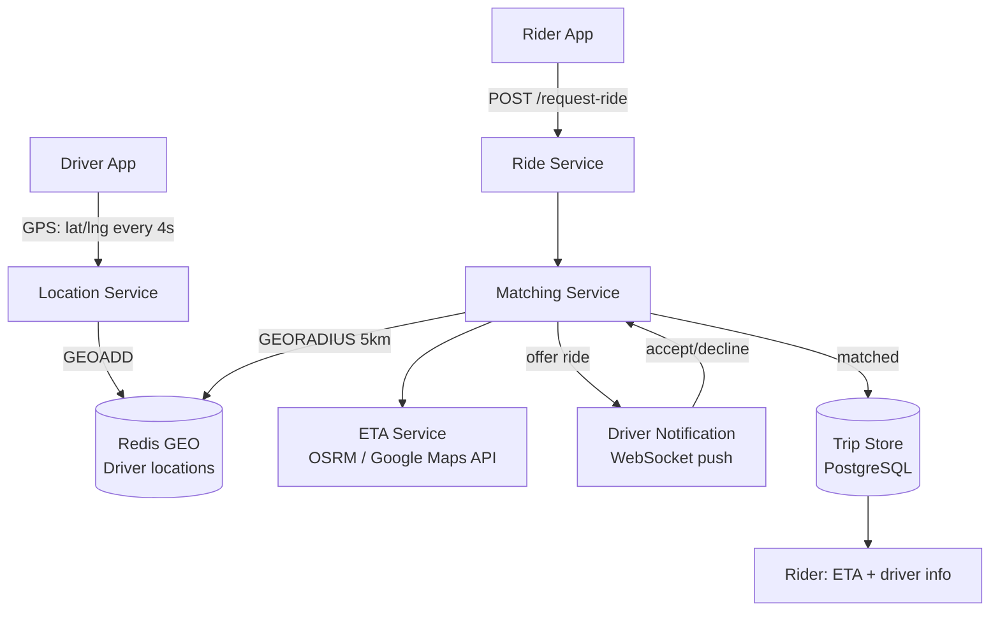

### Deep Dive: Driver Dispatch Flow

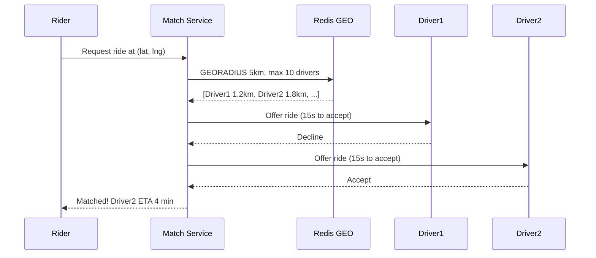

### Trade-off Decisions
| Decision | Option A | Option B | Chosen | Why |
|----------|----------|----------|--------|-----|
| Geo storage | PostgreSQL PostGIS | Redis GEO | Redis GEO | 12.5K location writes/sec → Redis handles in-memory |
| Driver search | Geohash grid | Redis GEORADIUS | Redis GEORADIUS | GEORADIUS O(N+log M) in memory vs PostGIS index |
| Match strategy | Nearest first | Batch auction | Nearest first | Lower latency; batch auction better for fairness at scale |
| ETA computation | Straight-line | OSRM routing engine | OSRM | Straight-line off by 50%+ in grid cities |

### Failure Modes
| Failure | Impact | Mitigation |
|---------|--------|------------|
| Redis GEO node failure | No nearby driver queries | Redis Sentinel; fallback to PostGIS at higher latency |
| Driver accepts but app crashes | Ride in limbo | 30s acceptance timeout + retry next driver |
| GPS signal lost | Driver location stale | TTL on driver location; remove after 30s no update |
| No drivers in radius | Rider waits indefinitely | Expand search radius every 10s; cap at 15km; notify rider |

### Concept References
→ [Caching Strategies](../../../system-design/fundamentals/caching-strategies)
→ [WebSockets Real-Time](../../../system-design/real-time-systems/websockets-real-time)

---

## Q2: How do you store and query real-time driver locations?

**Role:** Mid | **Difficulty:** 🟡 Mid | **Priority:** P0 | **Format:** Quick Answer

> **What the interviewer is testing:** Whether you know geospatial data structures and can choose between Redis GEO, PostGIS, and geohash for storing and querying high-frequency location updates.

### Answer in 60 seconds
- **Redis GEO commands:** `GEOADD drivers:city1 longitude latitude driver_id` on every location update; stores as sorted set with geohash score
- **Nearby query:** `GEORADIUS drivers:city1 lng lat 5km ASC COUNT 10` — returns nearest 10 drivers within 5km in O(N+M log M) time
- **Update rate:** 50K drivers × 1 update/4s = 12,500 writes/sec — Redis handles 200K writes/sec easily
- **PostGIS alternative:** PostgreSQL with `geography(POINT)` column + gist index; slower for in-memory but durable, suitable for historical location queries
- **Expiry:** Driver goes offline → `ZREM drivers:city1 driver_id`; or TTL via separate `driver_online:{id}` key with 30s TTL

### Diagram

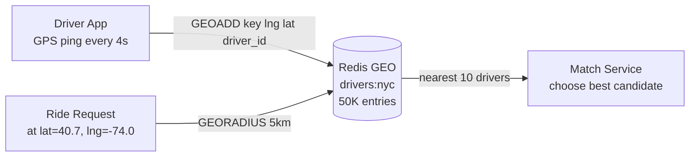

### Pitfalls
- ❌ **Using relational DB for 12.5K location writes/sec:** PostgreSQL write throughput saturates at ~5K writes/sec without tuning; for 12.5K/sec, use Redis; persist to DB async for history
- ❌ **Not removing offline drivers from GEO index:** If driver closes app, their location stays in index forever — match service offers rides to offline drivers; use heartbeat TTL to auto-remove

### Concept Reference
→ [Caching Strategies](../../../system-design/fundamentals/caching-strategies)

---

## Q3: How does Uber's dispatch algorithm match riders to nearest driver?

**Role:** Senior | **Difficulty:** 🔴 Senior | **Priority:** P0 | **Format:** Deep Dive

> **What the interviewer is testing:** Whether you understand the trade-offs between simple nearest-first dispatch and more sophisticated batch-matching algorithms, and when each is appropriate.

### Problem Constraints
| Dimension | Value |
|-----------|-------|
| Match SLA | Driver confirmed within 30s |
| Drivers in radius | Typically 3–20 drivers within 5km |
| Acceptance rate | ~85% first-offer acceptance |
| Concurrent ride requests | 11.6/sec, thousands of simultaneous matches in progress |

### Approach A — Nearest First (Sequential Offer)

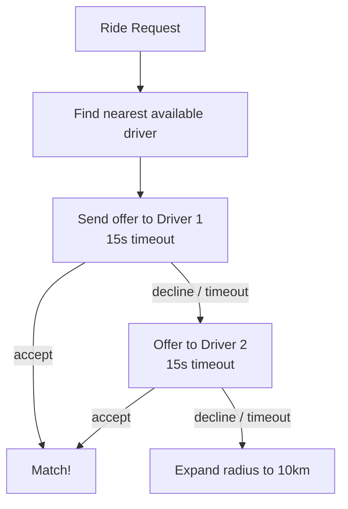

**Problem:** Driver 1 declines → 15s wait → offer Driver 2 → 30s in — barely makes SLA. Total match time = N × 15s.

### Approach B — Batch Matching with Scoring

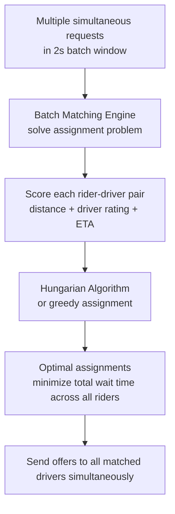

| Dimension | Nearest First | Batch Matching |
|-----------|--------------|---------------|
| Match latency (accept) | 5–15s | 2–5s |
| Match latency (declines) | 15s per decline | Fallback to next batch |
| Global optimality | Greedy, not optimal | Near-optimal across all rides |
| Complexity | Low | High (assignment problem) |
| Uber's model | Early Uber | Uber's Dispatch 2.0 |

### Recommended Answer
Uber uses batch matching (Approach B) at scale. Every 2 seconds, a batch window collects all pending ride requests and available drivers. Scoring function: `score = -0.5×distance_km - 0.3×ETA_min + 0.2×driver_rating`. Hungarian algorithm (O(n³)) or greedy assignment solves optimal matching. First-offer acceptance rate ~85% means most matches complete in single batch. For Approach A at 1M rides/day, 15% decline rate × 15s wait × 11.6 req/sec = degraded SLA; batch matching eliminates sequential wait.

### What a great answer includes
- [ ] Quantifies the problem with sequential offering (15s × declines)
- [ ] Explains batch window concept (2-second collection)
- [ ] Names the scoring function dimensions
- [ ] Mentions Hungarian algorithm or greedy as assignment approach

### Pitfalls
- ❌ **Locking a driver for a pending offer:** Driver locked for 15s × 85% acceptance = 2.25s average lock; at 50K drivers, only 13K available at any time — accept this or use shorter timeout (8s)
- ❌ **GEORADIUS returning many drivers for scoring:** Fetching 100 drivers per request × 11.6 requests/sec = 1160 driver records/sec to score — cap at 20 candidates

### Concept Reference
→ [Caching Strategies](../../../system-design/fundamentals/caching-strategies)

---

## Q4: How do you calculate ETA accurately?

**Role:** Mid | **Difficulty:** 🟡 Mid | **Priority:** P1 | **Format:** Quick Answer

> **What the interviewer is testing:** Whether you understand the inputs to ETA calculation (traffic, route, driver speed) and the system design to make it accurate at scale.

### Answer in 60 seconds
- **Routing engine:** OSRM (Open Source Routing Machine) or Google Maps API; takes driver current GPS + rider pickup location → optimal route + travel time
- **Real-time traffic:** Traffic layer from current speed data (GPS pings from all active drivers = crowd-sourced traffic signal); update road segment speeds every 1 min
- **ETA components:** `ETA = drive_time_to_pickup + buffer_for_traffic_uncertainty (×1.2) + pickup_delay (~2 min)`
- **Accuracy:** Uber reports ±2 min accuracy for 95% of trips; trained from historical actual arrival times vs predicted
- **Caching:** Pre-compute ETAs for common origin-destination pairs (airport → city center) hourly; actual request overrides with real-time route

### Diagram

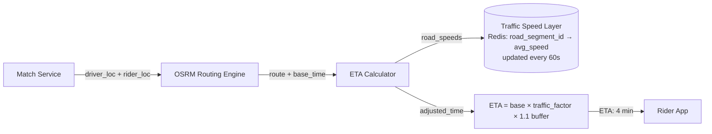

### Pitfalls
- ❌ **Straight-line distance for ETA:** Manhattan grid adds 57% to straight-line distance; ETA from distance alone off by ~2-3× in urban areas
- ❌ **Not updating ETA during trip:** Initial ETA can drift by 5+ min; push ETA updates every 30s during trip as route and traffic evolve

### Concept Reference
→ [WebSockets Real-Time](../../../system-design/real-time-systems/websockets-real-time)

---

## Q5: How do you handle surge pricing in real-time?

**Role:** Senior | **Difficulty:** 🔴 Senior | **Priority:** P1 | **Format:** Deep Dive

> **What the interviewer is testing:** Whether you can design a supply-demand matching system that adjusts prices dynamically to balance rider demand and driver supply.

### Problem Constraints
| Dimension | Value |
|-----------|-------|
| Surge regions | City divided into ~1 km² hex zones |
| Update frequency | Recalculate surge every 1 min |
| Pricing formula | surge_multiplier = f(demand/supply ratio in zone) |
| Display latency | Rider sees current surge before requesting |

### Approach A — City-Wide Surge Factor

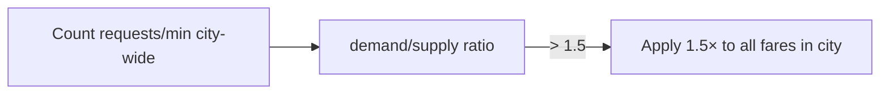

**Problem:** Surge at airport doesn't help downtown where supply is fine; over-applies surge, reduces demand city-wide.

### Approach B — Geohash Zone Surge

```mermaid
graph TD
  Zones[City divided into hex zones\n~500m radius each] --> ZoneStats[Per-zone stats every 60s\nactive_requests, available_drivers]
  ZoneStats -->|ratio = requests / drivers| SurgeCalc[Surge calculator\n1.0× if ratio < 1.2\n1.5× if ratio 1.2-1.8\n2.0× if ratio > 1.8]
  SurgeCalc --> SurgeMap[(Redis: surge:{zone_id} = multiplier\nTTL=90s)]
  RideReq[Ride request at pickup lat/lng] -->|lookup zone| SurgeMap
  SurgeMap -->|multiplier| FareCal[Apply to fare estimate]
```

| Dimension | City-Wide | Zone-Based |
|-----------|---------|-----------|
| Accuracy | Low (blunt instrument) | High (localized) |
| Driver incentive | Broad | Drivers move toward high-surge zones |
| Rider experience | Fair-city gets penalized | Accurate — only surge where needed |
| Computation | Simple ratio | Per-zone calculation |

### Recommended Answer
Zone-based surge (Approach B) using geohash zones (~500m radius hexagons via Uber's H3 library). Every 60 seconds, count active requests and available drivers per zone from Redis. Surge multiplier = `max(1.0, 1 + (demand/supply - 1) × 0.5)` — smooth curve, not step function. Surge map cached in Redis with 90s TTL. Driver app shows heat map of surge zones to incentivize supply movement. Rider sees surge price before confirming — explicit consent model (Uber requires typing "surge pricing applies").

### What a great answer includes
- [ ] Mentions Uber's H3 hexagonal grid or similar zone division
- [ ] Explains driver incentive (surge map) as core to supply dynamics
- [ ] Uses smooth multiplier formula, not discrete steps
- [ ] Names 90s TTL — surge can change quickly

### Pitfalls
- ❌ **Real-time surge without smoothing:** Surge flips from 1.0× to 2.5× in one minute → riders cancel en masse → demand drops → surge removed → all riders retry → demand spikes again; use exponential smoothing
- ❌ **Not showing surge before ride confirmation:** Surprise surge after entering destination causes cancellations and complaints — show surge on fare estimate screen

### Concept Reference
→ [Caching Strategies](../../../system-design/fundamentals/caching-strategies)

---

## Q6: How do you prevent a driver being double-matched?

**Role:** Senior | **Difficulty:** 🔴 Senior | **Priority:** P1 | **Format:** Quick Answer

> **What the interviewer is testing:** Whether you understand distributed locking for exclusive resource assignment and the failure modes around lock expiry.

### Answer in 60 seconds
- **Problem:** Two ride requests concurrently match the same driver → driver gets two simultaneous offers → accepts both → one rider abandoned
- **Solution:** Redis distributed lock — `SET driver_lock:{driver_id} request_id NX PX 20000` (20s TTL)
- **Lock before offer:** Matching service acquires driver lock before sending offer; if lock exists (driver already being offered), skip to next driver
- **Release on outcome:** Release lock immediately on decline; keep lock through acceptance until trip starts; trip start transitions to `driver_on_trip:{id}`
- **Lua script:** Lock acquisition must be atomic — check-and-set in single Lua script to prevent race condition

### Diagram

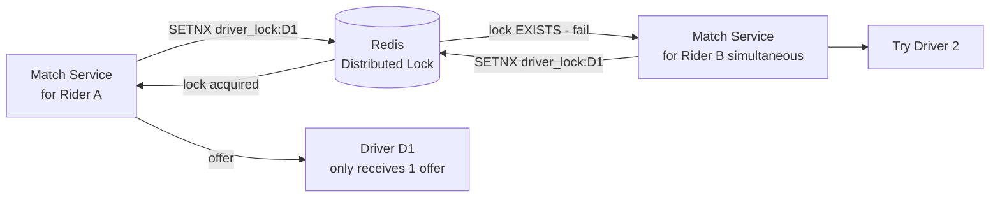

### Pitfalls
- ❌ **Lock TTL too short:** 20s offer window + 5s network latency buffer = 25s TTL needed; if TTL = 10s, lock expires before driver responds → potential double-match
- ❌ **Not releasing lock on driver app crash:** 20s TTL auto-releases; without TTL, crashed driver holds lock indefinitely blocking all future matches for that driver

### Concept Reference
→ [Caching Strategies](../../../system-design/fundamentals/caching-strategies)

---

## Q7: How does Uber handle GPS location streams from millions of drivers?

**Role:** Senior | **Difficulty:** 🔴 Senior | **Priority:** P2 | **Format:** Quick Answer

> **What the interviewer is testing:** Whether you can design a high-throughput write-optimized pipeline for GPS telemetry at millions-per-second scale.

### Answer in 60 seconds
- **Global scale:** Uber has 6M+ active drivers globally; at 1 update/4s = 1.5M location writes/sec globally
- **Kafka ingest:** Driver app sends location to location ingestion service → Kafka topic `driver-location` partitioned by `driver_id`; 1.5M writes/sec well within Kafka's 5M events/sec capacity
- **Hot path:** Kafka consumer writes to Redis GEO for current location (used by matching) — low-latency, in-memory
- **Cold path:** Same Kafka stream consumed by batch consumer → writes to Cassandra for historical trip path storage
- **Data volume:** 1.5M writes × 50 bytes = 75 MB/sec → 6.5 TB/day in Cassandra

### Diagram

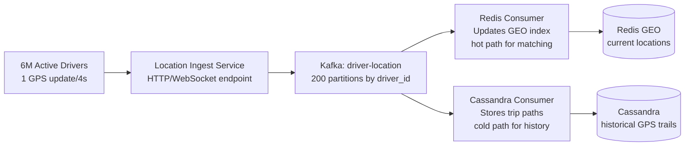

### Pitfalls
- ❌ **Writing to Redis directly from driver app at 1.5M/sec:** Redis can handle this, but 1.5M concurrent connections is too many; use a fleet of ingest service instances that batch-write to Redis
- ❌ **Storing all GPS points in Redis:** Redis is in-memory — 1.5M writes × 24h × 50B = 6.5 TB/day; only keep CURRENT location in Redis; archive history to Cassandra

### Concept Reference
→ [Kafka / Messaging](../../../system-design/messaging-and-streaming/kafka-rabbitmq)

---

## Q8: Design geospatial indexing for finding nearby drivers in <100ms

**Role:** Staff | **Difficulty:** ⚫ Staff | **Priority:** P2 | **Format:** Deep Dive

> **What the interviewer is testing:** Whether you understand geohash, quad trees, and Redis GEO internals, and can select the right structure for sub-100ms proximity queries at scale.

### Problem Constraints
| Dimension | Value |
|-----------|-------|
| Active drivers | 50K per city |
| Query type | Find N nearest drivers within R km |
| Query rate | 60 proximity queries/sec |
| Latency SLA | < 100ms p99 |
| Update rate | 12,500 location writes/sec |

### Approach A — Geohash Grid

```mermaid
graph LR
  DriverLoc[Driver GPS] --> Geohash[Encode as geohash\nprecision 6 = 1.2km cell]
  Geohash --> HashMap[HashMap: geohash_cell → [driver_ids]]
  Query[Find drivers near (lat, lng)] --> QueryHash[Encode query point\n+ 8 adjacent cells]
  QueryHash --> Lookup[Union of 9 cells\n→ candidate drivers]
  Lookup --> Distance[Exact distance filter]
```

### Approach B — Redis GEO (Sorted Set with Geohash Score)

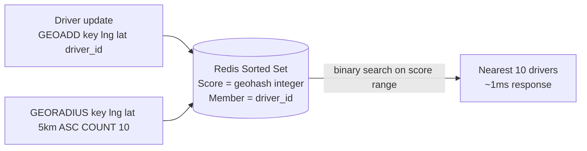

| Dimension | Geohash HashMap | Redis GEO |
|-----------|----------------|----------|
| Query latency | 5-20ms (hash lookup + distance filter) | 1-5ms (optimized sorted set) |
| Memory | Custom (varies) | ~50 bytes/entry |
| Update complexity | O(1) move between buckets | O(log N) sorted set insert |
| Edge cases | Geohash boundary issues | Built-in spherical distance |
| Operational burden | Custom code | Redis built-in |

### Recommended Answer
Redis GEO (Approach B). `GEORADIUS` uses a sorted set with geohash integer scores. Binary search on score range finds candidates within bounding box, then exact spherical distance filter. For 50K drivers, 5km radius query at city center returns ~20-50 drivers in ~1-2ms. With 60 proximity queries/sec, this is 60 Redis commands — trivial. Geohash grid (Approach A) requires handling 9-cell lookups for boundary correctness; Redis GEO handles this internally.

### What a great answer includes
- [ ] Explains that Redis GEO internally uses geohash integers as sorted set scores
- [ ] Mentions GEORADIUS has two-step filtering (bounding box + spherical distance)
- [ ] Quantifies latency: 1-2ms for 50K drivers
- [ ] Notes Uber uses H3 hex grid at city-zone level, Redis for driver-level queries

### Pitfalls
- ❌ **Using geohash at precision 4 (width 39.1 km):** 39km cells mean all city drivers in one cell — no spatial locality benefit; use precision 6 (1.2km) for ride-sharing
- ❌ **Not handling geohash cell boundaries:** Driver at cell boundary may be in adjacent cell — always query current cell + 8 neighbors; Redis GEORADIUS handles this automatically

### Concept Reference
→ [Caching Strategies](../../../system-design/fundamentals/caching-strategies)

---

## Q9: How do you handle driver going offline mid-ride?

**Role:** Staff | **Difficulty:** ⚫ Staff | **Priority:** P2 | **Format:** Quick Answer

> **What the interviewer is testing:** Whether you understand state machine design for ride lifecycle and how to handle partial failures gracefully.

### Answer in 60 seconds
- **Ride state machine:** States: `requested → matched → in_progress → completed`; driver offline during `in_progress` is partial failure
- **Last known route:** Trip service stores last GPS point when driver goes offline; rider app shows "Connection lost" but displays last known position
- **Grace period:** 60s grace window — most disconnects are temporary (tunnel, poor signal); send reconnect push notification to driver
- **After grace period:** If driver still offline > 60s, ops team alerted; rider offered choice: wait or rebook with refund
- **GPS vs app connectivity:** Driver phone GPS may work even when cellular offline; on reconnect, batch upload stored GPS points to reconstruct trip path

### Diagram

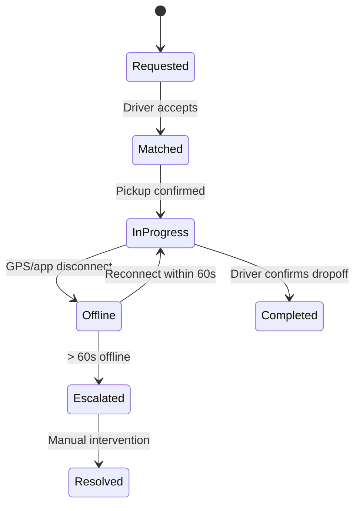

### Pitfalls
- ❌ **Immediately cancelling trip when driver disconnects:** False positives from tunnel/poor signal — 60s grace period handles 90% of cases; premature cancel angers both driver and rider
- ❌ **Not storing GPS locally on driver phone:** If backend loses connection, driver continues navigating from cached route; on reconnect, syncs GPS trail for billing accuracy

### Concept Reference
→ [WebSockets Real-Time](../../../system-design/real-time-systems/websockets-real-time)

---

## Q10: How would you design routing for multi-stop rides?

**Role:** Staff | **Difficulty:** ⚫ Staff | **Priority:** P3 | **Format:** Quick Answer

> **What the interviewer is testing:** Whether you understand the route optimization problem for multi-waypoint trips and how to price a multi-stop ride fairly.

### Answer in 60 seconds
- **Uber's model:** Rider specifies up to 3 stops at booking; app shows total ETA + fare estimate for full route
- **Route calculation:** Call OSRM with waypoints in order: `origin → stop1 → stop2 → destination`; returns optimized driving route
- **Fare calculation:** Fare = base_fare + per_km × total_distance + per_min × total_time; multi-stop route is just longer route — same formula
- **Stop timeout:** Driver waits 3 min at each stop; if rider doesn't return, trip continues and rider charged for wait time
- **Dynamic route change:** Rider can add stop mid-trip; app recalculates route and updated fare estimate immediately

### Diagram

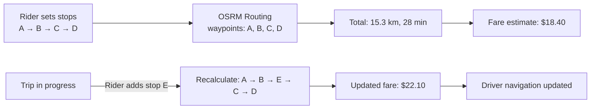

### Pitfalls
- ❌ **Optimizing stop order for rider:** Rider specifies stops in their intended order; don't reorder automatically (rider wants to pick up friend first, then go to office)
- ❌ **No stop timeout:** Without timeout, a driver could wait indefinitely if rider is at a restaurant — 3 min wait is standard with audible countdown

### Concept Reference
→ [WebSockets Real-Time](../../../system-design/real-time-systems/websockets-real-time)
