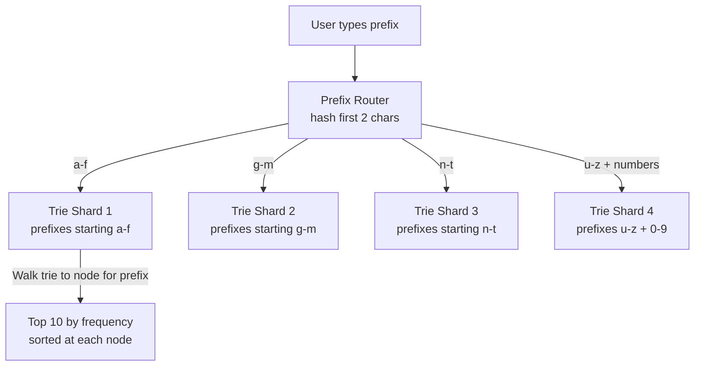
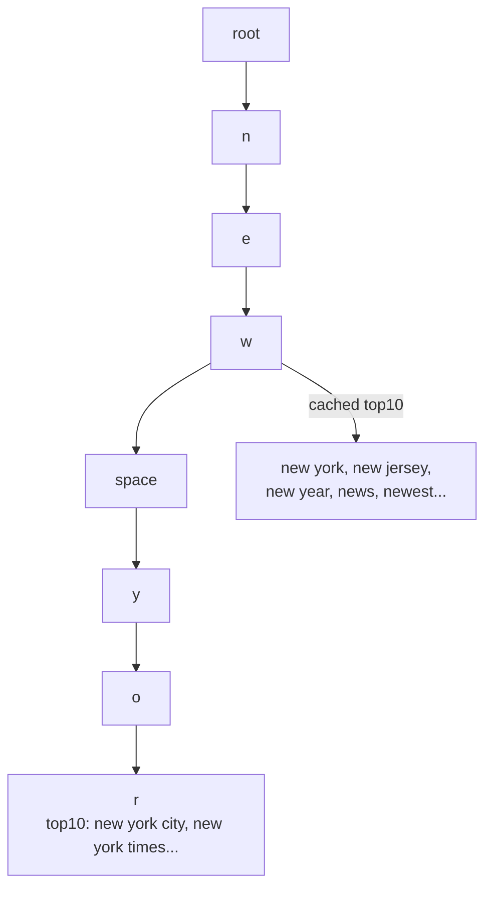
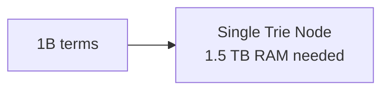
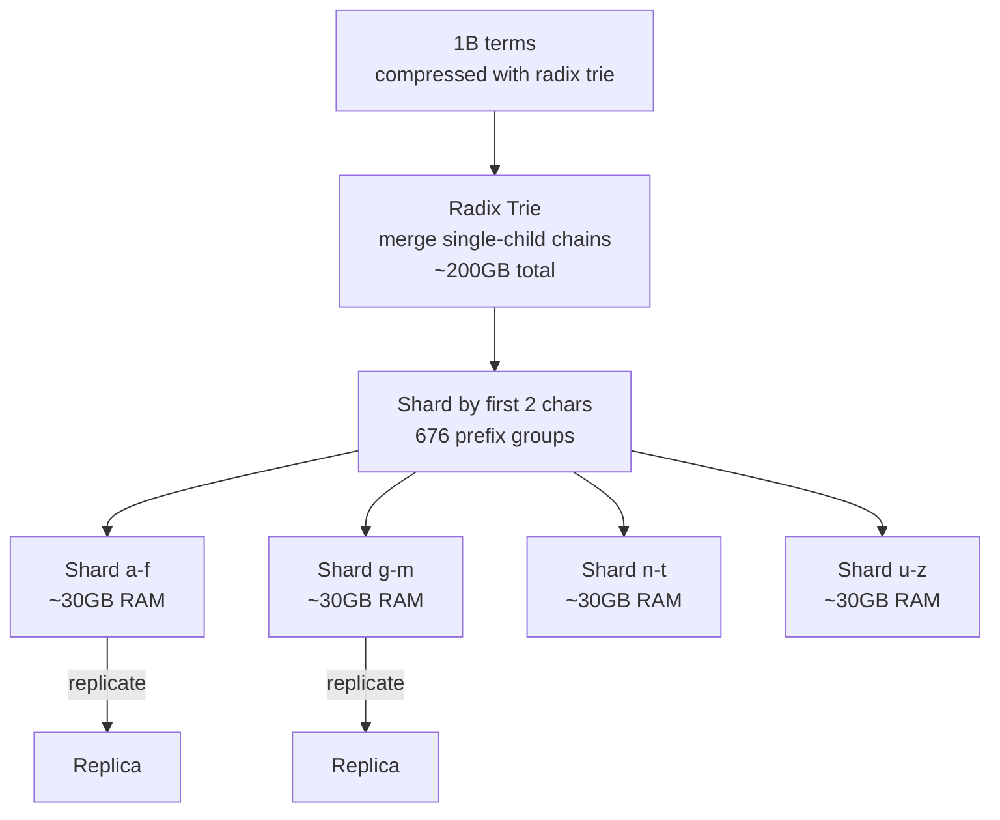
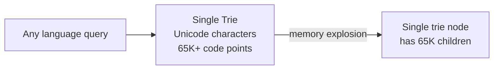
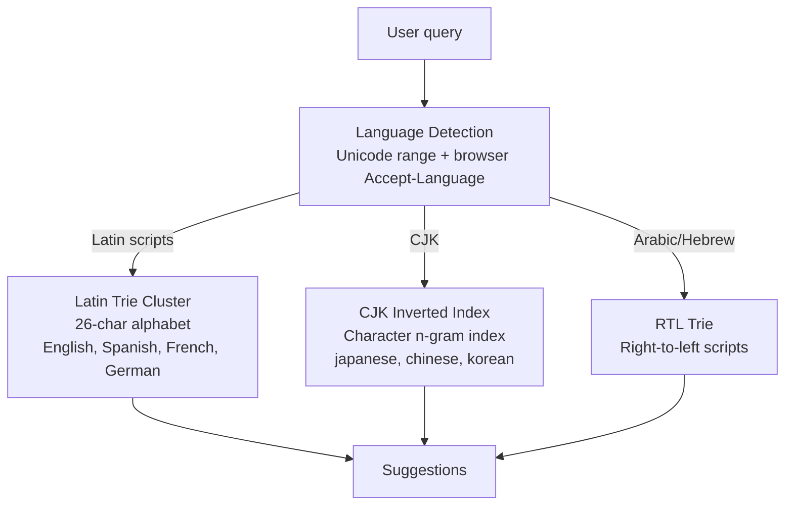
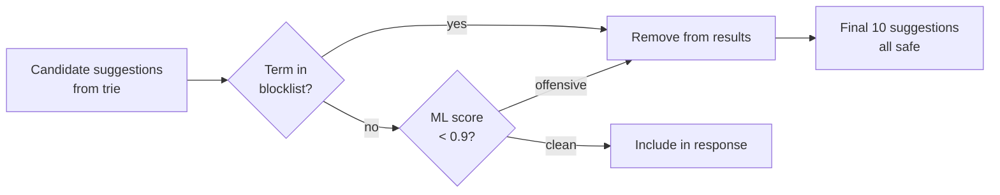

# Design Search Autocomplete

---

## Q1: Design search autocomplete like Google handling 10K queries/sec

**Role:** Senior | **Difficulty:** 🔴 Senior | **Priority:** P0 | **Format:** Scenario
**Real Company:** Google — 8.5B searches/day; 63K/sec; autocomplete serves suggestions in < 100ms

### The Brief
> "Design a search autocomplete system that shows up to 10 suggestions as a user types. The system handles 10K queries/sec and must return suggestions in < 100ms p99. Suggestions are ranked by search frequency. The data set contains 1 billion search terms that update in near-real-time as trending queries emerge."

### Clarifying Questions to Ask First
1. Is this global or single-region? (affects trie sharding strategy)
2. How quickly must new trending terms appear in suggestions? (real-time vs hourly batch)
3. Should suggestions be personalized per user, or global frequency ranking?
4. What is the max prefix length we need to support? (3+ chars?)

### Back-of-Envelope Estimation
| Metric | Calculation | Result |
|--------|-------------|--------|
| Queries/sec | 10K sustained, 30K peak | 30K rps peak |
| Avg keystrokes per search | 6 characters typed | 6 autocomplete calls per search |
| Autocomplete calls/sec | 10K × 6 | 60K ac-rps |
| Unique prefixes (up to 5 chars) | 26^5 + 26^4 + ... | ~12M unique prefixes |
| Top suggestions per prefix | Top 10 queries per prefix | — |
| Cache size | 12M prefixes × 10 suggestions × 30B avg | ~3.6 GB |
| Trie nodes (1B terms, avg 10 chars) | 1B × 10 / avg_branches | ~5B nodes |

### High-Level Architecture

```mermaid
graph TD
  User[User types "new y"] --> Client[Browser/App]
  Client -->|GET /suggest?q=new+y| LB[Load Balancer]
  LB --> AutocompleteAPI[Autocomplete Service]
  AutocompleteAPI --> Redis[(Redis Cache\nprefix → top10 suggestions\n3.6 GB, TTL=1h)]
  Redis -->|hit| Response[Return 10 suggestions\n<5ms]
  Redis -->|miss| TrieService[Trie Service\nIn-memory trie per shard]
  TrieService --> Response2[Return 10 suggestions\n<50ms]
  TrieService --> Redis

  SearchLog[Search Query Logs] --> Kafka[Kafka: search-events]
  Kafka --> FreqCounter[Frequency Counter\ncount queries per term per hour]
  FreqCounter --> TrieUpdater[Trie Updater\nupdates suggestion weights]
  TrieUpdater --> TrieService
```

### Deep Dive: Trie Shard Architecture



### Trade-off Decisions
| Decision | Option A | Option B | Chosen | Why |
|----------|----------|----------|--------|-----|
| Storage | In-memory trie | Redis sorted sets per prefix | Hybrid: trie + Redis cache | Trie for full depth; Redis for hot prefixes |
| Update frequency | Real-time | Hourly batch | Hourly batch for trie; real-time for trending boost | Trie rebuild is expensive; trending terms get real-time boost |
| Personalization | Global only | Per-user history | Global + personal boost | Global for cold start; personal for returning users |
| Result caching | Client-side | Server-side Redis | Server-side | Shared across all users with same prefix |

### Failure Modes
| Failure | Impact | Mitigation |
|---------|--------|------------|
| Trie service OOM | No suggestions served | Monitor memory; evict low-frequency leaves; cache handles hot prefixes |
| Redis cache miss storm | All requests hit trie | Trie is in-memory; can handle full load but at higher latency |
| Trie update lag | New trending terms missing | Real-time trending boost layer supplements trie |
| Single trie shard hotspot | a-f prefix overloaded | Sub-shard hot prefixes (e.g., "th" → dedicated shard) |

### Concept References
→ [Caching Strategies](../../../system-design/fundamentals/caching-strategies)
→ [Load Balancing](../../../system-design/fundamentals/load-balancing)

---

## Q2: What data structure is best for prefix-based autocomplete?

**Role:** Mid | **Difficulty:** 🟡 Mid | **Priority:** P0 | **Format:** Quick Answer

> **What the interviewer is testing:** Whether you know the trie data structure and can compare it against alternatives like sorted arrays and hash maps for prefix lookup.

### Answer in 60 seconds
- **Trie (prefix tree):** Each node represents a character; path from root = prefix; O(L) lookup where L = prefix length; nodes store top-k suggestions at each level for fast retrieval
- **Why not hash map:** Hash of "new" doesn't help find "new york", "new jersey" — hash has no prefix relationship
- **Why not sorted array:** Binary search on sorted array gives O(log N) per lookup but O(N) range scan for all words with prefix — slow at 1B terms
- **Radix trie (compressed):** Merges single-child chains into edge labels; reduces memory 3–5× vs naive trie; Google uses radix trie variant
- **Cached at nodes:** Store top-10 queries by frequency at each trie node — O(L) query without traversing subtree

### Diagram



### Pitfalls
- ❌ **Storing all matching words at each trie node:** For prefix "a", all words starting with "a" could be millions — only store top-k (10-20) per node
- ❌ **Not pre-sorting at each node:** Top-k must be pre-sorted by frequency at write time; computing at query time is O(subtree) — too slow

### Concept Reference
→ [Caching Strategies](../../../system-design/fundamentals/caching-strategies)

---

## Q3: How do you rank autocomplete suggestions by popularity + relevance?

**Role:** Senior | **Difficulty:** 🔴 Senior | **Priority:** P0 | **Format:** Deep Dive

> **What the interviewer is testing:** Whether you understand multi-signal ranking for autocomplete and how frequency, recency, and personalization combine into a suggestion score.

### Problem Constraints
| Dimension | Value |
|-----------|-------|
| Ranking signals | Frequency (global), recency (trending), personalization |
| Update frequency | Frequency: hourly batch; trending: 5-min window |
| Personalization | Last 30 days search history |
| Response latency | < 100ms including ranking |

### Approach A — Pure Frequency Ranking

```mermaid
graph LR
  Prefix[Prefix: "new y"] --> Trie[Trie lookup]
  Trie --> Sort[Sort by global frequency\nnew york city: 1.2M/day\nnew york times: 890K/day]
  Sort --> Return[Return top 10]
```

**Problem:** Static frequency doesn't capture current trends ("new year" spikes in January).

### Approach B — Multi-Signal Scoring

```mermaid
graph TD
  Prefix[Prefix lookup] --> Candidates[Candidate suggestions\nfrom trie node top-50]
  Candidates --> Scorer[Scoring Function\nscore = α×frequency + β×recency_boost + γ×personalization]
  Scorer --> FreqSignal[Global frequency score\nnormalized log(count)]
  Scorer --> TrendSignal[Trending boost\ncount in last 1hr / count last 24hr]
  Scorer --> PersonalSignal[Personal history\nhow many times user searched this]
  FreqSignal --> FinalScore[Combined score]
  TrendSignal --> FinalScore
  PersonalSignal --> FinalScore
  FinalScore --> TopK[Return top 10 re-ranked]
```

| Dimension | Frequency Only | Multi-Signal |
|-----------|--------------|-------------|
| Trending terms | Miss until next batch | Surface within 5 min |
| Personalization | None | Last 30 days history |
| Computation | O(k log k) sort | O(k) score + sort |
| Latency impact | Minimal | +5-10ms (precomputed signals) |

### Recommended Answer
Multi-signal approach (Approach B). Trie stores top-50 candidates per node (over-fetch). Scorer applies: `score = log(global_freq) + 0.3×trend_boost + 0.2×personal_match`. Trend boost = ratio of hourly count to daily average (smoothed) — surfaces "breaking news" terms within 5 minutes. Personal score stored in Redis per user, pre-computed from search history. Final re-rank of 50 → return top 10. All signal lookups via Redis = total latency < 20ms.

### What a great answer includes
- [ ] Explains why pure frequency fails for trending terms
- [ ] Precomputes signals — not computed at query time
- [ ] Gives weights for each signal (α, β, γ)
- [ ] Names latency of each component to stay within 100ms budget

### Pitfalls
- ❌ **Computing trend signal at query time:** Counting hourly search volume at 60K rps query time = unacceptable; pre-compute trend scores every 5 minutes, store in Redis
- ❌ **Personalizing for anonymous users:** Anonymous users have no search history — fall back to global ranking; only personalize for logged-in users

### Concept Reference
→ [Caching Strategies](../../../system-design/fundamentals/caching-strategies)
→ [Recommendation System](../../../system-design/business-and-advanced/recommendation-system)

---

## Q4: How do you update suggestions in real-time as trends change?

**Role:** Mid | **Difficulty:** 🟡 Mid | **Priority:** P1 | **Format:** Quick Answer

> **What the interviewer is testing:** Whether you understand streaming aggregation for trend detection and how to update autocomplete suggestions without rebuilding the entire trie.

### Answer in 60 seconds
- **Search event stream:** Every search query emitted to Kafka `search-events` topic; consumer counts queries per term in a 5-minute tumbling window
- **Trend detection:** Compare current 5-min rate to trailing 1-hour average; terms with > 5× spike flagged as trending
- **Update mechanism:** Trending terms get boosted score injected into Redis suggestion cache (bypasses trie); `trending:{prefix}` key with TTL = 30 min
- **Full trie rebuild:** Happens hourly from batch aggregated search logs; trending layer supplements, doesn't replace, the trie

### Diagram

```mermaid
graph LR
  Searches[Search Events\n60K/sec] --> Kafka[Kafka: search-events]
  Kafka --> Flink[Flink / Spark Streaming\n5-min tumbling window]
  Flink --> TrendDetect[Trend Detector\ncurrent_rate > 5× avg]
  TrendDetect --> Redis[Redis: trending_boosts\n{term → boost_score}\nTTL=30min]
  AutocompleteAPI --> Redis
  Redis -->|merge| FinalSuggestions[Suggestions with trending boost]
```

### Pitfalls
- ❌ **Updating trie in real-time per search query:** Trie is shared in-memory across all requests; locking for update at 60K rps causes contention — use separate trend layer in Redis
- ❌ **Trend TTL too long:** Trend for "Oscar nominations" lasts 6 hours; TTL should be proportional to trend duration — start with 30 min, extend if trend continues

### Concept Reference
→ [Kafka / Messaging](../../../system-design/messaging-and-streaming/kafka-rabbitmq)

---

## Q5: How do you scale a trie to handle 1B search terms?

**Role:** Senior | **Difficulty:** 🔴 Senior | **Priority:** P1 | **Format:** Deep Dive

> **What the interviewer is testing:** Whether you understand trie memory constraints and the sharding/compression strategies needed at 1B term scale.

### Problem Constraints
| Dimension | Value |
|-----------|-------|
| Unique terms | 1B search terms |
| Avg term length | 15 characters |
| Naive trie memory | 1B × 15 nodes × 100 bytes/node | ~1.5 TB (impossibly large) |
| Target memory | < 50 GB per machine |

### Approach A — Naive Trie per Machine



**Infeasible:** No single machine has 1.5 TB RAM.

### Approach B — Radix Trie + Prefix Sharding



| Dimension | Naive Trie | Radix Trie + Sharding |
|-----------|-----------|----------------------|
| Memory | 1.5 TB | ~200 GB total, 50 GB/shard |
| Lookup speed | O(L) | O(L) same |
| Update time | Fast (in-place) | Per-shard in-place update |
| Infrastructure | Single giant machine | 4+ commodity machines |

### Recommended Answer
Radix trie compression reduces memory by 5-10× (1B × 15 chars → 200GB after compression). Shard by first 2 characters of prefix → 676 possible shards, grouped into 4-8 physical machines by traffic distribution (not uniform — 'a' and 't' prefixes have more terms than 'x' and 'z'). Each machine holds ~30-50 GB radix trie entirely in RAM for O(L) lookup. Machine failure handled by replica (hot standby). Trie rebuilt hourly from search log batch job.

### What a great answer includes
- [ ] Calculates why naive trie doesn't fit in memory
- [ ] Names radix trie compression as first optimization
- [ ] Explains sharding strategy (by prefix character)
- [ ] Addresses uneven distribution (some prefix letters are more common)

### Pitfalls
- ❌ **Sharding evenly by character without considering term frequency:** 'a' and 'th' have far more searches than 'xz' — weighted shard assignment based on actual term distribution
- ❌ **Rebuilding entire trie on every update:** Hourly batch for full rebuild; trending updates injected as hot-patching to live trie nodes, not full rebuild

### Concept Reference
→ [Database Sharding](../../../system-design/storage-and-databases/database-sharding)

---

## Q6: How do you handle typos and fuzzy matching in autocomplete?

**Role:** Senior | **Difficulty:** 🔴 Senior | **Priority:** P1 | **Format:** Quick Answer

> **What the interviewer is testing:** Whether you know edit-distance algorithms and how to integrate fuzzy matching without sacrificing the < 100ms latency budget.

### Answer in 60 seconds
- **Exact prefix first:** Always return exact-match suggestions first; fuzzy only if exact returns < 5 results
- **BK-Tree (Burkhard-Keller Tree):** Metric tree built on edit distance; finds all terms within edit distance 1 or 2 from query in O(log N) average time
- **Edit distance 1:** One character insertion/deletion/substitution — covers 90% of common typos (e.g., "seach" → "search")
- **Pre-computed corrections:** For top 1000 most common misspellings, pre-store correction in Redis `corrections:{misspelling}` — O(1) lookup
- **Phonetic matching:** Soundex or Metaphone for phonetically similar words ("colour" → "color")

### Diagram

```mermaid
graph LR
  Query["User types: 'seach'"] --> Exact{Exact prefix\nsuggestions ≥ 5?}
  Exact -->|yes| Return[Return exact suggestions]
  Exact -->|no| Precomputed{Precomputed\ncorrection in Redis?}
  Precomputed -->|yes 'seach'→'search'| Corrected[Return 'search' suggestions\n+ "Did you mean: search?"]
  Precomputed -->|no| BKTree[BK-Tree\nedist=1 candidates]
  BKTree --> Rescore[Rescore by frequency\nreturn top 10]
```

### Pitfalls
- ❌ **Running fuzzy matching on every query at 60K rps:** BK-Tree search is O(log N) but adds 20-50ms; only trigger if exact prefix returns < 5 results
- ❌ **Edit distance 3+ in autocomplete:** Too many false positives; "cat" within edist=3 of hundreds of words — limit to edist=1 or 2

### Concept Reference
→ [Caching Strategies](../../../system-design/fundamentals/caching-strategies)

---

## Q7: How do you personalize autocomplete per user?

**Role:** Senior | **Difficulty:** 🔴 Senior | **Priority:** P2 | **Format:** Quick Answer

> **What the interviewer is testing:** Whether you understand how to blend global and personal signals without making every user's autocomplete a cold-start problem.

### Answer in 60 seconds
- **Personal history score:** Track last 30 days of user's searches; for each suggestion candidate, `personal_score = count(user_searched_this_in_30d) × recency_weight`
- **Storage:** Redis hash per user `usearch:{user_id}` → `{term: weighted_count}`, capped at 100 entries, TTL=30 days; ~8KB per user
- **Blend with global:** `final_score = 0.7 × global_frequency + 0.3 × personal_score` — global dominates to prevent over-personalization
- **Cold start:** New user with no history → pure global ranking; after 5 searches, personalization activates
- **Privacy:** User can clear search history → delete Redis key; no server-side retention beyond 30 days

### Diagram

```mermaid
graph LR
  Query["User types 'new y'"] --> Global[Global trie suggestions\nnew york, new year...]
  Query --> Personal[Personal Redis\nusearch:{user_id}\nnew york nba: 8 searches]
  Global --> Blend[Score blending\n0.7×global + 0.3×personal]
  Personal --> Blend
  Blend --> Result[Re-ranked top 10\nnew york nba boosted for this user]
```

### Pitfalls
- ❌ **100% personalization:** If global rank ignored, user who searched "new moon twilight" once always sees Twilight suggestions for "new" — over-fitting to old searches
- ❌ **Storing full personal trie per user:** 1B users × personal trie = impossible; use lightweight Redis hash of top-N personal terms, not full trie

### Concept Reference
→ [Caching Strategies](../../../system-design/fundamentals/caching-strategies)

---

## Q8: How would you design autocomplete across 40 languages?

**Role:** Staff | **Difficulty:** ⚫ Staff | **Priority:** P2 | **Format:** Deep Dive

> **What the interviewer is testing:** Whether you understand multilingual search challenges including character sets, locale-specific ranking, and trie per-language vs unified architecture.

### Problem Constraints
| Dimension | Value |
|-----------|-------|
| Languages | 40 (Latin, CJK, Arabic, Cyrillic, etc.) |
| CJK (Chinese/Japanese/Korean) | Billions of unique characters — traditional trie impractical |
| Language detection | Must infer language from keystrokes |
| Search terms per language | Variable — English has 5× Japanese terms |

### Approach A — Single Unified Trie (Unicode)



**Problem:** Unicode trie node has 65K possible children vs 26 for Latin — memory cost ×2500.

### Approach B — Per-Language Trie Shards



| Dimension | Unified Unicode Trie | Per-Language Shards |
|-----------|--------------------|--------------------|
| Memory | 65K× higher per node | Language-appropriate |
| CJK handling | Impractical | Dedicated n-gram index |
| Language routing | Not needed | Requires language detection |
| Maintenance | Single system | Per-language tuning |

### Recommended Answer
Per-language shards (Approach B). Latin-script languages share a 26–52 character trie (uppercase + lowercase). CJK languages use character n-gram inverted index — no trie (stroke order, compound characters make trie inappropriate). Arabic/Hebrew use RTL-aware trie. Language detection from Unicode character range + browser `Accept-Language` header. Per-language frequency data from localized search logs — Japanese trending terms trained from Japan searches, not global.

### What a great answer includes
- [ ] Identifies that CJK cannot use standard character-per-node trie
- [ ] Explains language detection from input characters
- [ ] Mentions per-language frequency data for culturally relevant suggestions
- [ ] Addresses normalization (Japanese full-width vs half-width characters)

### Pitfalls
- ❌ **Ranking CJK suggestions by global frequency:** A Japanese search term ranked low globally but top in Japan — per-locale frequency data required
- ❌ **Using Latin trie for Chinese:** Chinese has 50K+ common characters; 50K children per node × billions of terms = unworkable; use n-gram or word-segmentation + inverted index

### Concept Reference
→ [Database Sharding](../../../system-design/storage-and-databases/database-sharding)

---

## Q9: How do you filter offensive suggestions in real-time?

**Role:** Staff | **Difficulty:** ⚫ Staff | **Priority:** P2 | **Format:** Quick Answer

> **What the interviewer is testing:** Whether you understand content moderation integration in a high-performance serving path and can design a blocklist mechanism that doesn't degrade latency.

### Answer in 60 seconds
- **Blocklist in memory:** Load curated blocklist into all autocomplete service instances at startup (~100K terms, ~10 MB); zero-latency lookup with hash set
- **Hot-patch updates:** Push blocklist updates via config service (etcd/Consul) — propagate in < 30s without restart; critical for breaking news involving profanity
- **Confidence score:** ML classifier scores each candidate suggestion for offensiveness (0–1); filter if > 0.9; flag for human review if 0.7–0.9
- **Not filtering at trie level:** Blocklist in serving layer, not in trie — allows blocklist to be updated without trie rebuild
- **Context sensitivity:** "Ass" filtered in general search; allowed in "assassin", "assistant" — regex-free context check on full suggestion string

### Diagram



### Pitfalls
- ❌ **Blocking terms at index time (removing from trie):** Blocklist changes frequently (news events create new offensive terms); trie rebuild takes hours — filter at serving time
- ❌ **Running ML classifier synchronously on every suggestion at 60K rps:** Pre-classify all trie node suggestions async when stored; classifier runs offline, results cached per term

### Concept Reference
→ [Fraud Detection](../../../system-design/business-and-advanced/fraud-detection)

---

## Q10: How does Google's "did you mean?" work?

**Role:** Staff | **Difficulty:** ⚫ Staff | **Priority:** P3 | **Format:** Quick Answer

> **What the interviewer is testing:** Whether you understand query spell correction at scale, including the use of search result quality signals to validate corrections.

### Answer in 60 seconds
- **Not just spell-check:** "Did you mean" uses search result quality, not just dictionary — if corrected query returns 100× more results, suggest it
- **Noisy channel model:** P(correction | misspelling) = P(misspelling | correction) × P(correction) — bayesian model trained on search logs with correction click data
- **Candidate generation:** Edit distance 1-2 variants of query; scored by language model (how natural?) + correction frequency (how often did users self-correct from X to Y?)
- **Search result signal:** If "seach" returns 100 results and "search" returns 10M, confidence for "did you mean: search" is very high
- **Threshold:** Only show correction if confidence > 80% AND result count ratio > 100:1

### Diagram

```mermaid
graph LR
  Query["Query: 'seach engines'"] --> Candidates[Generate edit-distance-1\ncandidates: search, teach, beach...]
  Candidates --> LM[Language Model\nP(search engines) >> P(seach engines)]
  Candidates --> ResultCount[Search result count\nsearch: 2B results\nseach: 50K results]
  LM --> Score[Combined score]
  ResultCount --> Score
  Score -->|confidence > 80%| Correction["Did you mean:\nsearch engines?"]
```

### Pitfalls
- ❌ **Using only spell-checker without search result validation:** "colour" is correct British English — a pure spell-checker would "correct" it to "color"; result count signal prevents this
- ❌ **Always showing did-you-mean for any misspelling:** If original query returns meaningful results, suppress the suggestion — user may be searching for their intentional term (brand name, username)

### Concept Reference
→ [Recommendation System](../../../system-design/business-and-advanced/recommendation-system)
