# Design a URL Shortener

---

## Q1: Design a URL shortener like bit.ly handling 100M URLs and 10K redirects/sec

**Role:** Senior, Backend | **Difficulty:** 🔴 Senior | **Priority:** P0 | **Format:** Scenario
**Real Company:** Bitly — 300M+ links created, 10B+ clicks/month

### The Brief
> "Design a URL shortening service. Users paste a long URL and get a short 7-character code. When anyone visits the short URL, they are redirected to the original. The system must handle 100M stored URLs, 10K redirect requests per second, and return redirects in under 50ms p99."

### Clarifying Questions to Ask First
1. Read/write ratio? (redirects >> creates — typically 100:1)
2. Should short codes be random or sequential? Is collision acceptable?
3. Do we need analytics (clicks per URL, geo, referrer)?
4. Is custom alias support required (e.g., bit.ly/my-brand)?

### Back-of-Envelope Estimation
| Metric | Calculation | Result |
|--------|-------------|--------|
| DAU | 10M users × 10 links/day | 100M creates/day |
| Creates/sec | 100M ÷ 86400 | ~1,160 rps |
| Redirects/sec | 1,160 × 100 (100:1 ratio) | ~116K rps (peak: 10K sustained) |
| Storage/link | 500 bytes avg (URL + metadata) | — |
| Storage/year | 100M × 365 × 500B | ~18 TB/year |
| Cache hit rate | Top 20% URLs = 80% traffic | ~80% cache hits expected |

### High-Level Architecture

```mermaid
graph TD
  Client -->|POST /shorten| LB[Load Balancer]
  LB --> WS[Write Service]
  WS --> IDGen[ID Generator\nSnowflake / Base62]
  WS --> DB[(PostgreSQL\nURL Mappings)]
  WS --> Cache[Redis Cache\nWrite-through]

  Client2[Browser] -->|GET /{code}| LB2[Load Balancer]
  LB2 --> RS[Redirect Service]
  RS --> Cache2[Redis Cache\nRead-through]
  Cache2 -->|miss| DB2[(PostgreSQL)]
  RS -->|301 / 302| Client2

  WS --> MQ[Kafka\nClick Events]
  MQ --> AS[Analytics Service]
  AS --> TSDB[(ClickHouse\nTime-Series)]
```

### Deep Dive: ID Generation

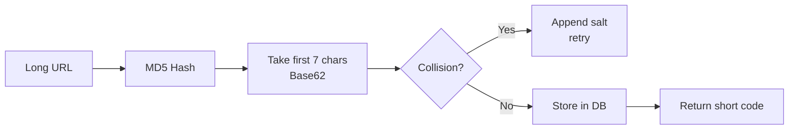

### Trade-off Decisions
| Decision | Option A | Option B | Chosen | Why |
|----------|----------|----------|--------|-----|
| ID generation | Hash-based (MD5 truncated) | Counter + Base62 (Snowflake) | Counter | Predictable length, no collision risk |
| Redirect type | 301 (permanent, browser caches) | 302 (temporary, all hit server) | 302 | Allows analytics; 301 kills tracking |
| Database | PostgreSQL | Cassandra | PostgreSQL | 100M rows fits comfortably, ACID for writes |
| Cache eviction | LRU | TTL-based | LRU + 24h TTL | Hot URLs stay warm, stale URLs auto-expire |

### Failure Modes
| Failure | Impact | Mitigation |
|---------|--------|------------|
| Cache miss storm | DB overloaded during cold start | Warm cache on startup; probabilistic early expiry |
| ID collision | Duplicate short codes | Use DB unique constraint; retry on conflict |
| Redis down | All redirects hit DB | Redis Sentinel for HA; circuit breaker to DB fallback |
| DB write lag | Redirect 404 for newly created URLs | Read-your-writes consistency; write to cache immediately |

### Concept References

---

## Q2: How do you generate unique short codes for URLs?

**Role:** Mid, Backend | **Difficulty:** 🟡 Mid | **Priority:** P0 | **Format:** Quick Answer

> **What the interviewer is testing:** Whether you know the trade-offs between hashing, counters, and random ID generation for uniqueness at scale.

### Answer in 60 seconds
- **Hash-based:** MD5/SHA256 the long URL → take first 7 chars in Base62 → collision rate ~0.01% at 100M URLs
- **Counter-based:** Global atomic counter → encode in Base62 → 7 chars supports 62^7 = 3.5 trillion URLs, zero collision
- **Random:** Secure random 7-char Base62 → birthday paradox gives ~1% collision at 100M entries
- **Winner:** Counter + Base62 via Snowflake (worker ID + timestamp + sequence) → no collision, sortable, ~1M IDs/sec per node

### Diagram

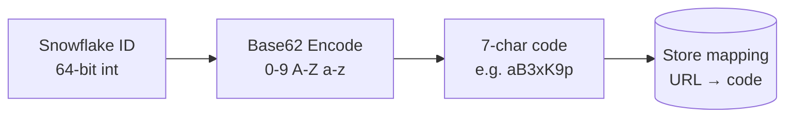

### Pitfalls
- ❌ **Using MD5 hash truncated to 6 chars:** Collision probability hits 1% at 68K entries — far too early
- ❌ **Global counter as single point of failure:** Zookeeper or Redis for distributed counter; if it dies, ID generation stops

### Concept Reference

---

## Q3: How would you handle custom aliases (e.g. bit.ly/my-brand)?

**Role:** Mid, Backend | **Difficulty:** 🟡 Mid | **Priority:** P0 | **Format:** Quick Answer

> **What the interviewer is testing:** Whether you understand how to integrate user-defined keys into an auto-generated system without breaking uniqueness guarantees.

### Answer in 60 seconds
- **Separate namespace:** Custom aliases and generated codes share the same key space — enforce uniqueness via DB unique index on `short_code`
- **Validation:** Sanitize alias (alphanumeric + hyphen, 3–30 chars), reject reserved words (api, admin, static)
- **Conflict handling:** Return 409 Conflict if alias is taken; do not auto-increment or suggest alternatives silently
- **Tiered access:** Free tier gets random codes; paid tier unlocks custom aliases (Bitly Enterprise model)

### Diagram

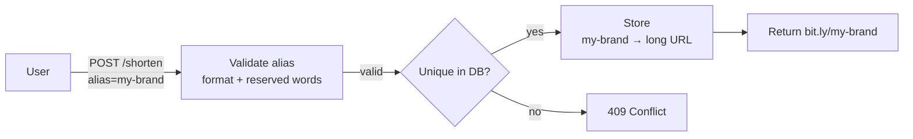

### Pitfalls
- ❌ **Not reserving system paths:** Users could claim `api`, `admin`, `health` as aliases — block reserved words at validation
- ❌ **Case sensitivity ambiguity:** `My-Brand` vs `my-brand` — normalize to lowercase on write and lookup

### Concept Reference

---

## Q4: How would you scale the redirect service to handle 50K req/sec?

**Role:** Senior | **Difficulty:** 🔴 Senior | **Priority:** P0 | **Format:** Deep Dive

> **What the interviewer is testing:** Whether you know how to design a horizontally scalable, cache-first read path that keeps p99 latency under 50ms.

### Problem Constraints
| Dimension | Value |
|-----------|-------|
| Scale | 50K redirects/sec sustained |
| Latency SLA | p99 < 50ms |
| Availability | 99.99% (52 min downtime/year) |
| Data size | 100M URL mappings (~50 GB in DB) |

### Approach A — Single-Region Redis Cache + DB Fallback

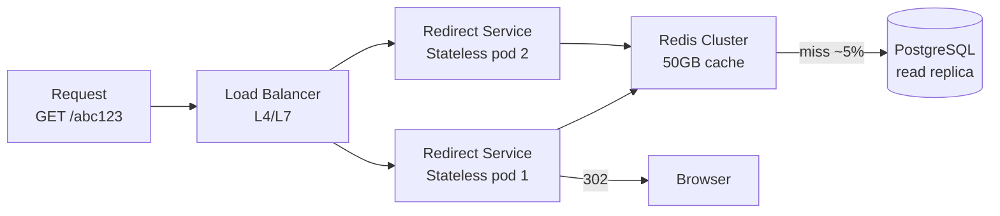

### Approach B — CDN Edge Caching

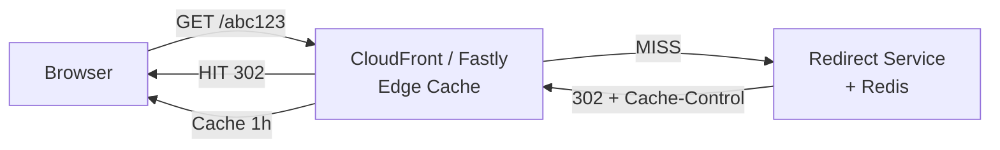

| Dimension | Approach A (Redis) | Approach B (CDN Edge) |
|-----------|-------------------|-----------------------|
| Throughput | 500K rps/node | 10M+ rps globally |
| Latency p99 | 5–15ms (same region) | 2–8ms (edge) |
| Cache hit rate | ~80% (LRU 50GB) | ~95% (global PoPs) |
| Cost | Redis cluster ~$500/mo | CDN ~$0.0001/request |
| Analytics | Easy — all hits pass service | Hard — CDN bypasses analytics service |

**Approach A when:** You need per-redirect analytics (click tracking, geo, referrer).
**Approach B when:** Maximum throughput + lowest latency, analytics not needed on every hit.

### Recommended Answer
Hybrid: Use CDN edge caching for static content (301 permanent redirects — no analytics needed). Use Redis + stateless redirect pods for dynamic/trackable links (302). Auto-scale redirect pods on CPU; use Redis Cluster with 3 shards × 2 replicas. At 50K rps with 80% cache hit, DB sees ~10K rps — well within read replica capacity.

### What a great answer includes
- [ ] Mentions cache hit rate and what the DB sees (not raw 50K)
- [ ] Distinguishes 301 vs 302 and analytics implications
- [ ] Addresses Redis cluster sharding strategy
- [ ] Mentions horizontal scaling of stateless redirect pods

### Pitfalls
- ❌ **Forgetting read replicas:** Single DB writer at 50K miss rps would saturate immediately
- ❌ **Using 301 redirects for analytics:** Browser caches 301 permanently — analytics service never sees repeat visits

### Concept Reference

---

## Q5: What database schema would you use for storing URL mappings?

**Role:** Mid | **Difficulty:** 🟡 Mid | **Priority:** P1 | **Format:** Quick Answer

> **What the interviewer is testing:** Whether you understand indexing, normalization trade-offs, and data access patterns for a write-once, read-many system.

### Answer in 60 seconds
- **Core table:** `urls(id BIGINT PK, short_code VARCHAR(10) UNIQUE, long_url TEXT, user_id BIGINT, created_at TIMESTAMP, expires_at TIMESTAMP, is_active BOOL)`
- **Index on short_code:** Primary lookup path — B-tree index, single-column, supports ~10K lookups/sec per Postgres instance
- **Index on user_id:** For "list my links" queries — secondary index
- **No joins on hot path:** Redirect lookup is a single-row fetch by `short_code` — no joins, no aggregations
- **Partition by created_at:** If > 500M rows, range partition by month for easier archival

### Diagram

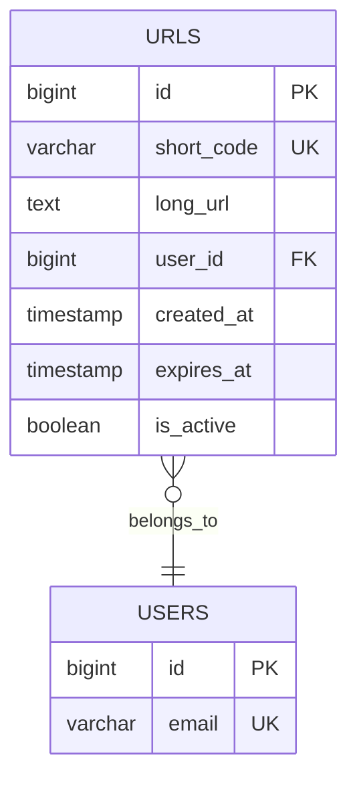

### Pitfalls
- ❌ **Storing analytics in the same table:** Click counts cause write amplification on the read-heavy URLs table — use separate analytics table or ClickHouse
- ❌ **VARCHAR(2048) for long_url:** URLs can exceed 2KB — use TEXT type; add separate column for display truncation

### Concept Reference

---

## Q6: How do you cache redirects to avoid hitting the database?

**Role:** Mid | **Difficulty:** 🟡 Mid | **Priority:** P1 | **Format:** Quick Answer

> **What the interviewer is testing:** Whether you know cache-aside pattern, TTL strategy, and how to handle cache invalidation for URL expiry.

### Answer in 60 seconds
- **Cache-aside pattern:** App checks Redis first; on miss, reads DB, writes to cache with TTL
- **Key:** `redirect:{short_code}` → value: `{long_url, expires_at, is_active}`
- **TTL:** 24h default; shorter TTL if `expires_at` is sooner than 24h from now
- **Write-through on create:** When URL is created, immediately warm cache — avoids cold miss on first redirect
- **Cache size:** Top 20% of URLs drive 80% of traffic; 50GB Redis holds ~100M entries (500 bytes/entry)

### Diagram

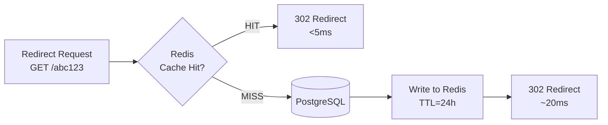

### Pitfalls
- ❌ **Not honoring expires_at in cache:** URL expires at midnight but cache TTL is 24h — user gets redirect to expired URL; set TTL = min(24h, time_until_expiry)
- ❌ **Cache stampede on popular URL expiry:** Multiple requests miss simultaneously, all hit DB; use probabilistic early expiry or Redis lock on miss

### Concept Reference

---

## Q7: How do you track analytics (click counts, geo, referrer) without slowing redirects?

**Role:** Senior | **Difficulty:** 🔴 Senior | **Priority:** P1 | **Format:** Deep Dive

> **What the interviewer is testing:** Whether you know how to decouple analytics from the critical path using async pipelines, and the trade-offs between real-time vs batch aggregation.

### Problem Constraints
| Dimension | Value |
|-----------|-------|
| Scale | 10K clicks/sec → 864M clicks/day |
| Latency SLA | Redirect p99 < 50ms (analytics must not add latency) |
| Analytics freshness | Near-real-time: < 60s for dashboard counts |
| Data retention | 2 years of raw events |

### Approach A — Synchronous DB Write

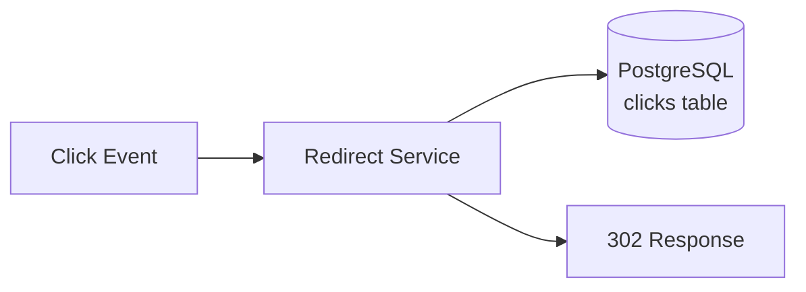

**When to use:** Low volume (< 100 rps), simplicity required, no latency SLA.

### Approach B — Async Kafka Pipeline

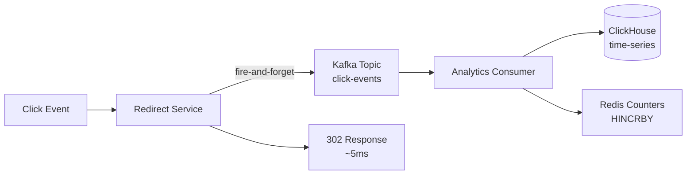

| Dimension | Approach A (Sync Write) | Approach B (Async Kafka) |
|-----------|------------------------|--------------------------|
| Redirect latency | +10–30ms per click | 0ms added (async) |
| Throughput | ~2K writes/sec (DB limit) | 500K events/sec (Kafka) |
| Data loss risk | None (synchronous) | Small window if Kafka lag |
| Dashboard freshness | Immediate | 5–30 seconds |
| Complexity | Low | High |

### Recommended Answer
Use Kafka (Approach B). Redirect service emits to Kafka topic `click-events` with fire-and-forget (producer acks=1). Analytics consumer batches events and writes to ClickHouse in 5-second micro-batches. Redis HINCRBY gives real-time counters for live dashboards. Raw events in Kafka replayed for accuracy if consumer fails.

### What a great answer includes
- [ ] States that analytics must not block the redirect response
- [ ] Mentions Kafka as decoupling mechanism
- [ ] Explains Redis HINCRBY for real-time counters
- [ ] Addresses at-least-once delivery and deduplication

### Pitfalls
- ❌ **Writing to DB on every redirect:** At 10K rps, analytics writes compete with redirect reads — DB becomes bottleneck
- ❌ **Losing clicks when Kafka is down:** Use local buffer (in-memory queue) with circuit breaker to drop analytics, not redirects

### Concept Reference

---

## Q8: How do you handle link expiration?

**Role:** Senior | **Difficulty:** 🔴 Senior | **Priority:** P1 | **Format:** Quick Answer

> **What the interviewer is testing:** Whether you understand TTL-based invalidation, lazy vs eager expiry, and user experience for expired links.

### Answer in 60 seconds
- **Store expires_at:** Column in URLs table; null = never expires
- **Lazy expiry:** Check `expires_at < NOW()` on every redirect request — no background job needed
- **Cache TTL alignment:** Set Redis TTL = min(24h, seconds_until_expiry) so expired URLs auto-evict from cache
- **Cleanup job:** Nightly batch deletes expired rows older than 30 days to control table size
- **User response:** Return 410 Gone (not 404) for intentionally expired links — signals permanent removal

### Diagram

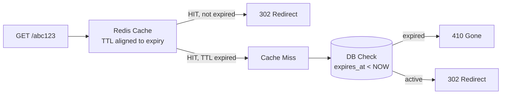

### Pitfalls
- ❌ **Returning 404 for expired links:** 404 means "not found" — crawlers may retry; 410 Gone signals permanent removal and stops retries
- ❌ **Not cleaning up DB:** Expired rows accumulate — index size grows, slowing lookup; schedule nightly cleanup

### Concept Reference

---

## Q9: How do you prevent abuse (spam/phishing)?

**Role:** Senior | **Difficulty:** 🔴 Senior | **Priority:** P2 | **Format:** Quick Answer

> **What the interviewer is testing:** Whether you understand abuse prevention in a URL shortener — specifically rate limiting, domain blacklisting, and safe browsing integration.

### Answer in 60 seconds
- **Rate limit creation:** 10 URLs/min per IP (unauthenticated); 100/min per API key (authenticated) — stops bulk spam
- **Domain blacklist:** Check destination domain against blocklist (Google Safe Browsing API) before creating short URL
- **Malware scanning:** Async check via VirusTotal API after creation; disable URL if flagged within 60s
- **Reputation scoring:** Track per-domain click-through rate; auto-suspend if >50% clicks result in user bounce-back
- **CAPTCHA:** Rate-limited IPs get CAPTCHA on creation form before blocking

### Diagram

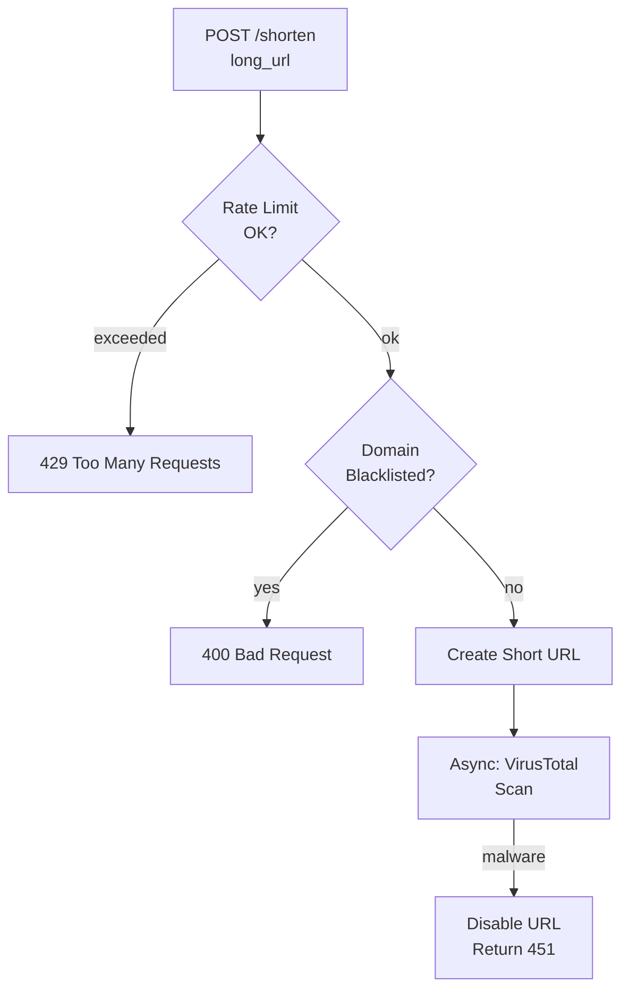

### Pitfalls
- ❌ **Blocking only at creation time:** URLs can be created clean then used for phishing after domain is compromised — re-scan periodically
- ❌ **Using synchronous malware scan in creation path:** VirusTotal scan takes 5–30s — always async; create first, disable retroactively

### Concept Reference

---

## Q10: How would you geo-distribute the redirect service to achieve <50ms globally?

**Role:** Staff | **Difficulty:** ⚫ Staff | **Priority:** P2 | **Format:** Deep Dive

> **What the interviewer is testing:** Whether you understand multi-region deployment, global load balancing with GeoDNS, data replication lag, and the trade-offs of eventual consistency for read-heavy workloads.

### Problem Constraints
| Dimension | Value |
|-----------|-------|
| Scale | 10K rps globally |
| Latency SLA | p99 < 50ms from any continent |
| Availability | 99.99% |
| Consistency | Eventual OK for redirects; strong for writes |

### Approach A — Active-Active Multi-Region

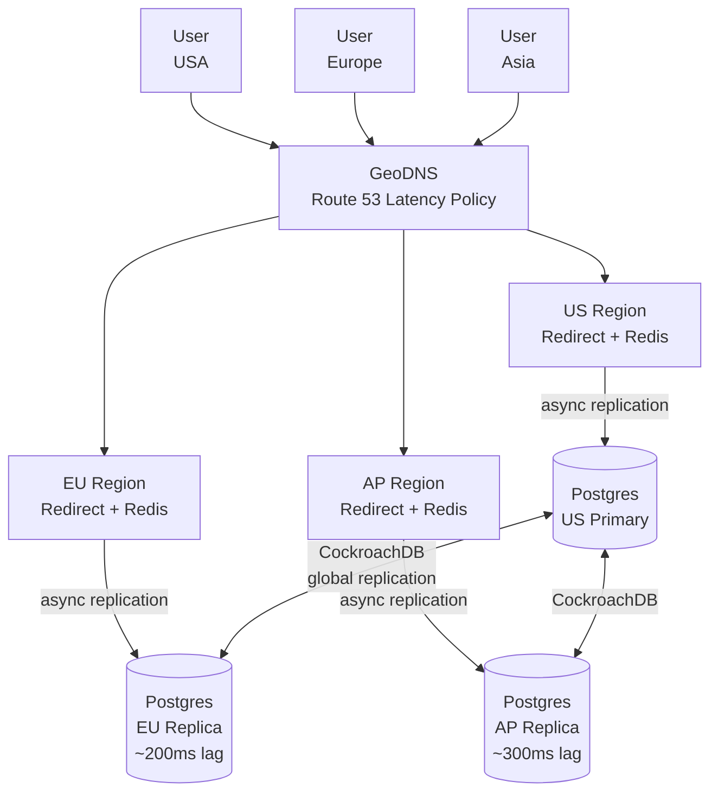

### Approach B — CDN Edge + Single-Region Origin

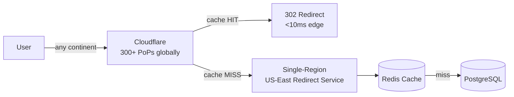

| Dimension | Approach A (Active-Active) | Approach B (CDN Edge) |
|-----------|--------------------------|----------------------|
| Cold request latency | 10–30ms (regional) | 5–10ms (edge hit) / 150ms (miss to US) |
| Complexity | Very high (global DB sync) | Medium (CDN config) |
| Write consistency | Strong with CockroachDB | N/A — writes always to US |
| Cost | 3× infrastructure | CDN costs + single origin |
| Analytics | All data in regional DBs | CDN access logs only |

### Recommended Answer
Approach B for 90% of traffic. CDN caches popular redirects at edge (cache hit rate ~85%), giving <10ms globally. For analytics and custom alias creation, all writes go to single-region primary. For the 15% cache misses, users in Asia/EU see 100–200ms to US origin — still within 50ms SLA if cache hit rate is high enough. If strict <50ms for all requests required, use CockroachDB for global active-active with Approach A.

### What a great answer includes
- [ ] Mentions GeoDNS or Anycast routing
- [ ] Quantifies CDN cache hit rate impact on global latency
- [ ] Addresses eventual consistency for replication lag
- [ ] Considers write path — writes to primary, reads from local replica

### Pitfalls
- ❌ **Treating reads and writes the same for geo-distribution:** Writes need strong consistency (go to primary); reads can tolerate stale data — route them to nearest replica
- ❌ **Ignoring DNS TTL:** GeoDNS only works if DNS TTL is short (60s); long TTLs mean users stay on a failed region

### Concept Reference
