# Design a Video Streaming Platform

---

## Q1: Design a video streaming platform like Netflix for 1M concurrent streams

**Role:** Senior | **Difficulty:** 🔴 Senior | **Priority:** P0 | **Format:** Scenario
**Real Company:** Netflix — 270M subscribers, 1B+ streaming hours/week, 15% of global internet bandwidth

### The Brief
> "Design a video streaming platform. Users upload videos and watch on-demand streams. The system must support 1M concurrent streams, provide adaptive bitrate streaming (1080p down to 360p based on network), and achieve < 2 second start time. Videos can be up to 2 hours long."

### Clarifying Questions to Ask First
1. Is this on-demand (YouTube/Netflix) or live streaming (Twitch)?
2. What geographic distribution is needed? (global CDN?)
3. What video formats/codecs must be supported (H.264, H.265, AV1)?
4. Are there DRM/content protection requirements?

### Back-of-Envelope Estimation
| Metric | Calculation | Result |
|--------|-------------|--------|
| Concurrent streams | 1M | 1M streams |
| Avg bitrate | 4 Mbps (1080p) | — |
| Total bandwidth | 1M × 4 Mbps | 4 Tbps |
| Storage per video | 2hr × 4 Mbps × 6 quality levels | ~21 GB per video |
| Video uploads/day | 10K new videos/day | — |
| New storage/day | 10K × 21 GB | ~210 TB/day |
| CDN edge servers | Each handles 100 Gbps | 40 edge nodes for 4 Tbps |

### High-Level Architecture

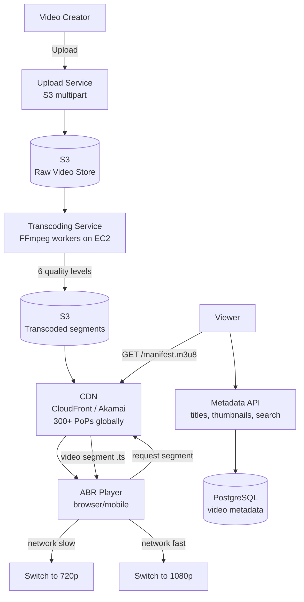

### Deep Dive: Adaptive Bitrate Streaming

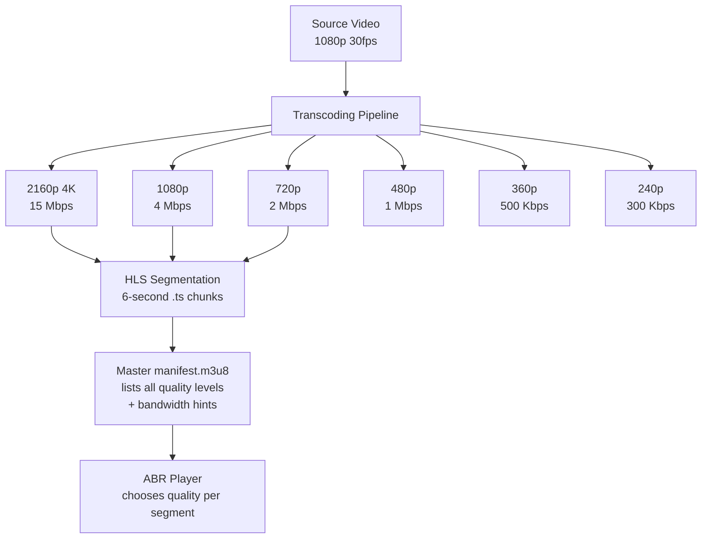

### Trade-off Decisions
| Decision | Option A | Option B | Chosen | Why |
|----------|----------|----------|--------|-----|
| Streaming protocol | HLS | DASH | HLS | Universal iOS support; DASH for HEVC/AV1 |
| Segment size | 2-second chunks | 10-second chunks | 6-second | Balance startup latency vs switching delay |
| CDN strategy | Push (pre-populate) | Pull (on-demand) | Pull with warm | Can't predict what 1M users want; pull + CDN cache |
| Transcoding | Real-time (upload) | Batch (background) | Batch | Allows quality verification before publishing |

### Failure Modes
| Failure | Impact | Mitigation |
|---------|--------|------------|
| CDN edge node down | Viewers in region rebuffer | Anycast routing; failover to next nearest PoP |
| Transcoding queue backlog | New videos delayed | Auto-scale EC2 Spot instances for transcoding workers |
| S3 us-east-1 outage | Origin unavailable | Multi-region S3 replication; CDN serves stale for 1h |
| Manifest not found | Video won't start | Separate metadata API from CDN; metadata DB HA |

### Concept References
→ [CDN Design](../../../system-design/scale-and-reliability/cdn-design)
→ [Load Balancing](../../../system-design/fundamentals/load-balancing)

---

## Q2: What is adaptive bitrate streaming (ABR) and how does it work?

**Role:** Mid | **Difficulty:** 🟡 Mid | **Priority:** P0 | **Format:** Quick Answer

> **What the interviewer is testing:** Whether you understand how video players dynamically adjust quality based on network conditions, avoiding rebuffering without manual quality selection.

### Answer in 60 seconds
- **Definition:** ABR splits video into small segments (6-10s) at multiple quality levels; player picks the highest quality segment its bandwidth can download before playback catches up
- **Manifest file:** HLS manifest (`.m3u8`) lists all quality tiers and their bandwidth requirements; player starts here
- **Bandwidth estimation:** Player measures download speed of last N segments → estimates available bandwidth → requests segment at matching quality
- **Buffer-based switching:** If buffer falls < 10s of video ahead, player downgrades quality to rebuild buffer; if buffer > 30s, upgrades quality
- **Protocols:** HLS (Apple, mobile-friendly), DASH (ISO standard), HDS (Adobe, deprecated)

### Diagram

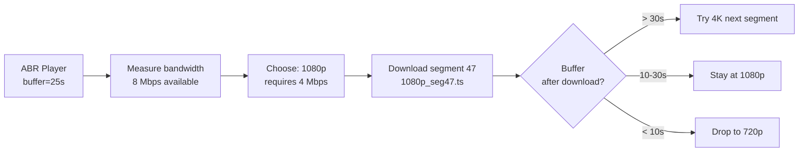

### Pitfalls
- ❌ **Requesting segment too large for available bandwidth:** Player estimates 4 Mbps, requests 15 Mbps (4K) — download takes 3.75× real-time — buffer empties, video freezes
- ❌ **Switching quality on every segment:** Network measurement has variance — add hysteresis (stay at current quality unless difference > 20%) to avoid constant quality flipping

### Concept Reference
→ [CDN Design](../../../system-design/scale-and-reliability/cdn-design)

---

## Q3: How does Netflix encode and store videos at global scale?

**Role:** Senior | **Difficulty:** 🔴 Senior | **Priority:** P0 | **Format:** Deep Dive

> **What the interviewer is testing:** Whether you understand Netflix's multi-codec encoding pipeline, per-title encoding optimization, and Open Connect CDN strategy.

### Problem Constraints
| Dimension | Value |
|-----------|-------|
| Library size | 36,000+ titles |
| Encoding jobs | Per-title optimization per codec |
| Storage | ~3 PB of encoded content |
| Delivery | 15% of global internet bandwidth at peak |

### Approach A — Fixed Ladder Encoding (Traditional)

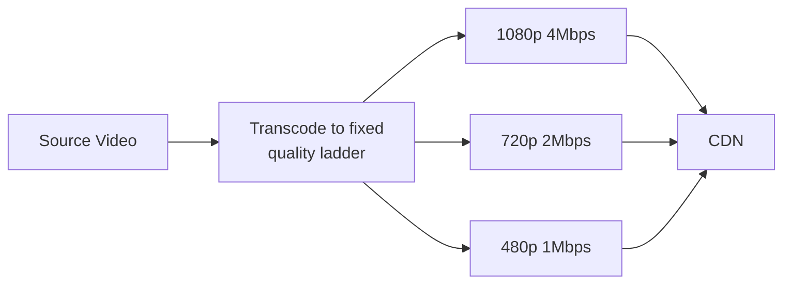

**Problem:** Animated content at 1080p needs less bandwidth than live action; fixed ladder wastes bandwidth or looks bad.

### Approach B — Per-Title Encoding Optimization (Netflix)

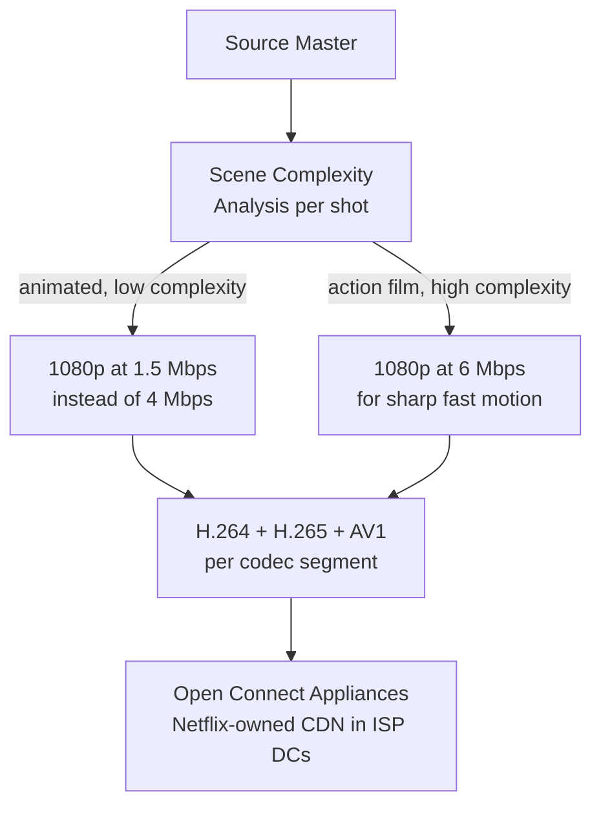

| Dimension | Fixed Ladder | Per-Title Optimization |
|-----------|-------------|----------------------|
| Bandwidth per stream | 4 Mbps avg | 2 Mbps avg (50% reduction) |
| Visual quality | Uniform | Optimized per content |
| Encoding cost | Low (one pass) | High (convex hull optimization) |
| Storage | Fixed | Variable per title |

### Recommended Answer
Netflix uses per-title encoding (Approach B) with AV1 codec (30% better compression than H.264). They analyze each title's complexity, find optimal bitrate-quality curve (convex hull), and encode only the points on the curve. Open Connect Appliances (Netflix-owned hardware in ISP data centers) cache popular content, reducing transit costs by 95%. 270M subscribers × 2 Mbps avg = 540 Gbps — but Open Connect moves 70% of traffic locally in ISP network, only 30% needs long-haul transit.

### What a great answer includes
- [ ] Names per-title vs fixed-ladder encoding
- [ ] Mentions AV1 codec efficiency gain
- [ ] Describes Open Connect as Netflix-owned CDN hardware
- [ ] Quantifies bandwidth savings from per-title encoding

### Pitfalls
- ❌ **Treating CDN as third-party only:** Netflix owns their CDN hardware in ISP facilities — this is a key cost and quality differentiator
- ❌ **Encoding only H.264:** H.265 is 40% smaller, AV1 is 50% smaller — modern devices support all three; encode multiple codecs, player picks best supported

### Concept Reference
→ [CDN Design](../../../system-design/scale-and-reliability/cdn-design)

---

## Q4: What is a CDN and how does it reduce video buffering?

**Role:** Mid | **Difficulty:** 🟡 Mid | **Priority:** P1 | **Format:** Quick Answer

> **What the interviewer is testing:** Whether you understand CDN fundamentals and can explain the role of edge caching in reducing both latency and origin bandwidth.

### Answer in 60 seconds
- **CDN definition:** Network of geographically distributed servers that cache content close to users; CloudFront has 400+ PoPs, Akamai 4,000+ PoPs
- **How it reduces buffering:** Video segment request to edge server (5ms round-trip) vs origin in US-East (200ms from Asia) — 40× faster; download rate determines buffer fill speed
- **Cache hit rate:** Popular Netflix title cached at every edge — 99%+ hit rate; obscure title may only cache on first request in each region
- **Origin offload:** At 95% cache hit rate, only 5% of requests reach origin — reduces origin bandwidth by 20×
- **Video segment caching:** Segment TTL = video duration + buffer; manifest TTL = 5s (must be fresh for ABR decisions)

### Diagram

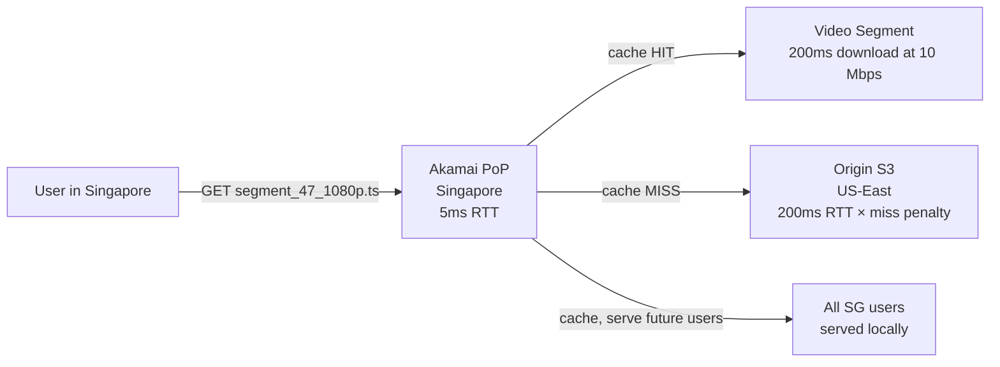

### Pitfalls
- ❌ **Setting segment TTL = forever:** If video is updated (re-encoded for quality), old segments stuck at edge; use versioned URLs (`/v2/seg47.ts`) to bust cache
- ❌ **Not caching manifests separately from segments:** Manifest must be fresh (5s TTL) to reflect quality changes; segments can be cached indefinitely (they never change)

### Concept Reference
→ [CDN Design](../../../system-design/scale-and-reliability/cdn-design)

---

## Q5: How do you handle video upload, processing, and transcoding at scale?

**Role:** Senior | **Difficulty:** 🔴 Senior | **Priority:** P1 | **Format:** Deep Dive

> **What the interviewer is testing:** Whether you can design an async video processing pipeline that handles unreliable uploads, long-running transcoding jobs, and video validation.

### Problem Constraints
| Dimension | Value |
|-----------|-------|
| Upload size | Up to 50 GB per video |
| Processing time | 30 min – 4 hours depending on duration |
| Concurrency | 10K uploads/day = 7 uploads/min |
| Failure handling | Resume interrupted uploads; retry failed transcoding |

### Approach A — Synchronous: Wait for Transcode


**Problem:** 4-hour upload-to-publish pipeline; failures lose all progress.

### Approach B — Async Pipeline with Kafka + Worker Pool

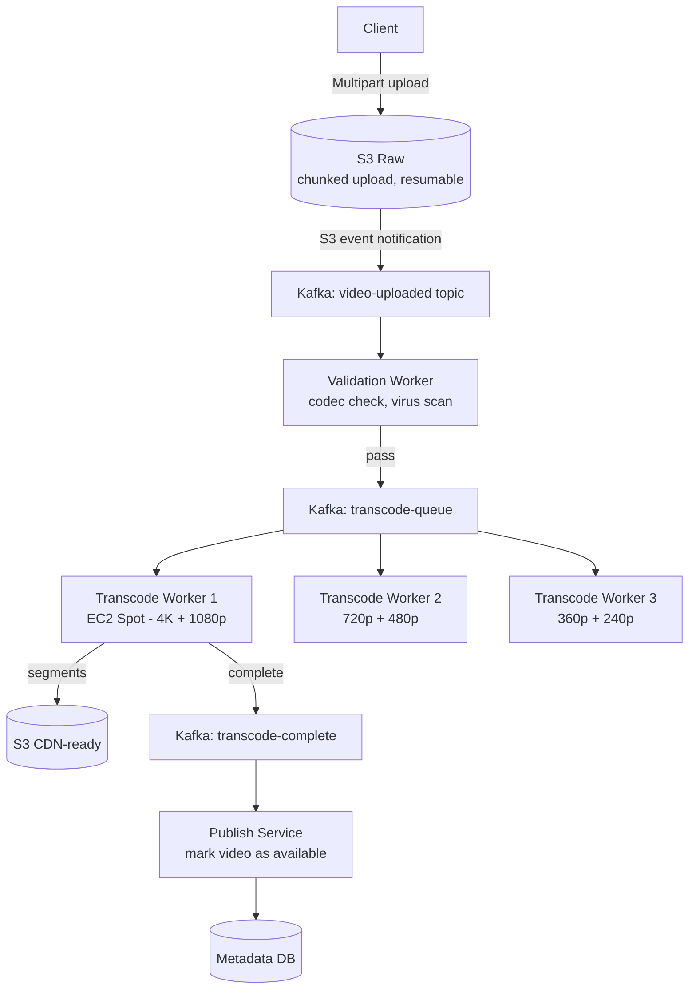

| Dimension | Synchronous | Async Pipeline |
|-----------|------------|---------------|
| Upload-to-publish time | 4 hours blocking | ~45 min async |
| Failure recovery | Restart from scratch | Resume from failed stage |
| Resource utilization | One large VM | Spot instances scale out |
| Upload resume | No | Yes (S3 multipart) |

### Recommended Answer
Async pipeline (Approach B). Client uploads via S3 multipart (each 100MB part uploaded independently — resume on network failure). S3 event → Kafka → validation worker (ffprobe checks codec, duration, resolution). Validated video queued for transcoding; 3 parallel workers handle different quality levels simultaneously — 4K + 1080p done in 30 min, lower qualities in 15 min. Thumbnail generation and speech-to-text subtitles run as separate async workers on same Kafka event.

### What a great answer includes
- [ ] S3 multipart for resumable large file upload
- [ ] Parallel transcoding workers for different quality tiers
- [ ] Validation stage before transcoding (bad video fails fast)
- [ ] Event-driven progress tracking (video state machine)

### Pitfalls
- ❌ **Transcoding all quality levels in single sequential job:** 4K + 1080p + 720p + 480p + 360p + 240p sequentially = 6× longer; parallelize across workers
- ❌ **Using large EC2 On-Demand instances:** Transcoding is CPU-intensive burst workload — Spot instances reduce cost by 70%; handle interruption with job checkpointing

### Concept Reference
→ [Kafka / Messaging](../../../system-design/messaging-and-streaming/kafka-rabbitmq)

---

## Q6: How do you implement video resumption (continue where you left off)?

**Role:** Senior | **Difficulty:** 🔴 Senior | **Priority:** P1 | **Format:** Quick Answer

> **What the interviewer is testing:** Whether you understand watch position tracking, cross-device sync, and the trade-offs between real-time vs batch position updates.

### Answer in 60 seconds
- **Store watch position:** Every 30s during playback, client sends `{user_id, video_id, position_seconds}` to progress API
- **On app open:** Fetch last position from API; player seeks to `position - 15s` (slight rewind for context)
- **Storage:** `watch_history(user_id, video_id, position_seconds, last_updated)` — upsert on every update
- **Write frequency:** 30s interval × 1M concurrent streams = 33K writes/sec — use Redis write-through (fast) + async flush to PostgreSQL every 5min
- **Cross-device:** Same user_id → same position regardless of device; latest timestamp wins

### Diagram

```mermaid
graph LR
  Player[Video Player\nposition=1847s] -->|every 30s| ProgressAPI[Progress API]
  ProgressAPI -->|HSET watch:u123:v456 pos=1847| Redis[(Redis\nfast write)]
  Redis -->|async flush every 5min| PostgreSQL[(PostgreSQL\ndurable store)]
  AppOpen[App opens] --> FetchPos[GET /watch-position/{video_id}]
  FetchPos --> Redis
  Redis -->|pos=1847| PlayerInit[Player seeks to 1832s\n-15s rewind for context]
```

### Pitfalls
- ❌ **Updating position on every frame:** At 30fps, 30K writes/sec per concurrent stream × 1M streams = 30B writes/sec — completely unacceptable; sample every 30s
- ❌ **Not handling device clock skew for last-write-wins:** If device A and B update simultaneously with same timestamp, use server-side timestamp, not client-provided

### Concept Reference
→ [Caching Strategies](../../../system-design/fundamentals/caching-strategies)

---

## Q7: How do you protect video content from unauthorized downloads (DRM)?

**Role:** Senior | **Difficulty:** 🔴 Senior | **Priority:** P2 | **Format:** Quick Answer

> **What the interviewer is testing:** Whether you understand DRM systems, key management, and how license servers control playback authorization.

### Answer in 60 seconds
- **DRM systems:** Widevine (Google, Chrome/Android), FairPlay (Apple, iOS/Safari), PlayReady (Microsoft, Windows/Edge) — must support all three
- **Encrypted segments:** Video segments encrypted with AES-128 using content encryption key (CEK); CEK not embedded in manifest
- **License server:** Player requests license from DRM server (presents auth token + device credentials) → DRM server returns decryption key wrapped in DRM container
- **Key per title:** Each video title has unique CEK; CEK rotation possible on compromise
- **Secure hardware:** Hardware DRM (L1 in Widevine) required for HD+ streams; software DRM (L3) limited to 480p by content owners

### Diagram

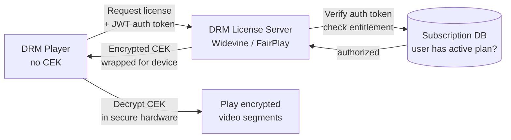

### Pitfalls
- ❌ **Embedding CEK in manifest or JavaScript:** Key visible to browser devtools → easily extracted; CEK must only transit via hardware-secured DRM license
- ❌ **Supporting only Widevine:** Apple devices require FairPlay — need multi-DRM solution (Axinom, PallyCon, or AWS MediaConvert) that handles all DRM types

### Concept Reference
→ [CDN Design](../../../system-design/scale-and-reliability/cdn-design)

---

## Q8: How would you design thumbnail generation for 500M videos?

**Role:** Senior | **Difficulty:** 🔴 Senior | **Priority:** P2 | **Format:** Deep Dive

> **What the interviewer is testing:** Whether you can design an async media processing pipeline with fan-out for multiple output sizes and formats.

### Problem Constraints
| Dimension | Value |
|-----------|-------|
| Video library | 500M videos (YouTube scale) |
| Thumbnails per video | 3 auto-generated + 1 custom from creator |
| Thumbnail sizes | 120×90, 320×180, 640×360, 1280×720 |
| Freshness | Within 5 min of upload |

### Approach A — Synchronous During Upload

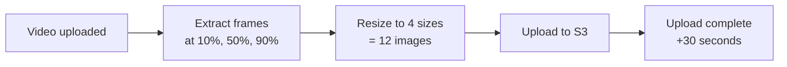

### Approach B — Async Worker Pool

```mermaid
graph TD
  Upload[Video Upload Complete] --> Kafka[Kafka: media-processing]
  Kafka --> ThumbWorker[Thumbnail Worker Pool\nauto-scaled by queue depth]
  ThumbWorker -->|ffmpeg: extract frame at 10%| Frame1[Frame 1]
  ThumbWorker -->|ffmpeg: extract frame at 50%| Frame2[Frame 2]
  ThumbWorker -->|ffmpeg: extract frame at 90%| Frame3[Frame 3]
  Frame1 --> Resize[ImageMagick resize\n4 sizes each]
  Frame2 --> Resize
  Frame3 --> Resize
  Resize -->|12 images| S3[(S3\nthumbnails/{video_id}/)]
  S3 --> CDN[CloudFront CDN\nthumbnail URLs]
  S3 --> UpdateMeta[Update metadata DB\nthumbnail_status=ready]
```

| Dimension | Synchronous | Async Pool |
|-----------|------------|-----------|
| Upload response time | +30s (user waits) | Instant (async) |
| Scalability | Limited by upload server | Independent worker scaling |
| Failure recovery | Upload fails if thumbnail fails | Retry thumbnail independently |
| Worker cost | Tied to upload resources | Spot instances, cost-optimized |

### Recommended Answer
Async pipeline (Approach B). Video upload complete event → Kafka → dedicated thumbnail worker pool (auto-scale on queue depth). Workers extract 3 frames using FFmpeg, resize to 4 dimensions = 12 images per video, upload to S3 with versioned paths. CDN edge caches thumbnails with long TTL (7 days). Metadata DB updated when thumbnails ready. Custom creator thumbnails uploaded separately via same pipeline with higher priority queue.

### What a great answer includes
- [ ] Async processing — thumbnail failure doesn't block video publish
- [ ] Multiple thumbnail sizes for responsive display
- [ ] CDN distribution for fast thumbnail load
- [ ] Custom creator thumbnail override path

### Pitfalls
- ❌ **Extracting only 1 frame for thumbnails:** Auto-selected frames often hit blank scene or title card; extract 3-5 options, let creator pick or ML select highest-engagement thumbnail
- ❌ **Storing thumbnails at full resolution:** 1280×720 thumbnail is 200KB; serve smallest size for list views; use responsive images (`srcset`) to serve right size per context

### Concept Reference
→ [Kafka / Messaging](../../../system-design/messaging-and-streaming/kafka-rabbitmq)

---

## Q9: Live streaming vs on-demand architecture differences?

**Role:** Staff | **Difficulty:** ⚫ Staff | **Priority:** P2 | **Format:** Quick Answer

> **What the interviewer is testing:** Whether you understand the fundamental architectural differences between live and VOD streaming, especially around latency, CDN behavior, and segment availability.

### Answer in 60 seconds
- **On-demand:** All segments pre-generated, stored in S3, cached at CDN; viewer can seek anywhere; CDN hit rate 90%+; no latency concern
- **Live streaming:** Segments generated in real-time at source; CDN cannot pre-cache (segments don't exist yet); latency is 10–45 seconds for HLS, 2–8 seconds for LL-HLS (Low-Latency HLS)
- **Live CDN push:** Broadcaster pushes each new segment to CDN immediately; CDN pulls from origin for cache misses — but misses are expensive (segment may only live 5s)
- **DVR buffer:** Live stream keeps 4-hour rolling window of segments in S3 — enables "rewind 30 minutes" without switching to full VOD
- **Twitch model:** 2,500 Kbps RTMP ingest → transcoding in < 2s → HLS segments at CDN → 3.5M concurrent viewers

### Diagram

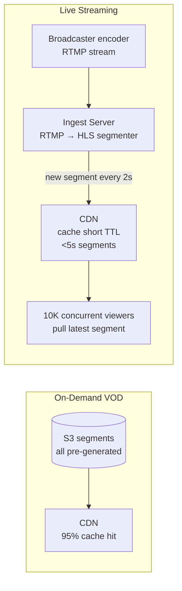

### Pitfalls
- ❌ **Using same CDN TTL for live and VOD:** Live segments are 2-6s long — CDN caching for 1 hour means viewers see stale manifest; live manifest TTL = segment duration (2s)
- ❌ **Not handling ingest server failure for live:** Single ingest point = SPOF; use redundant ingest with automatic failover; keep 30s buffer to mask 5s switchover

### Concept Reference
→ [CDN Design](../../../system-design/scale-and-reliability/cdn-design)

---

## Q10: How does YouTube achieve <2s video start time for 2B users?

**Role:** Staff | **Difficulty:** ⚫ Staff | **Priority:** P3 | **Format:** Quick Answer

> **What the interviewer is testing:** Whether you understand the techniques that reduce perceived startup time: pre-loading, early segment fetching, DNS pre-resolution, and edge computing.

### Answer in 60 seconds
- **Manifest pre-fetch:** When user hovers over thumbnail, player pre-fetches manifest file (< 5KB) — by click time, manifest is ready
- **First segment pre-loading:** With manifest in hand, player immediately requests first 2 segments at lowest quality — video starts playing while higher quality loads
- **ABR startup mode:** YouTube starts at 360p (fastest download) for first 5 seconds, then upgrades — minimizes time-to-first-frame
- **DNS pre-resolution:** Browser pre-resolves CDN hostname via DNS prefetch hints in HTML — eliminates 50ms DNS lookup on play
- **Edge computing:** YouTube uses Google's own CDN (GGC — Google Global Cache) in ISP networks — video served from 10ms away, not 200ms

### Diagram

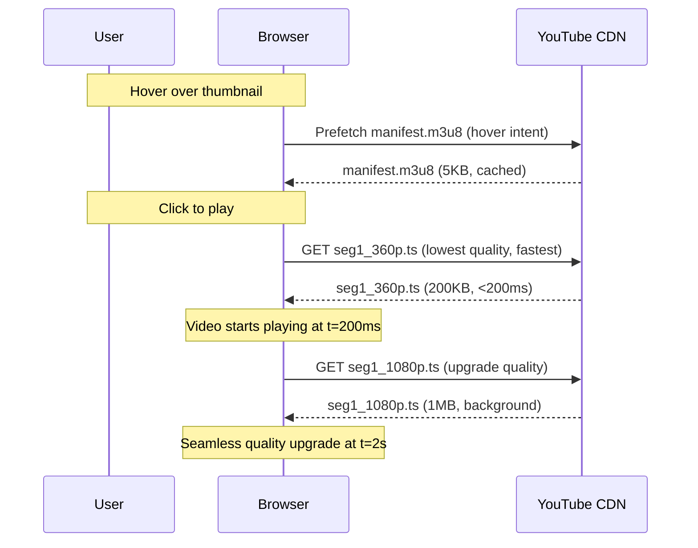

### Pitfalls
- ❌ **Starting at highest quality for first segment:** 1080p first segment = 2MB; at 100 Mbps = 160ms download but on 10 Mbps = 1.6s — start at 360p (200KB = 160ms even at 10 Mbps)
- ❌ **No prefetch on hover:** Without hover prefetch, user waits for manifest fetch after click — adds 100-300ms to startup; prefetch makes it invisible

### Concept Reference
→ [CDN Design](../../../system-design/scale-and-reliability/cdn-design)
