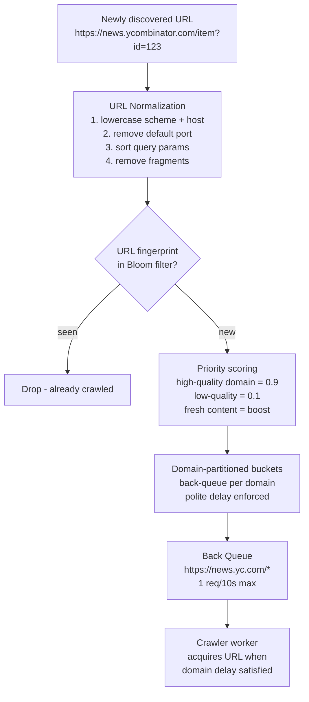
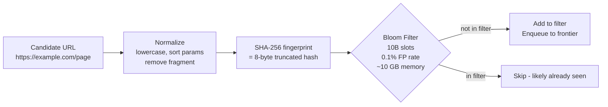
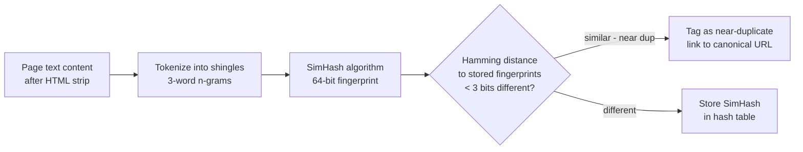
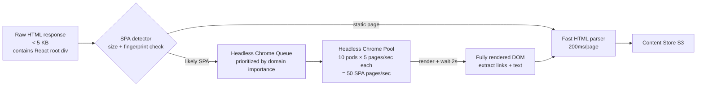
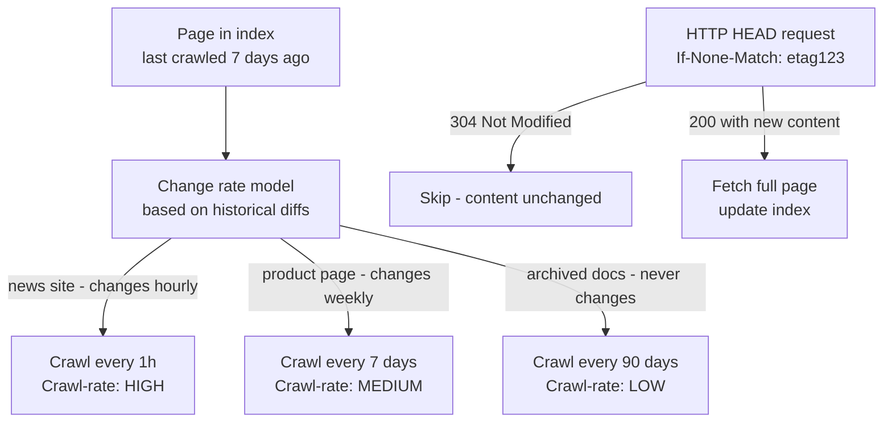
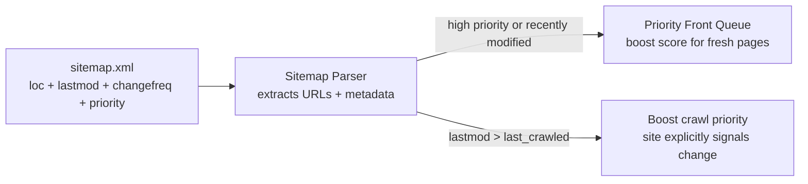

# Design a Web Crawler

---

## Q1: Design a web crawler that indexes 1 billion pages in 30 days

**Role:** Senior | **Difficulty:** 🔴 Senior | **Priority:** P0 | **Format:** Scenario
**Real Company:** Googlebot — crawls billions of pages/day; Common Crawl — monthly 3B+ page snapshots; Bing crawler — 100M+ pages/day

### The Brief
> "Design a distributed web crawler that can crawl 1 billion web pages within 30 days, store page content for indexing, respect robots.txt and crawl-delay directives, and avoid crawling duplicate content. The system should be fault-tolerant and resume gracefully after failures."

### Clarifying Questions to Ask First
1. Are we building a general-purpose crawler (like Googlebot) or focused on specific domains?
2. Do we need to re-crawl pages periodically, or is this a one-time snapshot (like Common Crawl)?
3. How do we handle JavaScript-rendered pages (SPAs) — render or skip?
4. What is the acceptable bandwidth limit per crawled domain?

### Back-of-Envelope Estimation
| Metric | Calculation | Result |
|--------|-------------|--------|
| Target crawl rate | 1B pages ÷ 30 days | ~386 pages/sec |
| Sustained rate (with failures) | 386 × 1.2 buffer | ~460 pages/sec → round to 400/sec |
| Avg page size | 50 KB compressed HTML | — |
| Storage for content | 1B × 50 KB | ~50 TB |
| URL frontier size | 10 URLs per page discovered | 10B URLs × 100 bytes = 1 TB |
| DNS lookups | 400 pages/sec × unique domains | ~40 DNS lookups/sec (cached aggressively) |
| Politeness constraint | 1 request/10s per domain | Need 4,000 domains crawled in parallel |
| Worker pods needed | 400 pages/sec ÷ 5 pages/sec per pod | ~80 crawler pods |

### High-Level Architecture

```mermaid
graph TD
  Seeds[Seed URLs\n1000 starting points] --> Frontier[URL Frontier\nPriority Queue\nRedis Sorted Set]
  Frontier --> Scheduler[Crawler Scheduler\nPolite dispatch\n1 req/domain/10s]
  Scheduler --> CrawlerPool[Crawler Worker Pool\n80 pods]

  CrawlerPool -->|HTTP GET| Internet[The Web]
  Internet -->|HTML response| Parser[HTML Parser\nextract links + content]

  Parser -->|discovered URLs| URLFilter[URL Filter\n1. robots.txt allowed?\n2. already seen?\n3. URL normalized?]
  URLFilter -->|new valid URLs| Frontier

  Parser -->|page content| ContentHash[Content Hasher\nSHA-256(stripped HTML)]
  ContentHash --> DedupCheck{Content hash\nalready seen?}
  DedupCheck -->|new| PageStore[Page Store\nS3 / HDFS\n50 TB]
  DedupCheck -->|duplicate| Discard[Discard - near-duplicate]

  PageStore --> IndexQueue[Kafka: pages-to-index\nfor downstream indexer]
```

### Deep Dive: URL Frontier Priority System



### Trade-off Decisions
| Decision | Option A | Option B | Chosen | Why |
|----------|----------|----------|--------|-----|
| URL seen check | Redis SET (exact) | Bloom filter | Bloom filter | 10B URLs × 100B = 1TB for Redis SET; Bloom filter = ~10 GB for 0.1% false positive rate |
| Content dedup | MD5 of raw HTML | SimHash for near-dup | SimHash + MD5 | MD5 detects exact dups; SimHash detects near-duplicates (same content, different ads/navbars) |
| URL frontier storage | In-memory queue | Redis Sorted Set | Redis Sorted Set | Survives worker crashes; priority-scored; scalable across pods |
| DNS caching | OS resolver | Custom in-process cache | Custom cache TTL=1h | OS resolver TTL often 30s; crawlers benefit from aggressive 1h cache; 40 DNS lookups/sec → 10 with cache |

### Failure Modes
| Failure | Impact | Mitigation |
|---------|--------|------------|
| Crawler trap | Infinite URL generation (e.g., calendar links `/cal?date=2026-03-26`) | URL depth limit (max 6 hops); URL path pattern detection; query param whitelist |
| URL explosion | Single domain generates 100M URLs (e.g., e-commerce faceted navigation) | Per-domain URL budget (max 1M URLs/domain); detect and block infinite parameter spaces |
| Robots.txt violation | Domain bans crawler IP; legal risk | Fetch and cache robots.txt per domain before any crawl; honor `Crawl-Delay`; block if `Disallow: /` |
| Dynamic JS content (SPAs) | Crawler fetches empty HTML shell, misses content | Detect single-page apps; route to headless Chrome pool (Puppeteer); much slower (1 page/2s vs 1/200ms) |

### Concept References
→ [Message Queues](../../../system-design/messaging-and-streaming/kafka-rabbitmq)
→ [Caching Strategies](../../../system-design/fundamentals/caching-strategies)

---

## Q2: How does the URL frontier prioritize and enforce politeness?

**Role:** Mid | **Difficulty:** 🟡 Mid | **Priority:** P0 | **Format:** Quick Answer

> **What the interviewer is testing:** Whether you understand the two-queue URL frontier design — front queues (priority) and back queues (politeness) — and how they work together to maximize throughput while respecting crawl-delay.

### Answer in 60 seconds
- **Front queues (priority):** Multiple FIFO queues, one per priority tier; Prioritizer assigns score (domain PageRank, freshness) and routes to Q1 (high) or Q3 (low); Queue selector biases toward high-priority queues
- **Back queues (politeness):** One queue per domain; each queue has a `crawl-after` timestamp; Worker only dequeues a URL from a domain queue when `NOW() > crawl_after`; default `crawl-after` = last_crawl + 10s; honors `Crawl-Delay` in robots.txt
- **Domain heap:** Min-heap ordered by `crawl_after`; worker pops domain with smallest `crawl_after` — always finds next crawlable domain efficiently
- **Parallelism:** With 4,000 domains each at 1 req/10s = 400 pages/sec — exactly our throughput target

### Diagram

```mermaid
graph LR
  NewURL[URL] --> Prioritizer[Prioritizer\nScore = f(domain_rank, freshness)]
  Prioritizer -->|score 0.9| FQ1[Front Queue 1\nhigh priority]
  Prioritizer -->|score 0.3| FQ3[Front Queue 3\nlow priority]

  QueueSelector[Queue Selector\nbiased random\n70% FQ1, 20% FQ2, 10% FQ3] --> FQ1
  FQ1 --> Router[Router\nassign to domain back queue]
  Router --> BQ_NYT[Back Queue\nnytimes.com\ncrawl_after=09:01:10]
  Router --> BQ_HN[Back Queue\nycombinator.com\ncrawl_after=09:01:20]

  DomainHeap[Domain Min-Heap\npop smallest crawl_after] --> Worker[Worker fetches URL\nfrom ready domain]
  BQ_NYT --> DomainHeap
  BQ_HN --> DomainHeap
```

### Pitfalls
- ❌ **Single global queue ignoring politeness:** Worker pops URLs as fast as possible; sends 400 requests/sec to nytimes.com — IP banned within minutes; domain-partitioned back queues are mandatory
- ❌ **Fixed 1s crawl delay for all domains:** Small blog may only handle 1 req/30s (robots.txt `Crawl-Delay: 30`); large CDN-backed sites can handle 1 req/s; always read and respect robots.txt `Crawl-Delay`

### Concept Reference
→ [Rate Limiting](../../../system-design/fundamentals/rate-limiting)

---

## Q3: How do you detect and avoid duplicate content?

**Role:** Senior | **Difficulty:** 🔴 Senior | **Priority:** P0 | **Format:** Deep Dive

> **What the interviewer is testing:** Whether you can distinguish URL deduplication (don't re-crawl same URL), exact content deduplication (identical pages), and near-duplicate detection (same content, minor differences) using appropriate algorithms at scale.

### Problem Constraints
| Dimension | Value |
|-----------|-------|
| URLs to dedup | 10B URLs across all frontier adds |
| Pages crawled | 1B pages |
| Near-duplicate rate | ~20% of web pages are near-duplicates |
| Memory budget | < 100 GB for dedup data structures |

### URL Deduplication — Bloom Filter



### Exact Content Deduplication — MD5

```mermaid
graph LR
  RawHTML[Raw HTML\nhttps://example.com/page] --> StripNav[Strip dynamic content\nremove ads, timestamps, nav]
  StripNav --> MD5[MD5(canonical_content)]
  MD5 --> HashSet{Hash seen in\nRedis SET?}
  HashSet -->|no| StoreHash[SADD content_hashes MD5\nStore page in S3]
  HashSet -->|yes| DropDup[Drop exact duplicate\ndo not store]
```

### Near-Duplicate Detection — SimHash



| Method | What It Catches | Memory | Speed | False Positive |
|--------|----------------|--------|-------|---------------|
| Bloom filter (URLs) | Exact URL duplicates | 10 GB for 10B URLs | O(1) | 0.1% |
| MD5 (content) | Exact content duplicates | 8B × 1B = 8 GB | O(1) | 0% |
| SimHash (content) | Near-duplicates (< 3 bit diff) | ~8 GB index | O(1) lookup | ~2% |

### Recommended Answer
Three-layer dedup strategy: (1) URL Bloom filter at frontier add — 10 GB catches 99.9% of URL dups, preventing re-crawl. (2) MD5 of stripped HTML at content store — prevents storing byte-identical pages (common for paginated content with only page numbers differing). (3) SimHash at indexing layer — identifies near-duplicates for canonical URL selection (don't index the same article on 20 mirror sites). Common Crawl uses this exact approach; Google additionally uses locality-sensitive hashing (LSH) for SimHash lookup at billion-page scale.

### What a great answer includes
- [ ] Distinguishes URL dedup (frontier) from content dedup (storage layer)
- [ ] States Bloom filter memory calculation (10 GB for 10B items at 0.1% FP)
- [ ] Explains SimHash Hamming distance threshold for near-dup
- [ ] Mentions stripping dynamic content (ads, timestamps) before hashing

### Pitfalls
- ❌ **Using full MD5 hash comparison for URL deduplication at 10B scale:** Storing 10B × 16B = 160 GB of MD5 hashes in Redis; Bloom filter does the same job at 10 GB with 0.1% FP rate — 16× more memory-efficient
- ❌ **No normalization before URL fingerprinting:** `http://example.com/page` vs `http://Example.COM/Page?a=1&b=2` vs `https://example.com/page?b=2&a=1` are the same page; without normalization, Bloom filter misses all three as different URLs

### Concept Reference
→ [Caching Strategies](../../../system-design/fundamentals/caching-strategies)
→ [Database Sharding](../../../system-design/storage-and-databases/database-sharding)

---

## Q4: How do you handle JavaScript-rendered single-page applications?

**Role:** Senior | **Difficulty:** 🔴 Senior | **Priority:** P1 | **Format:** Quick Answer

> **What the interviewer is testing:** Whether you understand the difference between static HTML crawling and JS-rendered content, and the architectural cost of adding a headless browser pool.

### Answer in 60 seconds
- **Problem:** SPAs return `<div id="root"></div>` in raw HTML; actual content rendered by JavaScript; crawler gets empty page with no indexable text and no links
- **Detection:** If raw HTML < 5 KB and contains `<script type="module">` or React/Angular fingerprint → likely SPA
- **Solution:** Route suspected SPAs to headless Chrome pool (Puppeteer/Playwright) — loads page, waits for `networkidle`, captures rendered DOM
- **Cost:** Static crawl = 1 page/200ms; headless Chrome = 1 page/2s (10× slower); reserve headless for important domains only
- **Googlebot approach:** Maintains separate render queue; pages first indexed as static HTML, then re-rendered by headless Chrome; two-wave indexing

### Diagram



### Pitfalls
- ❌ **Running headless Chrome for all pages:** 400 pages/sec × 2s/page = 800 Chrome instances needed; prohibitively expensive; gate with static analysis to only route SPAs to Chrome
- ❌ **Not waiting for network idle before capture:** Capturing DOM after 500ms misses lazily-loaded content; use `waitForNetworkIdle(timeout=3s)` or wait for specific DOM element

### Concept Reference
→ [Scalability](../../../system-design/fundamentals/horizontal-vs-vertical-scaling)

---

## Q5: How does Googlebot decide what to re-crawl and how often?

**Role:** Staff | **Difficulty:** ⚫ Staff | **Priority:** P2 | **Format:** Deep Dive

> **What the interviewer is testing:** Whether you understand adaptive crawl frequency based on page change rate, the freshness vs crawl cost trade-off, and how sitemaps accelerate crawl prioritization.

### Problem Constraints
| Dimension | Value |
|-----------|-------|
| Web size | ~50B+ indexed pages (Google estimate) |
| Crawl budget | Finite bandwidth, IP-based rate limits per domain |
| Freshness SLA | Breaking news: indexed in < 1 hour; stable docs: re-crawl monthly |
| Change detection | Must detect changed pages without fetching full content |

### Adaptive Recrawl Strategy



### Sitemap-Accelerated Crawling



| Dimension | No Adaptation (Fixed interval) | Adaptive Recrawl |
|-----------|-------------------------------|-----------------|
| News site freshness | 1-week lag (fixed) | < 1 hour (high-freq tier) |
| Crawl budget waste | High — re-crawl static docs weekly | Low — static docs every 90 days |
| Change detection cost | Full fetch every interval | HTTP HEAD (cheaper) + conditional GET |
| Implementation | Simple | Complex (change rate model per URL) |

### Recommended Answer
Googlebot uses a combination of: (1) Historical change-rate model per URL — pages that changed frequently in the past get higher recrawl priority. (2) HTTP conditional GET (`If-Modified-Since`, `If-None-Match`) — server returns 304 Not Modified if unchanged; saves bandwidth. (3) Sitemap signals — `<lastmod>` and `<priority>` accelerate crawl of explicitly signaled changes. (4) PageRank-weighted crawl budget — high-authority pages get more crawl frequency regardless of change rate. Small sites can use `IndexNow` API (Bing/Google) to proactively push new URL notifications to crawlers, bypassing recrawl scheduling entirely.

### What a great answer includes
- [ ] HTTP conditional GET (304) for bandwidth-efficient change detection
- [ ] Change-rate model per URL (not global fixed interval)
- [ ] Sitemap as a crawl acceleration signal
- [ ] Crawl budget allocation prioritizes high-PageRank pages

### Pitfalls
- ❌ **Equal recrawl frequency for all pages:** Re-crawling Wikipedia archive pages (never change) weekly wastes crawl budget that could refresh news articles; adaptive frequency is essential at Google scale
- ❌ **Trusting `changefreq` in sitemaps blindly:** Many sites set `changefreq=always` for all URLs to game crawl frequency; cross-validate with observed actual change rate from historical crawls

### Concept Reference
→ [Caching Strategies](../../../system-design/fundamentals/caching-strategies)
→ [Database Indexing](../../../system-design/storage-and-databases/database-indexing)
