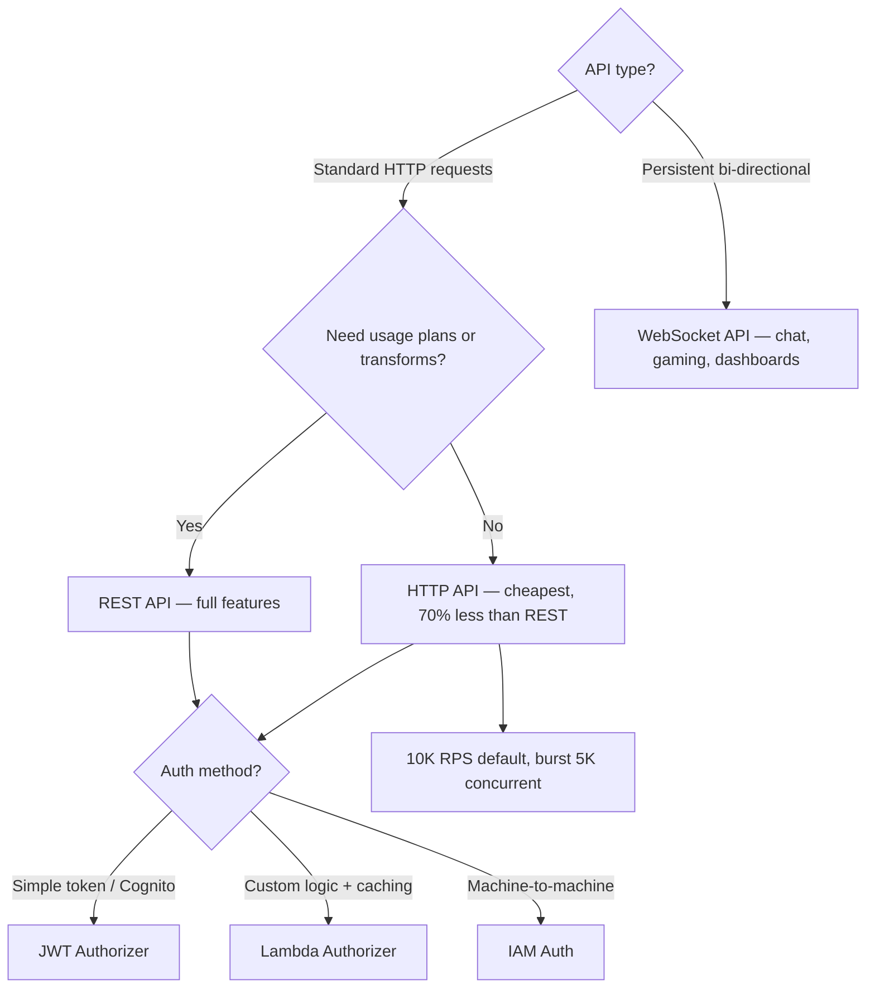
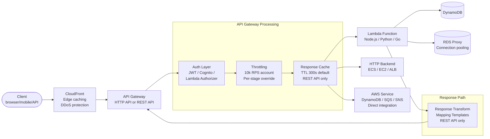
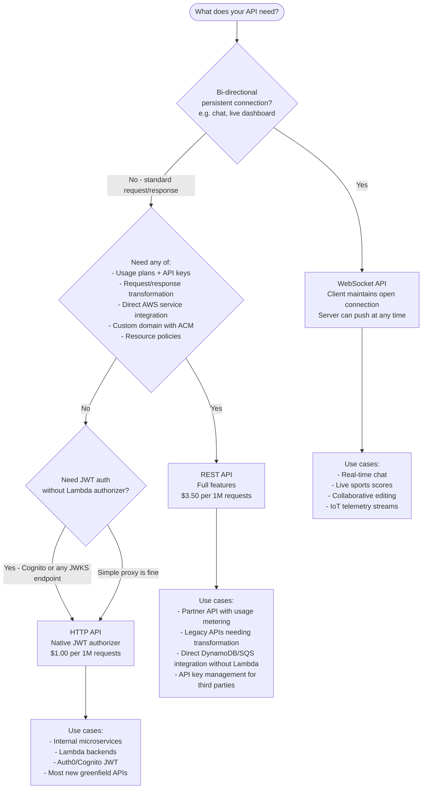
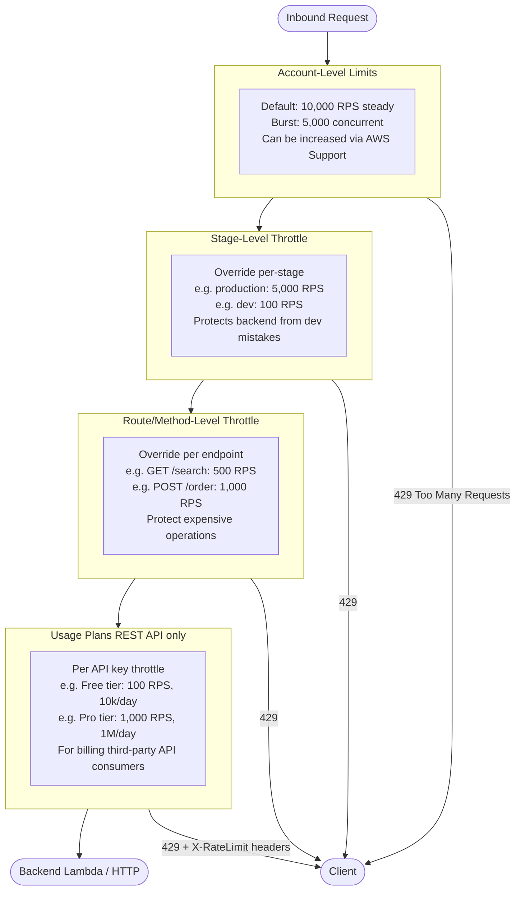
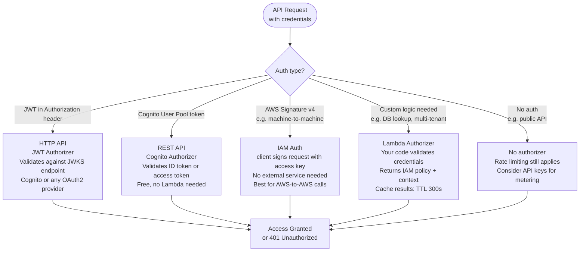

# AWS API Gateway: REST vs HTTP vs WebSocket, Auth & Scale

## 🗺️ Quick Overview



*Default to HTTP API; upgrade to REST API only for usage plans, transforms, or direct AWS service integrations.*

## Question
**"What's the difference between REST API, HTTP API, and WebSocket API in API Gateway? How do you implement auth, rate limiting, and handle 100,000 requests/second?"**

Common in: AWS Solutions Architect interviews, backend/API design, cloud engineering, AWS SAA/SAP exams

---

## Quick Answer (30-second version)

- **HTTP API**: Newest, cheapest (70% less than REST), less features — default choice for Lambda + HTTP backends
- **REST API**: Full-featured — usage plans, API keys, request/response transformations, direct AWS service integrations — use when you need these
- **WebSocket API**: Persistent bi-directional connections — chat, real-time dashboards, gaming
- **Auth choices**: JWT/Cognito (simple), Lambda Authorizer (custom logic + caching), IAM (machine-to-machine)
- **Throttling**: 10,000 RPS account default, per-stage and per-route overrides, burst limit 5,000 concurrent
- **Scale**: API Gateway scales automatically to millions of requests — the bottleneck is almost always Lambda concurrency or your backend, not API GW itself

**Key interview insight**: When someone says "API Gateway," 90% of the time they should use HTTP API. REST API exists for the 10% that needs usage plans, request transformation, or direct AWS service integrations.

---

## Why This Matters / The Thought Process

Interviewers testing API Gateway knowledge want to see:

1. **You know the cost implications**: REST API at 1M requests = $3.50; HTTP API at 1M requests = $1.00. That's 70% cheaper — significant at scale.
2. **You can navigate auth complexity**: Lambda authorizer caching is a common performance/cost trap. Cognito User Pools vs Identity Pools is a classic confusion point.
3. **You understand the cold start problem**: API Gateway doesn't buffer — if your Lambda is cold, the client sees 1-3s latency. This matters at p99.
4. **You know when NOT to use API Gateway**: ALB + ECS is cheaper and faster for high-traffic stable APIs. API Gateway shines for event-driven, variable-traffic workloads.

**The mental model**: API Gateway = fully managed reverse proxy + auth + rate limiting + request routing, with serverless scaling.

---

## Architecture: Full Request Flow



---

## REST API vs HTTP API vs WebSocket API: The Full Comparison



### Feature Comparison Table

| Feature | REST API | HTTP API | WebSocket API |
|---|---|---|---|
| **Price** | $3.50/million | $1.00/million | $1.00/million + $0.25/million msgs |
| **Lambda proxy** | Yes | Yes | Yes |
| **HTTP proxy** | Yes | Yes | N/A |
| **Direct AWS svc integration** | Yes (DynamoDB, SQS, etc.) | No | No |
| **JWT authorizer (native)** | No (need Lambda) | Yes (Cognito + any JWKS) | No |
| **Lambda authorizer** | Yes | Yes | Yes |
| **Usage plans + API keys** | Yes | No | No |
| **Request/response transforms** | Yes (Velocity templates) | No | No |
| **Response caching** | Yes | No | N/A |
| **VPC Link** | Yes (NLB only) | Yes (ALB + NLB) | No |
| **Custom domain** | Yes | Yes | Yes |
| **Regional / Edge / Private** | All 3 | Regional only | Regional only |
| **OIDC + OAuth 2.0** | Lambda authorizer | Native support | N/A |
| **Mutual TLS** | Yes | Yes | No |

---

## Integration Types (REST API)

```
1. Lambda Proxy Integration (most common):
   - API GW passes entire request to Lambda (method, headers, body, path params)
   - Lambda must return {statusCode, headers, body} structure
   - No transformation — what Lambda returns is what client gets
   - Use this 95% of the time

2. Lambda Custom Integration (legacy):
   - Mapping templates transform request/response using Apache Velocity
   - More control but painful to maintain
   - Only needed for legacy response format compatibility

3. HTTP Proxy Integration:
   - API GW forwards to HTTP endpoint (ECS service, EC2, external API)
   - Request passes through untransformed
   - Good for adding auth/throttling to an existing HTTP service

4. AWS Service Integration (REST API only):
   - API Gateway directly calls AWS service without Lambda middleman
   - Example: POST /messages → SQS SendMessage directly
   - Eliminates Lambda cold start and cost for simple pass-through
   - Requires request mapping template to format the AWS API call

5. Mock Integration:
   - API GW returns a response without backend
   - Use for: CORS preflight, health checks, API stubs during development
```

### Direct SQS Integration (No Lambda)

```
Example: REST API → SQS (zero Lambda cold start)

POST /events body: { "event": "user-click", "data": {...} }
  → API GW maps to SQS SendMessage
  → SQS queues the message
  → Downstream consumer processes asynchronously

Configuration:
  Integration type: AWS Service
  Service: SQS
  Subdomain: sqs
  HTTP method: POST
  Action: SendMessage
  Request mapping template (application/json):
    Action=SendMessage&MessageBody=$input.body
```

---

## Throttling Deep Dive



```
Token bucket algorithm:
  - Bucket size = burst limit (5,000 default)
  - Refill rate = steady-state RPS (10,000/s default)
  - Each request consumes 1 token
  - If bucket empty → 429 Too Many Requests

Practical impact at 10,000 RPS target:
  - If you receive 15,000 RPS burst: first 5,000 tokens drain instantly,
    then 10,000/s refill handles the ongoing 10,000 RPS
  - Excess 5,000 RPS returns 429 until bucket refills

For 100,000 RPS:
  1. Request quota increase from AWS Support (standard, takes 1-2 days)
  2. Deploy across multiple regions with Route53 latency-based routing
  3. CloudFront in front (caches GET responses, absorbs traffic before APIGW)
  4. Consider whether all requests need to hit Lambda or if caching helps
```

---

## Authentication Options: The Full Picture



### Cognito User Pools vs Identity Pools — The Classic Confusion

```
Cognito USER POOLS:
  - User directory (username/password, MFA, social login)
  - Issues JWT tokens (ID token, access token, refresh token)
  - Use with API Gateway: validate the JWT to control API access
  - Think of it as: Authentication (who are you?)
  - Use case: "Sign up / log in to my web app and call my API"

Cognito IDENTITY POOLS (Federated Identities):
  - Maps authenticated identities (from User Pools, Google, Facebook, etc.)
    to temporary AWS IAM credentials
  - Does NOT store users or issue app JWTs
  - Issues short-lived AWS Access Key / Secret Key / Session Token
  - Use case: "My mobile app needs to upload directly to S3 — give it
    temporary AWS credentials scoped to just that user's folder"
  - Think of it as: Authorization to AWS services (what can you access?)

Common pattern (they work TOGETHER):
  1. User authenticates via Cognito User Pool → gets JWT
  2. App presents JWT to Identity Pool → gets temporary IAM credentials
  3. App uses IAM credentials to directly access S3/DynamoDB

Interview trap:
  Q: "User logs in and needs to call your API. Cognito User Pool or Identity Pool?"
  A: User Pool (JWT → API Gateway authorizer validates it)

  Q: "Mobile app needs to directly upload to S3. User Pool or Identity Pool?"
  A: Both — User Pool authenticates, Identity Pool issues temp AWS creds
```

---

## Lambda Authorizer: Token-Based with Caching

```javascript
// lambda-authorizer.js
// Token-based Lambda authorizer for API Gateway
// Input: event.authorizationToken = "Bearer eyJhbGci..."
// Output: IAM policy document + context (passed to backend Lambda)

const jwt = require('jsonwebtoken');
const jwksClient = require('jwks-rsa');

// JWKS client for fetching public keys (Auth0, Cognito, etc.)
const client = jwksClient({
  jwksUri: `https://${process.env.AUTH0_DOMAIN}/.well-known/jwks.json`,
  cache: true,
  cacheMaxEntries: 5,
  cacheMaxAge: 600000, // 10 minutes — cache public keys locally
});

exports.handler = async (event) => {
  const token = extractToken(event.authorizationToken);

  if (!token) {
    throw new Error('Unauthorized'); // API GW returns 401
  }

  try {
    const decoded = await verifyToken(token);

    // Return allow policy — API GW caches this for TTL seconds
    // Cache key = authorizationToken value
    return buildPolicy('Allow', event.methodArn, {
      userId: decoded.sub,
      email: decoded.email,
      tenantId: decoded['https://myapp.com/tenantId'],
    });

  } catch (err) {
    console.error('Token verification failed:', err.message);

    if (err.name === 'TokenExpiredError') {
      throw new Error('Unauthorized'); // Returns 401
    }

    throw new Error('Unauthorized');
  }
};

function extractToken(header) {
  if (!header) return null;
  const parts = header.split(' ');
  if (parts.length !== 2 || parts[0] !== 'Bearer') return null;
  return parts[1];
}

async function verifyToken(token) {
  // Decode header to get kid (key ID)
  const header = jwt.decode(token, { complete: true });
  if (!header) throw new Error('Invalid token structure');

  const key = await client.getSigningKeyAsync(header.header.kid);
  const signingKey = key.getPublicKey();

  return jwt.verify(token, signingKey, {
    audience: process.env.API_AUDIENCE,      // e.g. 'https://api.myapp.com'
    issuer: `https://${process.env.AUTH0_DOMAIN}/`,
    algorithms: ['RS256'],
  });
}

function buildPolicy(effect, methodArn, context = {}) {
  // Wildcard ARN: allow/deny all methods in this API stage
  // This is important — narrow wildcard improves cache hit rate
  const apiGatewayWildcard = methodArn.replace(/\/[^\/]+\/[^\/]+$/, '/*/*');

  return {
    principalId: context.userId || 'user',
    policyDocument: {
      Version: '2012-10-17',
      Statement: [{
        Action: 'execute-api:Invoke',
        Effect: effect,
        Resource: apiGatewayWildcard, // All routes in this stage
      }],
    },
    // Context is passed to backend Lambda as event.requestContext.authorizer
    context: {
      userId: context.userId,
      email: context.email,
      tenantId: context.tenantId,
    },
  };
}

// CRITICAL: Authorizer caching configuration
// - Cache TTL: 300s default (0 = disabled, max 3600s)
// - Cache key: authorizationToken (for token-based) or full request (for request-based)
// - With 300s cache: only 1 Lambda invocation per unique token per 5 minutes
// - Without cache: every API request invokes the authorizer Lambda
// - Cost impact: 10,000 RPS × $0.0000002/invocation × no cache = $1.73/day JUST for auth
//   With 300s cache (assuming 1000 unique users): 1000/5min × $0.0000002 = $0.06/day
```

---

## Code: API Gateway with Cognito Auth (AWS CDK)

```typescript
import * as cdk from 'aws-cdk-lib';
import * as apigateway from 'aws-cdk-lib/aws-apigateway';
import * as lambda from 'aws-cdk-lib/aws-lambda';
import * as cognito from 'aws-cdk-lib/aws-cognito';
import { Construct } from 'constructs';

export class ApiStack extends cdk.Stack {
  constructor(scope: Construct, id: string, props?: cdk.StackProps) {
    super(scope, id, props);

    // ---- Cognito User Pool ----
    const userPool = new cognito.UserPool(this, 'UserPool', {
      userPoolName: 'myapp-users',
      selfSignUpEnabled: true,
      signInAliases: { email: true },
      autoVerify: { email: true },
      passwordPolicy: {
        minLength: 12,
        requireUppercase: true,
        requireDigits: true,
        requireSymbols: true,
      },
      accountRecovery: cognito.AccountRecovery.EMAIL_ONLY,
      mfa: cognito.Mfa.OPTIONAL,
      mfaSecondFactor: { sms: false, otp: true },
    });

    const userPoolClient = userPool.addClient('WebClient', {
      authFlows: {
        userPassword: true,
        userSrp: true,
      },
      generateSecret: false, // SPA/mobile: no secret
      accessTokenValidity: cdk.Duration.hours(1),
      refreshTokenValidity: cdk.Duration.days(30),
    });

    // ---- Lambda Functions ----
    const getUsersFn = new lambda.Function(this, 'GetUsers', {
      runtime: lambda.Runtime.NODEJS_20_X,
      handler: 'index.handler',
      code: lambda.Code.fromAsset('lambda/users'),
      environment: {
        TABLE_NAME: 'users-table',
      },
    });

    const createUserFn = new lambda.Function(this, 'CreateUser', {
      runtime: lambda.Runtime.NODEJS_20_X,
      handler: 'index.handler',
      code: lambda.Code.fromAsset('lambda/create-user'),
    });

    // ---- REST API with Cognito Authorizer ----
    const api = new apigateway.RestApi(this, 'Api', {
      restApiName: 'myapp-api',
      description: 'MyApp API',
      deployOptions: {
        stageName: 'v1',
        throttlingRateLimit: 5000,    // 5,000 RPS stage-level limit
        throttlingBurstLimit: 2000,   // 2,000 burst
        cachingEnabled: true,
        cacheClusterEnabled: true,
        cacheClusterSize: '0.5',      // 0.5 GB cache (cheapest tier)
        cacheTtl: cdk.Duration.seconds(300),
        metricsEnabled: true,         // CloudWatch metrics
        loggingLevel: apigateway.MethodLoggingLevel.INFO,
        dataTraceEnabled: false,      // Don't log request/response bodies (PII risk)
      },
      defaultCorsPreflightOptions: {
        allowOrigins: apigateway.Cors.ALL_ORIGINS,
        allowMethods: apigateway.Cors.ALL_METHODS,
        allowHeaders: ['Content-Type', 'Authorization', 'X-Api-Key'],
      },
    });

    // Cognito authorizer
    const authorizer = new apigateway.CognitoUserPoolsAuthorizer(this, 'Authorizer', {
      cognitoUserPools: [userPool],
      identitySource: 'method.request.header.Authorization',
      authorizerName: 'CognitoAuthorizer',
    });

    // Routes
    const users = api.root.addResource('users');

    // GET /users — requires auth
    users.addMethod('GET', new apigateway.LambdaIntegration(getUsersFn), {
      authorizer,
      authorizationType: apigateway.AuthorizationType.COGNITO,
      // Cache per user (vary by Authorization header)
      requestParameters: {
        'method.request.header.Authorization': true,
      },
      methodResponses: [
        { statusCode: '200' },
        { statusCode: '401' },
        { statusCode: '403' },
      ],
    });

    // POST /users — requires auth + throttle this endpoint specifically
    users.addMethod('POST', new apigateway.LambdaIntegration(createUserFn), {
      authorizer,
      authorizationType: apigateway.AuthorizationType.COGNITO,
    });

    // Outputs
    new cdk.CfnOutput(this, 'ApiUrl', { value: api.url });
    new cdk.CfnOutput(this, 'UserPoolId', { value: userPool.userPoolId });
    new cdk.CfnOutput(this, 'UserPoolClientId', { value: userPoolClient.userPoolClientId });
  }
}
```

---

## API Gateway vs ALB: When to Use Which

```
API Gateway:
  ✅ Serverless backends (Lambda)
  ✅ Variable traffic (scales to zero, scales to millions)
  ✅ Need built-in auth (JWT, Cognito, IAM, Lambda authorizer)
  ✅ Rate limiting / throttling per user/plan (usage plans with API keys)
  ✅ Direct AWS service integrations (SQS, DynamoDB, EventBridge)
  ✅ WebSocket connections with managed connection registry
  ✅ Request/response transformation
  ❌ Long-running backends (Lambda max 29s integration timeout for API GW)
  ❌ High-volume, consistent traffic where EC2/ECS is cheaper

ALB (Application Load Balancer):
  ✅ Container backends (ECS, EKS)
  ✅ Long-lived connections (streaming, file downloads)
  ✅ High-volume steady traffic (cost-effective per request)
  ✅ WebSocket (ALB supports native WebSocket proxying)
  ✅ gRPC (ALB supports gRPC natively)
  ✅ Lambda targets too (but less feature-rich than API GW)
  ❌ No built-in auth (must implement in application or use Cognito SAML)
  ❌ No throttling per user (must implement in application)
  ❌ No response caching

Cost at 1M requests/day with Lambda backend:
  API Gateway REST API: 1M × $0.0000035 = $3.50 + Lambda cost
  API Gateway HTTP API: 1M × $0.0000010 = $1.00 + Lambda cost
  ALB: 1M × ~$0.008/LCU ≈ variable (LCU pricing), ~$0.30-1.00 for typical traffic
  → At very high volume (>100M/day), ALB + ECS is often cheaper than API GW + Lambda
```

---

## API Gateway Caching

```
Response caching (REST API only — HTTP API has no caching):
  - Cache lives at the stage level
  - Default TTL: 300 seconds (5 minutes)
  - Min TTL: 0 (disabled), Max TTL: 3,600 seconds
  - Cache sizes: 0.5 GB, 1.6 GB, 6.1 GB, 13.5 GB, 28.4 GB, 58.2 GB, 118 GB, 237 GB
  - Cost: $0.020/hour for 0.5 GB → significant! Don't enable unless cache hit rate > 50%

When to enable caching:
  ✅ GET requests with infrequently changing data (product catalog, config)
  ✅ Expensive backend queries that are repeated with same parameters
  ✅ You want to reduce Lambda invocations (cost saving)

Cache invalidation:
  - TTL expiry (passive)
  - Cache-Control: max-age=0 header in request (client forces refresh, if allowed)
  - Console: "Flush cache" for a stage (manual, affects all cached responses)
  - Cannot invalidate individual cache entries by key

Cache key (what makes a cache hit?):
  By default: URL path + query string params
  You can add: headers, request body (for POST caching — rare)

Per-method cache:
  You can override cache TTL and enabled/disabled per method
  e.g. GET /products = 300s cache, GET /cart = no cache (user-specific)
```

---

## VPC Link: Connecting to Private Backends

```
Problem: Your backend is in a private VPC (ECS service, on-prem via Direct Connect).
         API Gateway is a public managed service. How do you connect them?

Solution: VPC Link

  REST API: VPC Link → Network Load Balancer (NLB) → private backend
  HTTP API: VPC Link → ALB or NLB → private backend (more flexible than REST API)

Architecture:
  Client → API Gateway → VPC Link → NLB (private VPC) → ECS service

When to use:
  ✅ Backend is on EC2/ECS in a private subnet (no public IP)
  ✅ Compliance requires no public internet exposure of backend
  ✅ You want API GW auth + throttling in front of an existing private service
  ✅ Migrating from self-managed to API GW without changing backend

NLB requirement (REST API VPC Link):
  You must have an NLB in the VPC. ALB doesn't work for REST API VPC Link.
  HTTP API VPC Link supports both ALB and NLB (and Cloud Map).
```

---

## Cold Start Impact and Mitigation

```
Cold Start in API Gateway + Lambda:

Timeline for first request (worst case, cold start):
  DNS resolution:           ~5ms
  TLS handshake:           ~50ms
  API Gateway routing:     ~1ms
  Lambda cold start:       100ms - 3,000ms (depends on runtime, package size)
  → Total p50 cold:        ~500ms
  → Total p99 cold:        ~3,000ms (Java/Kotlin with large dependencies)

Timeline for warm request:
  DNS resolution:           ~5ms
  TLS handshake:           ~50ms (or 0 with connection reuse)
  API Gateway routing:     ~1ms
  Lambda execution:        ~50-200ms
  → Total p50 warm:        ~100ms

Mitigation strategies:

1. Provisioned Concurrency (eliminate cold starts):
   - Pre-initialized Lambda containers, always ready
   - Cost: ~$0.000004167/GB-second provisioned
   - Use for: latency-critical user-facing APIs

2. Choose runtime wisely:
   Cold start by runtime (approximate, 512MB, simple function):
     Node.js 20.x:    ~100-300ms
     Python 3.12:     ~100-300ms
     Go (custom):     ~30-100ms
     Java 21 (SnapStart): ~100-200ms (SnapStart = snapshot JVM after init)
     Java 17 (no SnapStart): ~1,000-3,000ms

3. Lambda SnapStart (Java only):
   - AWS takes a snapshot of initialized Lambda execution environment
   - Restores snapshot instead of cold-starting from scratch
   - Reduces Java cold start from 3,000ms to ~200ms

4. Keep Lambda package small:
   - Smaller deployment package = faster code download
   - Use Lambda layers for large dependencies (shared, pre-loaded)
   - Use tree-shaking for Node.js (esbuild, webpack)
   - Avoid bundling unused SDKs (@aws-sdk/client-s3 not @aws-sdk/client-*)

5. Keep Lambda warm with EventBridge ping:
   - EventBridge rule: rate(5 minutes) → Lambda
   - Lambda detects warmup event and returns early
   - Free tier covers this, minimal cost otherwise
   - Works up to your desired concurrency (need to invoke N times for N warm containers)
```

---

## Real-World Cost: REST API vs HTTP API at 1M Requests/Day

```
Scenario: API for a SaaS app
  - 1,000,000 requests/day = ~11.6 RPS average
  - Each Lambda: 512MB, 200ms average duration
  - Lambda is already running (shared with SQS consumers)

Daily cost breakdown:

REST API:
  API Gateway: 1M × $3.50/million = $3.50/day
  Lambda (invocations): 1M × $0.20/million = $0.20/day
  Lambda (duration): 1M × 0.2s × 0.5GB × $0.0000166667/GB-s = $1.67/day
  Total: $5.37/day = $161/month

HTTP API:
  API Gateway: 1M × $1.00/million = $1.00/day
  Lambda (invocations): $0.20/day
  Lambda (duration): $1.67/day
  Total: $2.87/day = $86/month

Savings by switching REST → HTTP API: $75/month = $900/year

At 100M requests/day:
  REST API: ~$350/day = $10,500/month (API GW alone)
  HTTP API: ~$100/day = $3,000/month
  → Consider ALB + ECS at this scale if workload is steady
  → ALB cost at 100M requests: ~$30-50/day for LCU charges
```

---

## Common Interview Follow-ups

**Q: "Your API needs to handle 100,000 requests/second. How do you design this with API Gateway?"**

> "API Gateway itself can handle it — but you need to request a quota increase above the 10,000 RPS default. The real concerns are: 1) Lambda concurrency — at 100k RPS with 200ms duration, you need 20,000 concurrent Lambda executions. Request this limit increase too. 2) Cold starts — provisioned concurrency for the baseline, auto-scaling provisioned concurrency handles spikes. 3) Backend: DynamoDB or ElastiCache can handle this throughput; RDS will be the bottleneck — use RDS Proxy for connection pooling. 4) For this scale, also put CloudFront in front — cache GET responses, reduce origin hits. 5) Consider HTTP API + regional CloudFront endpoint to minimize latency."

**Q: "What's the API Gateway integration timeout? How do you handle long-running operations?"**

> "API Gateway has a 29-second maximum integration timeout (the 30-second HTTP timeout with 1 second overhead). If your Lambda takes longer than 29 seconds, the client gets a 504 Gateway Timeout even though Lambda is still running. Solution: async pattern — 1) Accept request, return 202 Accepted with a job ID. 2) Lambda/ECS processes asynchronously. 3) Client polls GET /jobs/{id} for status. Or use WebSocket API to push completion notification. For even longer jobs: Step Functions + EventBridge."

**Q: "How does API Gateway handle CORS?"**

> "For simple requests, the backend must return CORS headers. For preflight OPTIONS requests, API Gateway can respond directly without hitting the backend using Mock integration — configure it to return the CORS headers. In HTTP API, CORS is a first-class feature — configure it in the API settings. In REST API with Lambda Proxy, your Lambda function must add `Access-Control-Allow-Origin` headers to every response."

**Q: "Can you use API Gateway without Lambda?"**

> "Yes — HTTP proxy integration forwards requests to any HTTP endpoint (ECS, EC2, external API). AWS service integration (REST API) calls AWS APIs directly — no Lambda needed. This is powerful for simple pass-through scenarios: POST /emails → SES SendEmail, POST /queue → SQS SendMessage, no Lambda invocation cost or cold start."

---

## AWS Certification Exam Tips

```
SAA-C03 Hot Topics:

1. HTTP API vs REST API:
   Q: "Most cost-effective API Gateway type for Lambda integration?"
   A: HTTP API (70% cheaper, built-in JWT auth)

   Q: "Which API type supports AWS service integrations?"
   A: REST API only (HTTP API does not support direct AWS service integration)

2. Stage vs route throttling:
   - Account limit: 10,000 RPS, 5,000 burst (shared across ALL APIs in region)
   - Stage limit: Override per API stage
   - Route limit: Override per specific route
   - Usage plan: Per API key (for external developer metering)

3. WebSocket API — connection management:
   - Connection IDs: API GW assigns a connection ID when client connects
   - Backend stores connection ID to push messages later
   - Send to client: POST to https://{api-id}.execute-api.{region}.amazonaws.com/{stage}/@connections/{connectionId}
   - Lambda receives $connect, $disconnect, $default route events

4. Lambda authorizer caching:
   - TTL 0 = disabled = Lambda invoked on every request (expensive!)
   - TTL 300 = cache for 5 minutes per token
   - Cache key = Authorization header value (for token-based)
   - Same token = cache hit = no Lambda invocation

5. VPC Link:
   Q: "API Gateway needs to route to private ECS service. What do you need?"
   A: VPC Link + NLB (REST API) or ALB/NLB (HTTP API)

6. API Gateway is NOT a load balancer:
   - Does not replace ALB for high-throughput stable services
   - Think of it as: managed auth + throttling + routing proxy

7. Edge-Optimized vs Regional vs Private:
   - Edge-Optimized: CloudFront distribution managed by AWS, global PoPs
   - Regional: Single region, use your own CloudFront or no CDN
   - Private: Only accessible within VPC via Interface VPC Endpoint
   - HTTP API and WebSocket API: Regional only
```

---

## Key Takeaways

1. **HTTP API is the default choice** — 70% cheaper, built-in JWT auth, faster. Use REST API only for usage plans, transformations, or direct AWS service integrations.
2. **Lambda Authorizer caching is critical** — without cache TTL, every request pays for an authorizer Lambda invocation. Set TTL to 300s and return wildcard ARN policy.
3. **Cognito User Pools = authentication (JWT)**, Cognito Identity Pools = temporary AWS credentials. They solve different problems and are often used together.
4. **API Gateway + Lambda has a 29-second hard timeout** — design long operations as async with polling or WebSocket push.
5. **Throttling is account-wide** — 10k RPS shared across all APIs. Stage-level limits prevent one noisy API from starving others.
6. **Cold start strategy**: Node.js/Python for low cold-starts; Java SnapStart for Java; Provisioned Concurrency for p99 SLA requirements.
7. **VPC Link required for private backends** — REST API needs NLB; HTTP API supports ALB too.
8. **At high sustained scale** (>100M requests/day), ALB + ECS often beats API Gateway on cost — the managed features don't justify the per-request premium.

---

## Related Questions

- [AWS Lambda for Serverless Architecture](/interview-prep/aws-cloud/lambda-serverless)
- [AWS Load Balancers: ELB, ALB, NLB](/interview-prep/aws-cloud/load-balancer)
- [AWS ECS, EKS & Fargate](/interview-prep/aws-cloud/ecs-eks-fargate)
- [CloudWatch Monitoring](/interview-prep/aws-cloud/cloudwatch-monitoring)
- [Auto Scaling Groups](/interview-prep/aws-cloud/auto-scaling)
