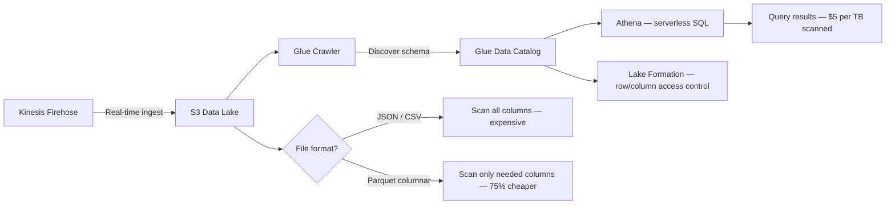
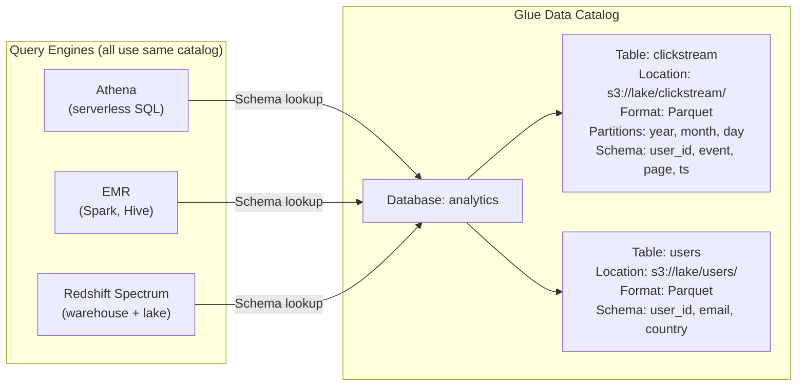
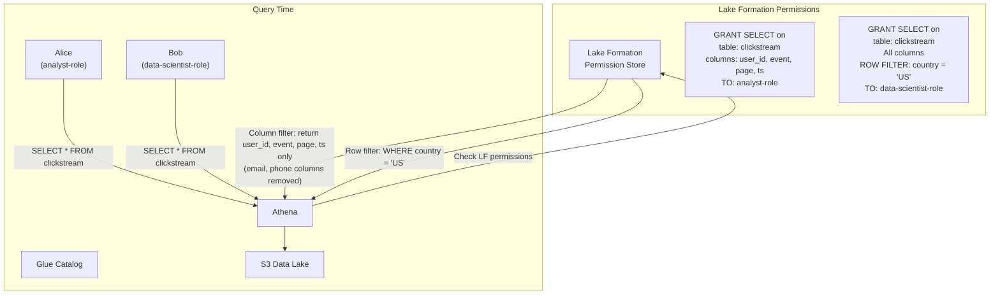
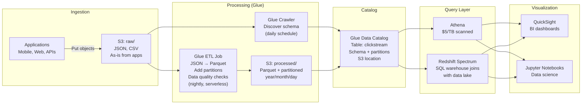
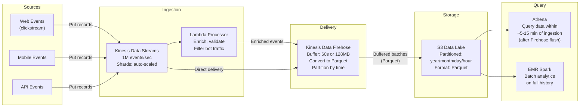
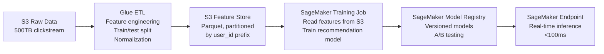
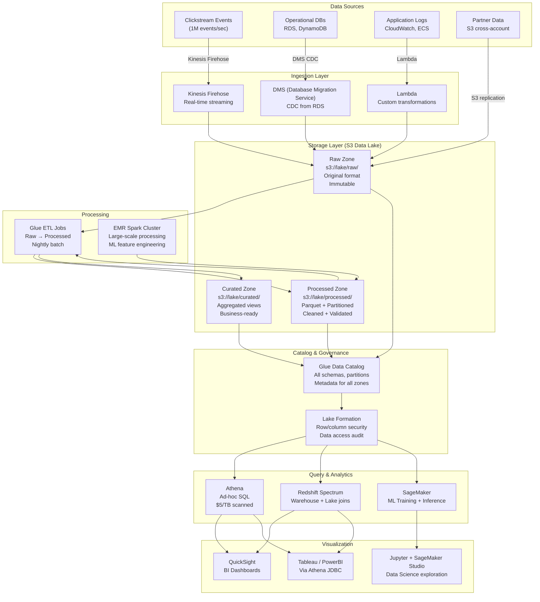

# AWS Athena, Glue & Data Lake Architecture: Querying Petabytes Cheaply

## 🗺️ Quick Overview



*Convert raw data to Parquet with partitioning to reduce Athena scan costs by 75%+.*

> **Common Interview Question**: "You have 10 years of clickstream data — 500TB. How do you query it cost-effectively? Design a real-time analytics pipeline for 1 million events per second. How do you build a data lake that both data scientists and BI tools can query?"

Common in: AWS Solutions Architect, Data Engineering, Senior Backend, Analytics Architecture interviews

---

## Quick Answer (30-second version)

- **S3 as a data lake** = Unlimited storage, $0.023/GB/month. Foundation of every AWS analytics stack. Organize by partitioning (year/month/day) to avoid full-table scans.
- **Athena** = Serverless SQL engine. Queries S3 directly. **$5 per TB scanned** — cost controlled by partitioning and columnar formats.
- **Glue** = Serverless ETL + Data Catalog. Crawlers discover schema automatically. Studio provides visual ETL. Catalog is the metadata store that Athena uses to understand your data.
- **Parquet vs JSON**: Parquet is columnar. A query on 2 columns of a 100-column dataset scans only those 2 columns, not all 100. **75%+ cost reduction** vs JSON for typical analytics queries.
- **Lake Formation** = Fine-grained access control (row/column level) on top of Glue Catalog. Manages who can query what data.
- **Kinesis Firehose** = Real-time ingestion → S3, with built-in Parquet conversion and partitioning.

---

## Why This Matters / The Thought Process

When an interviewer asks about data lakes, they're testing whether you understand **the relationship between storage format, query cost, and query performance**.

The real questions behind the question:
- Do you know that Athena charges per TB scanned, not per query or per row returned?
- Can you explain why Parquet reduces cost by 75%+ compared to JSON?
- Do you understand how partitioning prevents full dataset scans?
- Can you design a pipeline that ingests real-time data and makes it queryable within minutes?

Think like an SA: A 500TB dataset in JSON, queried 100 times a day, might cost $2,500/day in Athena scan costs. The same data in Parquet, properly partitioned, might cost $200/day for the same queries. The architectural decision (storage format + partitioning) is a $2,300/day decision. That's what SA interviews test.

The key insight: **data lakes are cheap to store but expensive to query** — unless you design the layout intentionally. Parquet + partitioning + Glue Catalog is the combination that makes petabyte analytics economically viable.

---

## The Data Lake Foundation: S3 Storage Design

### Partitioning Strategy: The Most Important Decision

Partitioning means organizing S3 objects into a directory structure that allows Athena to **skip irrelevant data entirely**:

```
Without partitioning (expensive):
s3://my-data-lake/clickstream/
  ├── event_20240101_000001.parquet
  ├── event_20240101_000002.parquet
  ├── event_20240101_000003.parquet
  └── ... (10 years of mixed files)

Query: WHERE date = '2024-01-15'
Athena scans: ALL files → 500TB → $2,500 for one query

With date partitioning (cheap):
s3://my-data-lake/clickstream/
  ├── year=2024/month=01/day=01/
  │   ├── part-00001.parquet
  │   └── part-00002.parquet
  ├── year=2024/month=01/day=02/
  │   └── part-00001.parquet
  └── year=2024/month=01/day=15/
      └── part-00001.parquet   ← Athena reads ONLY this folder

Query: WHERE year=2024 AND month=01 AND day=15
Athena scans: ~1.4GB (1 day of data) → $0.007 for the same query
```

**Cost difference: 500TB → 1.4GB. Factor of 350x reduction.**

### Partition Key Selection

Choose partition keys based on your most common query filters:

```
Most common query pattern: "Show me events from the last 7 days"
→ Partition by: year/month/day

Common patterns mixing:
  - Recent data queries: year/month/day/hour
  - Per-customer analytics: customer_id/year/month
  - Regional breakdown: region/year/month/day

Anti-pattern: Too many partitions hurt performance
  Partitioning by user_id on a table with 10M users = 10M S3 prefixes
  Athena has to list all prefixes → slow metadata operations
  Rule: Partition columns should have LOW cardinality (few distinct values)
        year: ~10 values ✓
        month: 12 values ✓
        day: 31 values ✓
        hour: 24 values ✓
        user_id: 10M values ✗
```

### Columnar Formats: Why Parquet Beats JSON

This is the most tested cost optimization concept for Athena:

```
Row-based storage (JSON, CSV):
  Record 1: { user_id: 1, event: "click", page: "/home", timestamp: ..., session: ..., device: ..., country: ..., ... }
  Record 2: { user_id: 2, event: "view",  page: "/cart", timestamp: ..., session: ..., device: ..., country: ..., ... }

  Query: SELECT COUNT(*) FROM events WHERE event = 'purchase'
  Athena must read: ALL columns for ALL rows to find the "event" column
  Even though you only care about 1 column!

Columnar storage (Parquet, ORC):
  Column: user_id    → [1, 2, 3, 4, 5, ...]
  Column: event      → ["click", "view", "purchase", ...]   ← Only this is read
  Column: page       → ["/home", "/cart", "/checkout", ...]
  Column: timestamp  → [1704067200, 1704067201, ...]
  Column: ...

  Query: SELECT COUNT(*) FROM events WHERE event = 'purchase'
  Athena reads: ONLY the "event" column — 1/100th of the data
```

| Format | Storage Size | Athena Scan Cost (typical) | Query Speed | Use When |
|--------|-------------|---------------------------|-------------|---------|
| JSON | 100GB | $0.50 | Slowest | Raw ingestion only |
| CSV | 80GB (no quotes) | $0.40 | Slow | Simple flat data |
| ORC | 25GB | $0.125 | Fast | Hive ecosystem |
| **Parquet** | **25GB** | **$0.125** | **Fastest** | **Default choice** |
| Parquet + Snappy | 20GB | $0.10 | Fast | Best compression |
| Parquet + ZSTD | 18GB | $0.09 | Fast | Best size |

**Rule of thumb**: Converting raw JSON to Parquet reduces Athena scan costs by **75-90%**.

---

## AWS Glue: The Data Lake Plumbing

### Glue Data Catalog: The Metadata Brain

The Glue Data Catalog is a managed Apache Hive Metastore. It stores:
- Database names
- Table definitions (schema: column names, types)
- Partition information (where the data is in S3)
- Table location (which S3 path)

Without a catalog, Athena would have no idea how to interpret the bytes in your S3 files. The catalog is what makes `SELECT user_id FROM clickstream` possible — Athena looks up the catalog to find: "clickstream table is at s3://my-bucket/clickstream/, has these columns, stored as Parquet."



One Glue Catalog, multiple query engines. This is the value of the catalog — it's the single source of truth for schema, shared by all processing tools.

### Glue Crawlers: Automatic Schema Discovery

Manually defining schemas for hundreds of tables is error-prone. Glue Crawlers automate this:

```
You configure: "Crawl s3://my-data-lake/clickstream/ on a schedule"

Crawler does:
1. Scan S3 path for files
2. Sample files to infer column names and types
3. Detect partitioning structure (year=, month=, day= folders)
4. Create/update table definition in Glue Catalog
5. Add discovered partitions to the catalog

Result: Athena can immediately query new data without manual schema updates
```

**When to run crawlers:**
- After initial data ingestion (one-time schema discovery)
- When schema evolves (new columns added)
- On a schedule if new partitions are added (daily data)
- On-demand before an important query run

**Alternative to crawlers (better for production)**: Use `MSCK REPAIR TABLE` or `ALTER TABLE ADD PARTITION` in Athena directly. Crawlers are convenient but have latency and can be overkill for stable schemas.

### Glue ETL Jobs: Transform Raw to Processed

```python
# Glue ETL Job (PySpark) — Convert raw JSON logs to Parquet with partitioning
import sys
from awsglue.transforms import *
from awsglue.utils import getResolvedOptions
from pyspark.context import SparkContext
from awsglue.context import GlueContext
from awsglue.job import Job

args = getResolvedOptions(sys.argv, ['JOB_NAME'])
sc = SparkContext()
glueContext = GlueContext(sc)
spark = glueContext.spark_session
job = Job(glueContext)
job.init(args['JOB_NAME'], args)

# Read raw JSON from S3
raw_data = glueContext.create_dynamic_frame.from_catalog(
    database="raw",
    table_name="clickstream_json"
)

# Apply transformations
from awsglue.transforms import ApplyMapping

mapped = ApplyMapping.apply(frame=raw_data, mappings=[
    ("userId", "string", "user_id", "string"),
    ("eventType", "string", "event", "string"),
    ("pageUrl", "string", "page", "string"),
    ("timestamp", "bigint", "ts", "bigint"),
    ("sessionId", "string", "session_id", "string"),
])

# Add date partition columns from timestamp
from pyspark.sql.functions import from_unixtime, year, month, dayofmonth

df = mapped.toDF()
df = df.withColumn("event_date", from_unixtime(df.ts / 1000))
df = df.withColumn("year", year(df.event_date))
df = df.withColumn("month", month(df.event_date))
df = df.withColumn("day", dayofmonth(df.event_date))

# Write as Parquet, partitioned by year/month/day
df.write \
  .mode("append") \
  .partitionBy("year", "month", "day") \
  .parquet("s3://my-data-lake/clickstream/processed/")

job.commit()
```

---

## Athena: Serverless SQL on S3

### How Athena Works

Athena is **serverless** — no clusters to manage, no capacity to provision. You write SQL, Athena executes it against S3:

```sql
-- Athena query: Find top 10 pages visited in the last 7 days
SELECT
    page,
    COUNT(*) as visits,
    COUNT(DISTINCT user_id) as unique_visitors
FROM clickstream
WHERE year = 2024
  AND month = 1
  AND day BETWEEN 8 AND 15   -- Partition pruning: only 8 days of data scanned
GROUP BY page
ORDER BY visits DESC
LIMIT 10;

-- Cost: ~1GB scanned (8 days × 2GB/day in Parquet) = $0.005
-- Same query on JSON without partitions: ~500TB = $2,500
```

### Athena Pricing: The Only Number You Need to Memorize

**$5 per TB scanned**

Everything about Athena optimization is about reducing bytes scanned:

| Optimization | Impact | How |
|-------------|--------|-----|
| **Partitioning** | 90-99% reduction | Only scan relevant date/region partitions |
| **Parquet/ORC** | 75-90% reduction | Columnar: only read queried columns |
| **Compression** | 20-40% reduction | Snappy, ZSTD, Gzip |
| **Compaction** | 50-80% reduction | Merge many small files into large files |
| **Column selection** | Variable | `SELECT col1, col2` not `SELECT *` |

Compaction note: Many small files (common with streaming ingestion) is terrible for Athena — it has per-file overhead for metadata operations. Glue ETL jobs running nightly to compact small files into 128MB-500MB Parquet files dramatically improves both cost and query speed.

### Athena Workgroups: Cost Control and Governance

```sql
-- Workgroup settings (set in console or Terraform):
-- Max data scanned per query: 1GB
-- If query would scan >1GB, it is cancelled before executing
-- Alert or block team if monthly scan exceeds 1TB

-- This prevents a runaway query from scanning 500TB and generating a $2,500 bill
```

Workgroups also separate query histories, result locations, and cost allocation by team.

---

## Lake Formation: Fine-Grained Access Control

Lake Formation adds row-level and column-level security on top of the Glue Catalog.

```
Without Lake Formation:
  IAM permission to Athena + Glue Catalog = access to ALL data in ALL tables

With Lake Formation:
  Data analyst Alice: can query clickstream table, but NOT the "email" column
  Data scientist Bob: can query all columns, but only for rows where country = 'US'
  BI tool Tableau: can only run SELECT (no DDL, no access to PII columns)
```



This is critical for GDPR, HIPAA, and PCI compliance — where different teams should see different data from the same table.

---

## Data Pipeline Patterns

### Pattern 1: Batch Analytics Pipeline



### Pattern 2: Real-Time Analytics Pipeline (1M events/second)



**Firehose key settings for production:**
- Buffer size: 128MB (larger = fewer, more efficient files for Athena)
- Buffer interval: 60 seconds (minimum latency for queryability)
- Parquet conversion: enable (uses Glue Catalog for schema)
- Dynamic partitioning: `year=!{timestamp:yyyy}/month=!{timestamp:MM}/day=!{timestamp:dd}/hour=!{timestamp:HH}`
- S3 prefix: `clickstream/!{partitionKeyFromQuery:year}/!{partitionKeyFromQuery:month}/...`

**Why not query Kinesis directly?** Kinesis Streams retain data for 24-365 hours. It's not designed for arbitrary SQL queries. You query S3 (Athena) for analytics; you consume Kinesis for real-time stream processing (Lambda, Flink, etc.).

### Pattern 3: ML Pipeline



---

## End-to-End Architecture: Complete Data Lake



---

## Cost Analysis: 500TB Clickstream Dataset

The question "analyze 10 years of clickstream data (500TB) cost-effectively" is specifically about this cost math:

| Approach | Athena Scan | Daily Query Cost (100 queries) | Monthly Storage |
|----------|------------|-------------------------------|-----------------|
| Raw JSON, no partitions | 500TB/query | $250,000/day | $11,500 |
| JSON with date partitions | ~5GB/query (1-day filter) | $2.50/day | $11,500 |
| Parquet, no partitions | ~125GB/query (columnar) | $62.50/day | $2,875 |
| **Parquet + date partitions** | **~1.25GB/query** | **$0.63/day** | **$2,875** |

**The answer to the 500TB question:**
1. Store data as Parquet (convert from raw JSON in Glue ETL)
2. Partition by year/month/day (or year/month/day/hour for finer granularity)
3. Use Athena with `WHERE year=X AND month=Y AND day=Z` filters always
4. Set up Athena workgroup with per-query scan limit ($10 max = 2TB max scan)
5. Monthly storage: ~$2,875 (500TB × $0.023/GB × 0.25 compression ratio ≈ 125TB × $0.023)
6. Monthly Athena: ~$19 (100 queries/day × 30 days × $0.63/query ≈ $1,900... actually ~1.25GB/query × 3,000 queries × $0.005/GB = $18.75)

---

## Interview Scenarios: Model Answers

### Scenario 1: "500TB of clickstream data — query cost-effectively"

**Model answer:**
1. Store in S3 partitioned by `year/month/day/hour` using Hive-style partitioning
2. Convert raw JSON to Parquet using a Glue ETL job (nightly batch or triggered on ingestion)
3. Register the table in Glue Data Catalog with partition information
4. Use Athena for SQL queries — always filter on partition columns in WHERE clause
5. Cost: $5/TB scanned, but with Parquet + partitions, a typical "last 7 days" query scans ~10-20GB ($0.05-$0.10)
6. Set Athena workgroup scan limits to prevent accidental full-table scans

**Key numbers to cite**: $5/TB, Parquet reduces scan by 75-90%, partitioning reduces scan by 90-99%, typical total reduction of 99%+ for time-filtered queries.

### Scenario 2: "Real-time analytics pipeline for 1M events/second"

**Model answer:**
1. Kinesis Data Streams (ingest, 1M events/sec with auto-scaling or manual shard management)
2. Lambda or Kinesis Data Analytics (Flink) for real-time transformation/enrichment
3. Kinesis Data Firehose with Parquet conversion → S3 (buffered every 60 seconds)
4. S3 partitioned by year/month/day/hour
5. Glue Crawler or MSCK REPAIR TABLE to register new hourly partitions
6. Athena for near-real-time queries (data queryable within ~5-15 minutes of ingestion)
7. For true sub-second analytics: Kinesis Data Analytics (Flink) → DynamoDB or ElastiCache for hot path

**Tradeoff to mention**: Firehose buffers 60 seconds minimum. If the requirement is sub-minute analytics, you need a hot path (Flink → DynamoDB/Redis) alongside the cold path (Firehose → S3 → Athena).

### Scenario 3: "Data lake for both data scientists and BI tools"

**Model answer:**
1. S3 as the storage layer (single source of truth, everyone reads from S3)
2. Glue Data Catalog as the schema registry (all tools use the same table definitions)
3. Lake Formation for access control (data scientists can see PII columns, BI tools cannot)
4. Athena for ad-hoc SQL — BI tools connect via JDBC/ODBC
5. SageMaker for data science — reads from S3 directly or via Athena
6. QuickSight for business dashboards — native Athena integration
7. Redshift Spectrum if complex join performance needs (join S3 data with warehouse data)

The key: **Glue Catalog is the shared schema layer** that lets every tool (Athena, Spark, Redshift, Hive, Trino) read the same data without schema translation.

---

## Common Interview Follow-ups

**Q: What's the difference between Glue Data Catalog and Apache Hive Metastore?**

A: Glue Data Catalog IS a managed Hive Metastore compatible with the Hive Metastore API. Any tool that supports Hive Metastore can use the Glue Catalog — including EMR (Spark, Hive), Athena, and Redshift Spectrum. The advantage of Glue Catalog over a self-managed Hive Metastore is that it's serverless, HA, and integrates natively with Athena and Glue ETL.

**Q: When would you use Redshift vs Athena?**

A: Athena is great for ad-hoc queries, infrequent queries, and queries against large datasets with good partitioning. Redshift excels at frequent, complex analytical queries with many joins (the columnar compressed storage is pre-loaded and optimized). Use Redshift Spectrum to JOIN Redshift warehouse tables with S3 data lake tables in a single query — best of both worlds.

**Q: How do you handle schema evolution in a data lake?**

A: Parquet and Avro both support schema evolution. For adding new columns: add to the Glue Catalog schema, set them as optional/nullable. Old Parquet files simply return NULL for the new column. For renaming or removing columns: harder — you typically need to rewrite historical data or maintain backward-compatible aliases in the catalog.

**Q: What's the difference between Glue ETL and EMR?**

A: Glue ETL is serverless Spark. You write the code, AWS manages the cluster lifecycle. Best for regular batch jobs where you don't want cluster management overhead. EMR is managed Hadoop/Spark clusters — you control instance types, scaling, and configuration. Best for complex pipelines, cost-optimized Spot instances for large jobs, or when you need specific Spark versions or libraries not supported by Glue.

**Q: Can you query S3 data in real time (sub-second)?**

A: Athena is not sub-second. Minimum query time is a few seconds even for tiny datasets (connection + planning overhead). For sub-second analytics, you need: (1) DynamoDB or ElastiCache as a hot path, or (2) OpenSearch/Elasticsearch, or (3) Kinesis Data Analytics (Flink) with aggregations pushed to a low-latency store.

---

## AWS Certification Exam Tips

1. **Athena charges per data SCANNED, not per rows returned** — A query that scans 1TB and returns 10 rows costs the same as a query that scans 1TB and returns 1 billion rows. This is fundamental to understanding why partitioning and columnar formats matter.

2. **Parquet and ORC are columnar — they reduce Athena costs** — JSON and CSV are row-based. The exam frequently asks which format reduces cost. Answer: Parquet or ORC.

3. **Glue Data Catalog is a metadata store, NOT a database** — The actual data stays in S3. Glue Catalog stores the schema, partition information, and S3 location. Confused candidates think "Glue stores the data."

4. **Crawlers are for schema discovery, not data movement** — Crawlers scan S3, infer schemas, and write to the Catalog. They do NOT move or transform data.

5. **Partitioning key must be low cardinality** — Partition by year/month/day = good. Partition by user_id (millions of values) = bad (too many S3 prefixes, metadata overhead).

6. **Firehose minimum buffer interval is 60 seconds** — If the question says "data must be available in Athena within 30 seconds," Firehose alone can't achieve it. You need a hot path.

7. **Lake Formation adds fine-grained access, Glue Catalog doesn't** — Glue Catalog defines schema. Lake Formation controls who can see which rows and columns.

8. **MSCK REPAIR TABLE registers new partitions in Athena** — When you add new data to S3 with new partition folders (e.g., new day), Athena doesn't automatically know. You must run `MSCK REPAIR TABLE tablename` or use Glue Crawlers to update the partition list.

9. **Athena result sets are stored in S3** — You specify an S3 output bucket. Athena writes query results there. You pay for that storage (small, usually ignored).

10. **Glue ETL runs PySpark or Scala** — It's not a visual-only tool. Glue Studio provides a visual ETL GUI, but under the hood it generates PySpark. You can also write PySpark directly without using the visual interface.

---

## Key Takeaways

| Concept | The Rule |
|---------|---------|
| **Athena pricing** | $5/TB scanned. Optimize by minimizing scanned bytes. |
| **Parquet vs JSON** | Parquet costs 75-90% less. Always convert before querying. |
| **Partitioning** | 90-99% scan reduction for time-filtered queries. Low cardinality keys only. |
| **Glue Catalog** | Metadata store. Schema + location for Athena, Spark, Redshift Spectrum. |
| **Glue Crawlers** | Automatic schema discovery. Don't move data — just catalog it. |
| **Firehose** | Real-time ingestion → S3 with Parquet conversion. 60s minimum latency. |
| **Lake Formation** | Row/column security on top of Glue Catalog. Required for PII compliance. |
| **500TB query** | Parquet + year/month/day partitions → 1.25GB scanned per query = $0.006. |
| **Real-time analytics** | Hot path (Kinesis → Flink → DynamoDB) + cold path (Firehose → S3 → Athena). |

The core principle: data lakes are storage-cheap but query-expensive by default. The architectural investment in columnar formats, partitioning, and a managed catalog pays for itself in the first month of queries. Parquet + Glue + Athena is the standard pattern precisely because it turns petabyte analytics from a $2,500/query problem into a $0.006/query problem.
