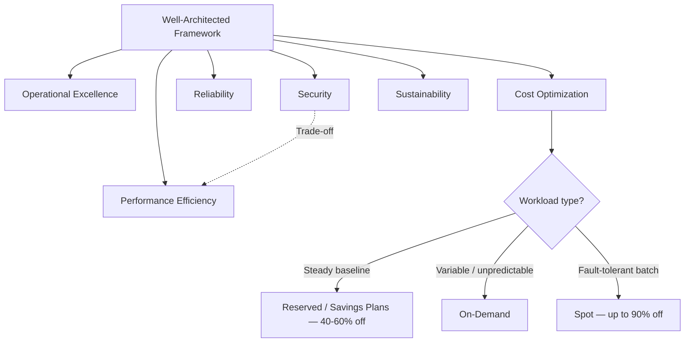
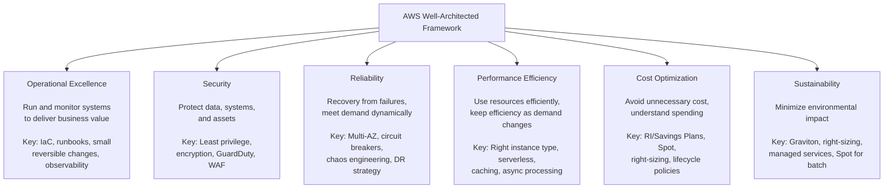
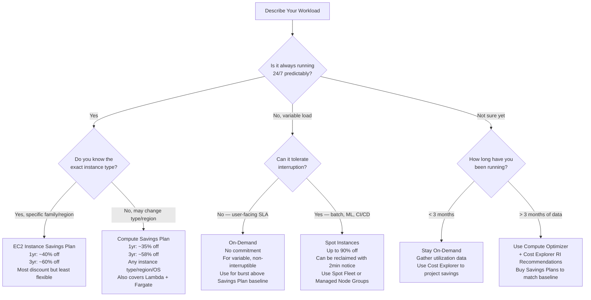

# AWS Well-Architected Framework: 6 Pillars & Cost Optimization

## 🗺️ Quick Overview



*The 6 pillars conflict with each other — your role is to make intentional, justified trade-off decisions.*

> **Common Interview Questions**: "What are the 6 pillars of the Well-Architected Framework? Give an example of a trade-off between them." / "How would you apply the Reliability pillar to a multi-region e-commerce application?" / "A startup is spending $50K/month on AWS — what's your approach to cost optimization?" / "How do Reserved Instances, Savings Plans, and Spot Instances differ?"

Common in: AWS Solutions Architect Professional, Engineering Manager, Cloud Cost Engineer, and senior technical interviews at companies with meaningful AWS spend.

---

## Quick Answer (30-second version)

- **6 Pillars**: Operational Excellence, Security, Reliability, Performance Efficiency, Cost Optimization, Sustainability.
- **The framework is not a checklist** — it's a structured conversation about trade-offs. Pillars conflict with each other. Your job as an SA is to make intentional decisions about which trade-offs are acceptable.
- **Example trade-off**: Security vs Performance — encrypting every inter-service call with TLS adds latency. You choose to do it anyway because the security requirement outweighs the performance cost.
- **Cost optimization is not just "use smaller instances"** — it's a matching game: right purchase option (On-Demand/RI/Spot) for right workload type (steady/variable/fault-tolerant).
- **Reserved Instances**: 1yr = 40% off, 3yr = 60% off. For steady-state, predictable workloads.
- **Savings Plans**: More flexible than RIs. Compute SP applies to any instance family/region. EC2 SP is specific to instance family/region but cheaper.
- **Spot Instances**: Up to 90% off. For fault-tolerant, interruptible workloads (batch, ML training, stateless web tier overflow).

---

## Why This Matters / The Thought Process

The Well-Architected Framework is asked in interviews not because interviewers expect you to recite the pillars — they want to see how you **reason about engineering trade-offs at scale**.

The real questions behind the question:
- Can you articulate why you made a specific architectural choice (not just what you chose)?
- Do you understand that adding redundancy (Reliability) costs money (Cost Optimization)?
- Do you know that over-provisioning for performance hurts cost, while under-provisioning hurts reliability?
- Can you identify anti-patterns in existing architectures and suggest improvements that move the needle on a specific pillar?

Think like an SA: When a startup says "we're spending $50K/month on AWS," the right response isn't "use smaller instances." The right response is: audit the bill by service, identify the biggest line items, check utilization metrics (CPU, memory, connections), and match the purchase options to the workload patterns. A 30% reduction in AWS spend at $50K/month frees up $180K/year — that's an engineer's salary.

**The framework trade-off that trips people up**: Candidates say "I'd optimize everything for all 6 pillars." That's not possible — every pillar has cost. Multi-region deployments (Reliability) cost 2x. Encryption everywhere (Security) adds latency. Graviton instances (Sustainability) require ARM-compatible code. You choose your battles based on the specific workload's requirements.

---

## Architecture: 6 Pillars Overview



---

## Architecture: Cost Optimization Purchase Decision Tree



---

## Pillar 1: Operational Excellence

**Core principle**: Treat operations as code. Every runbook, every deployment, every incident response should be automated and repeatable.

**Design principles**:
- Perform operations as code (IaC with CloudFormation/CDK/Terraform)
- Make frequent, small, reversible changes (trunk-based development, feature flags)
- Refine operations procedures frequently (runbooks are living documents)
- Anticipate failure (pre-mortems, GameDay exercises)
- Learn from all operational events (blameless post-mortems, metrics dashboards)

**AWS services**:
- AWS CloudFormation / CDK: IaC. If you're clicking in the console, you're doing it wrong.
- AWS Systems Manager: Run commands, parameter store, patch manager, session manager (no bastion hosts needed)
- AWS Config: Detect configuration drift. "This security group opened port 22 to 0.0.0.0/0 — alert and auto-remediate."
- CloudWatch: Metrics, logs, alarms, dashboards
- AWS X-Ray: Distributed tracing

**The anti-pattern**: "Works in prod, not in staging — they're different." IaC ensures environments are identical. The only difference should be scale and data.

**Interview angle**: "Walk me through your deployment process. How do you handle a bad deployment?" The right answer includes: blue/green or canary deployments, automated rollback on alarm thresholds, CloudWatch synthetics for smoke tests, and IaC for everything.

---

## Pillar 2: Security

**Core principle**: Apply security at every layer. Security is not an add-on — it's a default.

**Design principles**:
- Implement a strong identity foundation (least privilege IAM, no long-lived credentials)
- Maintain traceability (CloudTrail, VPC flow logs)
- Apply security at all layers (WAF at edge, security groups at instance, encryption at rest and in transit)
- Automate security best practices (AWS Config rules with auto-remediation)
- Protect data in transit and at rest (TLS everywhere, KMS for at-rest)
- Keep people away from data (use roles and automation, not direct DB access)
- Prepare for security events (incident response runbook, AWS GuardDuty, Security Hub)

**AWS services**:
- IAM: The foundation. Roles over users. No access keys on EC2 (use instance roles).
- AWS KMS: Key management for encryption. Customer-managed keys (CMK) for control; AWS-managed keys for convenience.
- AWS WAF: Layer 7 firewall. Block common attacks (SQLi, XSS), rate limit, geo-block.
- AWS Shield: DDoS protection. Standard is free with CloudFront/ALB/Route53. Advanced adds response team and financial protection.
- Amazon GuardDuty: Threat detection via ML. Analyzes VPC flow logs, CloudTrail, DNS queries for anomalies.
- AWS Security Hub: Aggregates findings from GuardDuty, Inspector, Macie, Config into one dashboard.
- Amazon Inspector: Automated vulnerability scanning for EC2, ECR container images, Lambda.

**The trade-off with Performance**: Encrypting every byte of inter-service communication with TLS adds 1-5ms per call. At 10,000 calls/sec, that's measurable. You accept this cost because the security requirement outweighs it. This is the kind of trade-off answer that impresses interviewers.

---

## Pillar 3: Reliability

**Core principle**: A reliable system continues to function correctly under unexpected load and recovers from failures automatically.

**Design principles**:
- Automatically recover from failure (health checks → replacement, not manual intervention)
- Test recovery procedures (GameDay, chaos engineering, FIS)
- Scale horizontally (many small instances vs one large instance)
- Stop guessing capacity (use Auto Scaling, not fixed fleet)
- Manage change through automation (no config drift, IaC rollouts)

**AWS services**:
- Elastic Load Balancing: Distributes traffic across healthy instances. Health checks remove unhealthy targets.
- Auto Scaling Groups: Replace unhealthy instances, scale to match demand.
- RDS Multi-AZ: Automatic failover within a region (30-60 second RTO for AZ failure).
- Route 53: DNS failover, health checks, latency routing.
- AWS Backup: Centralized backup for all services.

**For a multi-region e-commerce application** (the interview scenario):

```
Traffic flow:
  Route 53 latency routing → us-east-1 ALB (for US users)
                           → eu-west-1 ALB (for EU users)

Reliability components:
  Compute: Multi-AZ ASG in each region
  Database: Aurora Global Database (primary in us-east-1, reader in eu-west-1)
  Sessions: DynamoDB Global Tables (multi-master, users can write to any region)
  Static assets: S3 + CloudFront (global CDN)
  Queues: SQS (messages replicated across AZs within region)

Failure scenarios handled:
  - Single EC2 failure: ASG replaces in < 3 min
  - AZ failure: ASG redistributes across remaining AZs
  - Region failure: Route 53 health check + failover to other region
  - Database failure: Aurora Multi-AZ promotes standby in < 30s (within region)
```

**Circuit breaker pattern**: Not a native AWS feature — implemented in application code (or using App Mesh/service mesh). Prevents cascading failures when downstream services degrade. Open the circuit (return error immediately) rather than waiting for timeouts that pile up.

---

## Pillar 4: Performance Efficiency

**Core principle**: Use the right resource type for the job. Performance efficiency is not "use the fastest resources" — it's "use resources whose characteristics match the workload needs."

**Design principles**:
- Democratize advanced technologies (use managed services — don't run your own Kafka; use MSK)
- Go global in minutes (multi-region deployment with IaC)
- Use serverless architectures (no server management = focus on business logic)
- Experiment more often (A/B testing infrastructure, try new instance types)
- Consider mechanical sympathy (align data access patterns with data storage types)

**Decision framework for instance types**:

| Workload | Instance Family | Why |
|---|---|---|
| General web/API | t3/t4g (burstable), m5/m6i | Balanced CPU/memory. t-family for bursty, m-family for sustained |
| Compute-heavy (ML inference, video encoding) | c5/c6i/c7g | High CPU-to-memory ratio |
| Memory-heavy (in-memory caching, large datasets) | r5/r6i | High memory-to-CPU ratio |
| GPU workloads (ML training) | p3/p4, g4/g5 | GPUs for parallel compute |
| High-performance storage I/O (databases) | i3/i4i | NVMe local storage |
| Graviton (ARM) — best price/performance | t4g, m6g, c7g, r7g | 20-40% better price/performance than x86 equivalents |

**Caching tiers** (each tier reduces latency by an order of magnitude):

```
Client browser cache: 0ms (local disk)
CloudFront edge cache: ~5ms (nearest edge location)
ElastiCache (Redis): ~0.5ms (in-memory)
RDS read replica: ~2ms (database, not network)
Primary RDS: ~5ms (with query optimization)
```

**Serverless**: Lambda + API Gateway removes the undifferentiated heavy lifting of server management. Not always the right choice — cold starts matter for latency-sensitive synchronous APIs. Lambda@Edge has strict memory/time limits. But for event-driven, async workloads: superior performance efficiency (pay per execution, scales to zero, scales to thousands).

---

## Pillar 5: Cost Optimization

This is the pillar most interviewers at startup/growth-stage companies focus on deeply.

### Purchase Options Deep Dive

**On-Demand**:
- Pay per second/hour. No commitment.
- When to use: Unpredictable workloads, development/testing, short-lived workloads (< 1 week), burst capacity above your Savings Plan baseline.
- Never use for: Always-on production workloads (you're leaving 30-60% on the table).

**Reserved Instances (RIs)**:
- Commit to a specific instance type, region, and tenancy for 1 or 3 years.
- 1-year Standard RI: ~40% discount vs On-Demand
- 3-year Standard RI: ~60% discount vs On-Demand
- Convertible RI: Can change instance type/family within a generation. ~20% less discount.
- Payment: All Upfront > Partial Upfront > No Upfront (all three get similar discount; upfront = best discount + better cash flow prediction)
- **Gotcha**: If your workload changes (you move to a different instance type), you're stuck. RIs are for stable, predictable workloads. Can sell unused RIs on the Reserved Instance Marketplace.

**Savings Plans** (preferred over RIs for most cases):
- Commit to a spend amount per hour ($/hr), not a specific instance.
- **Compute Savings Plans**: Applies to any EC2 instance (any family, size, AZ, region, OS), Fargate, and Lambda. Most flexible. ~58% max discount (3yr).
- **EC2 Instance Savings Plans**: Specific to instance family in a region. ~72% max discount (3yr). Best discount but least flexible.
- **SageMaker Savings Plans**: For ML workloads.
- **Why Savings Plans beat RIs**: You don't need to predict which instance type you'll be using. If you migrate from m5 to m6i or to Graviton (m6g), your Compute Savings Plan still applies.

**Spot Instances**:
- Spare EC2 capacity at up to 90% discount.
- Can be reclaimed by AWS with 2-minute notice (the "Spot interruption").
- **Required application design**: Stateless, fault-tolerant, can handle instance termination gracefully.
- Use cases: Batch processing, ML training jobs (checkpoint frequently), CI/CD workers, stateless web tier overflow, video transcoding.
- **Spot Fleet / ASG with Spot**: Specify multiple instance types across multiple AZs — reduces interruption probability.
- **Never use Spot for**: Databases (unless very carefully architected), anything with state that can't be lost, ZooKeeper/Kafka coordinators.

**The mixed fleet strategy** (what you actually recommend):

```
Production web tier:
  - Baseline: Compute Savings Plan (commit to $/hr for always-on base)
  - Burst: On-Demand (handle spikes above committed baseline)
  - Batch workers: Spot (background jobs, can be interrupted)

The math (example):
  On-Demand: $0.192/hr for m5.large
  Compute SP (1yr): $0.124/hr = 35% savings
  Spot: ~$0.06/hr = 68% savings

  10 instances always on → Buy $1.24/hr Compute SP
  5 instances for burst → On-Demand (pay when needed)
  20 batch workers → Spot (~$1.20/hr vs $3.84/hr On-Demand = saves $2.64/hr)
```

---

## The $50K/Month Cost Audit: How to Find Savings

This is the scenario interviewers at VC-backed startups will ask about.

**Step 1: Identify the biggest line items**

```bash
# Use Cost Explorer by service
# Typical breakdown for a mid-size startup:
EC2 compute:         $20,000/month  (40%)  ← biggest lever
RDS/Aurora:           $8,000/month  (16%)
Data transfer:        $6,000/month  (12%)  ← often surprising
NAT Gateway:          $4,000/month   (8%)  ← often surprising
ElastiCache:          $3,000/month   (6%)
CloudFront:           $2,000/month   (4%)
ELB:                  $2,000/month   (4%)
Other (S3, Lambda...) $5,000/month  (10%)
```

**Step 2: EC2 right-sizing (most impact)**

```
Tools:
  - AWS Compute Optimizer: ML-based recommendations
    Example: "Your m5.2xlarge is running at 8% CPU avg. Recommended: t3.medium (86% savings)"
  - CloudWatch CPU/memory metrics (need CloudWatch agent for memory)
  - AWS Trusted Advisor: Idle EC2 instances (< 10% CPU for 4+ days)

Common findings:
  - Over-provisioned instances: "We provisioned for peak, run at 15% avg"
  - Idle instances: DEV/staging environments running 24/7 (should be stopped nights/weekends)
  - Previous-gen instances: m4 → m5 is 10% cheaper and faster
  - x86 → Graviton: m5 → m6g is 20% cheaper (if your code compiles for ARM)
```

**Step 3: Purchase option optimization**

```
Current state: 100% On-Demand
Findings from 90-day utilization data:
  - 8 m5.xlarge always running (web tier baseline) → Buy Compute Savings Plan
  - 2 r5.2xlarge always running (RDS proxies) → Buy EC2 Instance SP
  - 10-30 m5.large fluctuating (auto-scaling) → On-Demand for flexibility

Projected savings:
  - Savings Plans on 10 baseline instances: ~35% savings = $3,500/month
  - Stop dev instances nights + weekends (16h/day × 5d + 48h weekend = ~70% reduction)
    3 dev environments × $500/month → $150/month = saves $1,050/month
```

**Step 4: Data transfer surprises**

```
Common expensive patterns:
  - EC2 in private subnet → NAT Gateway → internet
    Fix: Use VPC endpoints for S3, DynamoDB, and other AWS services (free after endpoint)
    NAT GW costs: $0.045/GB processed. S3 VPC endpoint: free.
    Example: 100GB/day to S3 via NAT GW = $135/day = $4,050/month saved

  - Cross-AZ traffic
    Fix: Pin data-intensive services to same AZ (cache in same AZ as app servers)
    Cross-AZ data transfer: $0.01/GB each way. Free within same AZ.

  - Data transfer out to internet
    Fix: CloudFront for static assets (CF data transfer is cheaper than EC2 data transfer out)
    EC2 → internet: $0.09/GB
    CloudFront → internet: $0.0085/GB (US/Europe) = 90% savings on data transfer
```

**Step 5: Storage hygiene**

```
Common waste:
  - EBS volumes unattached to EC2 (instance terminated, volume orphaned)
    Cost: $0.10/GB-month for gp3. 500GB orphan = $50/month
    Fix: AWS Trusted Advisor "Underutilized EBS volumes" check

  - S3 without lifecycle policies
    Cost: $0.023/GB-month for Standard. Archives sitting in Standard for years.
    Fix: S3 Lifecycle → transition to S3-IA after 30 days ($0.0125/GB), Glacier after 90 days ($0.004/GB)

  - RDS snapshots never deleted
    Cost: $0.095/GB-month (manual snapshots don't expire automatically)
    Fix: Backup retention policy. 7-day automated backups sufficient for most.
```

---

## Pillar 6: Sustainability

The newest pillar (added 2021). Interviewers increasingly ask about it as companies set carbon reduction goals.

**Design principles**:
- Understand your impact (use AWS Customer Carbon Footprint Tool)
- Establish sustainability goals (reduce per-unit carbon, not just total)
- Maximize utilization (pack more workloads, don't over-provision)
- Anticipate and adopt new, more efficient services
- Use managed services (AWS operates at higher efficiency than individual tenants)
- Reduce the downstream impact of your cloud workloads

**Practical sustainability choices**:
- **Graviton processors**: 20% better performance-per-watt vs x86. AWS Graviton3 uses 60% less energy for same performance as comparable x86. Also cheaper — double win.
- **Spot instances**: Use spare capacity that would otherwise sit idle. More efficient than dedicated On-Demand capacity.
- **Right-sizing**: Under-utilized instances waste energy. Compute Optimizer findings improve sustainability and cost simultaneously.
- **Managed services**: Lambda, Fargate, managed databases — AWS operates these at much higher utilization rates than individual customers could achieve.
- **AWS Region selection**: Regions like us-gov-east-1, eu-north-1 (Stockholm) run on near-100% renewable energy. Consider this for batch workloads where latency matters less.

**The trade-off with Performance and Reliability**: Packing more workloads onto fewer instances (better utilization = more sustainable) reduces the redundancy that Reliability requires. Right-sizing saves money but risks under-provisioning during spikes. These tensions are intentional — the framework is asking you to make conscious choices.

---

## AWS Cost Tools Reference

| Tool | What It Does | When to Use |
|---|---|---|
| Cost Explorer | Historical cost analysis, RI/SP recommendations, forecasting | Monthly cost review, purchase planning |
| AWS Budgets | Set spend/usage/RI coverage alerts | Preventive alerting (before you overspend) |
| Compute Optimizer | ML-based right-sizing recommendations for EC2, Lambda, EBS | Quarterly right-sizing audit |
| Trusted Advisor | 5 categories: Cost, Security, Reliability, Performance, Service Limits | Regular health check |
| Cost and Usage Report (CUR) | Detailed hourly/daily billing data, exported to S3 | Deep analysis with Athena/QuickSight |
| AWS Pricing Calculator | Estimate costs before you build | Pre-architecture cost estimation |

**Trusted Advisor categories** (the exam asks this):
1. Cost Optimization
2. Performance
3. Security
4. Fault Tolerance
5. Service Limits (Service Quotas)

---

## Code Example: Terraform Tagging Strategy for Cost Allocation

Cost allocation tags are the foundation of understanding who spends what.

```hcl
# tagging-module/main.tf
# Module to enforce consistent resource tagging across the organization

variable "required_tags" {
  description = "Tags required on all resources for cost allocation"
  type = object({
    Environment = string  # dev | staging | production
    Team        = string  # platform | backend | ml | data
    Project     = string  # project name from internal project list
    CostCenter  = string  # finance cost center code
    Owner       = string  # owning engineer/team email
  })

  validation {
    condition = contains(["dev", "staging", "production"], var.required_tags.Environment)
    error_message = "Environment must be dev, staging, or production."
  }
}

# Default tags applied to all resources via provider
provider "aws" {
  region = var.region

  default_tags {
    tags = merge(var.required_tags, {
      ManagedBy  = "terraform"
      Repository = "github.com/mycompany/infra"
    })
  }
}

# AWS Config rule to detect untagged resources
resource "aws_config_config_rule" "required_tags" {
  name = "required-tags-enforcement"

  source {
    owner             = "AWS"
    source_identifier = "REQUIRED_TAGS"
  }

  input_parameters = jsonencode({
    tag1Key   = "Environment"
    tag2Key   = "Team"
    tag3Key   = "Project"
    tag4Key   = "CostCenter"
  })

  scope {
    compliance_resource_types = [
      "AWS::EC2::Instance",
      "AWS::RDS::DBInstance",
      "AWS::ElastiCache::CacheCluster",
      "AWS::S3::Bucket",
    ]
  }
}

# Auto-remediation: tag non-compliant resources or alert
resource "aws_config_remediation_configuration" "required_tags" {
  config_rule_name = aws_config_config_rule.required_tags.name
  target_type      = "SSM_DOCUMENT"
  target_id        = "AWS-PublishSNSNotification"  # Alert rather than auto-tag (can't guess correct tags)

  parameter {
    name           = "TopicArn"
    static_value   = aws_sns_topic.compliance_alerts.arn
  }

  parameter {
    name           = "Message"
    resource_value = "RESOURCE_ID"
  }

  automatic                  = true
  maximum_automatic_attempts = 1
}
```

---

## Code Example: Lambda for Automated Resource Cleanup

Stop dev/staging instances during off-hours. Straightforward but saves 50-70% on compute for non-production.

```js
// resource-scheduler.js
// EventBridge Rule: cron(0 22 ? * MON-FRI *) — Stop at 10 PM weekdays
// EventBridge Rule: cron(0 8 ? * MON-FRI *)  — Start at 8 AM weekdays
// EventBridge Rule: cron(0 22 ? * FRI *)      — Stop Friday evening (weekend off)

const { EC2Client, DescribeInstancesCommand, StopInstancesCommand, StartInstancesCommand } = require('@aws-sdk/client-ec2');
const { RDSClient, DescribeDBInstancesCommand, StopDBInstanceCommand, StartDBInstanceCommand } = require('@aws-sdk/client-rds');

const ec2 = new EC2Client({ region: process.env.AWS_REGION });
const rds = new RDSClient({ region: process.env.AWS_REGION });

const TARGET_ENVIRONMENTS = ['dev', 'staging'];

exports.handler = async (event) => {
  const action = event.action; // 'stop' or 'start'

  console.log(`Resource scheduler: ${action} for environments: ${TARGET_ENVIRONMENTS.join(', ')}`);

  const results = {
    ec2: { stopped: [], started: [], skipped: [], errors: [] },
    rds: { stopped: [], started: [], skipped: [], errors: [] },
  };

  // --- EC2 instances ---
  const ec2Instances = await getEC2InstancesByEnvironment(TARGET_ENVIRONMENTS);

  for (const instance of ec2Instances) {
    const id = instance.InstanceId;
    const env = instance.Tags?.find(t => t.Key === 'Environment')?.Value;
    const scheduleOpt = instance.Tags?.find(t => t.Key === 'ScheduleOptOut')?.Value;

    // Respect opt-out tag: ScheduleOptOut=true means always-on
    if (scheduleOpt === 'true') {
      results.ec2.skipped.push({ id, reason: 'ScheduleOptOut=true' });
      continue;
    }

    try {
      if (action === 'stop' && instance.State.Name === 'running') {
        await ec2.send(new StopInstancesCommand({ InstanceIds: [id] }));
        results.ec2.stopped.push(id);
        console.log(`Stopped EC2: ${id} (${env})`);
      } else if (action === 'start' && instance.State.Name === 'stopped') {
        await ec2.send(new StartInstancesCommand({ InstanceIds: [id] }));
        results.ec2.started.push(id);
        console.log(`Started EC2: ${id} (${env})`);
      }
    } catch (err) {
      results.ec2.errors.push({ id, error: err.message });
      console.error(`Failed to ${action} EC2 ${id}:`, err.message);
    }
  }

  // --- RDS instances ---
  const rdsInstances = await getRDSInstancesByEnvironment(TARGET_ENVIRONMENTS);

  for (const db of rdsInstances) {
    const id = db.DBInstanceIdentifier;
    const env = db.TagList?.find(t => t.Key === 'Environment')?.Value;
    const scheduleOpt = db.TagList?.find(t => t.Key === 'ScheduleOptOut')?.Value;

    if (scheduleOpt === 'true') {
      results.rds.skipped.push({ id, reason: 'ScheduleOptOut=true' });
      continue;
    }

    // RDS: can't stop Multi-AZ for more than 7 days (AWS auto-restarts)
    // For dev environments, single-AZ RDS is fine
    try {
      if (action === 'stop' && db.DBInstanceStatus === 'available') {
        await rds.send(new StopDBInstanceCommand({ DBInstanceIdentifier: id }));
        results.rds.stopped.push(id);
        console.log(`Stopped RDS: ${id} (${env})`);
      } else if (action === 'start' && db.DBInstanceStatus === 'stopped') {
        await rds.send(new StartDBInstanceCommand({ DBInstanceIdentifier: id }));
        results.rds.started.push(id);
        console.log(`Started RDS: ${id} (${env})`);
      }
    } catch (err) {
      results.rds.errors.push({ id, error: err.message });
      console.error(`Failed to ${action} RDS ${id}:`, err.message);
    }
  }

  // Summary for CloudWatch Logs
  console.log('Scheduler results:', JSON.stringify(results, null, 2));

  const totalStopped = results.ec2.stopped.length + results.rds.stopped.length;
  const totalStarted = results.ec2.started.length + results.rds.started.length;

  return {
    statusCode: 200,
    action,
    totalStopped,
    totalStarted,
    details: results,
  };
};

async function getEC2InstancesByEnvironment(environments) {
  const response = await ec2.send(new DescribeInstancesCommand({
    Filters: [
      {
        Name: 'tag:Environment',
        Values: environments,
      },
      {
        Name: 'instance-state-name',
        Values: ['running', 'stopped'],  // Exclude terminated
      },
    ],
  }));

  return response.Reservations.flatMap(r => r.Instances);
}

async function getRDSInstancesByEnvironment(environments) {
  const response = await rds.send(new DescribeDBInstancesCommand({}));

  return response.DBInstances.filter(db => {
    const env = db.TagList?.find(t => t.Key === 'Environment')?.Value;
    return environments.includes(env);
  });
}
```

---

## Real-World Scenario: Cost Optimization Audit — $50K/month Down to $30K

**Starting point**: Fast-growing startup, $50K/month AWS bill, engineering team says "we need this."

**The audit process** (over 2 weeks):

```
Week 1 — Discovery:
  1. Export Cost and Usage Report (CUR) to S3, query with Athena
  2. Identify top 10 cost drivers by service + tag
  3. Run Compute Optimizer on all EC2, Lambda, EBS
  4. Review Trusted Advisor for idle resources
  5. Analyze data transfer costs (NAT GW, cross-AZ, internet egress)

Week 2 — Remediation Planning:
  6. Right-size 15 over-provisioned EC2 instances (avg 8% CPU) → saves $4,200/month
  7. Buy 3-year Compute Savings Plans for baseline workload → saves $6,500/month
  8. Stop dev/staging instances nights + weekends → saves $2,800/month
  9. Delete 47 orphaned EBS volumes (3.2TB) → saves $320/month
  10. Add S3 lifecycle policies (4TB in Standard → Glacier) → saves $760/month
  11. VPC endpoints for S3/DynamoDB (eliminate 80GB/day NAT GW traffic) → saves $3,240/month
  12. Previous-gen instance family migration (m4 → m5 + small size reduction) → saves $1,800/month
  13. Migrate 4 workloads to Graviton (m5 → m6g) → saves $980/month

Total projected monthly savings: $20,600 (41% reduction)
One-time costs: ~40 hours of engineering time, 3-year SP commitment
Payback period: < 1 month
```

**What NOT to do**:
- Don't migrate everything to serverless to "save money" — Lambda costs more than EC2 for sustained high-throughput workloads.
- Don't use Spot for databases or stateful workloads — data loss risk outweighs cost savings.
- Don't over-commit on RIs — if you buy a 3-year RI and migrate off that instance type in 6 months, you're stuck (or selling at a discount on the RI marketplace).

---

## Common Interview Follow-ups

**Q: "What's the difference between Cost Explorer and Cost and Usage Report?"**

A: Cost Explorer is the interactive UI for analyzing costs — you can filter by service, tag, account, and get RI/SP recommendations. It stores 13 months of data. Cost and Usage Report (CUR) is the raw billing data exported to S3 in CSV/Parquet format — every line item, every hour, every resource. CUR is for advanced analysis with Athena or feeding into a data warehouse. Use Cost Explorer for quick decisions, CUR for deep analysis.

**Q: "When would you recommend Reserved Instances over Savings Plans?"**

A: RIs are better when you need maximum discount on a known stable workload (specific instance family, region, OS — never changing). EC2 Instance Savings Plans give similar discounts with slightly more flexibility within a family. The main remaining use case for RIs vs Savings Plans is RDS/ElastiCache/Redshift — which RIs cover but Savings Plans don't (there's no "RDS Savings Plan"). For EC2/Fargate/Lambda, Savings Plans are generally preferred.

**Q: "What are the 5 Trusted Advisor categories?"**

A: Cost Optimization, Performance, Security, Fault Tolerance, Service Limits (Service Quotas). The free tier gives basic checks in all 5 categories. Business/Enterprise support plans unlock all checks (including the valuable right-sizing and idle resource checks).

**Q: "How does AWS Compute Optimizer work? What does it need?"**

A: Compute Optimizer uses ML to analyze CloudWatch utilization metrics (at minimum 30 days of data for meaningful recommendations). For memory recommendations, you must install the CloudWatch agent on EC2 instances (memory is not a default metric). It recommends right-sizing for EC2, Lambda (memory), EBS (volume type), and ECS on Fargate. It's free to enable.

**Q: "A team wants to use Spot instances for their API tier to save money. What do you advise?"**

A: Spot instances can be reclaimed with 2-minute notice. For an API tier serving user requests, this means potential request failures during interruption. It's workable but requires architectural patterns: graceful shutdown on SIGTERM (drain connections, finish in-flight requests), load balancer health checks to remove instance before termination, and a mixed fleet (always-on On-Demand base + Spot overflow). The real question is: what's the P99 availability SLA? If it's 99.9%, you need enough On-Demand baseline to serve traffic while Spot instances are being replaced. I'd use Spot for batch/background workers and On-Demand/SP for user-facing API tier.

---

## AWS Certification Exam Tips

- **6 pillars in order**: Operational Excellence, Security, Reliability, Performance Efficiency, Cost Optimization, Sustainability. The acronym "OSRPCS" is harder to remember — just know them.
- **Savings Plans vs RIs for the exam**: For EC2/Lambda/Fargate, Savings Plans are the modern answer. RIs are still the right answer for RDS, ElastiCache, Redshift (services not covered by Savings Plans).
- **Compute Optimizer needs 30 days of data** to make recommendations. If asked "what tool helps right-size EC2," the answer is Compute Optimizer (not Cost Explorer — that shows spend, not utilization).
- **Trusted Advisor 5 categories**: Cost Optimization, Performance, Security, Fault Tolerance, Service Limits. This is asked directly on the exam.
- **Well-Architected Tool**: Formal process for reviewing a workload against all 6 pillars. Generates a report with "High Risk" and "Medium Risk" findings. This is different from Trusted Advisor (automated checks) — the Well-Architected Tool is a guided review process.
- **The cost of Savings Plans**: Compute SP (most flexible) = ~35% off 1yr. EC2 Instance SP (least flexible, family-specific) = ~40-42% off 1yr. Equivalent RIs = similar discount. All-Upfront payment maximizes discount vs No-Upfront.
- **Spot interruption handling**: The correct AWS answer is to configure the Spot interruption notice handler (2-minute notice via instance metadata and EventBridge events) to gracefully drain and save state. Not to "just retry."
- **Graviton exam angle**: Questions about "what delivers better price-performance for compute?" → Graviton/ARM instances. 20-40% better price/performance.
- **Cost allocation tags**: Must be activated in the Billing console to appear in Cost Explorer reports. Just tagging resources isn't enough — you must also activate the tag keys for cost allocation.

---

## Key Takeaways

1. **The framework is about intentional trade-offs**, not a checklist. Reliability costs money. Security adds latency. Every pillar has a cost that must be weighed against business value.
2. **For cost optimization, start with utilization data** — not with "buy RIs." Compute Optimizer after 30 days of data will tell you exactly where to right-size before you commit to any purchase options.
3. **Savings Plans beat Reserved Instances for EC2/Fargate/Lambda** in flexibility. RIs are still the right answer for RDS, ElastiCache, and Redshift.
4. **Spot instances are for fault-tolerant, stateless, interruptible workloads** — batch, ML training, CI/CD. Never for databases or user-facing APIs without a solid graceful shutdown strategy.
5. **The mixed fleet is the practical answer**: Compute Savings Plan for baseline + On-Demand for variable burst + Spot for batch.
6. **Data transfer costs are the most surprising line item** on bills. S3 VPC endpoints and same-AZ co-location of communicating services can yield thousands per month in savings.
7. **Graviton is a no-brainer for new workloads** — 20-40% better price/performance than equivalent x86, and supports Sustainability pillar simultaneously.
8. **Tag everything from day one** with Environment, Team, Project, CostCenter. Retroactively tagging 500 resources to understand who's spending what is painful and error-prone.
