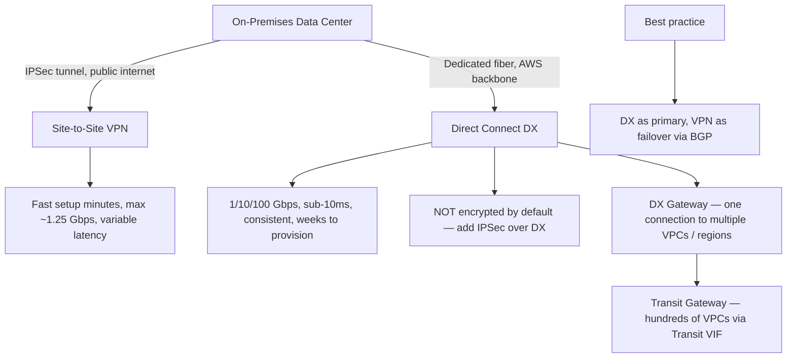
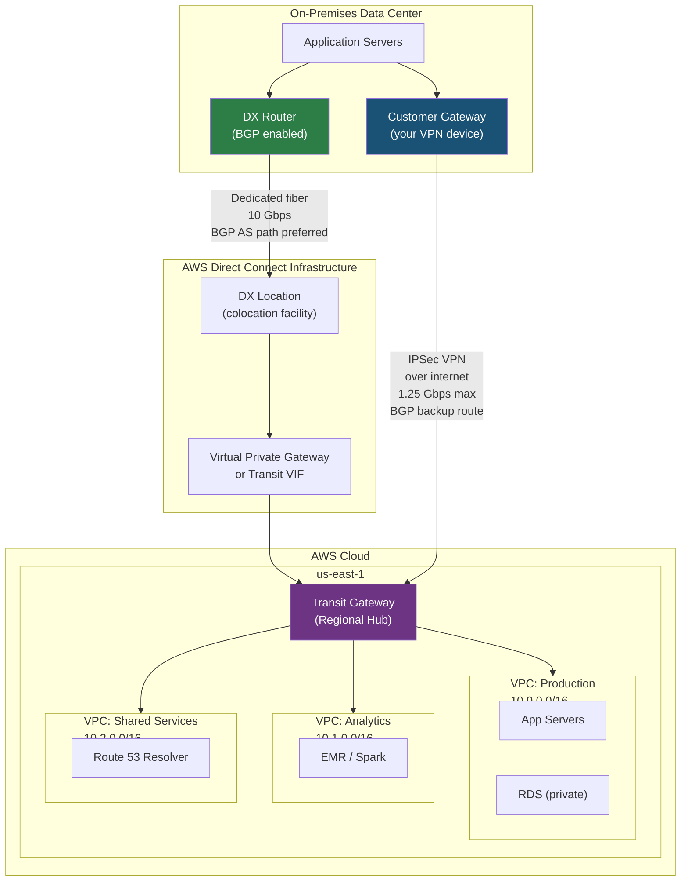
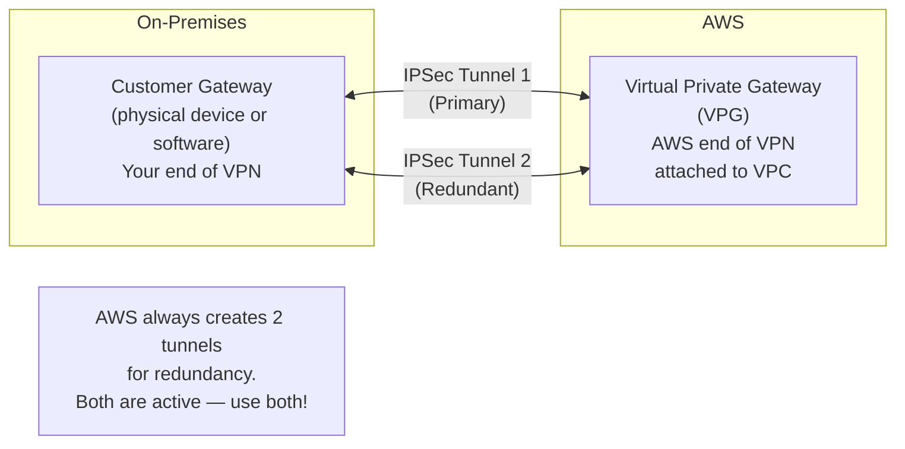
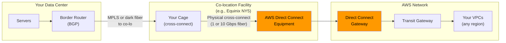
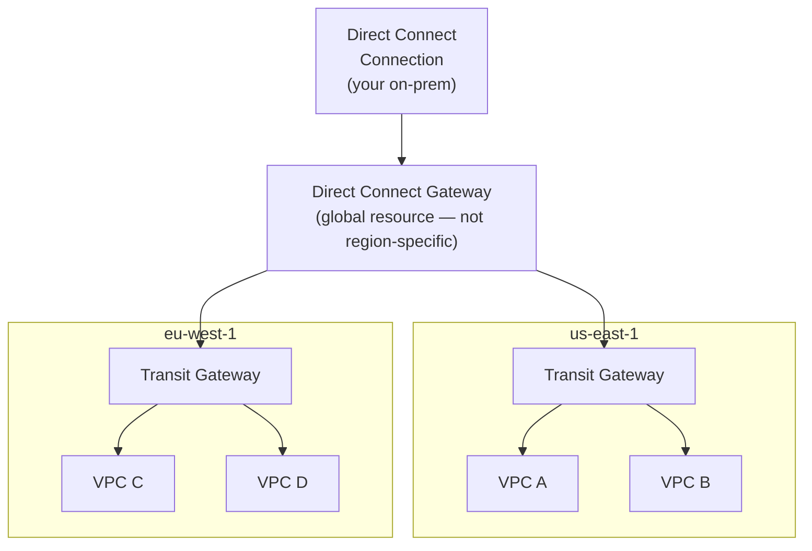
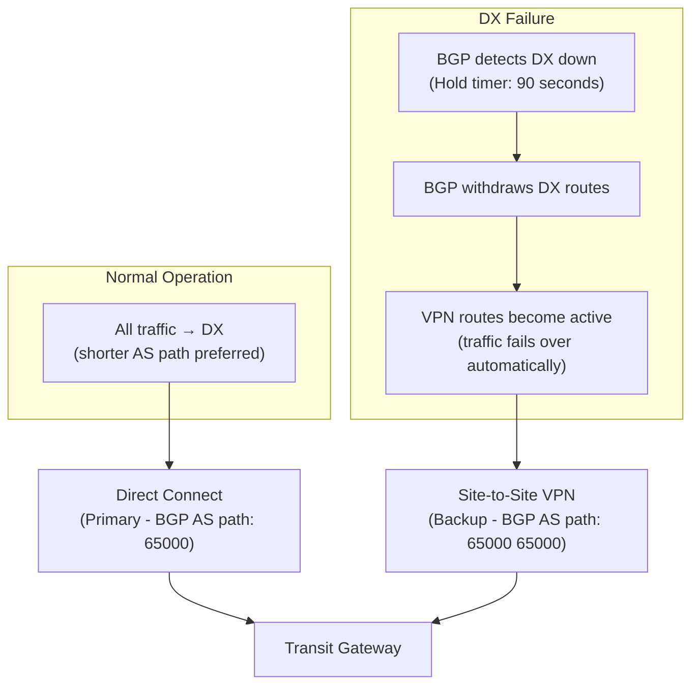
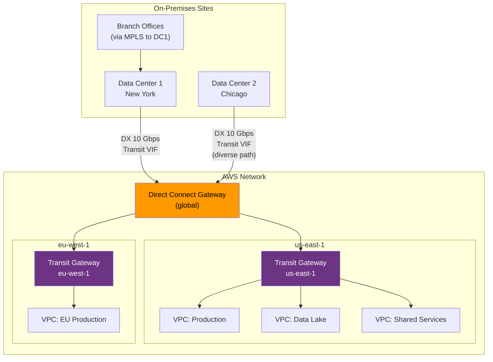

# AWS Direct Connect & Site-to-Site VPN: Hybrid Connectivity

## 🗺️ Quick Overview



*DX for high-throughput or latency-sensitive workloads; VPN as fast setup or failover path. Never use DX without encryption.*

> **Common Interview Question**: "Your company has a data center with 50TB/day of medical imaging data that needs to be processed in AWS. How do you connect your on-premises infrastructure? What happens if that connection goes down?"

Common in: AWS Solutions Architect, Senior Infrastructure, Cloud Migration, and Platform Engineering interviews

---

## Quick Answer (30-second version)

- **Site-to-Site VPN** = IPSec tunnel over the public internet. Fast to set up (minutes), cheap ($0.05/hr), but variable latency and max ~1.25 Gbps. Good for most workloads.
- **Direct Connect (DX)** = Dedicated fiber from your data center to AWS. 1/10/100 Gbps, consistent sub-10ms latency, no internet. Good for high-throughput or latency-sensitive workloads. Weeks to provision, expensive ($0.30–$0.85/port-hr).
- **DX is NOT encrypted by default** — you need to run IPSec over DX if you need encryption.
- **Best practice**: DX as primary + VPN as failover (BGP preference routes traffic to DX normally, fails over to VPN automatically).
- **Direct Connect Gateway** = Connect one DX connection to multiple VPCs across regions.
- **Transit Gateway + DX** = Enterprise-scale: one DX connection reaches hundreds of VPCs through a Transit VIF.

---

## Why This Matters / The Thought Process

When an interviewer asks about hybrid connectivity, they're testing whether you understand **the latency vs cost vs reliability triangle** in network design.

The real questions behind the question:
- Can you quantify how much data needs to move and how fast?
- Do you understand that "internet-based" means variable latency — a problem for real-time systems?
- Do you know the operational tradeoff: VPN is up in minutes, DX takes weeks?
- Can you design a failover strategy that's automatic, not manual?

Think like an SA: The choice between VPN and Direct Connect is almost never technical — it's math. Calculate your data volume, latency requirements, and budget. Then pick the right tool. The "DX + VPN backup" pattern is the correct answer for almost every production hybrid architecture.

**The mental model**: Think of VPN as driving on a public highway (shared, variable congestion) and Direct Connect as having a private toll road (dedicated, predictable). Both get you there — the question is whether you can afford the private road and whether traffic jams on the highway are acceptable.

---

## Architecture: Hybrid Connectivity with DX + VPN Failover



**How BGP failover works:**
1. DX route is advertised with a lower AS path (more preferred)
2. VPN route exists as backup with higher AS path (less preferred)
3. When DX fails, BGP withdraws the DX route → traffic automatically shifts to VPN
4. No manual intervention. Recovery time: seconds to minutes (BGP convergence)

---

## Site-to-Site VPN: How It Actually Works

### Components



### VPN Setup Process

```
Step 1: Create a Customer Gateway in AWS console
  - Specify your on-prem device's public IP
  - Specify BGP ASN (or use static routing)

Step 2: Create a Virtual Private Gateway (or use Transit Gateway)
  - Attach to your VPC

Step 3: Create a Site-to-Site VPN Connection
  - Links Customer Gateway → Virtual Private Gateway
  - AWS generates configuration for your device (Cisco, Palo Alto, Fortinet, etc.)

Step 4: Configure your on-prem device
  - Download the configuration file AWS generates
  - Apply to your router/firewall

Step 5: Test connectivity
  - Ping an EC2 private IP from on-prem
  - Time to working: typically 30-60 minutes
```

### VPN Key Facts

| Property | Value |
|----------|-------|
| Protocol | IPSec (IKEv1 or IKEv2) |
| Encryption | AES-256 |
| Max throughput | ~1.25 Gbps per tunnel |
| Tunnels per VPN | 2 (always, for redundancy) |
| Routing | Static or BGP (dynamic) |
| Cost | ~$0.05/hr per VPN connection + $0.01-0.09/GB data |
| Provisioning time | Minutes to hours |
| Latency | Variable (internet-based, typically 20-100ms+) |

**Why you always want BGP over static routing:**
- Static = you manually configure which networks are reachable on each side
- BGP = networks advertise themselves automatically. When a network is added on-prem, it propagates to AWS without manual updates.
- BGP also enables automatic failover between DX and VPN (the primary reason to use it)

---

## AWS Direct Connect: Dedicated Fiber to AWS

### What Direct Connect Actually Is

Direct Connect is a physical fiber connection from your data center (or a co-location facility) to an AWS Direct Connect location. You're not routing over the public internet at all — your packets travel on AWS's private backbone.



### DX Connection Types

**Dedicated Connection** — You get the full port:
- 1 Gbps, 10 Gbps, or 100 Gbps
- Physical port on AWS DX equipment
- You work with an APN partner for cross-connect
- Takes 4-8 weeks to provision

**Hosted Connection** — Shared through an AWS partner:
- 50 Mbps to 10 Gbps (partner slices their dedicated connection)
- Faster to provision (days to weeks)
- Good for: smaller bandwidth needs, faster start, lower cost

### Virtual Interfaces (VIFs)

A single DX connection can carry multiple virtual interfaces — each one a logical partition of the physical link.

| VIF Type | What It Connects To | Use Case |
|----------|---------------------|----------|
| **Private VIF** | Your VPC (via Virtual Private Gateway) | Access private resources in one VPC |
| **Public VIF** | AWS public services (S3, SQS, DynamoDB) | Access public AWS services without internet |
| **Transit VIF** | Transit Gateway | Access multiple VPCs through one DX connection |

**Interview insight**: If you have 50 VPCs, you don't need 50 Private VIFs. Use ONE Transit VIF → Transit Gateway → routes to all 50 VPCs. This is the enterprise-scale pattern.

### Direct Connect Gateway



**Direct Connect Gateway is the key to multi-region connectivity from a single DX connection.** Without it, you'd need a separate DX connection per region — extremely expensive.

**Limitations**:
- DX Gateway connects DX → VPCs, but does NOT allow VPC-to-VPC routing through DX Gateway
- For VPC-to-VPC routing, use Transit Gateway (attached to DX Gateway via Transit VIF)

---

## VPN vs Direct Connect: Decision Framework

| Dimension | Site-to-Site VPN | AWS Direct Connect |
|-----------|-----------------|-------------------|
| **Connection type** | IPSec tunnel over internet | Dedicated private fiber |
| **Max bandwidth** | ~1.25 Gbps per tunnel | 1, 10, or 100 Gbps |
| **Latency** | Variable (20-200ms, internet-dependent) | Consistent, sub-10ms |
| **Encryption** | Built-in (IPSec) | NOT included — add IPSec separately |
| **Provisioning time** | Minutes to hours | 4-8 weeks (dedicated) |
| **Cost** | ~$0.05/hr + data | $0.30-$0.85/port-hr + data |
| **Reliability** | Depends on ISP/internet | SLA-backed private line |
| **Setup complexity** | Low (configure VPN device) | High (colocation, cross-connect) |
| **Best for** | Dev/test, backup path, SMB workloads | Large data transfers, low-latency, compliance |

### The Decision Tree

```
Is latency a hard requirement (< 5ms, real-time systems)?
  YES → Direct Connect (only option for consistent latency)
  NO  ↓

Is bandwidth > 1 Gbps sustained?
  YES → Direct Connect (VPN can't match this)
  NO  ↓

Is this a compliance-mandated private connection (HIPAA, PCI, financial)?
  YES → Direct Connect (dedicated line, not internet)
  NO  ↓

Is this production with 24/7 availability requirements?
  → Direct Connect primary + VPN backup (best of both worlds)
  → Or just VPN with redundant tunnels (2 tunnels per connection)

Is this dev/test or early startup?
  → Site-to-Site VPN (fast, cheap, good enough)
```

### Real Numbers: When DX Pays for Itself

**Scenario**: 10 TB/day of data transfer from on-prem to AWS

**VPN option:**
- Data transfer: 10 TB × 30 days × $0.09/GB = ~$27,000/month
- VPN connection: $0.05 × 720 hrs = $36/month
- Total: ~$27,036/month

**Direct Connect option (10 Gbps port):**
- Port fee: $0.30/hr × 720 hrs = $216/month
- Data transfer: Much lower with DX pricing (~$0.02/GB) = ~$6,000/month
- Total: ~$6,216/month

**At 10 TB/day, DX saves ~$20,000/month.** The provisioning time and setup cost pay back in 1-2 months.

---

## Interview Scenario 1: Medical Imaging Data

> **"Your company processes medical imaging data (50TB/day) in AWS. You're on-prem today. How do you connect your data center?"**

**SA thought process:**

50 TB/day = ~4.6 Gbps sustained throughput. VPN maxes out at 1.25 Gbps. That alone rules out VPN as the primary link.

**Answer:**

1. **Primary: AWS Direct Connect at 10 Gbps**
   - 4.6 Gbps sustained fits within 10 Gbps with headroom for bursting
   - HIPAA compliance: private connection (not internet) is defensible to auditors
   - Provision 2× DX connections for redundancy (or DX + diverse path)

2. **Backup: Site-to-Site VPN**
   - For failover only — can't handle full 50TB/day load
   - BGP preference: DX advertised with shorter AS path (preferred)
   - When DX fails, VPN carries reduced load (non-urgent data queued, urgent data goes VPN)

3. **Architecture:**
   - Transit VIF → Direct Connect Gateway → Transit Gateway → VPCs
   - Private VIF not enough if you have multiple VPCs (analytics, processing, archive)

4. **Security:**
   - HIPAA requires encryption in transit → run MACsec (Layer 2 encryption) on DX or IPSec over DX
   - DX alone is private but not encrypted — this is a common compliance trap

---

## Interview Scenario 2: Sub-5ms Trading System

> **"A bank needs < 5ms latency to their trading system running in AWS. What connectivity do you choose?"**

**SA thought process:**

Latency budget breakdown:
- Speed of light across the US: ~30ms one-way. They likely mean 5ms for local/regional connections.
- VPN adds overhead: encryption/decryption, internet hops, variable congestion
- DX: predictable latency because traffic doesn't leave the private backbone

**Answer:**

1. **Direct Connect is the only choice** — VPN's internet routing means you can't guarantee sub-5ms.

2. **DX + co-location**: Ideally, the bank's trading systems are co-located at the same DX location as the AWS equipment — minimizing physical distance.

3. **Dedicated Connection (not Hosted)**: Need guaranteed bandwidth, no sharing.

4. **MACsec encryption on DX**: Financial compliance requires encryption. MACsec at Layer 2 adds minimal latency vs IPSec.

5. **Multiple DX connections from different providers**: For a trading system, if DX goes down, you need recovery in seconds, not minutes. Dual DX from diverse providers + VPN as final fallback.

6. **AWS Local Zones**: If sub-5ms is truly a hard requirement, consider running compute in an AWS Local Zone co-located near the financial district.

---

## Interview Scenario 3: Failover Strategy

> **"Design a failover strategy for when Direct Connect goes down."**



**Failover timeline:**
- BGP Hold Timer default: 90 seconds (reduce to 30s with keepalives every 10s)
- Traffic shifts to VPN: automatic, no manual intervention
- Throttling on VPN: if DX was 10 Gbps and VPN is 1.25 Gbps, you'll need a strategy for the excess traffic

**Tiered failover strategy for high-throughput:**
1. **Critical path traffic** (transactional, latency-sensitive): Goes over VPN immediately
2. **Bulk transfers** (batch jobs, analytics): Paused, queued in SQS, resumed when DX restores
3. **Read-heavy workloads**: Serve from S3/CloudFront cache in AWS — no DX needed

---

## Transit Gateway + Direct Connect: Enterprise Scale

For large enterprises with 50+ VPCs and multiple on-prem sites, the Transit Gateway + Direct Connect pattern is standard:



**Why this pattern works:**
- One DX connection reaches all VPCs across all regions
- Adding a new VPC = just attach it to TGW, no new DX needed
- Redundant DX from multiple data centers: if DC1's DX fails, DC2's DX carries the load
- BGP route policies control which VPCs can reach which on-prem networks (security isolation)

---

## Common Interview Follow-ups

**Q: "Can you run Site-to-Site VPN over Direct Connect?"**

Yes — and you should, for compliance scenarios. Running IPSec VPN over DX gives you:
- The consistent latency and bandwidth of DX
- The encryption that DX alone doesn't provide
- Double-layered security: private network + encrypted tunnel

This is the recommended pattern for PCI-DSS and HIPAA workloads on Direct Connect.

**Q: "What's the difference between a Virtual Private Gateway and a Transit Gateway for DX?"**

- **Virtual Private Gateway**: Attaches to a single VPC. One Private VIF per VPC. Gets complex with many VPCs.
- **Transit Gateway**: Central hub. One Transit VIF connects to TGW, which then routes to all attached VPCs. Scales to thousands of VPCs.

For more than 3-4 VPCs, always use Transit Gateway.

**Q: "What is MACsec and when do you use it with Direct Connect?"**

MACsec (IEEE 802.1AE) is Layer 2 encryption. It encrypts traffic between your router and the AWS DX device before it even enters the AWS network. Unlike IPSec (Layer 3), MACsec:
- Is transparent to higher-layer protocols
- Adds very minimal latency overhead (~microseconds vs milliseconds for IPSec)
- Requires 10 Gbps or 100 Gbps dedicated DX connections
- Available on MACsec-enabled Direct Connect hardware

Use MACsec when you need encryption + minimal latency (financial services, low-latency trading over DX).

**Q: "How many VPCs can a Direct Connect Gateway connect to?"**

Up to 10 VPCs (via Private VIF) directly, or unlimited (effectively) via Transit Gateway attachment. This is a common exam gotcha — the limit is 10 for direct Private VIF attachments, but TGW removes this limit.

**Q: "What happens to DX traffic if the Direct Connect location has an outage?"**

DX locations are AWS facilities or partner co-location facilities. If the facility has a power outage:
- Your DX connection to that location goes down
- BGP detects the failure and withdraws routes
- Failover to VPN (or second DX at a different location) kicks in

This is why enterprise architectures use DX connections to two DIFFERENT locations (diverse path) from two different on-prem sites.

---

## AWS Certification Exam Tips

1. **DX is NOT encrypted** — this is the #1 certification trap. A question about "secure, private, encrypted connection" is NOT answered by DX alone. You need IPSec over DX or MACsec.

2. **VPN uses the internet, DX does not** — exam questions about "consistent latency" or "not traversing the public internet" always point to Direct Connect.

3. **Hosted vs Dedicated DX**: Hosted connections are provisioned by an APN partner. Dedicated connections are provisioned by AWS directly. The exam asks: "fastest to provision" = Hosted.

4. **VIF types**: Private VIF → single VPC (via VPG). Transit VIF → multiple VPCs (via TGW). Public VIF → AWS public services (S3, SQS) without internet. Memorize which VIF type goes where.

5. **BGP is required for DX** — Direct Connect always uses BGP. VPN can use static routing OR BGP.

6. **Direct Connect Gateway is global** — it's not a regional resource. One DXGW can connect your on-prem to VPCs in multiple AWS regions.

7. **DX + VPN failover requires BGP on both sides** — if you use static routing on VPN, automatic failover doesn't work. The exam tests this.

8. **Provisioning time**: VPN = minutes, Hosted DX = days/weeks, Dedicated DX = 4-8 weeks. A question about "fastest hybrid connectivity" always picks VPN.

9. **VPC peering and TGW**: Traffic flows VPC→TGW→DXGW→DX→on-prem. Traffic does NOT flow VPC→DXGW directly unless there's a VPG on the VPC.

10. **Maximum VPN throughput**: Each tunnel supports ~1.25 Gbps. Two tunnels per VPN connection = up to 2.5 Gbps theoretically, but in practice you're limited by how traffic is split across tunnels.

---

## Key Takeaways

- **VPN** = fast to set up, internet-based, variable latency, max 1.25 Gbps, cheap. Great for dev/test, backup paths, or workloads that don't need guaranteed bandwidth.
- **Direct Connect** = dedicated fiber, consistent sub-10ms latency, 1-100 Gbps, takes weeks to provision, expensive. Required for high-throughput, latency-sensitive, or compliance-mandated workloads.
- **DX is NOT encrypted** — add IPSec over DX or MACsec for encryption in transit.
- **DX + VPN backup** is the production-grade pattern: DX as primary (BGP preferred), VPN as automatic failover.
- **Direct Connect Gateway** connects one DX to multiple VPCs across regions — do NOT create separate DX connections per region.
- **Transit VIF → Transit Gateway** is the enterprise pattern for connecting DX to many VPCs at scale.
- The "which connectivity" interview answer starts with: calculate data volume → check latency requirements → check compliance → then pick VPN, DX, or both.

## Related Topics

- [AWS VPC Networking](/12-interview-prep/quick-reference/aws-cloud/vpc-networking)
- [Route 53 DNS](/12-interview-prep/quick-reference/aws-cloud/route53-dns)
- [Load Balancer (ALB vs NLB)](/12-interview-prep/quick-reference/aws-cloud/load-balancer)
- [Disaster Recovery](/12-interview-prep/quick-reference/aws-cloud/disaster-recovery)
