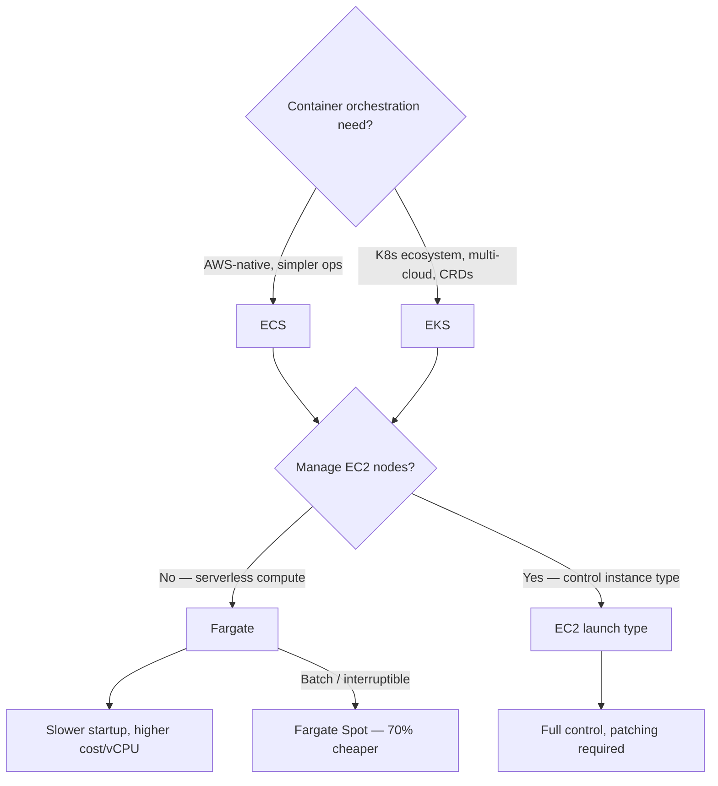
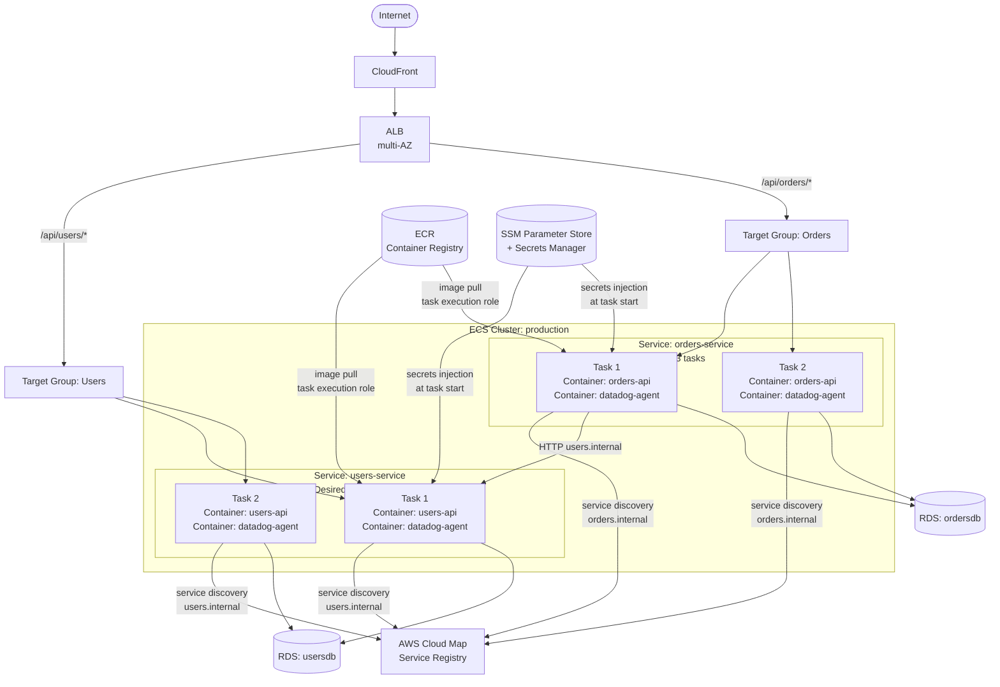
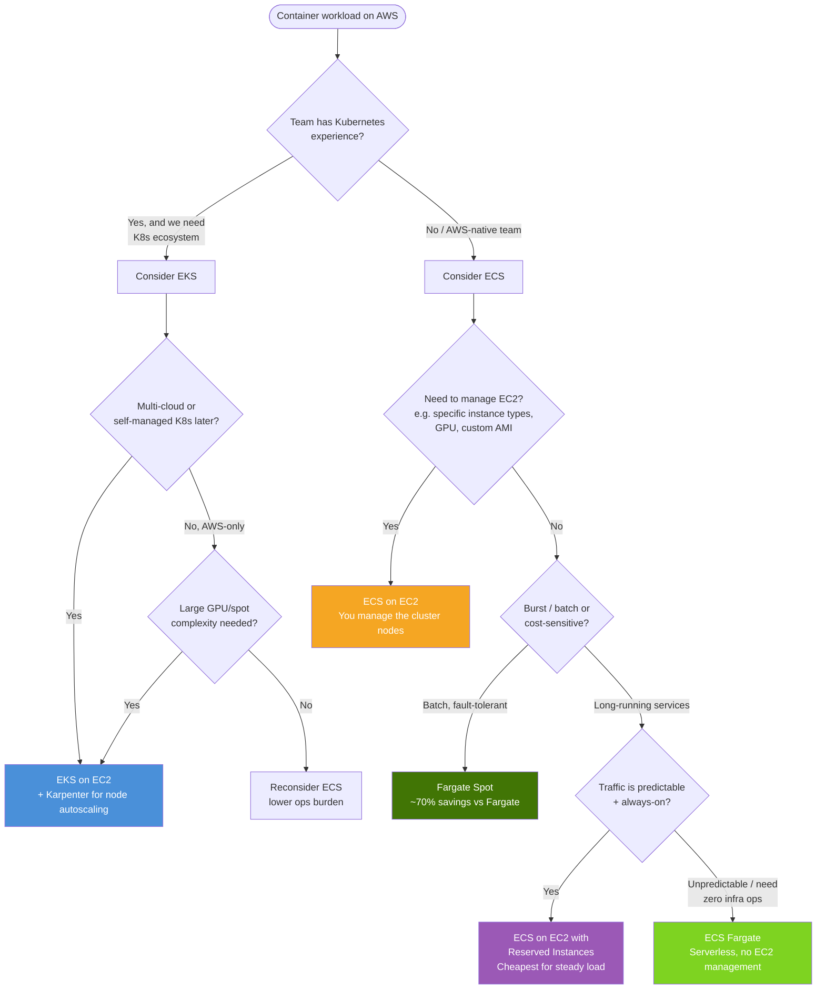
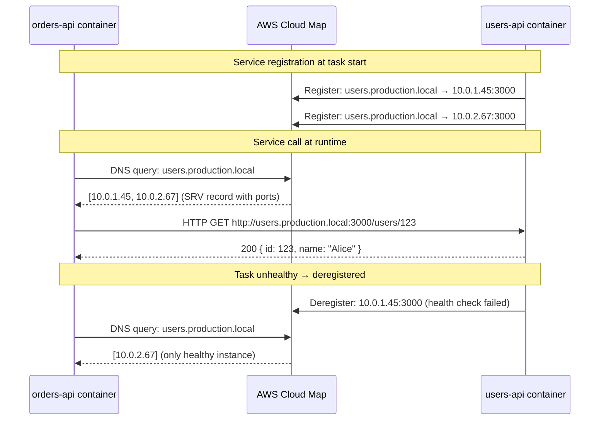
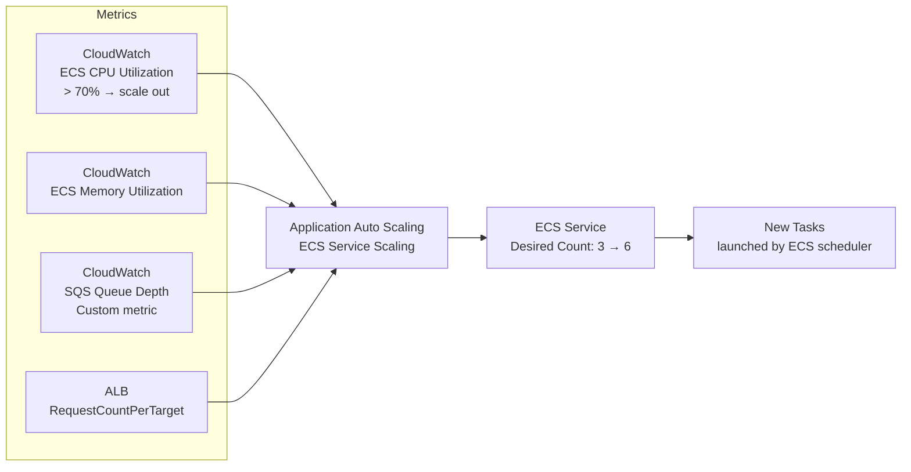
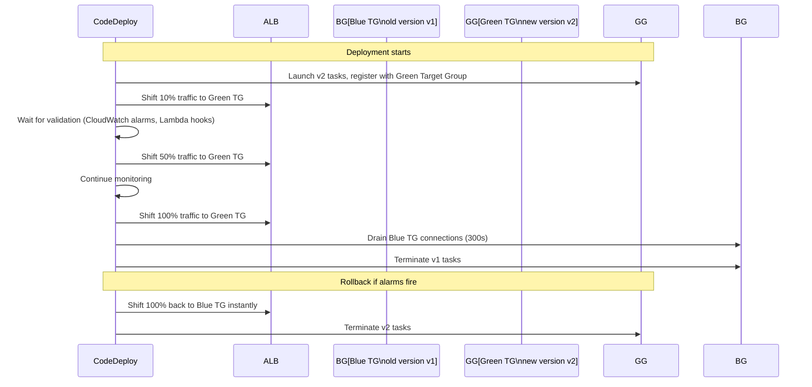

# AWS ECS vs EKS vs Fargate: Container Orchestration

## 🗺️ Quick Overview



*80% organizational: team knows K8s → EKS; AWS-native simplicity → ECS + Fargate.*

## Question
**"When would you choose ECS over EKS? When is Fargate the right choice? How does ECS task scheduling work, and how do you handle service-to-service communication in a containerized microservices architecture?"**

Common in: AWS Solutions Architect, DevOps, Platform Engineering, Backend interviews (any company running microservices on AWS)

---

## Quick Answer (30-second version)

- **ECS (Elastic Container Service)**: AWS-native, simpler ops, tighter AWS integration — right for most teams new to containers or running entirely on AWS
- **EKS (Elastic Kubernetes Service)**: Managed Kubernetes — right when you need the K8s ecosystem, multi-cloud portability, or advanced scheduling (DaemonSets, CRDs, Helm charts)
- **Fargate**: Serverless compute for containers — no EC2 to manage. Use it for ECS or EKS when you want zero infrastructure overhead. The trade-off: slower startup, higher per-vCPU cost, no SSH access
- **Fargate Spot**: 70% cheaper than Fargate, same interruption model as EC2 Spot — perfect for batch workloads

**The decision is 80% organizational** — if your team knows Kubernetes, EKS. If you're AWS-native and want simplicity, ECS + Fargate.

---

## Why This Matters / The Thought Process

Interviewers asking this question are probing three things:

1. **Can you reason about operational complexity?** Kubernetes has a steep learning curve. ECS is simpler but less portable.
2. **Do you understand cost trade-offs?** Fargate is expensive per CPU-hour vs EC2, but eliminates operations overhead (patching, capacity planning, AMI management).
3. **Do you understand the primitives?** Task definition, service, cluster, task role vs execution role — these map directly to K8s Pod, Deployment, Namespace, ServiceAccount.

**The mental model**: ECS:K8s :: Route53:CoreDNS :: ALB:Ingress — AWS has proprietary equivalents for most Kubernetes concepts. ECS is the AWS-native path.

---

## Architecture: ECS Cluster Full Stack



---

## Decision Framework: ECS vs EKS vs Fargate



### Comparison Table: ECS EC2 vs ECS Fargate vs EKS

| Dimension | ECS on EC2 | ECS Fargate | EKS (EC2) |
|---|---|---|---|
| **Infrastructure mgmt** | You manage EC2 (patches, AMIs, capacity) | Zero — AWS manages | You manage EC2 node groups |
| **Startup time** | ~30-60s (if EC2 running) | 30-90s (cold container start) | ~30-60s |
| **Cost model** | Per EC2 hour (bin-pack containers) | Per task vCPU + memory (higher unit cost) | Per EC2 hour |
| **SSH into container** | Yes (exec into running container or SSH to EC2) | No SSH — only `ecs exec` (SSM) | Yes (kubectl exec or SSH) |
| **GPU support** | Yes (p/g instance families) | No GPU support | Yes |
| **Spot integration** | Full Spot support | Fargate Spot (task-level interruption) | Spot node groups |
| **Max density** | You control (pack as many tasks as fits) | AWS controls (one task per Fargate "slot") | You control |
| **Ecosystem** | AWS proprietary | AWS proprietary | Full K8s ecosystem |
| **Learning curve** | Low | Lowest | High |

---

## ECS Core Concepts: Task Definition vs Service vs Cluster

```
Cluster:
  - Logical grouping of tasks and services
  - Does NOT provision compute (EC2 or Fargate does that)
  - Think of it as a namespace

Task Definition (immutable, versioned):
  - Blueprint for your containers (like a Pod spec in K8s)
  - Defines: container image, CPU/memory units, environment variables,
    secrets, log configuration, network mode, volumes, health check
  - Versioned: myapp:1, myapp:2, myapp:3
  - Registering a new task definition creates a new revision — old ones remain

Task:
  - Running instance of a task definition
  - Ephemeral — can be standalone (batch) or managed by a Service
  - Gets its own Elastic Network Interface (ENI) in awsvpc network mode

Service:
  - Long-running, maintains desired task count
  - Integrates with ALB target groups
  - Handles rolling deployments
  - Think of it as a Deployment + Service in K8s
```

### CPU and Memory Units

```
ECS uses units, not cores:
  - 1 vCPU = 1024 CPU units
  - Fargate valid CPU/memory combinations are fixed (not arbitrary):

  256 CPU units (0.25 vCPU):   0.5 GB, 1 GB, 2 GB
  512 CPU units (0.5 vCPU):    1 GB – 4 GB
  1024 CPU units (1 vCPU):     2 GB – 8 GB
  2048 CPU units (2 vCPU):     4 GB – 16 GB
  4096 CPU units (4 vCPU):     8 GB – 30 GB
  8192 CPU units (8 vCPU):     16 GB – 60 GB
  16384 CPU units (16 vCPU):   32 GB – 120 GB

For ECS on EC2: CPU units are relative to the EC2 instance.
  An m6i.xlarge has 4 vCPU = 4096 units to share across tasks.
  Two tasks of 1024 CPU units each leave 2048 for other tasks.
```

### Task Role vs Task Execution Role

```
Task Execution Role:
  - Used by the ECS AGENT (the AWS infrastructure layer)
  - Needed to pull container images from ECR
  - Needed to fetch secrets from SSM Parameter Store / Secrets Manager
  - Needed to write logs to CloudWatch Logs
  - This role exists at LAUNCH TIME before your container starts

Task Role:
  - Used by YOUR APPLICATION running inside the container
  - IAM permissions your app needs: DynamoDB:GetItem, S3:PutObject, SQS:SendMessage, etc.
  - Injected as ephemeral credentials via the container metadata endpoint
  - This is the role your Node.js/Python/Java code assumes via SDK

Common exam confusion:
  Q: "My container can't pull from ECR. Which role do I fix?"
  A: Task Execution Role — it's the ECS agent pulling the image, not your app.

  Q: "My container throws AccessDenied calling DynamoDB. Which role?"
  A: Task Role — that's your application code making the SDK call.
```

---

## Service Discovery in ECS

### Method 1: AWS Cloud Map (Service Discovery)



### Method 2: ALB Path-Based Routing (External-Facing)

Use when services are accessed from outside the cluster or when you need Layer 7 features (auth, routing rules).

```
Client → ALB → /api/users/* → users-service target group → tasks
              → /api/orders/* → orders-service target group → tasks
```

### Method 3: Internal ALB (Service Mesh Light)

Create an internal ALB (not internet-facing) for service-to-service routing. More overhead than Cloud Map DNS but gives you ALB features (sticky sessions, path routing) for internal traffic.

---

## ECS Service Auto-Scaling



```
Two scaling modes:

1. Target Tracking (preferred for most workloads):
   - Set a target metric value
   - Auto Scaling adds/removes tasks to maintain that value
   - Example: Keep ECSServiceAverageCPUUtilization at 60%

2. Step Scaling:
   - Define explicit steps: if CPU > 70%, add 2 tasks; if CPU > 90%, add 5 tasks
   - More control but more configuration
   - Useful when you know the relationship between load and capacity

Custom metric example (SQS queue depth → consumer scaling):
  - Metric: SQS ApproximateNumberOfMessages
  - Target: 100 messages per task (if each task processes 100 msg/min)
  - 500 messages in queue → 5 tasks needed
```

---

## Blue/Green Deployments with CodeDeploy



**Key advantage**: Instant rollback — just shift traffic back to Blue. No re-deploy needed.

---

## Code: ECS Task Definition (Node.js App + Sidecar)

```json
{
  "family": "myapp",
  "networkMode": "awsvpc",
  "requiresCompatibilities": ["FARGATE"],
  "cpu": "1024",
  "memory": "2048",
  "executionRoleArn": "arn:aws:iam::123456789:role/myapp-execution-role",
  "taskRoleArn": "arn:aws:iam::123456789:role/myapp-task-role",
  "containerDefinitions": [
    {
      "name": "myapp",
      "image": "123456789.dkr.ecr.us-east-1.amazonaws.com/myapp:v1.2.3",
      "essential": true,
      "portMappings": [
        {
          "containerPort": 3000,
          "protocol": "tcp"
        }
      ],
      "environment": [
        { "name": "NODE_ENV", "value": "production" },
        { "name": "PORT", "value": "3000" }
      ],
      "secrets": [
        {
          "name": "DB_PASSWORD",
          "valueFrom": "arn:aws:secretsmanager:us-east-1:123456789:secret:myapp/db-password-AbCdEf"
        },
        {
          "name": "JWT_SECRET",
          "valueFrom": "arn:aws:ssm:us-east-1:123456789:parameter/myapp/jwt-secret"
        }
      ],
      "healthCheck": {
        "command": ["CMD-SHELL", "curl -f http://localhost:3000/health || exit 1"],
        "interval": 30,
        "timeout": 5,
        "retries": 3,
        "startPeriod": 60
      },
      "logConfiguration": {
        "logDriver": "awslogs",
        "options": {
          "awslogs-group": "/ecs/myapp",
          "awslogs-region": "us-east-1",
          "awslogs-stream-prefix": "ecs"
        }
      },
      "ulimits": [
        {
          "name": "nofile",
          "softLimit": 65536,
          "hardLimit": 65536
        }
      ],
      "resourceRequirements": [],
      "dependsOn": [
        {
          "containerName": "datadog-agent",
          "condition": "START"
        }
      ]
    },
    {
      "name": "datadog-agent",
      "image": "public.ecr.aws/datadog/agent:latest",
      "essential": false,
      "environment": [
        { "name": "ECS_FARGATE", "value": "true" },
        { "name": "DD_SITE", "value": "datadoghq.com" }
      ],
      "secrets": [
        {
          "name": "DD_API_KEY",
          "valueFrom": "arn:aws:ssm:us-east-1:123456789:parameter/datadog/api-key"
        }
      ],
      "logConfiguration": {
        "logDriver": "awslogs",
        "options": {
          "awslogs-group": "/ecs/myapp-datadog",
          "awslogs-region": "us-east-1",
          "awslogs-stream-prefix": "ecs"
        }
      }
    }
  ],
  "tags": [
    { "key": "Environment", "value": "production" },
    { "key": "Service", "value": "myapp" }
  ]
}
```

---

## Code: ECS Fargate Service with ALB (AWS CDK — TypeScript)

```typescript
import * as cdk from 'aws-cdk-lib';
import * as ecs from 'aws-cdk-lib/aws-ecs';
import * as ecs_patterns from 'aws-cdk-lib/aws-ecs-patterns';
import * as ecr from 'aws-cdk-lib/aws-ecr';
import * as ec2 from 'aws-cdk-lib/aws-ec2';
import * as secretsmanager from 'aws-cdk-lib/aws-secretsmanager';
import { Construct } from 'constructs';

export class MyAppStack extends cdk.Stack {
  constructor(scope: Construct, id: string, props?: cdk.StackProps) {
    super(scope, id, props);

    // VPC — 3 AZs, public + private subnets
    const vpc = new ec2.Vpc(this, 'VPC', {
      maxAzs: 3,
      natGateways: 1, // 1 NAT GW for cost (use 3 for HA in prod)
    });

    // ECS Cluster
    const cluster = new ecs.Cluster(this, 'Cluster', {
      vpc,
      clusterName: 'myapp-production',
      containerInsights: true, // CloudWatch Container Insights
    });

    // ECR Repository
    const repository = ecr.Repository.fromRepositoryName(
      this, 'Repository', 'myapp'
    );

    // Secret from Secrets Manager
    const dbSecret = secretsmanager.Secret.fromSecretNameV2(
      this, 'DBSecret', 'myapp/database'
    );

    // All-in-one: Fargate Service + ALB + Target Group + CloudWatch Logs
    const fargateService = new ecs_patterns.ApplicationLoadBalancedFargateService(this, 'Service', {
      cluster,
      serviceName: 'myapp-service',
      cpu: 1024,           // 1 vCPU
      memoryLimitMiB: 2048, // 2 GB
      desiredCount: 3,

      // Container configuration
      taskImageOptions: {
        image: ecs.ContainerImage.fromEcrRepository(repository, 'v1.2.3'),
        containerPort: 3000,
        environment: {
          NODE_ENV: 'production',
          PORT: '3000',
        },
        secrets: {
          DB_PASSWORD: ecs.Secret.fromSecretsManager(dbSecret, 'password'),
          DB_HOST: ecs.Secret.fromSecretsManager(dbSecret, 'host'),
        },
        logDriver: ecs.LogDrivers.awsLogs({
          streamPrefix: 'myapp',
          logGroup: new cdk.aws_logs.LogGroup(this, 'LogGroup', {
            logGroupName: '/ecs/myapp',
            retention: cdk.aws_logs.RetentionDays.ONE_MONTH,
            removalPolicy: cdk.RemovalPolicy.DESTROY,
          }),
        }),
      },

      // ALB configuration
      publicLoadBalancer: true,
      listenerPort: 443,
      protocol: cdk.aws_elasticloadbalancingv2.ApplicationProtocol.HTTPS,
      domainName: 'api.myapp.com',
      domainZone: cdk.aws_route53.HostedZone.fromLookup(this, 'Zone', {
        domainName: 'myapp.com',
      }),

      // Deploy in private subnets (NAT for outbound)
      taskSubnets: {
        subnetType: ec2.SubnetType.PRIVATE_WITH_EGRESS,
      },

      // Circuit breaker — auto-rollback if deployment is unhealthy
      circuitBreaker: {
        rollback: true,
      },

      // Health check
      healthCheck: {
        path: '/health',
        interval: cdk.Duration.seconds(30),
        timeout: cdk.Duration.seconds(5),
        healthyHttpCodes: '200',
        healthyThresholdCount: 2,
        unhealthyThresholdCount: 3,
      },
    });

    // Auto-scaling: CPU-based
    const scaling = fargateService.service.autoScaleTaskCount({
      minCapacity: 3,
      maxCapacity: 20,
    });

    scaling.scaleOnCpuUtilization('CpuScaling', {
      targetUtilizationPercent: 70,
      scaleInCooldown: cdk.Duration.seconds(60),
      scaleOutCooldown: cdk.Duration.seconds(30),
    });

    // Auto-scaling: Request count (better for API workloads)
    scaling.scaleOnRequestCount('RequestScaling', {
      requestsPerTarget: 1000,
      targetGroup: fargateService.targetGroup,
      scaleInCooldown: cdk.Duration.seconds(60),
      scaleOutCooldown: cdk.Duration.seconds(30),
    });

    // Grant task role permissions
    dbSecret.grantRead(fargateService.taskDefinition.taskRole);

    // Outputs
    new cdk.CfnOutput(this, 'LoadBalancerDNS', {
      value: fargateService.loadBalancer.loadBalancerDnsName,
    });
  }
}
```

---

## Code: ECS Service with Fargate Spot (Cost Optimization)

```typescript
// Use Fargate Spot for non-critical services (batch, background workers)
import * as ecs from 'aws-cdk-lib/aws-ecs';

// In your ECS Service definition, override capacity provider strategy:
const workerService = new ecs.FargateService(this, 'WorkerService', {
  cluster,
  taskDefinition: workerTaskDef,
  serviceName: 'myapp-worker',
  desiredCount: 5,

  // Use Fargate Spot with On-Demand fallback
  capacityProviderStrategies: [
    {
      capacityProvider: 'FARGATE_SPOT',
      weight: 4,    // 80% of tasks on Fargate Spot
      base: 0,
    },
    {
      capacityProvider: 'FARGATE',
      weight: 1,    // 20% on On-Demand Fargate for reliability
      base: 1,      // Always keep at least 1 On-Demand task running
    },
  ],

  // Fargate Spot tasks get a 2-minute SIGTERM before termination
  // Your app must handle SIGTERM gracefully:
  //   process.on('SIGTERM', () => gracefulShutdown())
});
```

---

## ECS Task Scheduling: How ECS Places Containers

```
ECS Task Placement (EC2 launch type only — Fargate manages placement):

Placement Strategies (in order of evaluation):
  1. binpack: Fill instances to minimize EC2 usage (pack tightly by CPU or memory)
     → Saves money — fewer EC2 instances running
  2. spread: Distribute across AZs, instances (maximize fault tolerance)
  3. random: Random placement (simplest)

Placement Constraints:
  - distinctInstance: Never two tasks of same service on same EC2
  - memberOf: Place only on instances matching an expression
    e.g., "attribute:ecs.instance-type =~ m6i.*"

ECS Task Scheduler also handles:
  - Available CPU/memory on the instance (won't overschedule)
  - Port conflicts (if not using awsvpc network mode with per-task ENI)
  - AZ balance (tries to balance across AZs for services)

Best practice:
  Use awsvpc network mode (each task gets its own ENI + private IP)
  → No port conflicts, task-level security groups, works with Fargate
```

---

## Common Interview Follow-ups

**Q: "You need to run 1,000 containers on-demand for a batch job with no infrastructure management. What do you use?"**

> "ECS Fargate. Define a batch task definition, then use ECS RunTask API or Step Functions ECS integration to launch the tasks. Fargate Spot reduces cost by 70%. For scale, use ECS Task Sets or AWS Batch (which manages the ECS scheduling complexity for you at large scale). If the batch job is seconds-duration, Lambda is simpler — but Lambda has a 15-minute limit and 10 GB memory cap."

**Q: "Your microservice is crashing in production. How do you debug it on Fargate? You can't SSH."**

> "Three options: 1) `aws ecs execute-command` with SSM Session Manager — gives you a shell in the running container without SSH (requires `--enable-execute-command` on the service). 2) CloudWatch Logs — all container stdout/stderr goes to `/ecs/<service>`. 3) CloudWatch Container Insights — memory, CPU, task-level metrics. Enable X-Ray for distributed tracing if the bug is cross-service."

**Q: "ECS vs EKS — you're a startup with 3 engineers. Which do you choose?"**

> "ECS + Fargate. Kubernetes has real operational overhead — etcd management, RBAC configuration, node group patching, understanding of controllers and webhooks. ECS with Fargate means zero infrastructure management. When you reach the point where you need Helm chart ecosystem, custom operators, or multi-cloud portability, migrate to EKS. Most startups don't hit that inflection point until 20+ engineers."

**Q: "How does Fargate networking work? Can Fargate tasks talk to each other?"**

> "Each Fargate task gets a dedicated Elastic Network Interface (ENI) with a private IP in your VPC subnet. Task-to-task communication happens via VPC routing — same as EC2. Use AWS Cloud Map for service discovery (DNS-based), or an internal ALB. Security groups are applied at the task ENI level, giving you fine-grained control. Fargate does NOT support host networking mode."

**Q: "Walk me through a blue/green deploy of an ECS service with zero downtime."**

> "With CodeDeploy + ECS: 1) CodeDeploy creates a new task set (Green) with the new image. 2) Registers it with a second ALB target group. 3) Shifts traffic gradually (canary or linear). 4) Runs CloudWatch alarms during bake time. 5) If alarms fire, rolls back instantly by returning traffic to Blue. 6) After bake time passes, terminates Blue tasks. The entire shift is controlled by traffic weights — zero downtime because old tasks drain before termination."

---

## AWS Certification Exam Tips

```
SAA-C03 Key Points:

1. Fargate = no SSH access to underlying host
   - Use ECS Exec (SSM) for container shell access
   - Requires: --enable-execute-command on service

2. Task Execution Role vs Task Role — always tested:
   - Execution Role: ECS agent (ECR pull, Secrets Manager, CloudWatch Logs)
   - Task Role: Your application code (DynamoDB, S3, SQS)

3. ECR image pull:
   - Public ECR: No auth needed
   - Private ECR: Task execution role needs ecr:GetAuthorizationToken + ecr:BatchGetImage

4. Network modes:
   - awsvpc (required for Fargate): Task gets own ENI, security group
   - bridge (EC2 only): Docker NAT, port mapping
   - host (EC2 only): Use host network directly
   - Fargate ONLY supports awsvpc

5. Fargate Spot interruption:
   - 2-minute warning via SIGTERM to the container
   - ECS sends task state change notification via EventBridge
   - Handle SIGTERM in your app for graceful shutdown

6. ECS on EC2: You must run ECS agent on each EC2 (Amazon ECS-optimized AMI does this automatically)

7. Service health: ECS service considers a task healthy only after
   container health check + ELB health check both pass

8. ECS Task placement (EC2 launch type):
   - Exam loves "binpack" (cost saving) vs "spread" (availability) questions
   - "spread by attribute:ecs.availability-zone" → distribute across AZs
```

---

## Key Takeaways

1. **ECS = AWS-native simplicity**; EKS = Kubernetes ecosystem + portability — choose based on team expertise and lock-in tolerance
2. **Fargate = zero infra management**, higher per-CPU cost — right for variable/unpredictable workloads
3. **Task Execution Role** = AWS infrastructure (ECR, secrets, logs); **Task Role** = your application code
4. **Fargate Spot** saves 70% — pair with SIGTERM handler for graceful shutdown, always keep 1 On-Demand task as base
5. **Service discovery**: Cloud Map (DNS-based, integrated with ECS health checks) for service-to-service; ALB for external traffic
6. **Blue/green with CodeDeploy**: Instant rollback by traffic shift — preferred over rolling for production critical services
7. **ECS on EC2 with Reserved Instances** is the cheapest option for stable, always-on workloads — Fargate isn't always cheaper
8. **Container Insights + X-Ray + ECS Exec** replace SSH for debugging on Fargate

---

## Related Questions

- [AWS EC2 Instances, ASG & Placement Groups](/interview-prep/aws-cloud/ec2-instances)
- [AWS Lambda for Serverless Architecture](/interview-prep/aws-cloud/lambda-serverless)
- [AWS API Gateway](/interview-prep/aws-cloud/api-gateway)
- [AWS Load Balancers: ELB, ALB, NLB](/interview-prep/aws-cloud/load-balancer)
- [CloudWatch Monitoring](/interview-prep/aws-cloud/cloudwatch-monitoring)
