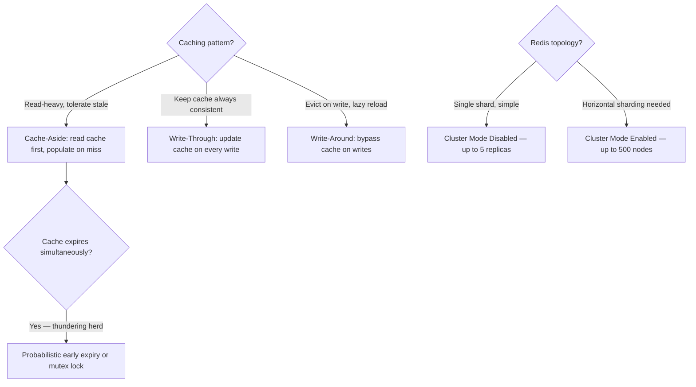
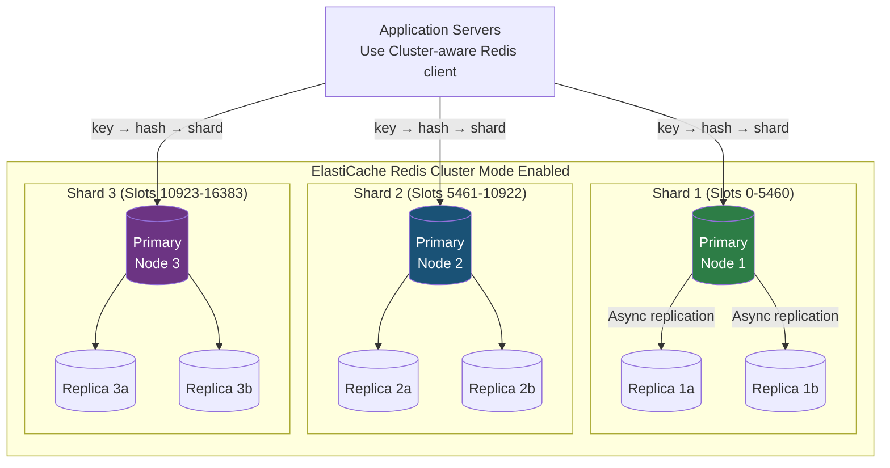
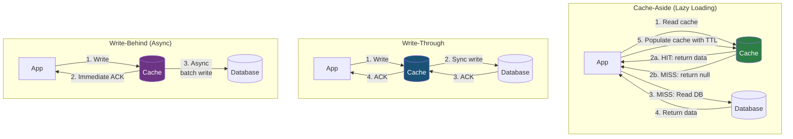
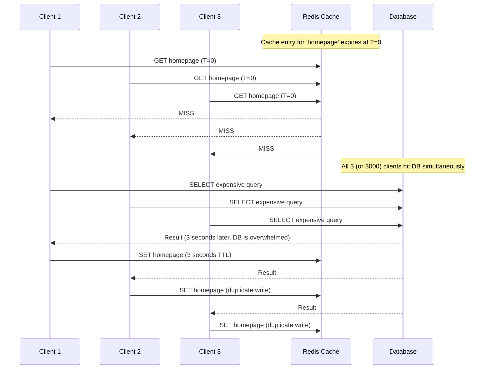

# AWS ElastiCache Redis: Caching Patterns, Cluster Modes, and Thundering Herd

## 🗺️ Quick Overview



*Cache-Aside is the default pattern; protect cache expiry with probabilistic refresh to prevent thundering herd.*

## Question

**"When would you use ElastiCache vs a database? What patterns benefit most from caching?"**

Common in: AWS Solutions Architect, FAANG backend, system design scalability interviews

---

## Quick Answer (30-second version)

- **ElastiCache** = Managed Redis or Memcached on AWS. In-memory, sub-millisecond latency. Reduces database load by serving frequently-read data from memory.
- **Cache-aside** (lazy loading) is the most common pattern. Read from cache first; on miss, read DB, populate cache.
- **Write-through** keeps cache consistent with every write but adds write latency.
- **Thundering herd** = when your cache expires, thousands of requests simultaneously hit the DB. Prevention: probabilistic early expiration, mutex locks, cache warming.
- **Redis Cluster Mode Enabled** = horizontal sharding up to 500 nodes across up to 250 shards. Cluster Mode Disabled = up to 5 replicas, single shard, simpler.
- **Redis vs Memcached**: Use Redis for everything unless you specifically need multi-threaded simple caching (Memcached's only real advantage today).

---

## Why This Matters — The Thought Process

Interviewers asking about caching are testing whether you understand the fundamental trade-off: **consistency vs. performance.**

Every caching decision is a bet: "This data doesn't change often enough that serving stale data for N seconds will cause problems." The moment that bet is wrong — user sees their old name after updating, payment processes twice, inventory goes negative — you have a consistency bug.

**The mental model**: Cache = a copy of truth. Every copy introduces divergence risk. Your caching strategy determines how long divergence is acceptable and what happens when divergence occurs.

**Interview framework for any caching question:**
1. What data is being cached? (immutable? time-sensitive? user-specific? global?)
2. What is the acceptable staleness? (10ms? 10 seconds? 10 minutes?)
3. What breaks if cache is wrong? (cosmetic or transactional?)
4. What's the cache invalidation strategy? (TTL? explicit? event-driven?)
5. What happens on cache failure? (fallback to DB? return error?)

---

## Architecture: Redis Cluster Mode Enabled



**Redis Cluster slots**: Redis divides key space into 16,384 hash slots. Each shard owns a contiguous range of slots. The client computes `CRC16(key) % 16384` to determine which shard handles the key.

---

## Cluster Mode Disabled vs Enabled

| Dimension | Cluster Mode Disabled | Cluster Mode Enabled |
|-----------|----------------------|---------------------|
| **Shards** | 1 (single shard) | Up to 250 shards |
| **Read Replicas** | Up to 5 per shard | Up to 5 per shard × 250 shards = 1250 total |
| **Max nodes** | 6 (1 primary + 5 replicas) | 500 nodes |
| **Max memory** | Limited to single node | Horizontal scale — near unlimited |
| **Multi-key operations** | Yes (all keys on same shard) | Only within same slot |
| **Failover** | Automatic (Multi-AZ) | Automatic per shard |
| **Scaling** | Vertical only | Horizontal + vertical |
| **Use case** | Most applications, simpler setup | Very large datasets, high write throughput |

**Interview insight**: Cluster Mode Disabled is the right choice for 95% of applications. You can have Multi-AZ (primary + replica in different AZs) + auto-failover with Cluster Mode Disabled. Only choose Cluster Mode Enabled when your dataset exceeds a single node's memory capacity or you need horizontal write scaling.

**The catch with Cluster Mode Enabled**: Multi-key operations like `MGET`, `MSET`, `SUNIONSTORE` only work if all keys hash to the same slot. Transactions (`MULTI/EXEC`) also must be single-shard. You use hash tags `{user:123}:session` to force keys to the same slot when needed.

---

## Cache Patterns: Architecture and Trade-offs



### Pattern Comparison

| Pattern | Reads | Writes | Staleness | Complexity | Best For |
|---------|-------|--------|-----------|------------|----------|
| **Cache-Aside** | Cache first, DB on miss | DB directly (cache not updated) | Until TTL expires | Low | Most applications, read-heavy |
| **Write-Through** | Always in cache | Cache + DB synchronously | None (consistent) | Medium | Consistent reads, write-tolerant latency |
| **Write-Behind** | Always in cache | Cache immediately, DB async | DB may lag | High | Write-heavy, can tolerate eventual consistency |
| **Read-Through** | Cache fetches from DB automatically | DB directly | Until TTL | Medium | Transparent cache layer |

**The nuance**: Cache-aside + Write-through together is a common production pattern. Write-through keeps the cache warm on writes, cache-aside handles the case where items were evicted.

---

## Cache Invalidation Strategies

**Phil Karlton's famous quote**: "There are only two hard things in Computer Science: cache invalidation and naming things."

**Why it's hard**: Cache and database must agree on what's current. Any update creates a window of inconsistency.

```
Strategy 1: TTL-Based Expiration
  Pro: Simple, no coordination needed
  Con: Stale data until TTL expires
  Use when: Data staleness is acceptable (prices, product descriptions, user profiles)
  Example: cache.set('user:123', userData, { EX: 300 })  // 5 minute TTL

Strategy 2: Explicit Invalidation on Write
  Pro: Cache is immediately consistent after writes
  Con: Cache-DB operation is not atomic — race conditions possible
  Race condition: Read gets stale data between DB write and cache delete
  Use when: Strong consistency matters (user account data, inventory)
  Example: update DB → delete cache key

Strategy 3: Event-Driven Invalidation
  Pro: Decoupled, cache invalidated asynchronously
  Con: Small inconsistency window during event propagation
  Use when: Multiple services share a cache, microservices architecture
  Pattern: Service A writes to DB → publishes event → Service B's cache consumer deletes key

Strategy 4: Versioned Keys
  Pro: No cache invalidation race conditions at all
  Con: Old keys accumulate (memory waste), need TTL anyway
  Use when: Immutable objects, CDN-style caching
  Example: cache key includes version: 'user:123:v42' → new version → 'user:123:v43'
```

---

## The Thundering Herd Problem



**The thundering herd is most dangerous when:**
- High-traffic endpoint (homepage, trending content)
- Expensive DB query (complex join, aggregation)
- Many concurrent users (Black Friday, viral post)
- Short TTL (cache expires frequently)

### Solution 1: Mutex Lock (Cache Stampede Prevention)

```javascript
// mutex-cache.js
// Only one process fetches from DB on cache miss — others wait or get stale data

const redis = require('ioredis');
const client = new redis(process.env.REDIS_URL);

const LOCK_TTL = 10;      // Lock expires in 10 seconds (safety valve)
const LOCK_WAIT = 100;    // Wait 100ms between lock retry attempts
const MAX_WAIT = 3000;    // Give up after 3 seconds

async function getWithMutex(cacheKey, fetchFn, ttl = 300) {
  // Try to get from cache first
  const cached = await client.get(cacheKey);
  if (cached !== null) {
    return JSON.parse(cached);
  }

  const lockKey = `lock:${cacheKey}`;
  const lockValue = `${process.pid}-${Date.now()}`;  // unique lock owner

  // Try to acquire lock atomically (NX = only set if not exists)
  const acquired = await client.set(lockKey, lockValue, 'NX', 'EX', LOCK_TTL);

  if (acquired === 'OK') {
    // We got the lock — we're responsible for fetching
    try {
      const data = await fetchFn();
      await client.setex(cacheKey, ttl, JSON.stringify(data));
      return data;
    } finally {
      // Release lock — but only if it's still ours (Lua for atomicity)
      const releaseLua = `
        if redis.call("get", KEYS[1]) == ARGV[1] then
          return redis.call("del", KEYS[1])
        else
          return 0
        end
      `;
      await client.eval(releaseLua, 1, lockKey, lockValue);
    }
  } else {
    // Another process has the lock — wait and retry
    let waited = 0;

    while (waited < MAX_WAIT) {
      await sleep(LOCK_WAIT);
      waited += LOCK_WAIT;

      const retryResult = await client.get(cacheKey);
      if (retryResult !== null) {
        return JSON.parse(retryResult);
      }
    }

    // Lock holder may have crashed — fall through to DB
    console.warn(`Lock wait timeout for ${cacheKey} — falling back to DB`);
    return fetchFn();
  }
}

const sleep = (ms) => new Promise(resolve => setTimeout(resolve, ms));

// Usage
async function getHomepageData() {
  return getWithMutex('homepage:v1', async () => {
    // This expensive query only runs once, even with 10,000 concurrent requests
    return db.query('SELECT ... FROM posts JOIN users JOIN analytics ORDER BY score LIMIT 50');
  }, 300);
}
```

### Solution 2: Probabilistic Early Expiration

```javascript
// probabilistic-expiration.js
// XFetch algorithm: Proactively refresh cache BEFORE it expires
// Prevents thundering herd by having ONE process refresh early

async function getWithEarlyExpiration(key, fetchFn, ttl = 300, beta = 1) {
  // Cache stores: { value, delta (fetch time), expiry }
  const raw = await client.get(key);

  if (raw !== null) {
    const { value, delta, expiry } = JSON.parse(raw);
    const now = Date.now() / 1000;   // Unix seconds

    // XFetch formula: should we refresh early?
    // Probability increases as expiry approaches
    // Higher beta = refresh earlier (more aggressive)
    const shouldRefreshEarly = now - delta * beta * Math.log(Math.random()) >= expiry;

    if (!shouldRefreshEarly) {
      return value;
    }
    // else: fall through to refresh (one lucky process wins the race)
  }

  // Cache miss or early refresh triggered
  const startTime = Date.now();
  const data = await fetchFn();
  const delta = (Date.now() - startTime) / 1000;   // fetch duration in seconds
  const expiry = Date.now() / 1000 + ttl;

  await client.setex(key, ttl + 5, JSON.stringify({ value: data, delta, expiry }));

  return data;
}

// The math: if fetching takes 2 seconds and TTL is 5 minutes (300s),
// the first request after T=297s has a high probability of triggering early refresh.
// This means ONE process refreshes before expiry, while others keep serving stale (still valid).
```

### Solution 3: Cache Warming

```javascript
// cache-warming.js
// Pre-populate cache before items expire — scheduled job

async function warmPopularContent() {
  console.log('Starting cache warming...');

  // Get list of popular items that will expire soon
  const popularItems = await db.query(`
    SELECT id, entity_type
    FROM popular_content
    WHERE cache_expires_at < NOW() + INTERVAL '1 minute'
    ORDER BY request_count DESC
    LIMIT 1000
  `);

  // Refresh them before they expire
  await Promise.all(popularItems.map(async (item) => {
    try {
      const data = await fetchContentById(item.id, item.entity_type);
      await client.setex(`content:${item.id}`, 300, JSON.stringify(data));
    } catch (err) {
      console.error(`Failed to warm cache for ${item.id}:`, err.message);
    }
  }));

  console.log(`Warmed ${popularItems.length} cache entries`);
}

// Run via EventBridge every 30 seconds
// Or run in the background thread of your application
```

---

## Redis vs Memcached Decision Matrix

| Feature | Redis | Memcached |
|---------|-------|-----------|
| **Data Structures** | Strings, Lists, Sets, Sorted Sets, Hashes, Streams, HyperLogLog | Strings only |
| **Persistence** | Yes (RDB snapshots, AOF log) | No |
| **Pub/Sub** | Yes | No |
| **Lua Scripting** | Yes | No |
| **Transactions** | Yes (MULTI/EXEC) | No |
| **Geospatial** | Yes (GEOADD, GEODIST) | No |
| **Replication** | Yes | No |
| **Multi-threaded** | No (single-threaded command processing) | Yes |
| **Max item size** | 512MB | 1MB |

**When to choose Memcached:**
- You only need a simple cache (no persistence, no data structures beyond strings)
- You need multi-threaded performance to fully utilize large multi-core servers
- Your team explicitly wants no persistence (simpler ops)

**Real answer in interviews**: Choose Redis unless you have a specific reason not to. Redis is a superset of Memcached's features. The multi-threading argument only matters at extreme scales with very large node sizes.

---

## Cache-Aside Pattern: Production Implementation

```javascript
// cache-aside.js
// The most common and recommended caching pattern

const redis = require('ioredis');
const { Pool } = require('pg');

const cache = new redis({
  host: process.env.ELASTICACHE_ENDPOINT,
  port: 6379,
  tls: {},           // ElastiCache requires TLS in transit
  maxRetriesPerRequest: 3,
  retryDelayOnFailover: 100
});

const db = new Pool({ connectionString: process.env.DATABASE_URL });

class CacheAsideRepository {
  constructor(cacheTTLSeconds = 300) {
    this.ttl = cacheTTLSeconds;
  }

  async getUserById(userId) {
    const cacheKey = `user:${userId}`;

    // 1. Try cache first
    try {
      const cached = await cache.get(cacheKey);
      if (cached !== null) {
        return JSON.parse(cached);     // Cache HIT
      }
    } catch (cacheErr) {
      // Cache unavailable — fall through to DB (degraded mode)
      console.warn('Cache read failed, falling back to DB:', cacheErr.message);
    }

    // 2. Cache MISS — read from DB
    const { rows } = await db.query(
      'SELECT id, username, email, avatar_url, created_at FROM users WHERE id = $1',
      [userId]
    );

    const user = rows[0] || null;

    // 3. Populate cache (fire-and-forget, don't block response)
    if (user !== null) {
      cache.setex(cacheKey, this.ttl, JSON.stringify(user)).catch(err => {
        console.warn('Cache write failed:', err.message);
      });
    }

    return user;
  }

  async updateUser(userId, updates) {
    // 1. Write to DB first (source of truth)
    const { rows } = await db.query(
      'UPDATE users SET username = $2, email = $3, updated_at = NOW() WHERE id = $1 RETURNING *',
      [userId, updates.username, updates.email]
    );

    const updatedUser = rows[0];

    // 2. Invalidate cache (delete, not update — avoids race conditions)
    // Next read will populate cache from DB with fresh data
    await cache.del(`user:${userId}`);

    return updatedUser;
  }

  // Batch get — reduces round trips for lists
  async getUsersBatch(userIds) {
    if (userIds.length === 0) return [];

    const cacheKeys = userIds.map(id => `user:${id}`);

    // MGET fetches all keys in one Redis command
    const cachedValues = await cache.mget(...cacheKeys);

    const result = [];
    const missingIds = [];

    cachedValues.forEach((value, index) => {
      if (value !== null) {
        result.push({ index, user: JSON.parse(value) });
      } else {
        missingIds.push({ index, id: userIds[index] });
      }
    });

    // Fetch missing from DB
    if (missingIds.length > 0) {
      const { rows } = await db.query(
        'SELECT * FROM users WHERE id = ANY($1)',
        [missingIds.map(m => m.id)]
      );

      const dbUsers = new Map(rows.map(u => [u.id, u]));

      // Populate cache for each miss
      const pipeline = cache.pipeline();

      missingIds.forEach(({ index, id }) => {
        const user = dbUsers.get(id) || null;
        result.push({ index, user });
        if (user) {
          pipeline.setex(`user:${id}`, this.ttl, JSON.stringify(user));
        }
      });

      await pipeline.exec();  // Execute all cache writes in one batch
    }

    // Restore original order
    return result.sort((a, b) => a.index - b.index).map(r => r.user);
  }
}
```

---

## Rate Limiting with Redis

```javascript
// rate-limiting.js
// Fixed window rate limiter — classic Redis interview pattern

async function checkRateLimit(userId, limitPerMinute = 100) {
  const key = `ratelimit:${userId}:${Math.floor(Date.now() / 60000)}`;
  // Key changes every minute — creates a fixed 1-minute window

  // INCR is atomic — safe for concurrent requests
  const current = await client.incr(key);

  if (current === 1) {
    // First request in this window — set TTL so key auto-expires
    await client.expire(key, 60);
  }

  return {
    allowed: current <= limitPerMinute,
    current,
    limit: limitPerMinute,
    resetAt: (Math.floor(Date.now() / 60000) + 1) * 60000   // next minute
  };
}

// Sliding window rate limiter (more accurate, uses sorted sets)
async function checkSlidingRateLimit(userId, limitPerWindow = 100, windowSeconds = 60) {
  const key = `ratelimit:sliding:${userId}`;
  const now = Date.now();
  const windowStart = now - windowSeconds * 1000;

  // Use Redis pipeline for atomicity
  const pipeline = client.pipeline();

  // Remove requests outside the window
  pipeline.zremrangebyscore(key, '-inf', windowStart);
  // Add current request with timestamp as score
  pipeline.zadd(key, now, `${now}-${Math.random()}`);
  // Count requests in window
  pipeline.zcard(key);
  // Reset TTL
  pipeline.expire(key, windowSeconds);

  const results = await pipeline.exec();
  const requestCount = results[2][1];  // zcard result

  return {
    allowed: requestCount <= limitPerWindow,
    current: requestCount,
    limit: limitPerWindow
  };
}

// Express middleware
function rateLimitMiddleware(req, res, next) {
  const userId = req.user?.id || req.ip;

  checkRateLimit(userId).then(({ allowed, current, limit, resetAt }) => {
    res.setHeader('X-RateLimit-Limit', limit);
    res.setHeader('X-RateLimit-Remaining', Math.max(0, limit - current));
    res.setHeader('X-RateLimit-Reset', resetAt);

    if (!allowed) {
      return res.status(429).json({
        error: 'Too Many Requests',
        retryAfter: Math.ceil((resetAt - Date.now()) / 1000)
      });
    }

    next();
  }).catch(err => {
    // If Redis is down, fail open (allow request) — availability > rate limiting
    console.error('Rate limit check failed:', err.message);
    next();
  });
}
```

---

## Distributed Lock Implementation

```javascript
// distributed-lock.js
// Preventing thundering herd with Redis-based distributed lock
// Implements Redlock algorithm (simplified single-node version)

class DistributedLock {
  constructor(redisClient) {
    this.redis = redisClient;
  }

  async acquire(resource, ttlMs = 5000) {
    const lockKey = `lock:${resource}`;
    const lockValue = `${process.pid}:${Date.now()}:${Math.random()}`;

    // SET NX PX = set if not exists, with millisecond expiry
    const result = await this.redis.set(lockKey, lockValue, 'NX', 'PX', ttlMs);

    if (result === 'OK') {
      return { acquired: true, lockKey, lockValue };
    }

    return { acquired: false, lockKey, lockValue: null };
  }

  async release(lockKey, lockValue) {
    // Lua script ensures atomicity: check owner then delete
    // Without Lua, another process could acquire lock between GET and DEL
    const script = `
      if redis.call("get", KEYS[1]) == ARGV[1] then
        return redis.call("del", KEYS[1])
      else
        return 0
      end
    `;

    const deleted = await this.redis.eval(script, 1, lockKey, lockValue);
    return deleted === 1;
  }

  // withLock: acquire, run callback, release — with retry logic
  async withLock(resource, callback, options = {}) {
    const { ttlMs = 5000, retryMs = 50, maxRetries = 20 } = options;

    for (let attempt = 0; attempt <= maxRetries; attempt++) {
      const lock = await this.acquire(resource, ttlMs);

      if (lock.acquired) {
        try {
          return await callback();
        } finally {
          await this.release(lock.lockKey, lock.lockValue);
        }
      }

      if (attempt < maxRetries) {
        // Exponential backoff with jitter
        const waitMs = retryMs * Math.pow(2, attempt) * (0.5 + Math.random() * 0.5);
        await new Promise(resolve => setTimeout(resolve, Math.min(waitMs, 500)));
      }
    }

    throw new Error(`Failed to acquire lock for ${resource} after ${maxRetries} attempts`);
  }
}

const lock = new DistributedLock(client);

// Use case: Only one Lambda processes a specific user's webhook at a time
async function processWebhook(userId, webhookData) {
  await lock.withLock(`webhook:${userId}`, async () => {
    // Only one process executes this block at a time per userId
    const existing = await db.query(
      'SELECT id FROM webhook_events WHERE idempotency_key = $1',
      [webhookData.id]
    );

    if (existing.rows.length > 0) {
      console.log('Webhook already processed:', webhookData.id);
      return;
    }

    await db.query(
      'INSERT INTO webhook_events (idempotency_key, payload, processed_at) VALUES ($1, $2, NOW())',
      [webhookData.id, webhookData]
    );

    await processPayment(webhookData);
  }, { ttlMs: 10000, maxRetries: 5 });
}
```

---

## Session Storage Pattern

```javascript
// session-storage.js
// Centralized session storage enables horizontal scaling
// Without this, sticky sessions are required (limits scaling options)

const SESSION_TTL = 3600;  // 1 hour

class SessionStore {
  async create(userId, sessionData = {}) {
    const sessionId = require('crypto').randomUUID();
    const session = {
      id: sessionId,
      userId,
      createdAt: Date.now(),
      ...sessionData
    };

    await client.setex(
      `session:${sessionId}`,
      SESSION_TTL,
      JSON.stringify(session)
    );

    return sessionId;
  }

  async get(sessionId) {
    const raw = await client.get(`session:${sessionId}`);
    if (!raw) return null;

    const session = JSON.parse(raw);

    // Sliding expiration: reset TTL on activity
    await client.expire(`session:${sessionId}`, SESSION_TTL);

    return session;
  }

  async destroy(sessionId) {
    await client.del(`session:${sessionId}`);
  }

  async destroyAllForUser(userId) {
    // Requires a secondary index: set of session IDs per user
    const userSessionsKey = `user-sessions:${userId}`;
    const sessionIds = await client.smembers(userSessionsKey);

    if (sessionIds.length > 0) {
      const pipeline = client.pipeline();
      sessionIds.forEach(id => pipeline.del(`session:${id}`));
      pipeline.del(userSessionsKey);
      await pipeline.exec();
    }
  }
}

// Express session middleware using Redis
const session = require('express-session');
const RedisStore = require('connect-redis').default;

app.use(session({
  store: new RedisStore({ client }),
  secret: process.env.SESSION_SECRET,
  name: 'sid',
  resave: false,
  saveUninitialized: false,
  cookie: {
    secure: true,         // HTTPS only
    httpOnly: true,       // No JS access
    maxAge: 3600000       // 1 hour
  }
}));
```

---

## ElastiCache Security and Encryption

```
Encryption at Rest:
  - Uses AWS KMS (Key Management Service)
  - CMK (Customer Managed Key) or AWS managed key
  - Encrypts data, backups, and snapshots
  - Enabled at cluster creation (cannot change after)

Encryption in Transit:
  - TLS 1.2+ between clients and ElastiCache
  - TLS between nodes in the cluster
  - Requires Redis 6.x+ for AUTH with TLS

AUTH Token (Redis AUTH):
  - Password protection for Redis
  - Set at cluster creation
  - Rotate via AWS Console or API
  - Length: 16-128 characters

IAM Authentication (Redis 7+):
  - No password needed — uses IAM roles
  - More secure than static passwords
  - Works with Lambda, ECS, EC2 instance profiles

VPC Security:
  - ElastiCache runs in VPC — no public endpoint
  - Security groups control which EC2/Lambda can connect
  - Use VPC endpoints for Lambda in same VPC
```

---

## Real-World Scenario: Twitter's Timeline Caching Architecture

**The scale problem**: Twitter has ~200M daily active users. When someone with 50M followers tweets, 50M timelines need to be updated. If you compute this on read (every user loads timeline), the computation is O(followers) per read — at Twitter's scale, this is impossible.

**Their solution: Fan-out on write with Redis caching**

```
Write Path (tweet created):
  1. User tweets
  2. Tweet stored in Cassandra (persistent storage)
  3. Fan-out service reads user's follower list
  4. For each follower (up to ~50M for celebrities):
     Redis LPUSH timeline:{follower_id} {tweet_id}
  5. LTRIM to keep only last 800 tweet IDs per timeline
  6. Timeline is pre-computed and cached

Read Path (user loads timeline):
  1. LRANGE timeline:{user_id} 0 799 → get 800 tweet IDs
  2. Batch GET tweet details for those IDs
  3. Render timeline — no expensive computation

Special case: Celebrity accounts (>1M followers)
  - Full fan-out to 50M Redis entries is too slow (takes minutes)
  - "Hybrid approach": Only fan-out to active users' timelines
  - On read: merge cached timeline with recent celebrity tweets
  - ~95% of followers see pre-computed timeline
  - ~5% (active users) get real-time merge on read
```

**What this teaches about caching architecture:**
- Pre-computation (write-time) can be better than lazy computation (read-time) at extreme scale.
- Not all users are equal — different strategies for power users vs regular users.
- Redis sorted sets and lists are first-class data structures, not just key-value.
- Cache eviction (LTRIM) is essential — you can't cache infinite history.

---

## Common Interview Follow-ups

**Q: "Cache invalidation race condition — two servers write to DB simultaneously. How do you handle it?"**
A: "The delete-then-write race condition: Server A deletes cache → Server B reads DB (stale) → Server B writes stale data to cache → Server A writes new data to DB. Cache now has stale data indefinitely. Solutions: 1) Use versioned cache keys — new write uses new key, old key naturally expires. 2) Use Redis transactions with WATCH (optimistic locking). 3) Use an event-driven approach where the DB triggers cache invalidation via CDC. 4) For critical data, write-through pattern (cache + DB in same operation) with distributed lock."

**Q: "Redis is single-threaded. How does it handle high throughput?"**
A: "Redis processes commands in a single thread, but it's not I/O bound — it's memory bound. Reads and writes are microseconds. The single thread eliminates lock contention overhead. For throughput, Redis pipelines batch multiple commands, and the event loop handles thousands of connections concurrently via I/O multiplexing (epoll/kqueue). Redis 6.0 added multi-threaded I/O (for reading/writing network data), but command processing remains single-threaded for simplicity. For true horizontal throughput scaling, use Cluster Mode Enabled."

**Q: "Your ElastiCache node memory is full. What happens and what do you do?"**
A: "When memory is full, the eviction policy determines what happens: `noeviction` returns errors on writes (bad for caches), `allkeys-lru` evicts least recently used keys (good default for caches), `volatile-lru` only evicts keys with TTL set. For production caches, use `allkeys-lru`. If you're consistently at max memory, either: increase node size, add more shards (Cluster Mode Enabled), reduce TTLs, or audit what you're caching — you may be caching too aggressively."

**Q: "What's the difference between replication group and cache cluster?"**
A: "These are older ElastiCache terms. A cache cluster is a single Redis or Memcached node. A replication group is a collection of Redis clusters — one primary + up to 5 read replicas. With Cluster Mode Enabled, a replication group contains multiple shards, each with its own primary and replicas. Modern ElastiCache uses 'cluster' to mean the entire system. On the exam, replication group = the HA setup with primary + replicas."

---

## AWS Certification Exam Tips

**Most tested ElastiCache concepts on AWS SAA/SAP:**

1. **Redis is single-threaded. Memcached is multi-threaded.** This is the classic differentiator exam questions use.

2. **Redis supports persistence (RDB/AOF). Memcached has no persistence.** If the question mentions "survive node restart", choose Redis.

3. **Replication group = primary + replicas. Cache cluster = single node.**
   For HA: create a replication group (not just a cache cluster) and enable Multi-AZ.

4. **ElastiCache for sessions** = standard pattern for horizontal scaling. Stateless EC2 instances + centralized Redis session store.

5. **Cache-aside (lazy loading)** vs Write-through: lazy = possible stale data on miss, write-through = consistent but slow writes.

6. **TTL is the simplest cache invalidation.** Explicit invalidation is more consistent but has race conditions.

7. **ElastiCache is in-VPC only** — no public endpoint. Lambda must be in the same VPC to access ElastiCache.

8. **Cluster Mode Enabled requires cluster-aware Redis client** — standard Redis clients don't work. Use `ioredis` or `redis` npm packages (both support cluster mode).

9. **Redis AUTH token** = password for Redis. Set at cluster creation, can be rotated.

10. **DAX (DynamoDB Accelerator) is NOT ElastiCache.** DAX is a separate service, DynamoDB-specific. ElastiCache is generic Redis/Memcached. Don't confuse them on the exam.

---

## Key Takeaways

- ElastiCache reduces database load by serving reads from memory — the trade-off is consistency vs performance. Choose your cache strategy based on acceptable staleness.
- Cache-aside is the most common pattern: read cache, on miss read DB and populate cache with TTL.
- Thundering herd is the most dangerous cache failure mode — prevent it with mutex locks, probabilistic early expiration, or cache warming.
- Redis Cluster Mode Disabled is right for most applications. Only enable Cluster Mode when your dataset exceeds single-node memory.
- Cache invalidation is hard: TTL is simple but allows staleness; explicit invalidation is consistent but has race conditions; event-driven is decoupled but has propagation lag.

---

## Related Questions

- [RDS Databases](/12-interview-prep/quick-reference/aws-cloud/rds-databases)
- [DynamoDB NoSQL](/12-interview-prep/quick-reference/aws-cloud/dynamodb-nosql)
- [Lambda Serverless](/12-interview-prep/quick-reference/aws-cloud/lambda-serverless)
- [Auto-Scaling Groups](/12-interview-prep/quick-reference/aws-cloud/auto-scaling)
