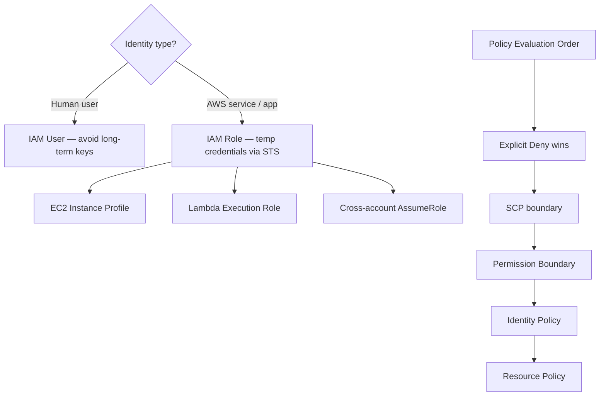
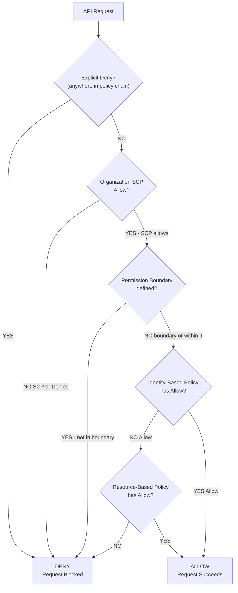
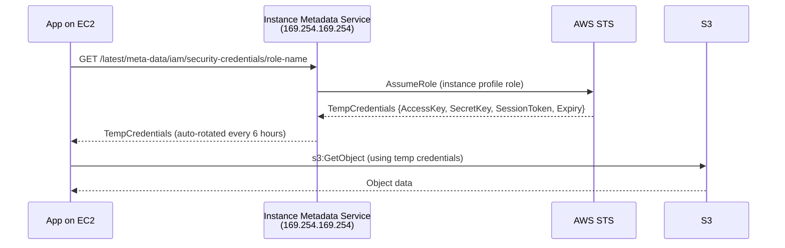
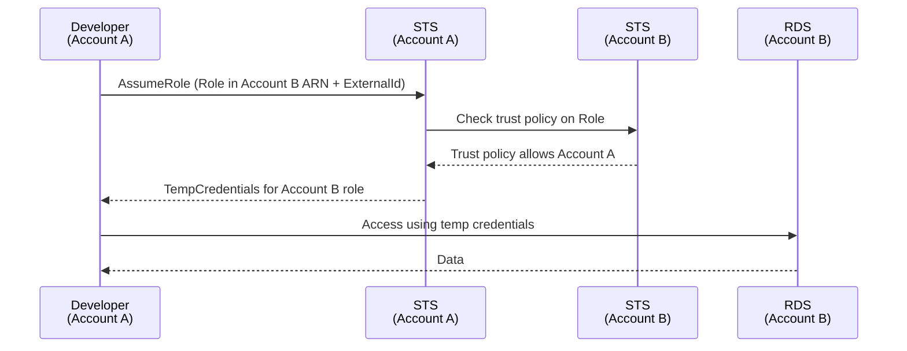
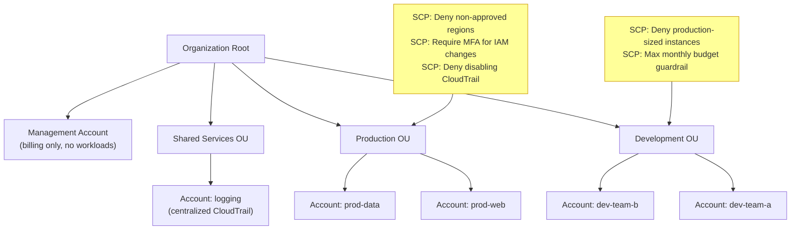

# AWS IAM: Roles, Policies, and Multi-Account Security

## 🗺️ Quick Overview



*Always prefer IAM Roles over IAM Users for machines. Explicit Deny always wins in policy evaluation.*

> **Common Interview Question**: "What's the difference between an IAM Role and an IAM User? How does an EC2 instance get permissions to access S3 without storing credentials? Explain IAM policy evaluation — what happens when there's an explicit Deny vs no Allow?"

Common in: AWS Solutions Architect, Security Engineering, Senior Backend, Platform/DevOps interviews

---

## Quick Answer (30-second version)

- **IAM User** = Long-term identity for a person or application. Has permanent credentials (access keys). Avoid where possible.
- **IAM Role** = Temporary identity assumed by a service, user, or application. No permanent credentials. Always prefer over IAM Users for machines.
- **EC2 + Instance Profile** = Attach a role to EC2. The instance calls STS, gets temporary credentials, accesses AWS services. No keys stored anywhere.
- **Policy evaluation order**: Explicit Deny always wins → SCPs (Organizations) → Permission Boundaries → Identity policies → Resource policies
- **Resource-based policy** = Attached to the resource (S3 bucket policy). Can grant cross-account access without role assumption.
- **STS AssumeRole** = Cross-account access mechanism. Use External ID to prevent confused deputy attacks.
- **SCP** = Service Control Policy. Sets the maximum permissions boundary for an entire AWS account — even admins can't exceed it.

---

## Why This Matters / The Thought Process

IAM is the most-asked AWS security topic in interviews. It's also the most commonly misconfigured service — leading to data breaches, privilege escalation, and compliance failures.

When an interviewer asks about IAM, they're testing:
- Do you know why hardcoded credentials are dangerous? (Rotation, leakage, auditability)
- Can you design a least-privilege model without breaking functionality?
- Do you understand the difference between "no permission" and "explicit deny"?
- Can you architect multi-account security with Organizations and SCPs?

The key mental model: **IAM is a decision engine that evaluates whether a principal (who) can perform an action (what) on a resource (where) under certain conditions (when/how).**

---

## IAM Policy Evaluation Logic

This is the #1 exam and interview trap. The evaluation happens in this exact order:



**The critical rules:**
1. **Explicit Deny always wins** — even if another policy grants access, a single explicit Deny blocks it.
2. **Default is Deny** — no policy = no access. You must explicitly grant.
3. **SCPs don't grant permissions** — they only restrict. You still need identity policies.
4. **Permission Boundaries limit, not grant** — an EC2 can only do what both the boundary AND the identity policy allow.

### Concrete Example: Why "No Allow" is Different from "Explicit Deny"

```json
// Scenario: Can Alice delete objects from S3 bucket "production-data"?

// Alice's IAM Policy:
{
  "Effect": "Allow",
  "Action": "s3:*",
  "Resource": "arn:aws:s3:::production-data/*"
}

// S3 Bucket Policy (resource-based):
{
  "Effect": "Deny",
  "Principal": {"AWS": "arn:aws:iam::123456789:user/alice"},
  "Action": "s3:DeleteObject",
  "Resource": "arn:aws:s3:::production-data/*"
}

// Result: DENY — the explicit Deny in bucket policy overrides Alice's Allow
// Even though Alice's IAM policy says "s3:*", the explicit Deny wins
```

---

## EC2 Instance Profile: How Machines Get Permissions

This is the "no credentials stored" pattern every interviewer wants to see:



**Why this is secure:**
- Credentials are temporary (expire in 6 hours, auto-rotated)
- Credentials never stored in code, environment variables, or config files
- If the instance is compromised, credentials expire soon
- All API calls are logged in CloudTrail with the role identity

**How to create an instance profile in code:**

```javascript
// AWS CDK (Node.js) — EC2 with least-privilege S3 access
const { Stack } = require('aws-cdk-lib');
const { Role, ServicePrincipal, PolicyStatement, Effect } = require('aws-cdk-lib/aws-iam');
const { Instance, InstanceType, MachineImage } = require('aws-cdk-lib/aws-ec2');

class AppStack extends Stack {
  constructor(scope, id, props) {
    super(scope, id, props);

    // Step 1: Create role with EC2 as trusted principal
    const appRole = new Role(this, 'AppServerRole', {
      assumedBy: new ServicePrincipal('ec2.amazonaws.com'),
      description: 'Role for app servers — least privilege S3 access',
      roleName: 'production-app-server-role',
    });

    // Step 2: Grant ONLY what's needed (not s3:* !)
    appRole.addToPolicy(new PolicyStatement({
      effect: Effect.ALLOW,
      actions: [
        's3:GetObject',      // Read objects
        's3:PutObject',      // Write objects
        // NOT s3:DeleteObject, s3:CreateBucket, etc.
      ],
      resources: [
        'arn:aws:s3:::my-app-bucket',         // Bucket itself (for ListBucket)
        'arn:aws:s3:::my-app-bucket/uploads/*' // Only the uploads prefix
      ],
    }));

    // Also allow writing to CloudWatch Logs
    appRole.addToPolicy(new PolicyStatement({
      effect: Effect.ALLOW,
      actions: ['logs:CreateLogGroup', 'logs:CreateLogStream', 'logs:PutLogEvents'],
      resources: ['arn:aws:logs:*:*:log-group:/app/*'],
    }));

    // Step 3: Attach role to EC2 instance (creates instance profile automatically)
    const instance = new Instance(this, 'AppServer', {
      vpc,
      instanceType: new InstanceType('t3.medium'),
      machineImage: MachineImage.latestAmazonLinux2(),
      role: appRole,  // This line attaches the instance profile
    });
  }
}
```

---

## Resource-Based vs Identity-Based Policies

Understanding when to use each is a key differentiator.

| | Identity-Based Policy | Resource-Based Policy |
|--|----------------------|----------------------|
| **Attached to** | IAM User, Group, or Role | AWS Resource (S3, SQS, KMS, etc.) |
| **Controls** | What this principal CAN do | Who can access this resource |
| **Cross-account** | Requires role assumption | Can grant directly without role |
| **Services** | All IAM entities | S3, SQS, SNS, KMS, Lambda, etc. |
| **Principal field** | Not present | Required (who gets access) |

### When to Use S3 Bucket Policy vs IAM Policy:

```json
// USE S3 Bucket Policy when:
// 1. Granting access to another AWS account
// 2. Making bucket public (CloudFront origin)
// 3. Enforcing encryption on all uploads

// Enforce HTTPS-only access (bucket policy):
{
  "Effect": "Deny",
  "Principal": "*",
  "Action": "s3:*",
  "Resource": ["arn:aws:s3:::my-bucket", "arn:aws:s3:::my-bucket/*"],
  "Condition": {
    "Bool": {"aws:SecureTransport": "false"}
  }
}

// Cross-account access WITHOUT role assumption (S3 bucket policy):
{
  "Effect": "Allow",
  "Principal": {"AWS": "arn:aws:iam::ACCOUNT-B:root"},
  "Action": ["s3:GetObject"],
  "Resource": "arn:aws:s3:::my-bucket/*"
}
```

---

## Cross-Account Role Assumption

The standard pattern for cross-account access. Accounts are called "trusting" (has the resource) and "trusted" (has the user).



### The Confused Deputy Problem & External ID

**Problem**: If you give Company X access to assume a role in your account by their AWS account ID, a malicious customer of Company X could trick Company X's service into accessing YOUR resources.

**Solution**: Require an External ID — a secret shared between you and Company X, specified in the trust policy.

```json
// Trust policy on the role in YOUR account (trusting account):
{
  "Version": "2012-10-17",
  "Statement": [{
    "Effect": "Allow",
    "Principal": {
      "AWS": "arn:aws:iam::PARTNER-ACCOUNT-ID:root"
    },
    "Action": "sts:AssumeRole",
    "Condition": {
      "StringEquals": {
        "sts:ExternalId": "unique-secret-abc123"  // Only they know this
      }
    }
  }]
}
```

### Code: STS AssumeRole for Cross-Account Access

```javascript
// cross-account-access.js
const { STSClient, AssumeRoleCommand } = require('@aws-sdk/client-sts');
const { S3Client, GetObjectCommand } = require('@aws-sdk/client-s3');

async function accessCrossAccountResource() {
  const stsClient = new STSClient({ region: 'us-east-1' });

  // Step 1: Assume the role in the target account
  const assumeRoleResponse = await stsClient.send(new AssumeRoleCommand({
    RoleArn: 'arn:aws:iam::TARGET-ACCOUNT-ID:role/DataAccessRole',
    RoleSessionName: `session-${Date.now()}`,  // Appears in CloudTrail
    ExternalId: process.env.EXTERNAL_ID,       // Prevents confused deputy
    DurationSeconds: 3600,                     // 1 hour, max 12 hours
  }));

  const { AccessKeyId, SecretAccessKey, SessionToken } = assumeRoleResponse.Credentials;

  // Step 2: Use temp credentials to access the resource
  const s3Client = new S3Client({
    region: 'us-east-1',
    credentials: {
      accessKeyId: AccessKeyId,
      secretAccessKey: SecretAccessKey,
      sessionToken: SessionToken,  // REQUIRED for temp credentials
    },
  });

  const response = await s3Client.send(new GetObjectCommand({
    Bucket: 'target-account-bucket',
    Key: 'data/report.csv',
  }));

  console.log('Successfully accessed cross-account resource');
  return response.Body;
}

// Best practice: Use credential providers instead of manual refresh
// The AWS SDK handles credential refresh automatically when using roles
```

---

## Lambda: Minimum Permissions for DynamoDB + SQS

This is a common interview scenario. Walk through the reasoning out loud.

```javascript
// CDK: Lambda with least-privilege DynamoDB read + SQS write
const { Function, Runtime, Code } = require('aws-cdk-lib/aws-lambda');
const { PolicyStatement, Effect } = require('aws-cdk-lib/aws-iam');
const { Table } = require('aws-cdk-lib/aws-dynamodb');
const { Queue } = require('aws-cdk-lib/aws-sqs');

const table = Table.fromTableName(this, 'ExistingTable', 'orders-table');
const queue = Queue.fromQueueArn(this, 'ExistingQueue', 'arn:aws:sqs:us-east-1:123:order-events');

const processorLambda = new Function(this, 'OrderProcessor', {
  runtime: Runtime.NODEJS_20_X,
  handler: 'index.handler',
  code: Code.fromAsset('./lambda'),
});

// Grant ONLY what's needed:
// 1. Read from DynamoDB (not write, not scan)
processorLambda.addToRolePolicy(new PolicyStatement({
  effect: Effect.ALLOW,
  actions: [
    'dynamodb:GetItem',
    'dynamodb:Query',
    // NOT: dynamodb:PutItem, dynamodb:DeleteItem, dynamodb:Scan
  ],
  resources: [
    table.tableArn,
    `${table.tableArn}/index/*`,  // Allow querying GSIs
  ],
}));

// 2. Write to SQS (not read, not delete)
processorLambda.addToRolePolicy(new PolicyStatement({
  effect: Effect.ALLOW,
  actions: [
    'sqs:SendMessage',
    // NOT: sqs:ReceiveMessage, sqs:DeleteMessage, sqs:CreateQueue
  ],
  resources: [queue.queueArn],
}));

// 3. Allow CloudWatch Logs (Lambda needs this to log)
// CDK grants this automatically via managed policy when creating Lambda
// AWSLambdaBasicExecutionRole = logs:CreateLogGroup, CreateLogStream, PutLogEvents
```

**Interview talking point**: "I never use wildcards on actions. I list exactly the API calls this function needs. If a Lambda only reads from DynamoDB, it should never have `dynamodb:*` — that grants delete, create, and admin operations."

---

## AWS Organizations + SCPs for Multi-Account Security

Large organizations use multiple AWS accounts for isolation. The pattern:



### SCP Examples:

```json
// SCP 1: Restrict AWS regions (deny everything except approved regions)
{
  "Version": "2012-10-17",
  "Statement": [{
    "Effect": "Deny",
    "Action": "*",
    "Resource": "*",
    "Condition": {
      "StringNotEquals": {
        "aws:RequestedRegion": ["us-east-1", "us-west-2", "eu-west-1"]
      }
    }
  }]
}

// SCP 2: Prevent anyone from disabling CloudTrail (security compliance)
{
  "Version": "2012-10-17",
  "Statement": [{
    "Effect": "Deny",
    "Action": [
      "cloudtrail:DeleteTrail",
      "cloudtrail:StopLogging",
      "cloudtrail:UpdateTrail"
    ],
    "Resource": "*"
  }]
}

// SCP 3: Deny expensive instance types in dev (cost control)
{
  "Version": "2012-10-17",
  "Statement": [{
    "Effect": "Deny",
    "Action": "ec2:RunInstances",
    "Resource": "arn:aws:ec2:*:*:instance/*",
    "Condition": {
      "StringEquals": {
        "ec2:InstanceType": [
          "p3.16xlarge", "p4d.24xlarge",  // GPU instances
          "r5.24xlarge", "x1e.32xlarge"   // High memory
        ]
      }
    }
  }]
}
```

**Critical SCP nuance**: SCPs don't grant permissions. They define the maximum boundary. If an SCP allows `s3:*` but an IAM policy doesn't have any S3 permission — the user still can't access S3.

---

## Decision Framework: IAM Entity Selection

| Scenario | Use | Reason |
|----------|-----|--------|
| Human developer access | IAM User + MFA, or SSO via Identity Center | Long-term identity, enable MFA |
| CI/CD pipeline (GitHub Actions) | OIDC Federation → IAM Role | No long-term keys needed |
| EC2 application | IAM Role via Instance Profile | Auto-rotating temp credentials |
| Lambda function | Execution Role (auto-created) | Function assumes role at runtime |
| Cross-account access | IAM Role with trust policy | Assume from trusted account |
| Third-party SaaS access | IAM Role with External ID | Prevent confused deputy |
| Group-level permissions | IAM Group + Policy | Manage multiple users at once |
| Permission exceptions | Inline Policy | Can't be attached to other entities |
| Reusable permissions | Customer Managed Policy | Version-controlled, reusable |
| AWS-recommended baseline | AWS Managed Policy | Pre-built, kept updated by AWS |

---

## Permission Boundaries — The Advanced Concept

Permission boundaries limit the maximum permissions an IAM entity can have. Used to delegate IAM administration safely.

**Scenario**: You want devs to create roles for their Lambda functions, but you don't want them to create admin roles.

```json
// Permission Boundary: What Lambda roles can do (max allowed)
{
  "Version": "2012-10-17",
  "Statement": [{
    "Effect": "Allow",
    "Action": [
      "dynamodb:GetItem", "dynamodb:PutItem", "dynamodb:Query",
      "s3:GetObject", "s3:PutObject",
      "logs:*",
      "sqs:SendMessage", "sqs:ReceiveMessage"
    ],
    "Resource": "*"
  }]
}

// Developer can create this Lambda execution role:
// (Attached identity policy + boundary applied)
// The Lambda gets: intersection of identity policy AND boundary
// Even if identity policy says "dynamodb:*", boundary limits it to GetItem/PutItem/Query
```

---

## Common Interview Follow-ups

**Q: "What's the difference between AWS Managed, Customer Managed, and Inline policies?"**
- **AWS Managed**: AWS creates/maintains them. Easy, but broad. Example: `AmazonS3ReadOnlyAccess`.
- **Customer Managed**: You create and version them. Best for reusable organizational policies.
- **Inline**: Embedded directly in a single entity. Deleted with the entity. Use for one-off permissions.

**Q: "How do you audit who accessed what in AWS?"**
- **CloudTrail**: Every API call logged with who/what/when/where. Enable in all regions, store to S3.
- **IAM Access Analyzer**: Identifies resources shared outside your account.
- **IAM Credential Report**: All users, their keys, last used, MFA status.

**Q: "Can an S3 bucket policy grant access even if there's no IAM policy?"**
- **Same account**: No. You need both identity policy AND bucket policy (or just identity policy).
- **Cross-account**: Yes. A bucket policy granting access to external account + IAM policy in that account = access.

**Q: "What is the Trust Policy?"**
- JSON document on a Role defining WHO can assume it. Different from permission policy (what can be done).
- Example: EC2 trust policy has `"Principal": {"Service": "ec2.amazonaws.com"}`.

---

## AWS Certification Exam Tips

1. **Role vs User**: Roles are ALWAYS preferred for applications, services, and cross-account. Users for humans.
2. **Explicit Deny wins** — no matter how many allows, one deny blocks it.
3. **SCPs don't grant** — they restrict. Management account is NOT affected by SCPs.
4. **Permission boundary vs SCP**: Boundary limits a specific IAM entity; SCP limits an entire account.
5. **Instance Profile** = the container that holds a Role and attaches to EC2. You create a role, a profile is created automatically (or explicitly).
6. **AssumeRole requires**: 1) Trust policy allowing assumption, 2) Permission to call `sts:AssumeRole`.
7. **Inline vs Managed**: Inline deleted with entity; managed can be shared. Exam favors managed policies for reusability.
8. **Condition keys**: `aws:RequestedRegion`, `aws:MultiFactorAuthPresent`, `aws:PrincipalOrgID` — powerful for access control.
9. **Access Analyzer**: Finds external access to S3, KMS, Lambda, SQS, IAM roles. Free per account.
10. **Resource-based policies support cross-account** without role assumption only for certain services (S3, SQS, KMS, Lambda).

---

## Key Takeaways

- **Always use Roles** for machine identities — instance profiles for EC2, execution roles for Lambda. No long-term keys.
- **Policy evaluation**: Explicit Deny → SCPs → Permission Boundaries → Identity Policies → Resource Policies. Default is Deny.
- **Least privilege** means listing exact API actions, not using wildcards. Build up from zero, don't restrict down from all.
- **External ID** prevents the confused deputy problem in cross-account role assumption.
- **Organizations + SCPs** provide guardrails for multi-account environments — even account admins can't exceed SCP limits.
- **Permission Boundaries** let you safely delegate IAM creation while preventing privilege escalation.

## Related Topics

- [VPC Networking](/12-interview-prep/quick-reference/aws-cloud/vpc-networking)
- [Lambda & Serverless](/12-interview-prep/quick-reference/aws-cloud/lambda-serverless)
- [CloudWatch Monitoring](/12-interview-prep/quick-reference/aws-cloud/cloudwatch-monitoring)
- [S3 TPS Limits](/12-interview-prep/quick-reference/aws-cloud/s3-tps-limits)
