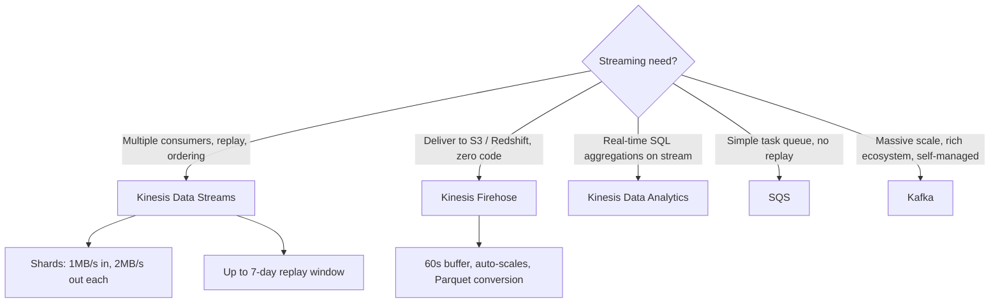
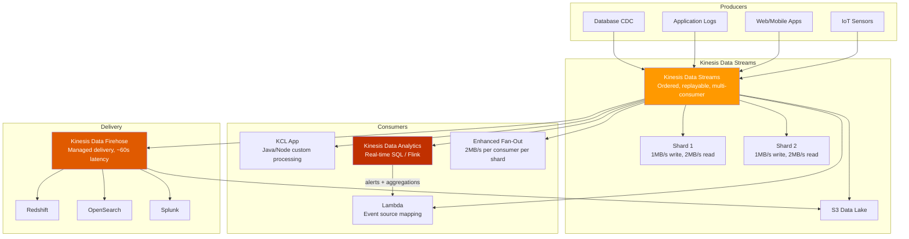
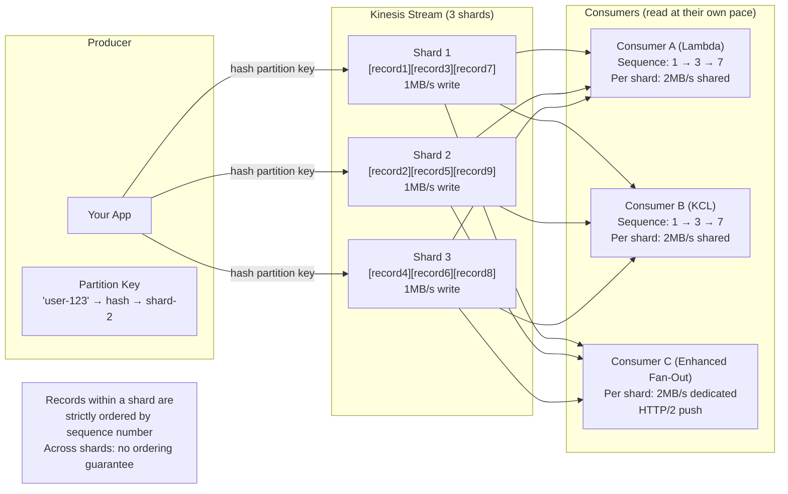
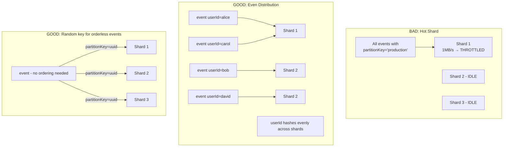
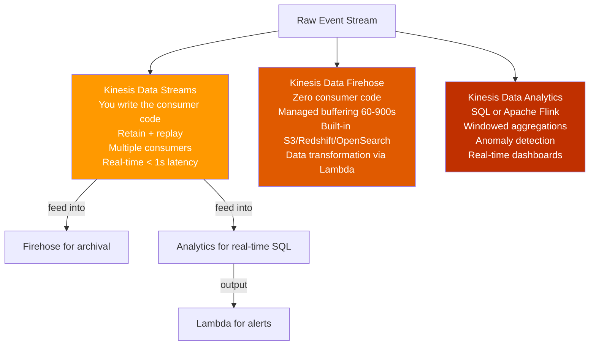
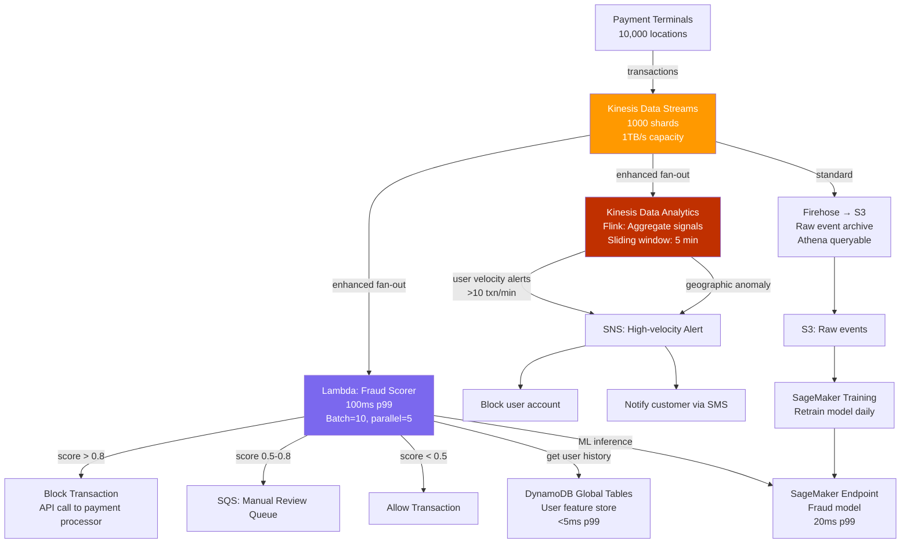

# AWS Kinesis: Real-Time Streaming at Scale

## 🗺️ Quick Overview



*Kinesis for real-time multi-consumer streaming; SQS for simple task queues; Kafka when self-managed scale justifies the ops cost.*

## Question
**"When would you use Kinesis Data Streams vs SQS vs Kafka? How does sharding work? Design a real-time fraud detection system."**

Common in: AWS Solutions Architect, Data Engineering, FAANG System Design interviews, AWS SAA-C03 / SAP-C02 exams

---

## Quick Answer (30-second version)

- **Kinesis Data Streams**: Real-time streaming, multiple consumers, replay, ordering per shard. Use for clickstreams, IoT, log aggregation.
- **Kinesis Data Firehose**: Managed delivery to S3 / Redshift / OpenSearch. Zero code, auto-scales, near-real-time (60s buffer).
- **Kinesis Data Analytics**: Real-time SQL or Apache Flink on streaming data. Aggregations, windowing, anomaly detection.
- **vs SQS**: Kinesis for replay + multiple concurrent consumers + real-time analytics. SQS for simple task queues.
- **vs Kafka**: Kinesis = managed, serverless, AWS-native. Kafka = more powerful, self-managed, better ecosystem, cheaper at massive scale.

---

## Why This Matters: The Thought Process

> When an interviewer asks "Kinesis vs SQS", they're probing: *"Do you understand streaming vs queuing, ordering, replay, and the operational cost of managing real-time data pipelines?"*

The mental model shift:
- **Queue (SQS)**: Each message consumed once, then deleted. Workers compete. Good for tasks.
- **Stream (Kinesis)**: Messages retained for N days. Multiple independent consumers read the same data at their own pace. Good for analytics, ML, real-time processing.

---

## The Kinesis Ecosystem



---

## Kinesis vs SQS vs Kafka: Decision Matrix

| Dimension | Kinesis Data Streams | SQS | Apache Kafka |
|---|---|---|---|
| **Primary use case** | Real-time streaming, analytics | Task queues, decoupling | High-throughput streaming, event log |
| **Message retention** | 1–365 days | Up to 14 days | Configurable (unlimited) |
| **Ordering** | Per shard (partition key) | FIFO queue only | Per partition |
| **Multiple consumers** | Yes — each reads independently | No — each msg consumed once | Yes — consumer groups |
| **Replay** | Yes — seek to any position | No | Yes |
| **Throughput per unit** | 1 MB/s write, 2 MB/s read per shard | Unlimited (Standard) | ~100 MB/s+ per broker |
| **Scaling** | Manual shard split/merge (or on-demand) | Automatic | Manual partition management |
| **Managed** | Fully managed (AWS) | Fully managed (AWS) | Self-managed (or MSK) |
| **Cost at 1TB/day** | ~$150–$300/mo | Varies (per message) | Cheaper at extreme scale |
| **Ecosystem** | AWS-native | AWS-native | Rich (Kafka Connect, Streams, etc.) |
| **Exactly-once** | With enhanced fan-out + KCL checkpointing | FIFO queue only | Yes (transactions API) |

**When Kinesis wins over SQS**:
- You need multiple independent consumers reading the same data (analytics + fraud + ML simultaneously)
- You need to replay events (re-process after a bug fix)
- Data must be retained and queryable for days/weeks
- Real-time windowing/aggregations on the stream

**When SQS wins over Kinesis**:
- Simple worker pool consuming tasks (image resizing, email sending)
- Variable load where you want to absorb bursts without managing shards
- Each message needs exactly one processor — not a broadcast

**When Kafka wins over Kinesis**:
- >1 GB/s sustained throughput (shard overhead becomes limiting)
- Need Kafka Connect ecosystem (hundreds of source/sink connectors)
- Multi-cloud or on-premises deployment
- Sub-10ms latency requirements (Kinesis has ~200ms latency)

---

## Shard Architecture: The Core Concept



### Shard Capacity Math — Size Your Cluster

```
Per shard capacity:
  WRITE: 1 MB/s OR 1,000 records/s (whichever limit is hit first)
  READ:  2 MB/s shared across all standard consumers
         2 MB/s per consumer with Enhanced Fan-Out

Sizing example: IoT sensor fleet
  - 10,000 sensors × 100 bytes/event × 50 events/second = 50 MB/s write
  - Required shards: 50 MB/s ÷ 1 MB/s per shard = 50 shards
  - Read consumers: 3 (analytics, ML, archive)
    - Standard: 2 MB/s ÷ 3 consumers = 0.67 MB/s each → bottleneck
    - Enhanced Fan-Out: 2 MB/s × 3 consumers × 50 shards = 300 MB/s read → no bottleneck

Cost estimate (50 shards, us-east-1):
  - Shard-hour: 50 shards × 720 hours × $0.015 = $540/month
  - PUT payload units: 50 MB/s × 3600s × 720h / 25KB per unit ≈ additional
  - Enhanced Fan-Out: $0.015 per shard-hour consumer + data retrieval
```

---

## Partition Key Strategy: Avoiding Hot Shards

> **The most common Kinesis operational failure**: All data goes to one shard because the partition key has low cardinality or is biased.



**Partition key rules:**
1. **Use high-cardinality keys**: `userId`, `deviceId`, `orderId` — not `environment`, `region`, `true/false`
2. **For orderless events**: use `crypto.randomUUID()` — maximally even distribution
3. **For ordered events**: use the entity ID — all events for `user-123` land in same shard in order
4. **Monitor shard metrics**: `IncomingBytes` and `WriteProvisionedThroughputExceeded` per shard — alert on any shard at >80%

---

## Kinesis Data Streams vs Firehose vs Analytics



**Decision tree:**
- "I need to store raw events in S3 for later analysis" → **Firehose** (zero code, auto-batches to S3)
- "I need custom processing logic and multiple consumers" → **Data Streams** (you build consumers)
- "I need real-time SQL aggregations like 'fraud rate per minute'" → **Data Analytics** (managed Flink)
- "I need all three" → Data Streams as source → Firehose (archive) + Analytics (real-time) as sinks

---

## Enhanced Fan-Out: Dedicated Throughput per Consumer

```
Standard consumers share the 2MB/s read throughput per shard:

  Shard (2MB/s total read)
    ├── Consumer A gets ~0.67 MB/s
    ├── Consumer B gets ~0.67 MB/s
    └── Consumer C gets ~0.67 MB/s

  Problem: 3 consumers × 0.67 MB/s = 2MB/s cap → bottleneck!

Enhanced Fan-Out — each consumer gets dedicated 2MB/s:

  Shard
    ├── Consumer A: 2MB/s (dedicated HTTP/2 push)
    ├── Consumer B: 2MB/s (dedicated HTTP/2 push)
    └── Consumer C: 2MB/s (dedicated HTTP/2 push)

  No sharing → no bottleneck!
  Push-based (not polling) → ~200ms lower latency than standard

Cost: $0.015 per enhanced fan-out consumer-shard-hour + $0.013 per GB retrieved
Use when: >2 consumers on same stream, or latency is critical
```

---

## KCL: Kinesis Client Library

KCL manages the hard parts of stream processing: shard assignment across workers, checkpointing progress, handling shard splits/merges, and retrying failures.

```
KCL Architecture (multiple worker nodes):

Stream (6 shards)                    Worker Fleet
  Shard 1  ─────────────────────▶  Worker A (Node 1)
  Shard 2  ─────────────────────▶  Worker A (Node 1)
  Shard 3  ─────────────────────▶  Worker B (Node 2)
  Shard 4  ─────────────────────▶  Worker B (Node 2)
  Shard 5  ─────────────────────▶  Worker C (Node 3)
  Shard 6  ─────────────────────▶  Worker C (Node 3)

KCL coordinates via DynamoDB lease table:
  shardId   | leaseOwner | checkpoint              | leaseCounter
  shard-001 | worker-A   | 49584...00001 (seq#)    | 42
  shard-002 | worker-A   | 49584...00089 (seq#)    | 18
  shard-003 | worker-B   | 49584...00023 (seq#)    | 31
  ...

If Worker A dies → KCL reassigns shard-001 and shard-002 to B or C
Checkpoint = last successfully processed record → restart from there
```

---

## Lambda Integration: Event Source Mapping

```javascript
// Lambda processes Kinesis records via event source mapping
// AWS manages polling, batching, retries, DLQ for you

exports.handler = async (event) => {
  console.log(`Processing ${event.Records.length} records from Kinesis`);

  const results = [];
  const failures = [];

  for (const record of event.Records) {
    try {
      // Decode base64 record data
      const payload = Buffer.from(record.kinesis.data, 'base64').toString('utf-8');
      const data = JSON.parse(payload);

      // Process the record
      await processEvent(data, record.kinesis.sequenceNumber);

      results.push({ sequenceNumber: record.kinesis.sequenceNumber, status: 'success' });

    } catch (err) {
      console.error(`Failed to process record ${record.kinesis.sequenceNumber}:`, err);

      // Return failed sequence numbers — Lambda will retry these
      // (bisect on error = split batch to isolate the poison record)
      failures.push({ itemIdentifier: record.kinesis.sequenceNumber });
    }
  }

  // Partial batch response — only retry failed records, not the whole batch
  return {
    batchItemFailures: failures,
  };
};

async function processEvent(data, sequenceNumber) {
  console.log(`Seq: ${sequenceNumber}, Event: ${data.eventType}, User: ${data.userId}`);

  switch (data.eventType) {
    case 'page_view':
      await updatePageViewCounter(data.userId, data.page);
      break;
    case 'purchase':
      await updateRevenueMetrics(data.userId, data.amount);
      break;
    case 'fraud_signal':
      await escalateToFraudTeam(data);
      break;
  }
}

/*
Lambda event source mapping config (Terraform):

resource "aws_lambda_event_source_mapping" "kinesis" {
  event_source_arn                   = aws_kinesis_stream.events.arn
  function_name                      = aws_lambda_function.processor.arn
  starting_position                  = "LATEST"          // or TRIM_HORIZON to read from beginning
  batch_size                         = 100               // Records per invocation
  maximum_batching_window_in_seconds = 5                 // Wait up to 5s to fill batch
  parallelization_factor             = 10                // 10 concurrent Lambdas per shard
  bisect_batch_on_function_error     = true              // Split batch to isolate bad record
  maximum_retry_attempts             = 3                 // Retry failed batches 3 times
  destination_config {
    on_failure {
      destination_arn = aws_sqs_queue.kinesis_dlq.arn   // Send failed records to DLQ
    }
  }
}
*/
```

---

## Code: Kinesis Producer with Partition Key Strategy

```javascript
const { KinesisClient, PutRecordCommand, PutRecordsCommand } = require('@aws-sdk/client-kinesis');
const crypto = require('crypto');

const kinesis = new KinesisClient({ region: 'us-east-1' });
const STREAM_NAME = process.env.KINESIS_STREAM_NAME;

// ── Single record producer ─────────────────────────────────────────────────────

async function publishEvent(event) {
  const partitionKey = selectPartitionKey(event);

  await kinesis.send(new PutRecordCommand({
    StreamName: STREAM_NAME,
    Data: Buffer.from(JSON.stringify(event)),
    PartitionKey: partitionKey,
    // SequenceNumberForOrdering: lastSequenceNumber  // Only for strict intra-shard ordering
  }));
}

function selectPartitionKey(event) {
  // Strategy depends on ordering requirements:

  if (event.userId) {
    // All events for a user go to same shard → ordered per user
    return event.userId;
  }

  if (event.sessionId) {
    // All events in a session are ordered
    return event.sessionId;
  }

  // No ordering needed → random key for maximum distribution
  return crypto.randomUUID();
}

// ── Batch producer (more efficient) ──────────────────────────────────────────

async function publishEventBatch(events) {
  const MAX_BATCH_SIZE = 500; // Kinesis PutRecords limit

  // Split into batches of 500
  for (let i = 0; i < events.length; i += MAX_BATCH_SIZE) {
    const batch = events.slice(i, i + MAX_BATCH_SIZE);

    const records = batch.map(event => ({
      Data: Buffer.from(JSON.stringify(event)),
      PartitionKey: selectPartitionKey(event),
    }));

    const response = await kinesis.send(new PutRecordsCommand({
      StreamName: STREAM_NAME,
      Records: records,
    }));

    // IMPORTANT: PutRecords is partial failure — check each record
    if (response.FailedRecordCount > 0) {
      const failed = response.Records
        .map((r, idx) => ({ record: records[idx], result: r }))
        .filter(({ result }) => result.ErrorCode);

      console.error(`${response.FailedRecordCount} records failed:`, failed.map(f => f.result.ErrorCode));

      // Retry failed records with exponential backoff
      await retryWithBackoff(failed.map(f => f.record));
    }
  }
}

async function retryWithBackoff(records, attempt = 1, maxAttempts = 5) {
  if (attempt > maxAttempts) {
    console.error('Max retries exceeded for records:', records.length);
    // Send to DLQ or alert
    return;
  }

  const delay = Math.pow(2, attempt) * 100; // 200ms, 400ms, 800ms, 1600ms, 3200ms
  await new Promise(resolve => setTimeout(resolve, delay));

  const response = await kinesis.send(new PutRecordsCommand({
    StreamName: STREAM_NAME,
    Records: records,
  }));

  if (response.FailedRecordCount > 0) {
    const stillFailed = response.Records
      .map((r, idx) => ({ record: records[idx], result: r }))
      .filter(({ result }) => result.ErrorCode)
      .map(f => f.record);

    await retryWithBackoff(stillFailed, attempt + 1, maxAttempts);
  }
}
```

---

## Real-World Scenario: Real-Time Fraud Detection

> "Design a system that processes 1 million transaction events per second from payment terminals worldwide and detects fraud in under 100ms."



**Sizing the shards:**
- 1M transactions/second × 500 bytes/transaction = 500 MB/s write
- 500 MB/s ÷ 1 MB/s per shard = **500 shards minimum**
- Use **On-Demand mode** to avoid manual shard management (Kinesis auto-scales)

**Why Kinesis and not SQS here?**
1. Three consumers need the same data simultaneously (fraud scoring, analytics, archival)
2. Must replay events when fraud model is retrained — check historical transactions against new model
3. Ordered within each payment terminal's shard → detect velocity patterns
4. 500 MB/s far exceeds SQS's per-queue throughput model

### Kinesis Data Analytics: Real-Time Fraud SQL

```sql
-- Kinesis Data Analytics (Apache Flink SQL)
-- Detect users making > 10 transactions in a 5-minute sliding window

CREATE TABLE transactions (
  transactionId  VARCHAR(64),
  userId         VARCHAR(64),
  amount         DECIMAL(10, 2),
  merchantId     VARCHAR(64),
  countryCode    VARCHAR(2),
  eventTime      TIMESTAMP(3),
  WATERMARK FOR eventTime AS eventTime - INTERVAL '5' SECOND
) WITH (
  'connector' = 'kinesis',
  'stream'    = 'transactions-stream',
  'format'    = 'json'
);

-- Alert: high transaction velocity (card testing attack)
SELECT
  userId,
  COUNT(*) AS txn_count,
  SUM(amount) AS total_amount,
  MIN(eventTime) AS window_start,
  MAX(eventTime) AS window_end
FROM TABLE(
  HOP(TABLE transactions, DESCRIPTOR(eventTime), INTERVAL '1' MINUTE, INTERVAL '5' MINUTE)
)
GROUP BY
  userId,
  HOP_START(eventTime, INTERVAL '1' MINUTE, INTERVAL '5' MINUTE),
  HOP_END(eventTime, INTERVAL '1' MINUTE, INTERVAL '5' MINUTE)
HAVING COUNT(*) > 10;

-- Alert: geographic velocity (card used in two countries within 30 minutes)
SELECT
  a.userId,
  a.countryCode AS country1,
  b.countryCode AS country2,
  a.eventTime   AS time1,
  b.eventTime   AS time2
FROM transactions a
JOIN transactions b ON (
  a.userId = b.userId
  AND a.countryCode <> b.countryCode
  AND b.eventTime BETWEEN a.eventTime AND a.eventTime + INTERVAL '30' MINUTE
);
```

### Lambda Fraud Scorer with DynamoDB Feature Store

```javascript
const { KinesisClient } = require('@aws-sdk/client-kinesis');
const { DynamoDBClient, GetItemCommand, UpdateItemCommand } = require('@aws-sdk/client-dynamodb');

const dynamodb = new DynamoDBClient({ region: 'us-east-1' });
const FEATURES_TABLE = 'user-fraud-features';

exports.handler = async (event) => {
  const failures = [];

  for (const record of event.Records) {
    try {
      const transaction = JSON.parse(
        Buffer.from(record.kinesis.data, 'base64').toString('utf-8')
      );

      // 1. Fetch user feature vector from DynamoDB (< 5ms with DAX)
      const features = await getUserFeatures(transaction.userId);

      // 2. Score the transaction
      const score = calculateFraudScore(transaction, features);

      // 3. Act on the score
      if (score >= 0.8) {
        await blockTransaction(transaction.transactionId);
        await logFraudSignal(transaction, score, 'BLOCKED');
      } else if (score >= 0.5) {
        await queueForManualReview(transaction, score);
        await logFraudSignal(transaction, score, 'REVIEW');
      }

      // 4. Update user features (transaction count, last country, etc.)
      await updateUserFeatures(transaction.userId, transaction);

    } catch (err) {
      console.error(`Failed record ${record.kinesis.sequenceNumber}:`, err);
      failures.push({ itemIdentifier: record.kinesis.sequenceNumber });
    }
  }

  return { batchItemFailures: failures };
};

async function getUserFeatures(userId) {
  const result = await dynamodb.send(new GetItemCommand({
    TableName: FEATURES_TABLE,
    Key: { userId: { S: userId } },
  }));

  if (!result.Item) {
    return { txnCount24h: 0, lastCountry: null, avgAmount: 0, riskScore: 0 };
  }

  return {
    txnCount24h: parseInt(result.Item.txnCount24h?.N ?? '0'),
    lastCountry: result.Item.lastCountry?.S,
    avgAmount: parseFloat(result.Item.avgAmount?.N ?? '0'),
    riskScore: parseFloat(result.Item.riskScore?.N ?? '0'),
  };
}

function calculateFraudScore(transaction, features) {
  let score = 0;

  // Rule 1: High velocity
  if (features.txnCount24h > 50) score += 0.3;
  else if (features.txnCount24h > 20) score += 0.1;

  // Rule 2: Country mismatch
  if (features.lastCountry && features.lastCountry !== transaction.countryCode) {
    score += 0.4; // Card used in different country
  }

  // Rule 3: Amount anomaly (5x average)
  if (features.avgAmount > 0 && transaction.amount > features.avgAmount * 5) {
    score += 0.3;
  }

  // Rule 4: Known risky merchant
  if (isRiskyMerchant(transaction.merchantId)) {
    score += 0.2;
  }

  // In production: replace rules with ML model inference
  // const mlScore = await invokeSageMakerEndpoint({ transaction, features });
  // score = mlScore;

  return Math.min(score, 1.0); // Cap at 1.0
}

async function updateUserFeatures(userId, transaction) {
  await dynamodb.send(new UpdateItemCommand({
    TableName: FEATURES_TABLE,
    Key: { userId: { S: userId } },
    UpdateExpression: `
      ADD txnCount24h :one
      SET lastCountry = :country,
          lastTxnTime = :time,
          avgAmount = if_not_exists(avgAmount, :zero) * :decay + :amount * :oneMinusDecay
    `,
    ExpressionAttributeValues: {
      ':one': { N: '1' },
      ':country': { S: transaction.countryCode },
      ':time': { S: new Date().toISOString() },
      ':zero': { N: '0' },
      ':amount': { N: String(transaction.amount) },
      ':decay': { N: '0.9' },        // Exponential moving average
      ':oneMinusDecay': { N: '0.1' },
    },
  }));
}

function isRiskyMerchant(merchantId) {
  // In production: check against a Redis or DynamoDB blocklist
  const RISKY_MERCHANT_CATEGORIES = ['gambling', 'crypto', 'wire-transfer'];
  return RISKY_MERCHANT_CATEGORIES.some(cat => merchantId.includes(cat));
}
```

---

## Exactly-Once Processing: The Full Pattern

```
Kinesis delivers at-least-once (records may be redelivered on failure).
To achieve exactly-once:

1. Enhanced Fan-Out: Dedicated throughput, each consumer gets consistent view
2. KCL Checkpointing: Only checkpoint AFTER successful processing
   - If processor crashes mid-batch, restart from last checkpoint
   - Never checkpoint before confirming downstream write succeeded
3. Idempotent Writes: Use sequence number or event ID as idempotency key

Implementation pattern:
  for each record in shard:
    1. Parse record data
    2. Check idempotency table: "Have I processed sequenceNumber X?"
       - YES → skip (already done, safe)
       - NO  → process and mark as done
    3. Write to downstream (DynamoDB, RDS, etc.)
    4. Mark sequenceNumber X as processed in idempotency table
    5. Checkpoint to KCL (ONLY after step 4 succeeds)

If crash between step 3 and step 4: record is reprocessed BUT idempotency check catches it
If crash between step 4 and step 5: record is reprocessed, idempotency check catches it, checkpoint retried
```

---

## Common Interview Follow-ups

**Q: How do you handle a hot shard?**

A: Detect via `IncomingBytes` or `WriteProvisionedThroughputExceeded` CloudWatch metrics. Fix options:
1. **Better partition key**: More cardinality (use `userId` not `region`)
2. **Shard splitting**: Split the hot shard into two shards
3. **Random suffix on partition key**: Append `Math.floor(Math.random() * 10)` to spread writes — but breaks ordering
4. **On-Demand mode**: Kinesis auto-scales shards (added 2021) — eliminates manual shard management

**Q: Kinesis vs MSK (Managed Kafka) — which do you choose?**

A: Rule of thumb — if you're already deep in AWS, need < 100 MB/s, and want minimal ops burden → Kinesis. If you need Kafka Connect ecosystem, cross-cloud, very high throughput (> 1 GB/s), or existing Kafka expertise → MSK. MSK is ~30-40% cheaper than Kinesis at the same throughput once you factor in shard vs broker pricing at scale.

**Q: How does Kinesis Data Firehose handle backpressure and failures?**

A: Firehose buffers records (by size up to 128 MB or by time up to 900 seconds, whichever comes first). On S3 delivery failure, it retries with backoff. If still failing, it sends to a configured S3 error bucket (never drops data). You can add a Lambda transformation step — if Lambda fails, Firehose can skip the record and write original to an error prefix.

**Q: What's the maximum record size in Kinesis?**

A: **1 MB per record** (including partition key). For larger payloads, use S3 pointer pattern: store payload in S3, send S3 key as the Kinesis record. Unlike SQS's 256KB, Kinesis's 1MB limit accommodates more use cases natively.

**Q: Kinesis retention — if a consumer falls 7+ days behind, what happens?**

A: Records older than the retention window (7 days default, up to 365 days with extended retention) are permanently deleted from the shard. The consumer will receive a `ExpiredIteratorException` and must reset to `TRIM_HORIZON` (oldest available) or `AT_TIMESTAMP`. This means it will miss records from the gap — design for this with archival to S3 via Firehose for true long-term replay.

---

## AWS Certification Exam Tips (SAA-C03 / SAP-C02)

**Kinesis key numbers:**
- Shard write: **1 MB/s OR 1,000 records/s** (per shard)
- Shard read (standard): **2 MB/s shared** across all consumers
- Shard read (enhanced fan-out): **2 MB/s per consumer** per shard (HTTP/2 push, dedicated)
- Max record size: **1 MB**
- Default retention: **24 hours**; max: **365 days** (with long-term data retention)
- PutRecords batch: **up to 500 records**, 5 MB max total per call
- On-Demand mode: auto-scales, charged per GB in/out
- Provisioned mode: charged per shard-hour

**Firehose key facts:**
- Destinations: S3, Redshift, OpenSearch, Splunk, HTTP endpoint
- Buffer: 60–900 seconds OR 1–128 MB (whichever hits first)
- Transformation: Lambda (inline) — max 6 MB response
- Near-real-time only: minimum ~60s latency (not for real-time use cases)
- No consumer code needed — fully managed

**Classic exam scenarios:**

> "You need to analyze clickstream data from a website in real-time to detect user behavior patterns. You also need to store all events in S3 for data science team."

Answer: Kinesis Data Streams → Analytics (real-time patterns) + Firehose (S3 archival). One stream, two consumers.

> "Your application processes 5,000 events/second. Each event is 10 KB. How many Kinesis shards do you need?"

Answer: 5,000 events/s × 10 KB = 50 MB/s ÷ 1 MB/s per shard = **50 shards**. (Check both limits: 50,000 records/s ÷ 1,000 records/s per shard = also 50 shards.)

> "A Lambda reading from Kinesis keeps failing because one bad record causes the entire batch to fail."

Answer: Enable `BisectBatchOnFunctionError = true` in the event source mapping. This splits the failing batch in half recursively to isolate the poison record. Also configure an `on_failure` SQS DLQ destination so the bad record doesn't disappear.

---

## Key Takeaways

1. **Kinesis = stream, SQS = queue**: Streams support replay, multiple independent consumers, and retention. Queues support one consumer per message.
2. **Shard sizing**: 1 MB/s write per shard — calculate your throughput and add 20% headroom. Use On-Demand mode to avoid manual scaling.
3. **Partition key = ordering scope**: High-cardinality keys avoid hot shards. Random keys maximize distribution when ordering is not needed.
4. **Enhanced Fan-Out** is essential when you have >2 consumers on the same stream — prevents read throughput sharing.
5. **Kinesis Data Streams → Firehose + Analytics** is the standard pattern: streaming as the backbone, Firehose for cheap archival, Analytics for real-time aggregations.
6. **Idempotency is mandatory**: At-least-once delivery means duplicates happen. Always check-before-write or use idempotency keys.
7. **Kinesis vs Kafka**: Managed vs ecosystem power. At < 500 MB/s with AWS-native stack, Kinesis wins on ops simplicity. At massive scale or cross-cloud, MSK (Kafka) wins on cost and flexibility.
8. **Fraud detection pattern**: Kinesis → Lambda (per-event scoring) + Analytics (windowed aggregations) → block/review/allow trifecta.

---

## Related Questions

- [SQS vs SNS vs EventBridge](/12-interview-prep/aws-cloud/sqs-sns-eventbridge)
- [Lambda Serverless Architecture](/12-interview-prep/aws-cloud/lambda-serverless)
- [Auto-Scaling Groups](/12-interview-prep/aws-cloud/auto-scaling)
- [CloudWatch Monitoring](/12-interview-prep/aws-cloud/cloudwatch-monitoring)
