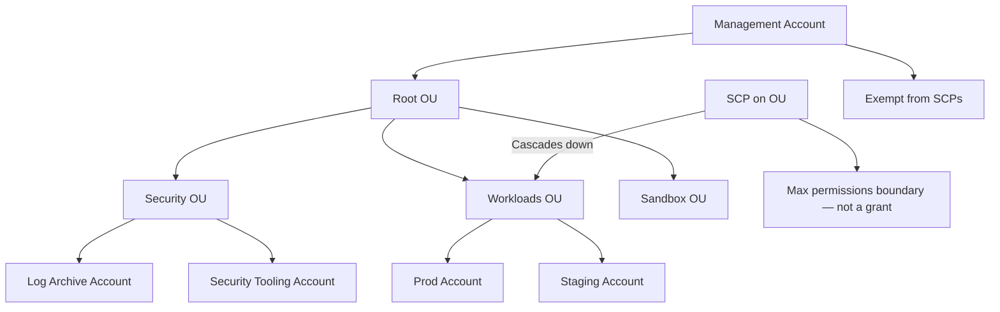
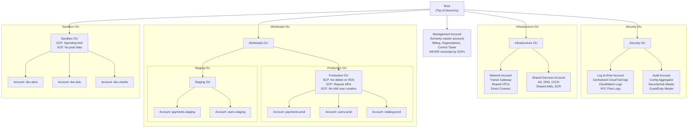
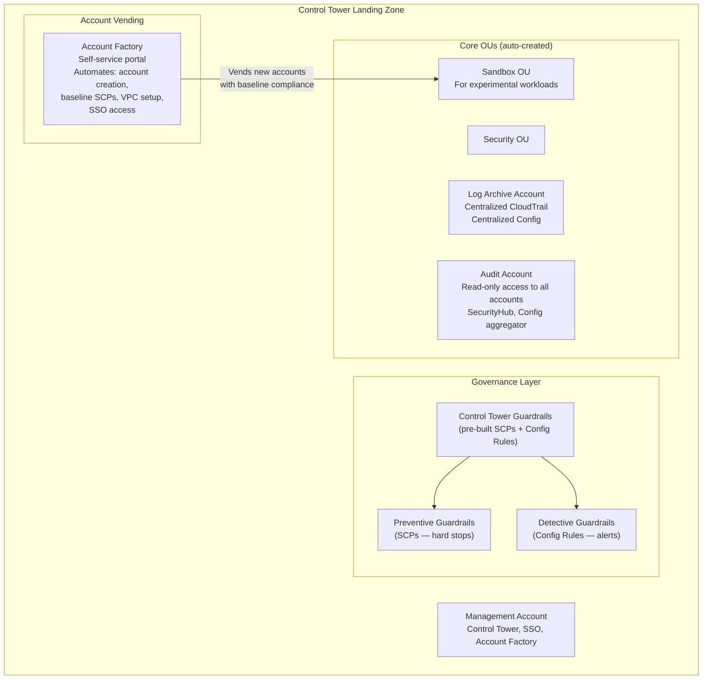
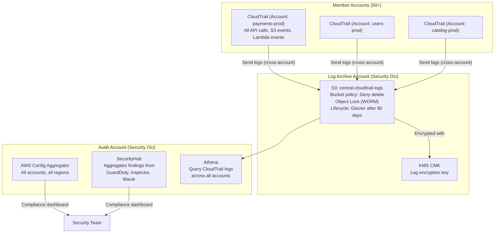

# AWS Organizations & SCPs: Multi-Account Strategy at Scale

## 🗺️ Quick Overview



*SCPs restrict, they do not grant. The management account is always exempt — a critical security consideration.*

> **Common Interview Question**: "A developer accidentally deleted a production database. How do you prevent this organization-wide? How do you ensure no one creates resources outside us-east-1? Design a multi-account AWS strategy for a 500-person company."

Common in: AWS Solutions Architect, Platform Engineering, Security Engineering, Cloud Architecture interviews

---

## Quick Answer (30-second version)

- **AWS Organizations** = Hierarchical grouping of AWS accounts. One management account governs all member accounts.
- **SCPs (Service Control Policies)** = Guardrails, NOT grants. They define the **maximum permissions** an account can have. Both SCP AND IAM policy must allow an action for it to succeed.
- **SCPs do NOT grant permissions** — They only restrict. An SCP allowing S3 doesn't mean users have S3 access; they still need IAM policies.
- **Management account is EXEMPT from SCPs** — SCPs never apply to the management account. This is a critical security design consideration.
- **OUs (Organizational Units)** = Logical groupings of accounts. SCPs applied to an OU cascade to all child OUs and accounts.
- **Control Tower** = AWS-managed service that automates Organizations, SCPs, and account provisioning. Landing Zone = the baseline multi-account setup it creates.
- **Multi-account why**: Blast radius reduction, billing isolation, security boundary, team autonomy.

---

## Why This Matters / The Thought Process

When an interviewer asks about AWS Organizations, they're testing whether you understand **governance at scale**.

The real questions behind the question:
- Do you know why a single AWS account for an entire company is dangerous?
- Can you explain how SCPs interact with IAM — why they restrict rather than grant?
- Do you understand the management account's special status (and why it's a risk)?
- Can you design an OU hierarchy that reflects organizational structure AND security requirements?

Think like an SA: A 500-person company might have 50+ AWS accounts. Without Organizations, enforcing "no resources in China regions" requires sending emails to 50 different account owners and hoping they comply. With SCPs, you write one JSON policy, apply it to the root OU, and it's enforced for every user in every account — including the CEO's admin account — instantly and unbypassably.

The hardest concept: **SCPs are a ceiling, not a floor**. Applying an SCP that allows everything (the default) doesn't actually grant anyone anything. You've just set the maximum possible permissions. Users still need IAM policies to do anything.

---

## Organizations Structure: The Hierarchy



---

## Service Control Policies: The Most Misunderstood Concept

### SCPs Are Guardrails (Ceiling), Not Grants (Floor)

The #1 exam trap: candidates think applying an SCP that allows S3 grants their users S3 access. It does not.

```
Permission granted = SCP allows AND IAM policy allows

Example:
  SCP: { Allow: s3:* }          <- Sets ceiling: max allowed is all S3 actions
  IAM: { Allow: s3:GetObject }  <- User policy: only GetObject

Result: User can only GetObject
        (intersection of SCP ceiling and IAM grant)

Another example:
  SCP: { Allow: s3:GetObject only }  <- Ceiling: only GetObject
  IAM: { Allow: s3:* }              <- User policy: all S3

Result: User can only GetObject
        (SCP ceiling is lower than IAM grant → SCP wins)

The trap:
  SCP: { Allow: s3:* }          <- Default: allow all
  IAM: (no policy)              <- No grant

Result: User can do NOTHING
        (IAM has no Allow — both must allow)
```

### SCP Evaluation Model

```mermaid
flowchart TD
    REQ["API Request\n(e.g., rds:DeleteDBInstance)"]
    A{"Is requester in\nmanagement account?"}
    ALLOW_MGMT["ALLOW\n(SCPs don't apply\nto management account)"]
    B{"Explicit Deny\nin any SCP?"}
    DENY["DENY\nRequest blocked"]
    C{"Action allowed\nby all SCPs in\nhierarchy?"]
    D{"IAM policy\ngrants permission?"}
    FINAL_ALLOW["ALLOW"]

    REQ --> A
    A -->|YES| ALLOW_MGMT
    A -->|NO - member account| B
    B -->|YES| DENY
    B -->|NO| C
    C -->|NO - not in any Allow SCP| DENY
    C -->|YES| D
    D -->|NO| DENY
    D -->|YES| FINAL_ALLOW
```

**Key rule**: The effective permission = intersection of all SCPs in the hierarchy AND the IAM policy. A Deny anywhere kills it. An Allow in all SCPs is necessary but not sufficient.

### SCP Inheritance Down the Hierarchy

SCPs are **inherited** down the OU tree. An SCP applied at the Root applies to every account in the organization. An SCP on the Workloads OU applies to all Production, Staging, and all accounts within.

```
Root SCP: "Deny leaving the organization"
  ↓ (inherits)
Workloads OU SCP: "Deny disabling CloudTrail"
  ↓ (inherits)
Production OU SCP: "Deny RDS delete, deny IAM user creation, require MFA"
  ↓ (inherits)
payments-prod account: All 3 parent SCPs apply PLUS any account-level SCPs
```

---

## Critical SCP Examples

### 1. Prevent Leaving the Organization

```json
{
  "Version": "2012-10-17",
  "Statement": [
    {
      "Sid": "DenyLeavingOrganization",
      "Effect": "Deny",
      "Action": "organizations:LeaveOrganization",
      "Resource": "*"
    }
  ]
}
```

Apply at: **Root OU**. Without this, a disgruntled admin can detach an account from the organization, escaping all SCPs.

### 2. Restrict All Regions Except Approved Ones

```json
{
  "Version": "2012-10-17",
  "Statement": [
    {
      "Sid": "DenyAllUnapprovedRegions",
      "Effect": "Deny",
      "NotAction": [
        "iam:*",
        "organizations:*",
        "support:*",
        "trustedadvisor:*",
        "cloudfront:*",
        "route53:*",
        "waf:*",
        "sts:*",
        "budgets:*",
        "account:*"
      ],
      "Resource": "*",
      "Condition": {
        "StringNotEquals": {
          "aws:RequestedRegion": [
            "us-east-1",
            "eu-west-1"
          ]
        }
      }
    }
  ]
}
```

**Why `NotAction` instead of `Action`?**: IAM, CloudFront, Route53, and a few other global services are not region-specific. If you use `Action: *`, you'd block IAM operations from working at all. `NotAction` with the global services listed means "deny everything EXCEPT these globally-scoped actions, when the region is not in our approved list."

Apply at: **Root OU** (or Workloads OU if sandbox accounts need other regions).

### 3. Prevent Deleting Production RDS Instances

```json
{
  "Version": "2012-10-17",
  "Statement": [
    {
      "Sid": "DenyRDSDeletion",
      "Effect": "Deny",
      "Action": [
        "rds:DeleteDBInstance",
        "rds:DeleteDBCluster",
        "rds:DeleteDBSnapshot",
        "rds:DeleteDBClusterSnapshot"
      ],
      "Resource": "*"
    }
  ]
}
```

Apply at: **Production OU**. This is the direct answer to "a developer deleted a production database." Even if a developer has the IAM permission to delete RDS, the SCP blocks it.

### 4. Deny Creating IAM Users in Production

```json
{
  "Version": "2012-10-17",
  "Statement": [
    {
      "Sid": "DenyIAMUserCreation",
      "Effect": "Deny",
      "Action": [
        "iam:CreateUser",
        "iam:CreateAccessKey"
      ],
      "Resource": "*"
    }
  ]
}
```

Apply at: **Production OU**. In production, all access should be via IAM roles (federated identity, assumed roles). No permanent IAM users means no static credentials that can leak.

### 5. Require MFA for Console Access

```json
{
  "Version": "2012-10-17",
  "Statement": [
    {
      "Sid": "DenyWithoutMFA",
      "Effect": "Deny",
      "NotAction": [
        "iam:CreateVirtualMFADevice",
        "iam:EnableMFADevice",
        "iam:GetUser",
        "iam:ListMFADevices",
        "iam:ListVirtualMFADevices",
        "iam:ResyncMFADevice",
        "sts:GetSessionToken"
      ],
      "Resource": "*",
      "Condition": {
        "BoolIfExists": {
          "aws:MultiFactorAuthPresent": "false"
        }
      }
    }
  ]
}
```

Apply at: **Workloads OU** (not sandbox where developers might be onboarding). The `NotAction` exceptions allow users to set up their own MFA device before they have MFA — otherwise they'd be locked out.

### 6. Deny Disabling CloudTrail

```json
{
  "Version": "2012-10-17",
  "Statement": [
    {
      "Sid": "DenyCloudTrailDisable",
      "Effect": "Deny",
      "Action": [
        "cloudtrail:StopLogging",
        "cloudtrail:DeleteTrail",
        "cloudtrail:UpdateTrail",
        "cloudtrail:PutEventSelectors"
      ],
      "Resource": "*"
    }
  ]
}
```

Apply at: **Root OU**. An attacker's first action after compromising credentials is often to disable audit logging. This SCP prevents that — even if they compromise the management account credentials of a member account.

---

## AWS Control Tower: Automating Multi-Account Setup

Control Tower is the "opinionated" version of Organizations — AWS does the heavy lifting of setting up a compliant multi-account environment.

### What Control Tower Creates (Landing Zone)



### Control Tower Guardrails

Guardrails come in two flavors:

| | Preventive Guardrails | Detective Guardrails |
|--|----------------------|---------------------|
| **Implementation** | SCPs (hard block) | AWS Config Rules (audit) |
| **Effect** | Block the action from happening | Alert when violation detected |
| **Example** | "Deny S3 public access" | "Alert if S3 bucket is public" |
| **When to use** | Critical security controls | Monitoring for drift |
| **Compliance** | Mandatory or elective | Mandatory or elective |

**Mandatory guardrails** (always on, can't disable):
- Disallow changes to CloudTrail
- Disallow deletion of Log Archive bucket
- Disallow changes to account-level AWS CloudWatch setup

**Elective guardrails** (you choose):
- Require MFA for root user
- Disallow public read access to S3 buckets
- Require encryption for EBS volumes

### Account Factory: Account Vending Machine

Without Control Tower, creating a new AWS account for a team involves:
1. Create account in Organizations
2. Apply baseline SCPs
3. Set up CloudTrail
4. Configure AWS Config
5. Set up VPC with standard subnets
6. Configure SSO access
7. Set up billing alerts
8. Apply security baseline Config rules

Manual process: 2-4 hours per account. At 10 new teams per quarter, that's 40 hours of platform team time.

With Account Factory: Developer fills out a form (team name, environment, cost center). Account is provisioned in 15 minutes with all baseline controls applied automatically.

---

## Multi-Account Strategy: The "Why"

Companies often resist multi-account because it "seems complex." Here's how to explain the value:

| Problem | Single Account | Multi-Account |
|---------|---------------|---------------|
| **Blast radius** | One compromised admin = all resources exposed | Compromised account only affects that account |
| **Billing** | One bill, impossible to allocate costs by team | Per-account billing, cost allocation by OU |
| **IAM limits** | 5,000 IAM users per account | Unlimited accounts |
| **Service limits** | Shared Lambda concurrency across all teams | Per-account service limits |
| **Compliance** | All teams must meet highest compliance bar | Isolate regulated workloads to dedicated accounts |
| **Developer access** | Hard to give devs broad access without prod risk | Sandbox accounts with broad access, strict prod accounts |
| **Security incidents** | Incident affects all teams' operations | Blast radius contained to one account |

### Real-World Example: How Large Companies Structure Their Organizations

Netflix (public case study) structure approximation:
```
Root
├── Security OU
│   ├── Log Archive
│   └── Security Tooling
├── Infrastructure OU
│   ├── Networking
│   └── Shared Services
├── Streaming OU
│   ├── Playback Production
│   ├── Encoding Production
│   └── Recommendations Production
├── Content OU
│   └── CMS, Originals tools
└── Sandbox OU
    └── Per-developer accounts (1 per engineer)
```

Key pattern: **One account per microservice per environment** in large orgs. This means a 200-microservice company with 3 environments (dev/staging/prod) = 600+ accounts. This is normal and manageable with Control Tower + Account Factory.

---

## Centralized Logging Architecture

A critical compliance requirement: all API activity, across all accounts, must be centralized and immutable.



**Organization Trail**: One CloudTrail trail created in the management account covers ALL member accounts. Logs automatically flow to the central S3 bucket. Member account admins cannot delete or stop this trail (SCP prevents it).

**Immutable logs**: S3 Object Lock with WORM (Write Once Read Many) mode. Even if an attacker gets S3 write access, they cannot delete or overwrite existing log objects.

---

## Interview Scenarios: Model Answers

### Scenario 1: "Developer deleted the production RDS database. Prevent this org-wide."

**Model answer:**

1. Apply an SCP to the Production OU that denies `rds:DeleteDBInstance`, `rds:DeleteDBCluster`, and all delete-related RDS actions
2. Enable RDS deletion protection on all production databases (in addition to SCP — defense in depth)
3. Apply the SCP at the OU level so it applies to all current AND future production accounts automatically
4. Optionally, use AWS Config Rule to detect if any production database has deletion protection disabled — alert the security team

**Follow-up**: "What if a legitimate DBА needs to delete a database for a migration?"

Answer: Create an exception process — DBAs request access via a ticket, a temporary IAM permission boundary is added (not removing the SCP, since that's not how it works), or they use a dedicated "database operations" account that isn't in the Production OU.

### Scenario 2: "Ensure no resources created outside us-east-1"

**Model answer:**

1. Write an SCP using `NotAction` to exclude global services (IAM, Route53, CloudFront, STS, support, budgets) from the restriction
2. Use `aws:RequestedRegion` condition with `StringNotEquals` for the approved regions
3. Apply to Root OU so it covers all accounts
4. Test it first in a Sandbox account — it's easy to accidentally lock yourself out of IAM operations

**Common mistake**: Forgetting to exclude IAM, STS, and other global services. IAM calls don't have a "region" in the request context, so a naive `Action: *` with a region condition would block ALL IAM operations.

### Scenario 3: "Design a multi-account AWS strategy for a 500-person company"

**Model answer structure:**

1. **Start with why**: Blast radius, billing isolation, security boundary, team autonomy
2. **OU structure**: Root → Security OU, Infrastructure OU, Workloads OU (with Prod/Staging sub-OUs), Sandbox OU
3. **Account Factory**: Control Tower for automated account provisioning with baseline compliance
4. **Minimum accounts needed**:
   - Management (billing, organizations)
   - Log Archive (centralized immutable logs)
   - Audit (security tooling, Config aggregator)
   - Network (Transit Gateway, shared VPCs)
   - Shared Services (CI/CD, container registry)
   - Per-team production accounts (one per domain/service)
   - Per-developer sandbox accounts (optional but scales security)
5. **SCPs**: Region restriction, CloudTrail protection, prod database deletion protection, no IAM users in prod
6. **SSO**: AWS SSO for centralized authentication — one login, access to multiple accounts
7. **Billing**: Cost allocation tags, per-account billing, AWS Budgets alerts

---

## Common Interview Follow-ups

**Q: Can the management account be restricted by SCPs?**

A: No. SCPs never apply to the management account. This is a deliberate design — the management account is the "break glass" account. This is also why the management account should have almost no workloads running in it — just Organizations, Control Tower, and billing. The fewer resources in the management account, the less risk of the SCP exemption being exploited.

**Q: What's the difference between SCPs and IAM Permission Boundaries?**

A: SCPs apply at the account level (all principals in an account). Permission Boundaries apply at the IAM principal level (specific roles or users). They stack: a principal must satisfy both the account-level SCP AND its permission boundary (if set) AND its identity policy. SCPs are set by organization admins; permission boundaries are set per-IAM entity.

**Q: If I apply an Allow SCP at the root, does that mean everyone has access?**

A: No. The default FullAWSAccess SCP that Organizations attaches is an Allow-all. Removing it doesn't revoke access — it blocks everything because the SCP no longer "allows" anything. But keeping Allow SCPs doesn't grant access — users still need IAM policies. Think of Allow SCPs as defining the maximum allowed action space, not as a grant.

**Q: How do you handle emergency access if SCPs are too restrictive?**

A: Two approaches: (1) Use the management account (which is SCP-exempt) to break glass. (2) Maintain a dedicated "emergency access" IAM role that bypasses SCPs by being in a separate account not under the restrictive OU. But this should require a separate approval workflow (PagerDuty integration, JIRA ticket, etc.).

**Q: How does Control Tower differ from manually configuring Organizations?**

A: Control Tower is opinionated and automated. It creates a Landing Zone with pre-built guardrails, Account Factory, SSO setup, and centralized logging. Manual Organizations gives you full control but requires building all of this yourself. For most companies, Control Tower is the right starting point — you can customize from there. The main limitation is that Control Tower doesn't support every customization that raw Organizations allows.

---

## AWS Certification Exam Tips

1. **SCPs do NOT grant permissions** — The most-tested concept. An SCP allowing an action only means the action is not blocked; users still need IAM policies to actually perform it.

2. **Management account is NOT restricted by SCPs** — Ever. This is intentional. If the question involves the management account and an SCP, the management account can always perform the action.

3. **SCPs affect ALL principals in an account INCLUDING root user** — Unlike IAM policies which don't restrict the root user, SCPs DO restrict the root user of member accounts. The root user of the management account is still exempt.

4. **Explicit Deny in SCP overrides everything** — An explicit Deny in an SCP cannot be overridden by an IAM Allow anywhere.

5. **FullAWSAccess SCP is the default** — New accounts get FullAWSAccess attached. This is an Allow-all, which doesn't grant anything, but doesn't restrict anything either. You then add Deny SCPs on top.

6. **SCPs and OU inheritance** — SCP on Root applies to all OUs and accounts. SCP on Workloads OU applies to all accounts in Workloads OU and its child OUs. Accounts can have multiple SCPs (from multiple OUs in the hierarchy) all applying simultaneously.

7. **Control Tower Guardrails = SCPs + Config Rules** — Preventive guardrails are implemented as SCPs. Detective guardrails are implemented as Config Rules. Know this distinction.

8. **Organization Trail vs regular trail** — Organization Trail (created in management account) covers all accounts. Individual account CloudTrail trails only cover that account. For centralized logging, organization trail is the pattern.

9. **Account Factory vs manual account creation** — Account Factory (via Control Tower) provisions accounts with baseline compliance automatically. Manual account creation doesn't. Exam questions about "automated compliant account provisioning" = Account Factory.

10. **SCPs are attached to OUs and accounts, not individual IAM principals** — They apply to ALL IAM principals in the account. If you need per-principal restrictions, use IAM Permission Boundaries, not SCPs.

---

## Key Takeaways

| Concept | The Rule |
|---------|---------|
| **SCP nature** | Guardrails (ceiling), not grants (floor). Both SCP AND IAM must allow. |
| **Management account** | Never restricted by SCPs. Keep it minimal — no workloads. |
| **OU hierarchy** | Security OU, Infrastructure OU, Workloads OU, Sandbox OU. |
| **Region restriction** | Use `aws:RequestedRegion` with `NotAction` for global services. |
| **Centralized logging** | Organization Trail → central S3 with Object Lock (WORM). |
| **Account Factory** | Automated account provisioning with baseline compliance via Control Tower. |
| **Blast radius** | One account per service per environment at scale. |
| **Multi-account why** | Security isolation, billing, service limits, team autonomy. |

The core principle: treat each AWS account as a security and blast-radius boundary. A compromised account should never cascade into other accounts. SCPs are the enforcement mechanism that makes this guarantee hold even when IAM policies are misconfigured.
