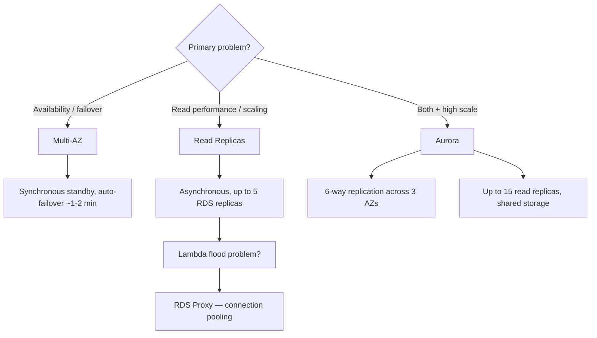
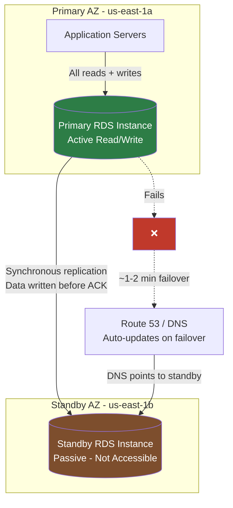
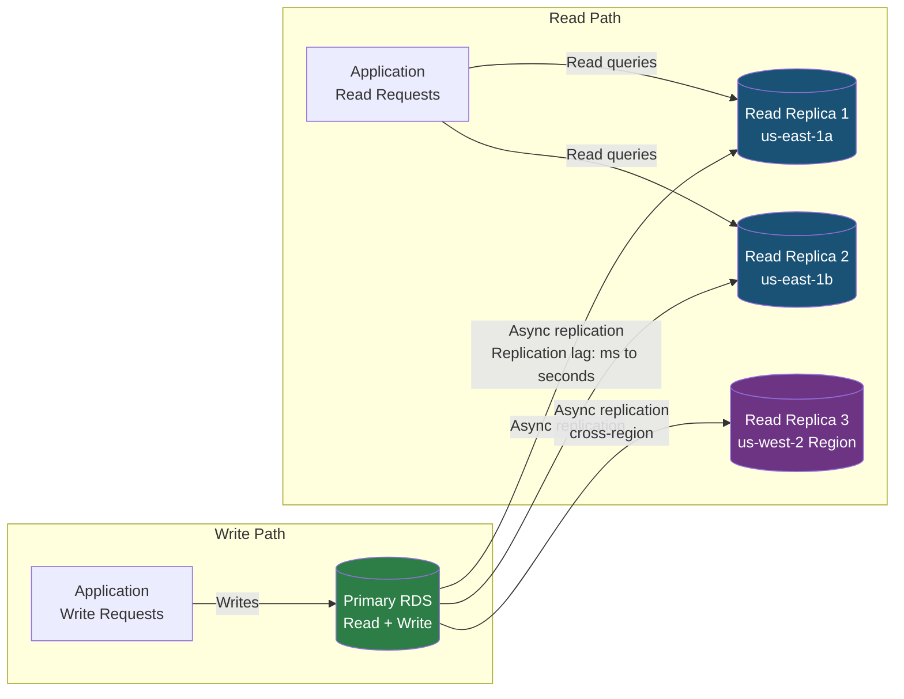
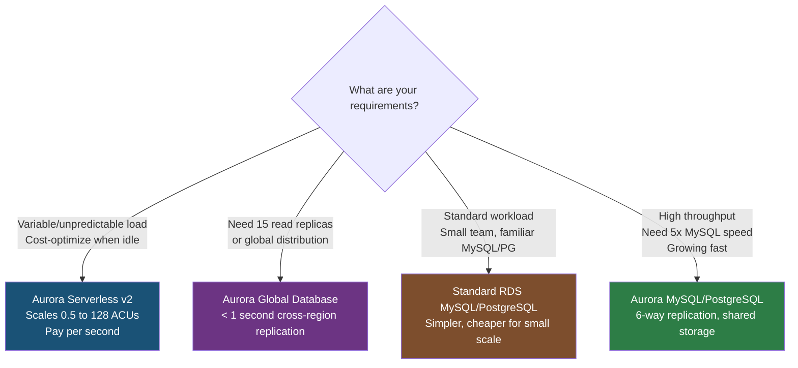
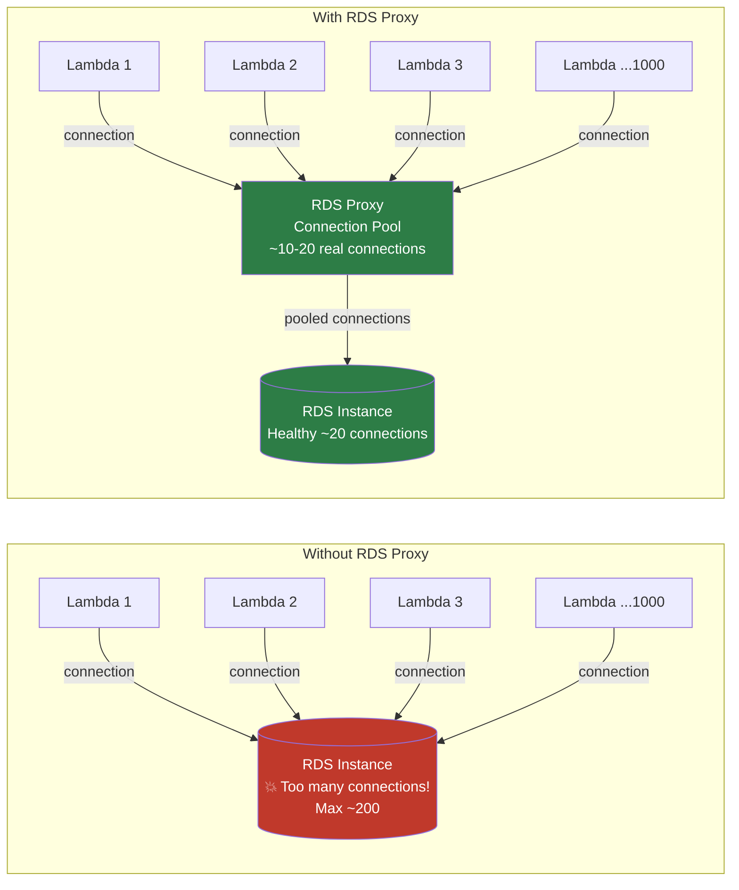
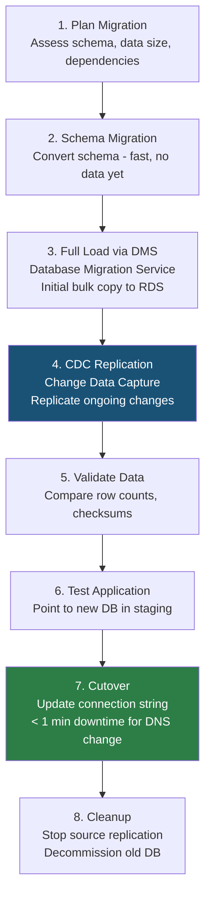

# AWS RDS: Multi-AZ, Read Replicas, Aurora, and Scaling

## 🗺️ Quick Overview



*Multi-AZ = availability; Read Replicas = performance. Aurora combines both at higher scale.*

## Question

**"How does RDS Multi-AZ work? What's the failover time and how is it different from Read Replicas?"**

Common in: AWS Solutions Architect, FAANG infrastructure, backend system design interviews

---

## Quick Answer (30-second version)

- **Multi-AZ** = High Availability. Synchronous standby in another AZ. Automatic failover ~1-2 minutes. NOT for performance.
- **Read Replicas** = Performance. Asynchronous copies. Up to 15 (Aurora) or 5 (RDS). For read-heavy workloads. NOT automatic failover.
- **Aurora** = AWS-rebuilt MySQL/PostgreSQL. 6-way replication across 3 AZs. 5x faster than MySQL. Up to 15 read replicas, all sharing the same storage.
- **RDS Proxy** = Connection pooler. Solves the "Lambda + RDS = too many connections" problem.
- **Exam trick**: Multi-AZ is synchronous. Read Replicas are asynchronous. These two facts alone get you past most trick questions.

---

## Why This Matters — The Thought Process

When an interviewer asks about RDS, they're really testing whether you understand the difference between **availability** and **performance** — two very different problems with very different solutions.

**Scenario A**: "Our database crashes, we lose data and go down for 30 minutes."
→ That's an **availability** problem → Multi-AZ

**Scenario B**: "Our database CPU is at 80%, queries are slow, users are complaining."
→ That's a **performance** problem → Read Replicas, Aurora, caching

The mistake most candidates make: they answer availability problems with read replicas ("just add more read replicas!") — which does nothing for failover. Or they answer performance problems with Multi-AZ ("just enable Multi-AZ!") — which does nothing for read throughput.

**The mental model**: Multi-AZ = insurance policy. Read Replicas = hiring more workers.

---

## Architecture: RDS Multi-AZ



**Key Multi-AZ facts interviewers test:**
- Standby is NOT accessible — no queries, no reads, nothing. It exists purely as a hot spare.
- Failover is automatic via DNS CNAME flip — your connection string doesn't change.
- Synchronous replication means zero data loss on failover (RPO = 0).
- Failover triggers: AZ outage, DB instance failure, OS patching, DB engine version upgrade.
- Standby is in a **different AZ**, not a different region (that's a separate feature: cross-region replicas).

---

## Architecture: RDS Read Replicas



**Key Read Replica facts:**
- Asynchronous — there can be replication lag (seconds to minutes under heavy write load).
- You can have up to 5 read replicas for standard RDS, up to 15 for Aurora.
- Cross-region read replicas are possible (useful for disaster recovery + geo-distributed reads).
- Read replicas can be promoted to primary in a DR scenario — but this is manual, not automatic.
- Each read replica has its own DNS endpoint — your app must explicitly route reads there.

---

## Multi-AZ vs Read Replicas — The Crystal Clear Distinction

| Dimension | Multi-AZ | Read Replicas |
|-----------|----------|---------------|
| **Purpose** | High Availability (HA) | Read Performance |
| **Replication** | Synchronous | Asynchronous |
| **Standby accessible?** | No — passive standby | Yes — active, read-only |
| **Failover** | Automatic (~1-2 min) | Manual promotion |
| **Data loss on failure** | Zero (synchronous) | Possible (replication lag) |
| **Number of copies** | 1 standby | Up to 5 (RDS), 15 (Aurora) |
| **Cross-region?** | No | Yes |
| **Cost** | Doubles DB cost | Each replica is full instance cost |
| **Solves** | "DB went down" | "DB is slow on reads" |

**Interview follow-up trap**: "Can you use a Multi-AZ standby for reporting queries?"
→ No. The standby is completely inaccessible. You need a read replica for reporting. These are orthogonal features — you can have both enabled simultaneously.

---

## Aurora vs RDS MySQL/PostgreSQL — When to Choose



### Aurora's Storage Architecture — Why It's Different

```
Standard RDS Multi-AZ:
  Primary → writes to local storage
  Primary → synchronously replicates to Standby storage
  2 copies of data, 2 I/O operations per write

Aurora Shared Storage:
  Primary → writes go to Aurora Storage Layer
  Storage Layer → automatically replicates across 3 AZs, 6 copies
  All instances (primary + replicas) share the SAME storage volume
  Result: Reads from any replica see the same data immediately
  No replication lag for Aurora read replicas (they read from shared storage)
```

**Aurora advantages in interview terms:**
- **6-way replication**: 2 copies in 3 AZs. Can tolerate losing 2 copies for writes, 3 copies for reads.
- **No replication lag**: Read replicas share storage — they're not "behind" like standard RDS replicas.
- **5x faster than MySQL**: Redo log optimization, purpose-built storage.
- **15 read replicas** (vs 5 for standard RDS).
- **Automatic storage growth**: Starts at 10GB, grows in 10GB increments up to 128TB.
- **Backtrack**: Roll back database to any point in time without restoring a snapshot (Aurora-specific).

### Aurora Endpoints — An Exam Favorite

```
Aurora provides multiple endpoint types:

1. Cluster Endpoint (Writer Endpoint):
   mydb.cluster-xyz.us-east-1.rds.amazonaws.com
   → Always points to current writer instance
   → Automatically updates on failover

2. Reader Endpoint:
   mydb.cluster-ro-xyz.us-east-1.rds.amazonaws.com
   → Load balances across all read replicas
   → Your app uses this for SELECT queries

3. Instance Endpoints:
   mydb-instance-1.xyz.us-east-1.rds.amazonaws.com
   → Points to specific instance
   → Use for diagnostic queries or specific instance targeting

4. Custom Endpoints:
   → You define which instances are in the group
   → Use case: point analysts at larger instances for reporting
```

---

## Aurora Serverless v2 — The Variable Load Solution

**When to use**: Traffic that is completely unpredictable — dev/test, new products, infrequent reporting.

```
Aurora Serverless v2 Scaling:
  Minimum: 0.5 ACUs (Aurora Capacity Units)
  Maximum: 128 ACUs
  1 ACU ≈ 2 GB RAM + proportional CPU

  Scale-up: Near-instant (seconds), triggered by CPU or connection pressure
  Scale-down: Gradual (minutes)
  Cost: Pay per second of ACU usage

  vs Serverless v1:
    v1: Could scale to zero (pause/resume), but cold start was 30+ seconds
    v2: Cannot scale to zero, minimum 0.5 ACU, but scale-up is near-instant
```

**Interview question**: "When does Aurora Serverless v2 NOT make sense?"
→ When you have steady, predictable load. Provisioned Aurora will be cheaper because you're not paying the Serverless premium. Serverless shines when you go from 0 to 100 to 0 repeatedly.

---

## RDS Proxy — Solving the Lambda Connection Problem

**The problem**: Lambda functions are stateless. They can scale to thousands of concurrent instances, each trying to open its own database connection. A PostgreSQL instance handles ~100-200 connections before performance degrades.



**RDS Proxy features:**
- Maintains a warm pool of connections to RDS.
- Multiplexes thousands of application connections through a small pool.
- Failover-aware: During Multi-AZ failover, proxy reconnects to new primary — your app sees reduced downtime (failover is faster because connections aren't dropped).
- Supports IAM authentication — no credentials in Lambda code.
- Serverless-native: Designed for Lambda, ECS, other ephemeral compute.

---

## Scaling RDS — Decision Framework

**Your RDS CPU is at 80% during reads. What do you do?**

```
Step 1: Identify the bottleneck
  → Is it reads or writes causing high CPU?
  → Check: CloudWatch ReadIOPS vs WriteIOPS, CPUUtilization

Step 2 (if reads):
  Option A: Add Read Replicas
    → Route SELECT queries to read replica endpoints
    → Each replica reduces load on primary by taking read traffic

  Option B: Add ElastiCache (Redis) in front of DB
    → Cache frequently-read, infrequently-changed data
    → 99% cache hit rate = 99% fewer DB reads

  Option C: Migrate to Aurora
    → Share read load across up to 15 replicas
    → Storage-level replication means no lag between replicas

Step 3 (if writes):
  Option A: Optimize queries (EXPLAIN ANALYZE, indexes)
  Option B: Use write-through caching
  Option C: Shard the database (complex, last resort)
  Option D: Use DynamoDB for write-heavy workloads

Step 4 (instance too small):
  → Vertical scaling: Change instance class (requires brief downtime)
  → Enable Multi-AZ first → upgrade standby → fail over → upgrade old primary
  → This gives you near-zero downtime vertical scaling
```

---

## Storage Types — What the Exam Tests

| Storage Type | IOPS | Use Case | Cost |
|---|---|---|---|
| **gp2 (General Purpose SSD)** | Baseline 3 IOPS/GB, burst to 3000 | Most workloads, dev/test | Low |
| **gp3 (General Purpose SSD v2)** | Baseline 3000 IOPS, configurable to 16000 | Most production workloads | Low-Medium |
| **io1 (Provisioned IOPS)** | Up to 64,000 IOPS | High-throughput transactional | High |
| **io2 (Provisioned IOPS)** | Up to 64,000 IOPS, 99.999% durability | Mission-critical | Highest |

**Interview tip**: gp3 replaced gp2 as the recommended default — you get more baseline IOPS at lower cost. The key difference from gp2: IOPS and throughput can be scaled independently from storage size.

---

## Database Migration with Zero Downtime

**The problem**: How do you migrate a 2TB production PostgreSQL database to RDS without 4 hours of downtime?



**DMS (Database Migration Service) key points:**
- Supports homogeneous (MySQL→MySQL) and heterogeneous (Oracle→PostgreSQL) migrations.
- Schema Conversion Tool (SCT) handles heterogeneous schema translation.
- CDC (Change Data Capture) uses database transaction logs to replicate ongoing changes during migration.
- During the CDC phase, source and target stay in sync — you can run both in parallel for weeks.
- Cutover = update application connection string. With Route 53 and short TTLs, this is near-instantaneous.

**Blue-Green Deployments** (RDS native, launched 2022):
```
1. RDS creates a "green" copy of your DB (fully synced staging environment)
2. You make changes on green (schema changes, OS upgrades, engine upgrades)
3. Test application against green environment
4. One-click switchover: RDS swaps DNS endpoints in ~minutes
5. Old "blue" environment retained for rollback

Use case: Major version upgrades (PostgreSQL 13 → 16) with confidence
```

---

## Backup: Automated Backups vs Manual Snapshots

| Feature | Automated Backups | Manual Snapshots |
|---|---|---|
| **Trigger** | Daily, automatic | Manual or via Lambda/EventBridge |
| **Retention** | 0-35 days (configurable) | Indefinitely (until you delete) |
| **Point-in-time recovery** | Yes, to any second in retention window | No — only to snapshot point |
| **Transaction logs** | Stored alongside backups | Not included |
| **On instance deletion** | Deleted with instance (optionally retain) | NOT deleted automatically |
| **Cross-region copy** | Manually copy | Manually copy |

**Interview scenario**: "We deleted our RDS instance by accident. What can we recover?"
→ Manual snapshots survive instance deletion (if you had them). Automated backups do NOT survive deletion by default. Enable "final snapshot" and "backup retention" — and critically, enable "deletion protection" to prevent this scenario.

---

## Code Examples

### Node.js with RDS Proxy Connection Pooling

```javascript
// rds-proxy-connection.js
// Problem: Lambda creates 1000 concurrent connections → DB melts
// Solution: RDS Proxy absorbs all connections, pools ~20 to DB

const mysql = require('mysql2/promise');

// In Lambda with RDS Proxy, the proxy endpoint is used
// Proxy handles connection pooling — no need for pg-pool in Lambda
const dbConfig = {
  host: process.env.RDS_PROXY_ENDPOINT,   // proxy endpoint, not DB endpoint
  user: process.env.DB_USER,
  database: process.env.DB_NAME,
  // Prefer IAM auth over passwords in Lambda
  ssl: { rejectUnauthorized: true }
};

// With IAM authentication (recommended pattern)
const { Signer } = require('@aws-sdk/rds-signer');

async function getDbConnection() {
  const signer = new Signer({
    hostname: process.env.RDS_PROXY_ENDPOINT,
    port: 3306,
    region: 'us-east-1',
    username: 'lambda_user'
  });

  // Token is valid for 15 minutes — generate fresh for each Lambda cold start
  const token = await signer.getAuthToken();

  const connection = await mysql.createConnection({
    host: process.env.RDS_PROXY_ENDPOINT,
    user: 'lambda_user',
    password: token,
    database: process.env.DB_NAME,
    ssl: { rejectUnauthorized: true },
    authPlugins: {
      mysql_clear_password: () => () => Buffer.from(token + '\0')
    }
  });

  return connection;
}

// Lambda handler — connection is established per invocation
// RDS Proxy ensures the underlying DB connection is pooled
exports.handler = async (event) => {
  const conn = await getDbConnection();

  try {
    const [rows] = await conn.execute(
      'SELECT id, username, email FROM users WHERE id = ?',
      [event.userId]
    );

    return {
      statusCode: 200,
      body: JSON.stringify(rows[0] || null)
    };
  } finally {
    // This "closes" the connection to the proxy
    // The proxy keeps the underlying DB connection alive
    await conn.end();
  }
};
```

### Aurora Auto-Scaling Read Replicas

```javascript
// aurora-read-routing.js
// Route read queries to Aurora Reader Endpoint for load balancing across replicas
// Aurora's reader endpoint automatically load balances across all replicas

const { Pool } = require('pg');

// Two separate pools: writer for mutations, reader for queries
const writerPool = new Pool({
  host: process.env.AURORA_WRITER_ENDPOINT,  // cluster endpoint
  database: process.env.DB_NAME,
  user: process.env.DB_USER,
  password: process.env.DB_PASSWORD,
  max: 20,          // max connections in pool
  idleTimeoutMillis: 30000,
  connectionTimeoutMillis: 2000
});

const readerPool = new Pool({
  host: process.env.AURORA_READER_ENDPOINT,  // reader endpoint (load balances across replicas)
  database: process.env.DB_NAME,
  user: process.env.DB_USER,
  password: process.env.DB_PASSWORD,
  max: 50,          // can handle more reads
  idleTimeoutMillis: 30000,
  connectionTimeoutMillis: 2000
});

// Application-level query router
class AuroraQueryRouter {
  // SELECT → reader pool (reads from a replica)
  async query(sql, params = []) {
    const isWrite = /^\s*(INSERT|UPDATE|DELETE|CREATE|ALTER|DROP|TRUNCATE)/i.test(sql);
    const pool = isWrite ? writerPool : readerPool;
    const client = await pool.connect();

    try {
      const result = await client.query(sql, params);
      return result.rows;
    } finally {
      client.release();
    }
  }

  // Explicit write — always goes to writer
  async write(sql, params = []) {
    const client = await writerPool.connect();
    try {
      const result = await client.query(sql, params);
      return result.rows;
    } finally {
      client.release();
    }
  }

  // Transaction — always writer (transactions cannot span reader/writer)
  async transaction(callback) {
    const client = await writerPool.connect();
    try {
      await client.query('BEGIN');
      const result = await callback(client);
      await client.query('COMMIT');
      return result;
    } catch (err) {
      await client.query('ROLLBACK');
      throw err;
    } finally {
      client.release();
    }
  }
}

const db = new AuroraQueryRouter();

// Usage examples
async function getUserProfile(userId) {
  // Automatically routes to reader replica
  return db.query('SELECT * FROM users WHERE id = $1', [userId]);
}

async function createOrder(userId, items) {
  // Transaction — routes to writer, atomically
  return db.transaction(async (client) => {
    const order = await client.query(
      'INSERT INTO orders (user_id, status) VALUES ($1, $2) RETURNING id',
      [userId, 'pending']
    );
    const orderId = order.rows[0].id;

    for (const item of items) {
      await client.query(
        'INSERT INTO order_items (order_id, product_id, quantity) VALUES ($1, $2, $3)',
        [orderId, item.productId, item.quantity]
      );
    }

    return orderId;
  });
}
```

### Database Scaling — Adding Read Replica Programmatically

```javascript
// scale-read-replicas.js
// CloudWatch alarm triggers Lambda to add read replica when CPU > 70%

const { RDSClient, CreateDBInstanceReadReplicaCommand,
        DescribeDBInstancesCommand } = require('@aws-sdk/client-rds');

const rds = new RDSClient({ region: 'us-east-1' });

exports.handler = async (event) => {
  console.log('Scale event:', JSON.stringify(event));

  const clusterIdentifier = process.env.CLUSTER_ID;

  // Check current replica count
  const { DBInstances } = await rds.send(new DescribeDBInstancesCommand({
    Filters: [{
      Name: 'db-cluster-id',
      Values: [clusterIdentifier]
    }]
  }));

  const replicas = DBInstances.filter(db => db.ReadReplicaSourceDBInstanceIdentifier);
  console.log(`Current read replica count: ${replicas.length}`);

  if (replicas.length >= 15) {
    console.log('Already at maximum Aurora replicas (15). Consider read sharding.');
    return { statusCode: 200, message: 'At max replicas' };
  }

  // Add a new read replica
  const replicaId = `${clusterIdentifier}-replica-${Date.now()}`;

  await rds.send(new CreateDBInstanceReadReplicaCommand({
    DBInstanceIdentifier: replicaId,
    SourceDBClusterIdentifier: clusterIdentifier,
    DBInstanceClass: 'db.r6g.large',    // match or adjust based on load
    MultiAZ: false,                      // replicas don't need their own Multi-AZ
    AutoMinorVersionUpgrade: true,
    Tags: [{ Key: 'CreatedBy', Value: 'AutoScaler' }]
  }));

  console.log(`Read replica ${replicaId} creation initiated. Available in ~10 minutes.`);

  return {
    statusCode: 200,
    replicaId,
    message: 'Read replica creation initiated'
  };
};
```

---

## Real-World Scenario: Instagram-Scale PostgreSQL Journey

**The problem**: Instagram stored photos metadata in PostgreSQL. As they grew past 10M users, a single DB instance couldn't handle the read load.

**Their evolution:**
```
Phase 1: Single PostgreSQL instance
  → Works fine at small scale
  → Simple, easy to reason about

Phase 2: Added Read Replicas for photo feed queries
  → Reads offloaded to replicas
  → Writes (new photos, likes) still on primary
  → Key insight: 90% of queries are reads (timelines, photo views)

Phase 3: Functional sharding
  → Split by feature: users DB, photos DB, comments DB, relationships DB
  → Each functional area has its own primary + replicas
  → Reduced cross-database joins (had to be handled in application layer)

Phase 4: Horizontal sharding (pgBouncer + custom sharding)
  → User IDs hashed to determine which shard
  → Allows infinite horizontal scaling of writes
  → Complexity cost: cross-shard queries require application-level joins

Lesson: Start with read replicas. Only shard when forced by write bottleneck.
Aurora would have deferred Phase 2 and Phase 3 significantly.
```

---

## Common Interview Follow-ups

**Q: "Multi-AZ failover takes 1-2 minutes. What happens to in-flight transactions?"**
A: "They're rolled back. The application must handle retries. The DNS change propagates quickly but TCP connections to the old primary are dropped. Use connection retry logic with exponential backoff. RDS Proxy reduces failover impact further — the proxy re-establishes connections to the new primary transparently."

**Q: "Can you read from the Multi-AZ standby to reduce primary load?"**
A: "No. The standby is completely inaccessible. If you need both HA and read scaling, you need both Multi-AZ AND read replicas. Aurora's approach is better here — all 15 read replicas share the same storage, giving you both HA and read scaling in one product."

**Q: "Your RDS instance storage is filling up. What happens?"**
A: "RDS Storage Auto Scaling can handle this — it automatically increases storage when free space drops below a threshold (configurable). Minimum increment is 5GB, maximum is the configured max storage. There's no downtime for storage expansion (unlike instance class changes). Aurora storage scales automatically up to 128TB."

**Q: "How do parameter groups work?"**
A: "Parameter groups are like config files for your database engine. They control settings like max_connections, work_mem, shared_buffers (PostgreSQL), or innodb_buffer_pool_size (MySQL). Changes to static parameters require instance reboot. Dynamic parameters apply immediately. You create a custom parameter group for any non-default settings — you cannot modify the default parameter group."

**Q: "Explain RDS automated backups vs snapshots for compliance."**
A: "Automated backups are retained 0-35 days and allow point-in-time recovery to any second. They're deleted when the instance is deleted. Snapshots are permanent until manually deleted — use these for compliance. For regulatory requirements, set up EventBridge + Lambda to copy snapshots to S3 Glacier for long-term retention. You can also share encrypted snapshots with other AWS accounts."

---

## AWS Certification Exam Tips

**Most tested RDS concepts on AWS SAA/SAP:**

1. **Multi-AZ = synchronous, standby = inaccessible, automatic failover.**
   Read Replicas = asynchronous, accessible for reads, manual promotion.

2. **Aurora endpoint types**: Cluster (writer), Reader, Instance, Custom.
   Exam loves asking which endpoint to use for various scenarios.

3. **RDS Proxy is the answer to "Lambda + database connection exhaustion"** every single time.

4. **Aurora Serverless v2**: Variable load, dev/test, cannot scale to zero (use v1 for that, but v1 is slow to resume).

5. **Automated backups deleted on instance deletion. Manual snapshots are not.**
   Always enable deletion protection on production RDS.

6. **gp3 over gp2**: Better baseline IOPS, lower cost, IOPS and throughput configurable independently.

7. **Read Replica in same region = free data transfer. Cross-region = charges apply.**

8. **RDS does NOT support all database engines equally**:
   - Aurora: MySQL 5.7/8.0, PostgreSQL 11+
   - RDS: MySQL, PostgreSQL, MariaDB, Oracle, SQL Server, Db2
   - Aurora has more features (Global Database, Backtrack, serverless) than standard RDS

9. **DMS (Database Migration Service)** is the answer to migration questions.
   Schema Conversion Tool (SCT) for heterogeneous migrations.

10. **Aurora Global Database**: RPO < 1 second cross-region, RTO < 1 minute failover.
    Use for global applications needing regional read performance + cross-region DR.

---

## Key Takeaways

- Multi-AZ = availability (HA), Read Replicas = performance (read scaling). These are orthogonal — use both simultaneously for production databases.
- Aurora's shared storage architecture eliminates replication lag for read replicas and allows 15 replicas vs 5 for standard RDS.
- RDS Proxy is not optional for Lambda + RDS architectures — it prevents connection exhaustion.
- Zero-downtime migrations use DMS with CDC phase to keep source and target in sync until cutover.
- Storage Auto Scaling handles disk growth automatically; instance class changes require brief downtime (mitigate with Multi-AZ + failover trick).

---

## Related Questions

- [DynamoDB NoSQL Design](/interview-prep/quick-reference/aws-cloud/dynamodb-nosql)
- [ElastiCache Redis Caching](/interview-prep/quick-reference/aws-cloud/elasticache-redis)
- [Auto-Scaling Groups](/interview-prep/quick-reference/aws-cloud/auto-scaling)
- [Lambda Serverless](/interview-prep/quick-reference/aws-cloud/lambda-serverless)
