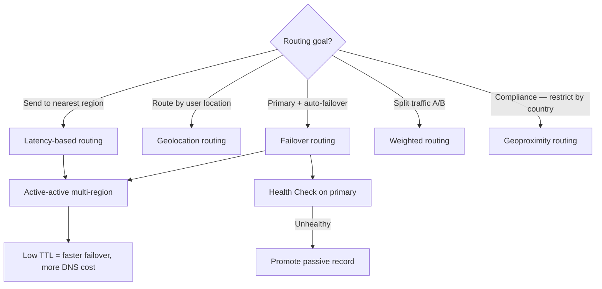
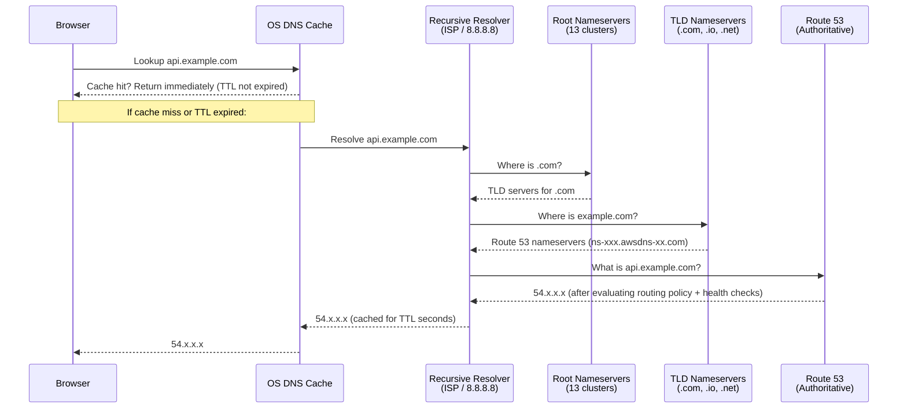
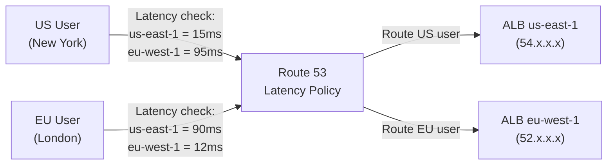
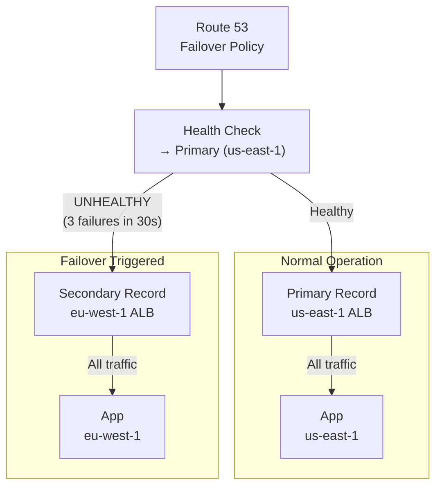
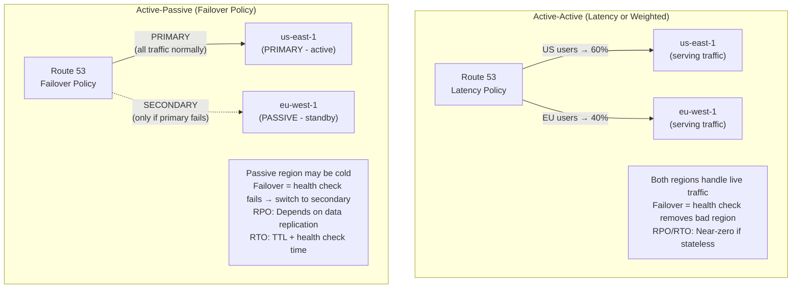
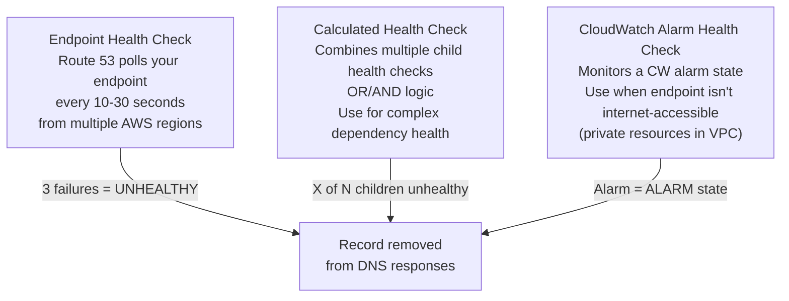
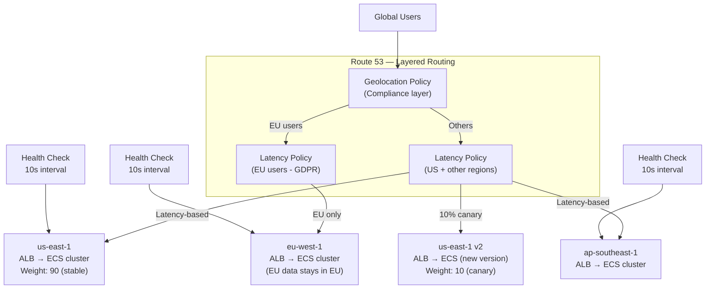
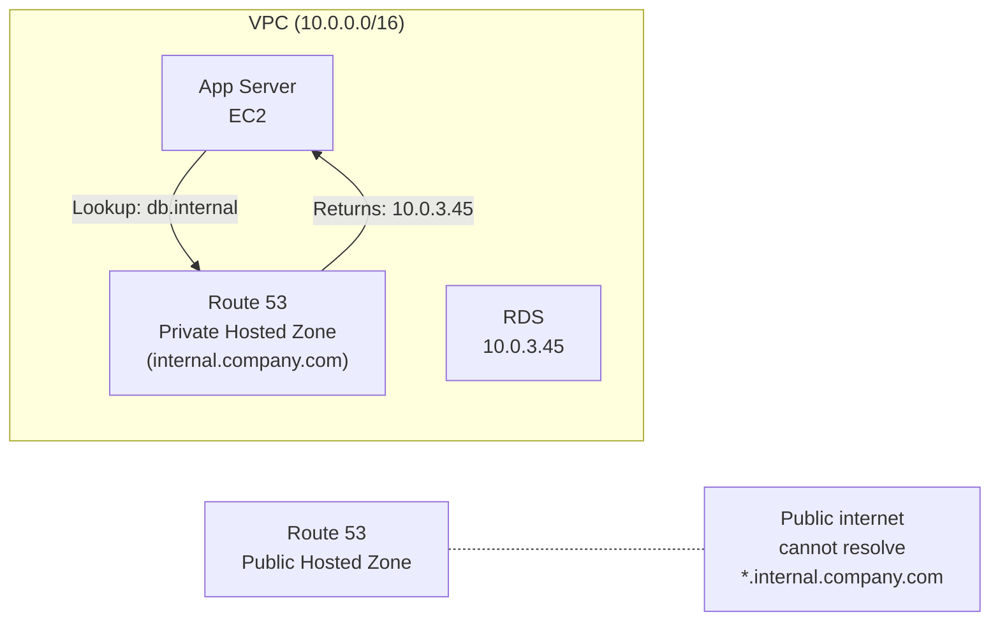

# AWS Route 53: DNS Routing, Failover, and Global Traffic Management

## 🗺️ Quick Overview



*Health checks are what make automatic failover work. Always pair Failover routing with health checks.*

> **Common Interview Question**: "Your application is deployed in us-east-1 and eu-west-1. How do you route users to the nearest region with automatic failover? Explain the different Route 53 routing policies and when you'd use each."

Common in: AWS Solutions Architect, Senior Backend, Infrastructure, Distributed Systems interviews

---

## Quick Answer (30-second version)

- **Route 53** = AWS's authoritative DNS + health checking + traffic routing service. It is **global**, not regional.
- **7 routing policies**: Simple, Weighted, Latency, Failover, Geolocation, Geoproximity, Multivalue Answer
- **Health checks** determine record availability. Route 53 automatically removes unhealthy endpoints from DNS responses.
- **Active-active**: Both regions serve traffic (Latency-based or Geolocation). Both healthy records returned.
- **Active-passive**: One region is primary. Failover record promoted only when primary health check fails.
- **Alias record vs CNAME**: Alias is AWS-native, works at zone apex (`example.com`), free queries. CNAME can't be at zone apex, charges per query. For ALB, CloudFront, S3 — always use Alias.
- **TTL impact**: Low TTL (60s) = faster failover, more DNS queries. High TTL (300s+) = slower failover, cheaper.

---

## Why This Matters / The Thought Process

DNS is the first step in every user request. When it fails or routes poorly, everything downstream fails. Route 53 decisions made wrong cause:
- Users hitting a dead region for minutes (high TTL + no health checks)
- US users being routed to EU servers (missing Latency policy)
- Traffic imbalance between regions (Weighted policy misconfigured)

When an interviewer asks about Route 53, they're testing:
- Do you understand that DNS is eventually consistent (TTL matters for failover speed)?
- Can you design a routing strategy that handles region failure within 30-60 seconds?
- Do you know the subtle difference between Failover and Latency policies?
- Do you understand that Route 53 health checks don't use CloudWatch — they're independent?

**The SA mindset**: Route 53 is not just DNS — it's your global load balancer, your failover controller, and your traffic manager. Design it wrong and your SLA is a fiction.

---

## DNS Resolution Flow

Understanding how DNS works underpins everything about TTL and failover timing:



**Why TTL matters for failover**:
- If TTL = 300s and your primary fails, clients who already resolved the IP keep hitting the dead server for up to 300 seconds
- Route 53 health check detects failure in 10-30 seconds, removes the bad record — but DNS propagation takes TTL seconds
- **During failover**: Lower TTL = faster recovery but higher DNS query cost

---

## All 7 Routing Policies — Decision Table

| Policy | How It Routes | Use Case | Supports Health Checks |
|--------|--------------|----------|----------------------|
| **Simple** | Returns one record (or all if multiple values) | Single resource, no routing logic | No |
| **Weighted** | Distributes % across records | A/B testing, gradual deploys, traffic splitting | Yes |
| **Latency** | Routes to region with lowest network latency | Multi-region, best user experience | Yes |
| **Failover** | Primary/secondary — active-passive | DR scenarios, backup region | Yes (required) |
| **Geolocation** | Routes based on user's country/continent | Compliance, localization, content restrictions | Yes |
| **Geoproximity** | Routes based on proximity + optional bias | Geographic traffic shifting | Yes |
| **Multivalue Answer** | Returns up to 8 healthy records randomly | Client-side load balancing (not a replacement for ALB) | Yes |

---

## Deep Dive: Each Routing Policy

### Simple
```
api.example.com → [3.x.x.x]
# No logic. No health checks. Single value or all values returned.
# Use when: one server, no failover needed, dev environments
```

### Weighted — A/B Testing and Blue/Green Deploys

```
api.example.com
  ├── Weight 90 → v1 (ALB in us-east-1, stable)
  └── Weight 10 → v2 (ALB in us-east-1, new version)
```

**How weight works**: Total all weights, calculate percentage. Weight 90 + 10 = 100. 90% v1, 10% v2.

**Blue/Green rollout**: Start at 5% for new version, watch error rates, ramp to 100%. If bad, set weight to 0 (not delete the record — keeping it at 0 lets you quickly ramp back up).

**Set weight=0 to stop traffic** without deleting the record. Record still exists for easy re-enabling.

### Latency — Multi-Region Best Experience



**Important nuance**: Latency is measured between the **Recursive Resolver** (usually near the user) and the AWS region. It's based on AWS's historical latency measurements — not real-time. It can route a London user to us-east-1 if their ISP's resolver happens to be in a US location.

### Failover — Active-Passive



**Health check configuration for fast failover:**
- Check interval: 10 seconds (fast) vs 30 seconds (standard)
- Failure threshold: 3 consecutive failures = unhealthy
- Time to detect failure: 10s × 3 = **30 seconds**
- Plus TTL: If TTL = 60s, total failover time = 30s + 60s = **90 seconds maximum**

### Geolocation — Compliance and Localization

```
api.example.com
  ├── Continent: EU → eu-west-1 (data residency compliance)
  ├── Country: CN → ap-east-1 (China-specific content)
  ├── Country: US → us-east-1 (default US endpoint)
  └── Default → us-east-1 (anyone not matching above)
```

**ALWAYS create a Default record**. Without it, users from unmatched locations get a DNS NXDOMAIN error.

**Geolocation vs Latency**:
- Geolocation: Routes based on WHERE the user is — deterministic.
- Latency: Routes based on network performance — may not respect geography.
- Use Geolocation for: GDPR compliance (EU data must stay in EU), content licensing restrictions.
- Use Latency for: best performance without geographic constraints.

### Geoproximity — With Traffic Bias

Like Latency, but you can shift the geographic boundaries using a **bias value**.

```
Bias = 0: Natural routing boundary (50/50 split roughly)
Bias = +50 on us-east-1: Expand us-east-1's catchment area (routes more traffic to it)
Bias = -50 on eu-west-1: Shrink eu-west-1's catchment area
```

Use case: Gradually shift traffic away from a region for maintenance. Or preferentially serve traffic from a higher-capacity region.

### Multivalue Answer — NOT a Load Balancer

Returns up to 8 healthy IP addresses. Client picks one randomly.

```
api.example.com → [1.1.1.1, 2.2.2.2, 3.3.3.3, 4.4.4.4]  (all healthy)
api.example.com → [1.1.1.1, 3.3.3.3, 4.4.4.4]            (2.2.2.2 is unhealthy)
```

**Why it's NOT an ALB replacement**: Route 53 is not in the request path — it just returns IPs. The client makes the HTTP connection. ALB actually proxies, does health checks at HTTP level, drains connections, etc.

---

## Active-Active vs Active-Passive Failover



**When to use which:**

| Scenario | Use | Reason |
|----------|-----|--------|
| Stateless API, need best performance | Active-Active (Latency) | Both regions handle traffic, automatic load distribution |
| Stateful app, complex data sync | Active-Passive (Failover) | Avoid split-brain, simpler replication |
| DR with cost sensitivity | Active-Passive | Secondary can be smaller (scale up on failover) |
| Zero-downtime requirement | Active-Active | No failover delay |
| Compliance (data residency) | Active-Active with Geolocation | Route EU users to EU always |

---

## Health Checks — Endpoint, Calculated, CloudWatch Alarm



**Health check configuration for production:**
```
Protocol: HTTPS
Port: 443
Path: /health  (not / — use a dedicated health endpoint)
Check interval: 10 seconds (costs more but faster detection)
Failure threshold: 3
String matching: Optionally check response body for "OK" string
```

**Private resource health checks**: Route 53 health checkers are on the internet — they can't reach private EC2 instances. Use CloudWatch Alarm health check: EC2 metric → CW Alarm → Route 53 watches alarm state.

---

## Real-World Scenario: Netflix-Style Global Traffic Management

**Situation**: Video streaming service with 50M users globally. 3 regions: us-east-1 (primary), eu-west-1 (Europe), ap-southeast-1 (Asia). Requirements: lowest latency, automatic failover, gradual rollout for new API versions.

**Architecture Decision:**



**TTL Strategy for this scenario:**
- Normal operation: TTL = 60s (balance between query cost and failover speed)
- Before planned failover (maintenance): Lower TTL to 30s an hour before. Clients will resolve fresh IPs faster.
- After failover complete: Raise TTL back to 60s.

---

## Alias Records vs CNAME — The Critical Difference

This is an exam and interview staple. Memorize the rules.

| | Alias Record | CNAME |
|--|-------------|-------|
| **Zone apex** | YES — works at `example.com` | NO — only subdomains like `api.example.com` |
| **Query cost** | Free (Route 53 resolves internally) | $0.40/million queries |
| **Points to** | AWS resources only | Any hostname |
| **DNS response** | Returns actual IP directly | Returns another hostname |
| **TTL** | Controlled by AWS resource | You set it |
| **Health checks** | Can be linked to resource health | Cannot link to resource health |

**When you MUST use Alias (not CNAME):**
- ALB → Use Alias
- CloudFront distribution → Use Alias
- S3 static website → Use Alias
- Another Route 53 record → Use Alias
- Elastic Beanstalk → Use Alias
- Zone apex (`example.com`) → ALWAYS Alias

**Interview trap**: "I want `example.com` to point to my ALB. Can I use a CNAME?" — No. CNAMEs cannot be at the zone apex. Use an Alias record.

---

## Private Hosted Zones — Internal Service Discovery



**Use cases:**
- Microservices resolving each other by name instead of IP (`auth.internal`, `user-service.internal`)
- Pointing to RDS endpoints with a friendly name (so you can failover RDS without updating app configs)
- Split-horizon DNS: Same domain name resolves differently inside VPC vs public internet

**Setup**: Associate the private hosted zone with your VPC. Enable DNS resolution and DNS hostnames on the VPC.

---

## Terraform: Route 53 with Health Checks and Failover

```hcl
# route53-failover.tf

# Primary health check (us-east-1)
resource "aws_route53_health_check" "primary" {
  fqdn              = "api-primary.example.com"
  port              = 443
  type              = "HTTPS"
  resource_path     = "/health"
  failure_threshold = 3
  request_interval  = 10    # 10s for faster detection (costs more)

  regions = [
    "us-east-1",
    "eu-west-1",
    "ap-southeast-1"   # Check from multiple continents
  ]

  tags = { Name = "primary-health-check" }
}

# Hosted zone
data "aws_route53_zone" "main" {
  name = "example.com"
}

# Primary record (us-east-1 ALB) — active
resource "aws_route53_record" "primary" {
  zone_id = data.aws_route53_zone.main.zone_id
  name    = "api.example.com"
  type    = "A"

  alias {
    name                   = aws_lb.primary.dns_name
    zone_id                = aws_lb.primary.zone_id
    evaluate_target_health = true   # Route 53 also checks ALB health
  }

  set_identifier  = "primary"
  health_check_id = aws_route53_health_check.primary.id

  failover_routing_policy {
    type = "PRIMARY"
  }
}

# Secondary record (eu-west-1 ALB) — passive failover
resource "aws_route53_record" "secondary" {
  zone_id = data.aws_route53_zone.main.zone_id
  name    = "api.example.com"
  type    = "A"

  alias {
    name                   = aws_lb.secondary.dns_name
    zone_id                = aws_lb.secondary.zone_id
    evaluate_target_health = true
  }

  set_identifier = "secondary"

  failover_routing_policy {
    type = "SECONDARY"
  }
  # No health_check_id — secondary is always considered healthy
  # Route 53 only fails to secondary when primary is unhealthy
}

# Weighted routing for A/B testing (separate record set)
resource "aws_route53_record" "api_v1" {
  zone_id        = data.aws_route53_zone.main.zone_id
  name           = "api-beta.example.com"
  type           = "A"
  set_identifier = "v1-stable"

  weighted_routing_policy {
    weight = 90
  }

  alias {
    name                   = aws_lb.v1.dns_name
    zone_id                = aws_lb.v1.zone_id
    evaluate_target_health = true
  }
}

resource "aws_route53_record" "api_v2" {
  zone_id        = data.aws_route53_zone.main.zone_id
  name           = "api-beta.example.com"
  type           = "A"
  set_identifier = "v2-canary"

  weighted_routing_policy {
    weight = 10   # 10% canary traffic
  }

  alias {
    name                   = aws_lb.v2.dns_name
    zone_id                = aws_lb.v2.zone_id
    evaluate_target_health = true
  }
}
```

---

## Node.js: Programmatic Route 53 Failover Control

```javascript
// route53-traffic-manager.js
// Use case: Automated incident response — shift traffic programmatically
const { Route53Client, ChangeResourceRecordSetsCommand,
        GetHealthCheckStatusCommand } = require('@aws-sdk/client-route-53');

const client = new Route53Client({ region: 'us-east-1' });

// Check health of a Route 53 health check
async function getHealthCheckStatus(healthCheckId) {
  const command = new GetHealthCheckStatusCommand({ HealthCheckId: healthCheckId });
  const response = await client.send(command);

  // Aggregate status from multiple checker regions
  const checkers = response.HealthCheckObservations;
  const healthyCount = checkers.filter(c => c.StatusReport?.Status?.startsWith('Success')).length;
  const totalCount = checkers.length;

  return {
    healthy: healthyCount > totalCount / 2,  // Majority healthy
    healthyCount,
    totalCount,
  };
}

// Shift weighted traffic — useful for gradual rollouts or emergency rerouting
async function shiftTrafficWeight(hostedZoneId, recordName, primaryWeight, secondaryWeight) {
  const command = new ChangeResourceRecordSetsCommand({
    HostedZoneId: hostedZoneId,
    ChangeBatch: {
      Changes: [
        {
          Action: 'UPSERT',
          ResourceRecordSet: {
            Name: recordName,
            Type: 'A',
            SetIdentifier: 'primary-us-east-1',
            Weight: primaryWeight,       // e.g., set to 0 for emergency shutdown
            AliasTarget: {
              HostedZoneId: 'Z35SXDOTRQ7X7K',  // ALB zone ID for us-east-1
              DNSName: process.env.PRIMARY_ALB_DNS,
              EvaluateTargetHealth: true,
            },
          },
        },
        {
          Action: 'UPSERT',
          ResourceRecordSet: {
            Name: recordName,
            Type: 'A',
            SetIdentifier: 'secondary-eu-west-1',
            Weight: secondaryWeight,     // e.g., set to 100 to absorb all traffic
            AliasTarget: {
              HostedZoneId: 'Z32O12XQLNTSW2',  // ALB zone ID for eu-west-1
              DNSName: process.env.SECONDARY_ALB_DNS,
              EvaluateTargetHealth: true,
            },
          },
        },
      ],
    },
  });

  await client.send(command);
  console.log(`Traffic shifted: primary=${primaryWeight}, secondary=${secondaryWeight}`);
}

// Emergency: Route all traffic away from broken region
async function emergencyFailover(hostedZoneId, recordName) {
  console.log('Initiating emergency failover...');
  await shiftTrafficWeight(hostedZoneId, recordName, 0, 100);
  console.log('Failover complete. Monitor secondary region capacity.');
}

// Example usage:
// emergencyFailover('Z1234567890', 'api.example.com');
```

---

## Common Interview Follow-ups

**Q: "What's the fastest possible Route 53 failover time?"**
- Health check interval: 10 seconds × failure threshold 3 = 30 seconds to detect failure
- DNS propagation: TTL seconds (minimum practical: 30-60s)
- Total minimum failover: **60-90 seconds**
- You cannot do faster with Route 53 alone. For sub-second failover, use ALB + target group health checks (within a region).

**Q: "Route 53 vs CloudFront for global traffic management?"**
- Route 53 = DNS-level routing. Directs users to an origin.
- CloudFront = Content delivery network. Caches at edge, reduces origin load.
- They're complementary: Route 53 → CloudFront distribution → ALB in origin region.

**Q: "Can Route 53 load balance across multiple IPs?"**
- Multivalue Answer returns up to 8 IPs. Client picks one randomly. Not real load balancing.
- Real load balancing: ALB (within region), NLB, or Global Accelerator (cross-region).

**Q: "What's the difference between Route 53 and Global Accelerator?"**
- Route 53: DNS-based. Client resolves IP and connects directly. Subject to DNS caching/TTL.
- Global Accelerator: Anycast routing. Client connects to nearest AWS edge, traffic traverses AWS backbone. Consistent low latency. Immediate failover (no DNS TTL delay).
- Use Global Accelerator when you need sub-60 second failover and consistent performance.

**Q: "How do you debug Route 53 routing issues?"**
```bash
# Check what a DNS resolver returns from a specific location
dig api.example.com @8.8.8.8

# Check TTL remaining
dig +ttl api.example.com

# Check from Route 53's perspective (AWS CLI)
aws route53 test-dns-answer \
  --hosted-zone-id ZONE_ID \
  --record-name api.example.com \
  --record-type A \
  --resolver-ip 8.8.8.8
```

---

## AWS Certification Exam Tips

1. **Route 53 is global** — not deployed per region. You pay per hosted zone and per query.
2. **Alias records are free** — Route 53 doesn't charge for Alias record queries. CNAME queries are charged.
3. **Zone apex requires Alias** — `example.com` (not `www.example.com`) cannot use CNAME. Must use Alias.
4. **Alias targets must be in the same account** — Can't Alias to another account's ALB.
5. **Health checks are global** — Route 53 health checkers are distributed worldwide. They check from 15+ regions by default.
6. **Failover requires health checks** — The PRIMARY record must have a health check. Secondary does not need one.
7. **TTL is per record** — Each record has its own TTL. Different records in same zone can have different TTLs.
8. **Private hosted zones**: Must enable DNS resolution AND DNS hostnames on the VPC. Associate zone with VPC.
9. **Geolocation Default record**: Without a default, unmatched locations get NXDOMAIN. Always add Default.
10. **Latency routing uses AWS backbone data** — not real-time measurement. Based on historical latency between resolver regions and AWS regions.
11. **Weighted 0** = Stop sending traffic. The record stays. Weighted = remove the record if you want to stop and clean up.
12. **Calculated health checks** = Combine up to 256 child health checks with AND/OR logic. Used for complex health aggregation.

---

## Key Takeaways

- Route 53 is **global and authoritative** — it's your traffic manager, not just a DNS registry.
- Choose routing policy based on goal: **performance** (Latency), **compliance** (Geolocation), **DR** (Failover), **gradual rollout** (Weighted).
- **Health checks are the nervous system**: Configure 10s interval, 3 failures threshold for fastest detection. Combined with TTL, failover is 60-90 seconds minimum.
- **Alias > CNAME** for AWS resources: Free, works at zone apex, integrates with ALB/CloudFront health.
- **Active-active** (Latency) serves all traffic across regions simultaneously — better RTO, more complex data strategy. **Active-passive** (Failover) keeps secondary warm but idle — simpler data model.
- **TTL is your failover speed dial**: Low TTL = fast failover + more DNS cost. Tune based on your RTO requirement.
- **Private hosted zones** enable internal service discovery within VPC — essential for microservices.

## Related Topics

- [Load Balancer (ALB vs NLB)](/12-interview-prep/quick-reference/aws-cloud/load-balancer)
- [Auto Scaling](/12-interview-prep/quick-reference/aws-cloud/auto-scaling)
- [CloudWatch Monitoring](/12-interview-prep/quick-reference/aws-cloud/cloudwatch-monitoring)
- [VPC Networking](/12-interview-prep/quick-reference/aws-cloud/vpc-networking)
