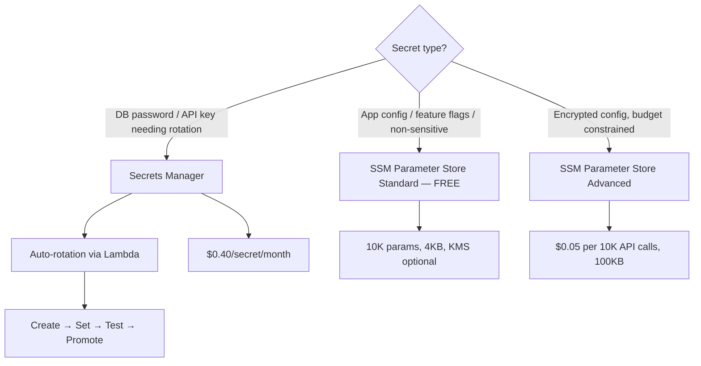
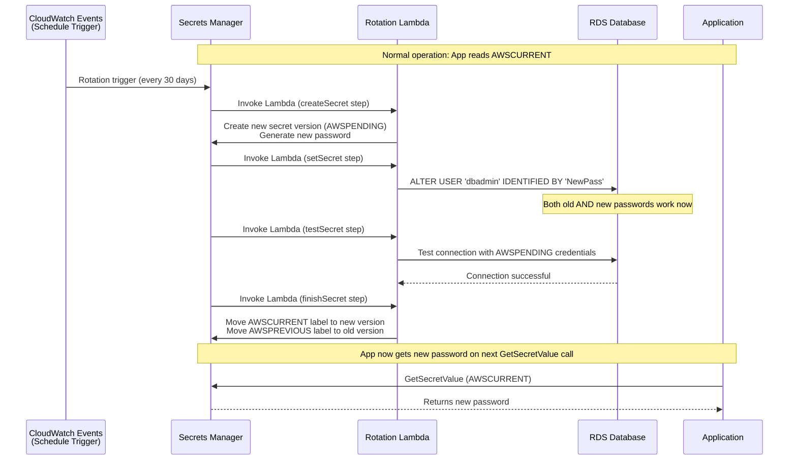
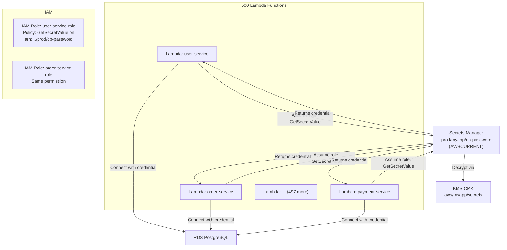
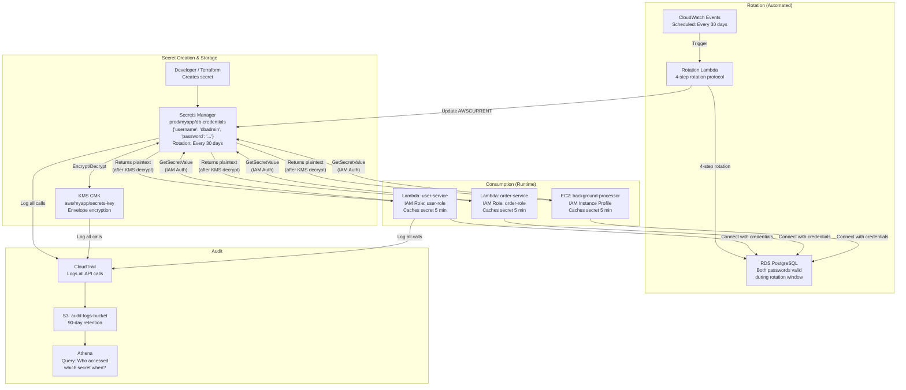

# AWS Secrets Manager & SSM Parameter Store: Credential Management Done Right

## 🗺️ Quick Overview



*Use Secrets Manager for anything needing rotation; SSM Parameter Store for static config.*

> **Common Interview Question**: "How do you handle database password rotation across 500 Lambda functions without downtime? What's the difference between Secrets Manager and SSM Parameter Store? When would you use each?"

Common in: AWS Solutions Architect, Security Engineering, Senior Backend, DevOps/Platform interviews

---

## Quick Answer (30-second version)

- **Secrets Manager** = Managed secrets store with **automatic rotation**. Costs $0.40/secret/month. Use for DB passwords, API keys, OAuth tokens — anything needing rotation.
- **SSM Parameter Store Standard** = **FREE** configuration store. 10,000 params, 4KB max, basic SecureString with KMS. Use for app config, feature flags, non-sensitive values.
- **SSM Parameter Store Advanced** = $0.05/10,000 API calls. 100KB params, 8 types of policies, parameter store policies. Use when you need encryption but can't justify Secrets Manager costs.
- **Rotation**: Secrets Manager invokes a **Lambda function** that rotates the secret in 4 steps: create → set → test → finish (promote AWSPENDING to AWSCURRENT).
- **Never hardcode credentials** — use IAM roles + `GetSecretValue` API call in your application code.
- **Cross-account**: Grant access via resource-based policy on the secret + allow `kms:Decrypt` on the CMK.

---

## Why This Matters / The Thought Process

When an interviewer asks about credential management, they're testing whether you understand **operational security at scale**.

The real questions behind the question:
- Do you know why hardcoded credentials are a compliance violation, not just a "bad practice"?
- Can you explain how rotation works without causing application downtime?
- Do you understand the cost implications of choosing Secrets Manager vs Parameter Store?
- Can you design a solution for dozens of services sharing the same database credential?

Think like an SA: A leaked database password is catastrophic. But rotation that causes a 30-second outage at 2 AM every 30 days is also unacceptable. The architecture must handle **both** the security requirement AND the zero-downtime requirement simultaneously.

The hardest part isn't "use Secrets Manager." The hardest part is designing the rotation Lambda to handle the overlap window where AWSPENDING and AWSCURRENT are both valid — so in-flight requests using the old credential don't fail while the new credential is being rolled out.

---

## The Decision Framework (Most Tested Question)

This is the question that appears on every SA exam and in most architecture reviews:

```
Decision: What do I use for [X]?

DB password, API key, OAuth token, certificate:
  → Do you need auto-rotation?  YES → Secrets Manager ($0.40/secret/month)
  → No rotation needed but encrypted: SSM Advanced SecureString ($0.05/10k calls)

App config, feature flags, environment name, non-sensitive values:
  → SSM Parameter Store Standard (FREE)

Large config files (>4KB), need expiry/notification on parameters:
  → SSM Parameter Store Advanced

Budget-conscious, need encryption, no rotation:
  → SSM Parameter Store Advanced SecureString
```

| | Secrets Manager | SSM Standard | SSM Advanced |
|--|----------------|--------------|--------------|
| **Cost** | $0.40/secret/month | **FREE** | $0.05/10,000 API calls |
| **Max size** | 64KB | 4KB | 100KB |
| **Auto-rotation** | Yes (via Lambda) | No | No |
| **KMS encryption** | Yes (mandatory) | Yes (SecureString) | Yes (SecureString) |
| **Cross-account** | Yes (resource policy) | Harder | Harder |
| **Native DB integration** | RDS, Redshift, DocumentDB | No | No |
| **Parameter limit** | Unlimited | 10,000 | 100,000 |
| **Audit trail** | CloudTrail | CloudTrail | CloudTrail + policies |
| **Best for** | Secrets with rotation | Free config store | Large configs, policies |

---

## Secrets Manager Deep Dive

### Versioning: AWSCURRENT / AWSPENDING / AWSPREVIOUS

Every secret in Secrets Manager has **version labels** — this is the mechanism that enables zero-downtime rotation:

```
Secret: prod/myapp/db-password

Version A (label: AWSCURRENT)  ← Active version. Applications read this.
  value: { "username": "dbadmin", "password": "OldPass123!" }

Version B (label: AWSPENDING)  ← During rotation. Lambda is testing this.
  value: { "username": "dbadmin", "password": "NewPass456!" }

Version C (label: AWSPREVIOUS) ← Recently rotated out. Kept for rollback.
  value: { "username": "dbadmin", "password": "OlderPass789!" }
```

Applications should always call `GetSecretValue` with `--version-stage AWSCURRENT` (this is the default). During rotation, AWSPENDING is set on the database but NOT promoted to AWSCURRENT until the Lambda verifies the new credentials work.

### Rotation Flow: Zero-Downtime Secret Rotation



**The 4 Lambda steps explained:**

| Step | Lambda Action | Database State |
|------|--------------|----------------|
| `createSecret` | Generate new password, store as AWSPENDING | Old password still active |
| `setSecret` | Set new password on the DB | **Both** old AND new passwords valid |
| `testSecret` | Connect using AWSPENDING credentials | Verify new password works |
| `finishSecret` | Promote AWSPENDING → AWSCURRENT | Old password becomes AWSPREVIOUS |

**Why zero downtime?** During the `setSecret` step, the database accepts BOTH the old and new passwords simultaneously. Any in-flight requests using the old password continue working. After `finishSecret`, the app's next `GetSecretValue` call returns the new password.

### Native Database Integration

Secrets Manager has built-in rotation Lambda templates for:
- **RDS MySQL / PostgreSQL / Oracle / SQL Server**
- **Amazon Redshift**
- **Amazon DocumentDB**
- **Amazon DynamoDB** (for DynamoDB-specific credentials)

For these, you don't write a rotation Lambda yourself — you select the managed template in the console. AWS handles the `createSecret → setSecret → testSecret → finishSecret` flow automatically.

For custom databases or third-party APIs, you write your own rotation Lambda using the template as a starting point.

### KMS Integration: Envelope Encryption

Every secret is encrypted at rest. By default, Secrets Manager uses the AWS-managed key (`aws/secretsmanager`). For compliance, use a **Customer Managed Key (CMK)**:

```
Secret stored in Secrets Manager:
  1. Secrets Manager generates a Data Encryption Key (DEK) from your CMK
  2. DEK encrypts the secret value (AES-256)
  3. Encrypted DEK + encrypted value stored together
  4. On GetSecretValue: call KMS.Decrypt(DEK), then decrypt secret value

This is envelope encryption — the CMK never leaves KMS.
```

Using a CMK lets you:
- **Audit** every key usage via CloudTrail
- **Revoke access** by disabling the CMK (emergency lockout)
- **Cross-account**: Grant `kms:Decrypt` on the CMK to other accounts

---

## SSM Parameter Store Deep Dive

### Hierarchy: Organizing Parameters

Parameter Store supports a path-based hierarchy — this is critical for managing parameters at scale:

```
/myapp/prod/database/host         = prod-db.cluster.rds.amazonaws.com
/myapp/prod/database/port         = 5432
/myapp/prod/database/name         = myapp_production
/myapp/prod/feature-flags/new-ui  = true
/myapp/prod/feature-flags/dark-mode = false

/myapp/staging/database/host      = staging-db.cluster.rds.amazonaws.com
/myapp/staging/database/port      = 5432
```

Retrieve an entire path hierarchy in one API call:

```bash
aws ssm get-parameters-by-path \
  --path /myapp/prod \
  --recursive \
  --with-decryption
# Returns all parameters under /myapp/prod/** in one call
```

This is more efficient than calling `GetParameter` for each individual parameter, and lets you control IAM access at the path level:

```json
{
  "Action": "ssm:GetParametersByPath",
  "Resource": "arn:aws:ssm:us-east-1:123456789012:parameter/myapp/prod/*"
}
```

### Standard vs Advanced

| | Standard | Advanced |
|--|----------|---------|
| **Cost** | **FREE** | $0.05/10,000 API calls |
| **Max value size** | 4KB | 100KB |
| **Parameter count** | 10,000 per account | 100,000 per account |
| **SecureString (KMS)** | Yes | Yes |
| **Parameter policies** | No | Yes (expiration, notification, no-change alert) |
| **Throughput** | 40 TPS (default) | 1,000 TPS |
| **Data types** | String, StringList, SecureString | + aws:ec2:image |

**Parameter policies (Advanced only)**: You can set:
- **Expiration**: Alert or delete parameter after a date
- **ExpirationNotification**: SNS notification 15 days before expiry
- **NoChangeNotification**: Alert if parameter not updated in X days

---

## Application Integration Patterns

### Pattern 1: Lambda Reading from Secrets Manager

The naive approach (wrong): read the secret on every invocation. The right approach: cache it in memory across Lambda invocations.

```javascript
// Node.js — Secrets Manager with in-memory caching
const { SecretsManagerClient, GetSecretValueCommand } = require("@aws-sdk/client-secrets-manager");

const client = new SecretsManagerClient({ region: "us-east-1" });

// Cache at module level — survives warm Lambda invocations
let cachedSecret = null;
let cacheExpiry = 0;
const CACHE_TTL_MS = 5 * 60 * 1000; // 5 minutes

async function getDbCredentials() {
  const now = Date.now();

  // Return cached value if still fresh
  if (cachedSecret && now < cacheExpiry) {
    return cachedSecret;
  }

  // Fetch from Secrets Manager
  const response = await client.send(new GetSecretValueCommand({
    SecretId: "prod/myapp/db-credentials",
    VersionStage: "AWSCURRENT", // Default, but explicit is better
  }));

  cachedSecret = JSON.parse(response.SecretString);
  cacheExpiry = now + CACHE_TTL_MS;

  return cachedSecret;
}

// Lambda handler
exports.handler = async (event) => {
  const { host, port, username, password, dbname } = await getDbCredentials();

  // Connect to database using credentials
  // ... your database logic here
};
```

**Why cache?**: Secrets Manager charges $0.05 per 10,000 API calls. At 500 Lambda invocations/second, uncached = 1.5M calls/hour = $7.50/hour just for credential fetches. With 5-minute caching, that drops to 300 calls/hour = nearly free.

**Why not cache forever?**: During rotation, the secret changes. If you cache forever, you'll hold the old credentials after rotation completes — causing auth failures 30 days later.

**5 minutes is the sweet spot**: Long enough to be cost-efficient, short enough that post-rotation the system self-heals quickly.

### Pattern 2: 500 Lambda Functions, One Database Secret



**The key insight**: ALL 500 Lambda functions read the SAME secret. When the secret rotates, all 500 functions automatically get the new credentials on their next cache refresh — without any redeployment, environment variable update, or manual intervention.

This is fundamentally different from the old approach of putting credentials in environment variables — where rotating means redeploying all 500 functions.

### Pattern 3: Cross-Account Secret Sharing

Company A (account 111111111111) needs to share a secret with Company B (account 222222222222):

```json
// Resource-based policy on the secret in Account A
{
  "Version": "2012-10-17",
  "Statement": [
    {
      "Sid": "AllowCrossAccountAccess",
      "Effect": "Allow",
      "Principal": {
        "AWS": "arn:aws:iam::222222222222:role/consumer-role"
      },
      "Action": [
        "secretsmanager:GetSecretValue",
        "secretsmanager:DescribeSecret"
      ],
      "Resource": "*"
    }
  ]
}
```

```json
// KMS CMK policy in Account A — must also allow Account B to decrypt
{
  "Sid": "AllowCrossAccountDecrypt",
  "Effect": "Allow",
  "Principal": {
    "AWS": "arn:aws:iam::222222222222:role/consumer-role"
  },
  "Action": [
    "kms:Decrypt",
    "kms:DescribeKey"
  ],
  "Resource": "*"
}
```

**Two grants required**: The resource-based policy on the secret AND the KMS key policy. If you only grant the secret access but not the KMS key, the decrypt step fails.

Account B then calls:
```bash
aws secretsmanager get-secret-value \
  --secret-id "arn:aws:secretsmanager:us-east-1:111111111111:secret/shared-api-key" \
  --region us-east-1
```

---

## Interview Scenarios: Model Answers

### Scenario 1: "How do you handle database password rotation without downtime?"

**Model answer structure:**
1. Use Secrets Manager with automatic rotation enabled (30/60/90 day schedule)
2. The rotation Lambda runs 4 steps: create new password → update DB → test connection → promote
3. During rotation, BOTH old and new passwords are valid on the database simultaneously
4. Applications cache the secret for 5 minutes. After rotation completes, they refresh within 5 minutes
5. The only "gap" is at most 5 minutes of cache TTL — and during that window, the old password still works

**Follow-up they'll ask**: "What if a Lambda function is mid-execution when rotation completes?"

Answer: The in-flight execution completes using the cached old credential (still valid as AWSPREVIOUS). The next execution fetches AWSCURRENT. Secrets Manager keeps AWSPREVIOUS valid long enough for this transition.

### Scenario 2: "500 Lambda functions needing DB credentials — how do you manage this?"

**Wrong answer**: Environment variables. Hard to rotate, require redeployment, visible in Lambda console.

**Right answer**:
1. Store credentials in Secrets Manager under a single secret path
2. Each Lambda has an IAM role with `secretsmanager:GetSecretValue` permission on that specific ARN
3. Lambda fetches and caches the secret at cold start, refreshes every 5 minutes
4. When rotation happens, no redeployment needed — all functions refresh automatically
5. Cost: $0.40/month for the secret + minimal API call costs

**Bonus point**: "I'd also consider using an AWS Lambda Extension for Secrets Manager — it handles caching and refresh automatically without you writing the caching logic."

### Scenario 3: "How do you share a secret across AWS accounts?"

**Answer**:
1. Add a resource-based policy to the secret granting the other account's role access
2. ALSO update the KMS CMK policy to allow the other account to call `kms:Decrypt`
3. The consuming account's role must have `secretsmanager:GetSecretValue` in its IAM policy
4. Common mistake: forgetting step 2 — the secret policy allows access but without KMS permission, decryption fails

---

## Common Interview Follow-ups

**Q: Can you use SSM Parameter Store for database passwords?**

A: Yes, with SecureString type and KMS encryption. But SSM doesn't auto-rotate. You'd have to build your own rotation mechanism (Lambda + EventBridge). Unless budget is a hard constraint, Secrets Manager is the right tool for secrets that need rotation.

**Q: What's the difference between a secret ARN and a secret name?**

A: Secrets Manager appends a random 6-character suffix to the ARN to ensure uniqueness even after deletion. If you delete and recreate a secret with the same name, it gets a different suffix. This means IAM policies using the full ARN won't automatically work for recreated secrets — use a wildcard on the suffix or use the secret name in the policy.

**Q: Can Lambda access Secrets Manager from a VPC without internet access?**

A: Yes — create a VPC Interface Endpoint for Secrets Manager (`com.amazonaws.region.secretsmanager`). This routes the `GetSecretValue` call through AWS PrivateLink, never touching the internet. Same for KMS — add a KMS VPC endpoint too.

**Q: How do you audit who accessed which secret and when?**

A: CloudTrail logs every `GetSecretValue`, `PutSecretValue`, and `RotateSecret` call with the IAM principal, timestamp, IP address, and secret ARN. Route CloudTrail to S3 for long-term storage and Athena for queries.

**Q: What's the Secrets Manager Lambda Extension?**

A: An AWS-managed Lambda layer that provides a local HTTP endpoint (`http://localhost:2773/secretsmanager/get?secretId=...`). Your function calls localhost instead of Secrets Manager directly. The extension handles caching, refresh, and connection pooling. You get all the caching benefits without writing caching logic.

---

## Architecture: End-to-End Secrets Management



---

## AWS Certification Exam Tips

1. **Parameter Store Standard is FREE** — This is on the exam. If the question says "cost-effective" and the secret doesn't need rotation, Parameter Store Standard is the answer.

2. **Secrets Manager costs $0.40/secret/month** — Not free. If budget is mentioned in the scenario, this matters.

3. **Rotation requires a Lambda function** — Secrets Manager doesn't rotate secrets itself. It invokes your Lambda (or an AWS-managed Lambda for RDS/Redshift/DocumentDB). No Lambda = no rotation.

4. **SSM Parameter Store does NOT auto-rotate** — Never. If auto-rotation is a requirement, Secrets Manager is the only option.

5. **The 4 rotation steps are testable**: createSecret → setSecret → testSecret → finishSecret. Know what each step does.

6. **AWSCURRENT is what applications read** — AWSPENDING is the new secret being set, AWSPREVIOUS is the old one kept for rollback.

7. **Cross-account requires BOTH policies** — Secret resource-based policy AND KMS CMK key policy. Forgetting KMS is the most common wrong answer.

8. **SecureString in Parameter Store uses KMS** — But Standard tier SecureString cannot use a customer-managed CMK... wait, actually it CAN use a customer-managed CMK in Standard tier. The exam sometimes tries to trick you here. Both tiers support customer-managed CMKs.

9. **Maximum secret size is 64KB** — Secrets Manager stores JSON. If you're storing large certificates or config files, that's Parameter Store Advanced territory (100KB).

10. **VPC endpoint required for private Lambda** — Lambda in a private subnet with no NAT Gateway cannot reach Secrets Manager. You need `com.amazonaws.region.secretsmanager` and `com.amazonaws.region.kms` VPC endpoints.

---

## Key Takeaways

| Concept | The Rule |
|---------|---------|
| **Secrets Manager vs Parameter Store** | Secrets Manager for anything needing rotation. Parameter Store for configuration. |
| **Cost** | Parameter Store Standard = free. Secrets Manager = $0.40/month/secret. |
| **Rotation** | Lambda-based, 4-step protocol. AWSPENDING → tested → promoted to AWSCURRENT. |
| **Zero downtime rotation** | DB accepts both old and new passwords simultaneously during rotation window. |
| **500 Lambda functions** | One secret, IAM roles, cached 5 minutes per function. Rotation is transparent. |
| **Cross-account** | Resource policy on secret + key policy on KMS CMK. Both required. |
| **Never hardcode** | IAM role + GetSecretValue at runtime. Credentials are temporary and auditable. |
| **VPC isolation** | Interface endpoint for Secrets Manager + KMS endpoint for private subnets. |

The core principle: credentials are a liability. The fewer places they exist (no env vars, no code, no config files), the smaller your attack surface. Secrets Manager centralizes, encrypts, rotates, and audits — turning a 30-page security policy into a few IAM permissions and one API call.
