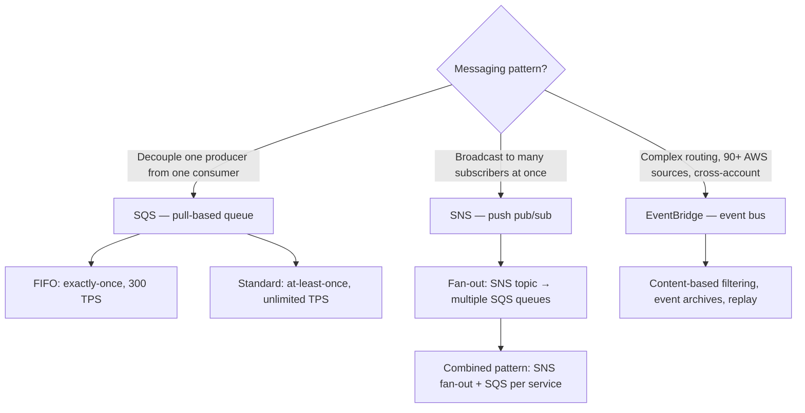
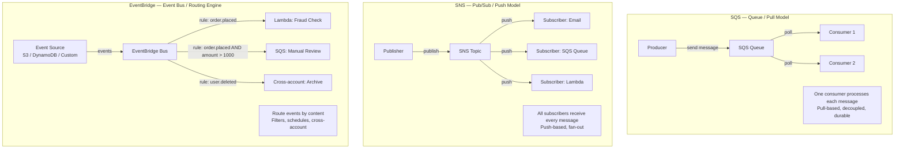
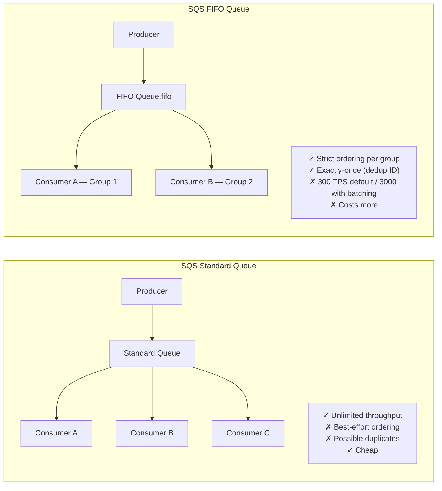
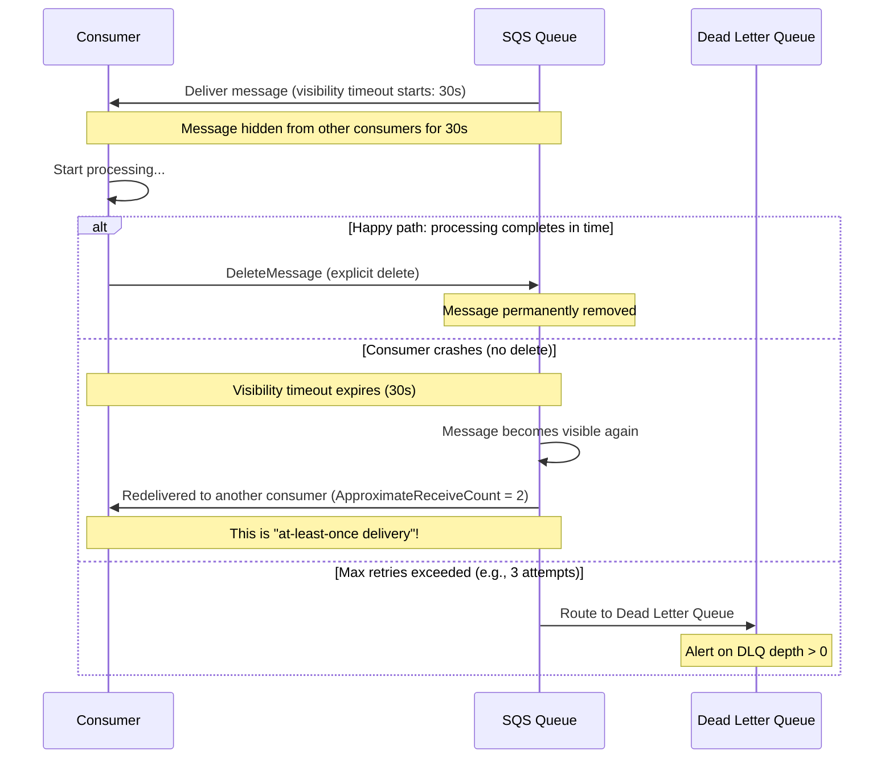
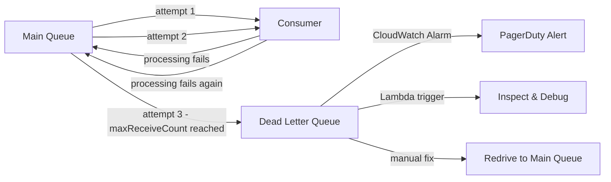
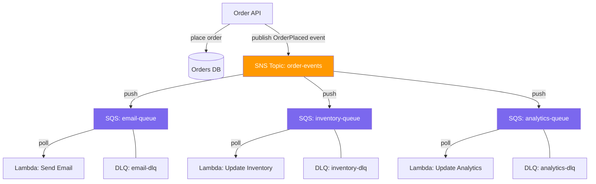
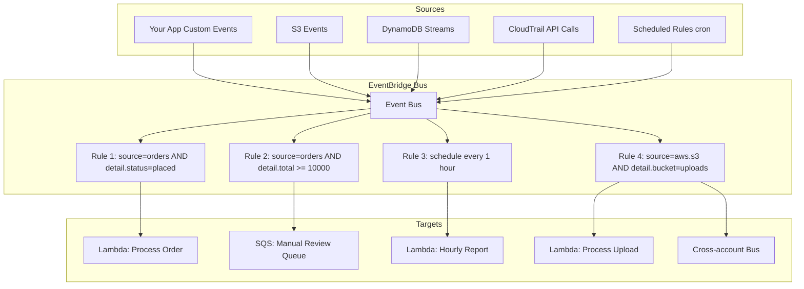
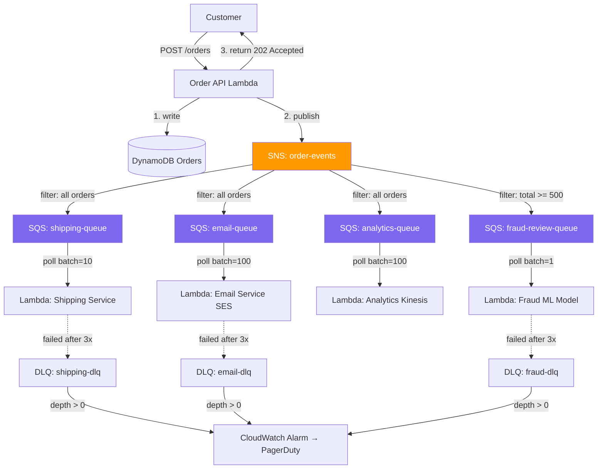

# AWS SQS vs SNS vs EventBridge: The Messaging Holy Trinity

## 🗺️ Quick Overview



*They work together: SNS fan-out to SQS queues per consumer is the canonical decoupling pattern.*

## Question
**"When would you use SQS vs SNS vs EventBridge? Give a real-world example of each. How do they work together?"**

Common in: AWS Solutions Architect, Backend System Design, FAANG interviews, AWS SAA-C03 exam

---

## Quick Answer (30-second version)

- **SQS** = Queue (pull-based). One producer, one consumer. Decouples workers. Use for task queues, background jobs.
- **SNS** = Pub/Sub (push-based). One publisher, many subscribers. Fan-out. Use for notifications, broadcast events.
- **EventBridge** = Event bus (routing engine). Complex filtering, 90+ AWS service integrations, cross-account events. Use for event-driven architecture at scale.

The real power: **they work together**. SNS publishes → SQS queues per downstream service → Lambda processes.

---

## Why This Matters: The Thought Process

> An interviewer who asks "SQS vs SNS" is really asking: *"Do you understand decoupling, at-least-once delivery, fan-out, and the operational tradeoffs of async systems?"*

The wrong answer is memorizing specs. The right answer demonstrates:
1. What problem each solves
2. What happens when things go wrong (crashes, retries, ordering)
3. How to compose them for real workflows

---

## The Holy Trinity: Architecture Diagram



---

## Decision Framework

| Question | SQS | SNS | EventBridge |
|---|---|---|---|
| How many consumers per message? | **One** (competing consumers) | **Many** (all subscribers) | **Many** (matching rules) |
| Consumer model | Pull (poll) | Push | Push |
| Routing logic | None (round-robin) | Filter policies (basic) | Complex patterns, content-based |
| Cross-account | No | No | **Yes** |
| AWS service integrations | Lambda, EC2 | Lambda, SQS, HTTP, Email | **90+ services** |
| Message ordering | FIFO queue only | No | No |
| Replay messages | No | No | **Yes** (archive + replay) |
| Delivery guarantee | At-least-once (Standard) / Exactly-once (FIFO) | At-least-once | At-least-once |
| Max message size | 256 KB | 256 KB | 256 KB |
| Retention | 14 days max | No retention (push only) | 90 days (archive) |

---

## SQS Deep Dive: Standard vs FIFO

### The Core Difference



**When ordering actually matters** (ask this in the interview):
- Payment state machine: `authorized → captured → refunded` — out-of-order = double-charge
- Inventory reservation: `reserved → confirmed → released` — wrong order = oversell
- Database changelog: must apply migrations in sequence

**When ordering doesn't matter** (and Standard is better):
- Send email notifications (recipient doesn't care if two arrive slightly out of order)
- Resize images (each image is independent)
- Generate reports (each report standalone)

### FIFO: Message Group ID for Partial Ordering

```
FIFO Queue with Message Group IDs:

Group: order-123        Group: order-456        Group: order-789
  ┌─────────────────┐     ┌─────────────────┐     ┌─────────────────┐
  │ 1. placed       │     │ 1. placed       │     │ 1. placed       │
  │ 2. payment_ok   │     │ 2. payment_ok   │     │ 2. payment_fail │
  │ 3. shipped      │     │ 3. shipped      │     └─────────────────┘
  └─────────────────┘     └─────────────────┘

→ Order-123 and order-456 process in parallel (different groups)
→ Within each group, strict FIFO ordering is maintained
→ This is "partial ordering" — ideal for per-entity workflows
```

---

## Visibility Timeout: The "At-Least-Once" Problem

> **Interview trap**: "What happens if a consumer crashes mid-processing?"



**Critical implication**: Because a message can be delivered more than once, your consumer **must be idempotent**.

```javascript
// BAD: Not idempotent — charging twice if message redelivered
async function processPayment(message) {
  const { orderId, amount } = message;
  await stripe.charge({ amount }); // Will charge twice!
}

// GOOD: Idempotent — safe to process multiple times
async function processPayment(message) {
  const { orderId, amount, idempotencyKey } = message;

  // Check if already processed
  const existing = await db.get(`payment:${idempotencyKey}`);
  if (existing) {
    console.log(`Payment ${idempotencyKey} already processed, skipping`);
    return; // Safe to return — already done
  }

  // Mark as in-progress (with TTL)
  await db.set(`payment:${idempotencyKey}`, 'processing', 'EX', 300);

  await stripe.charge({ amount, idempotencyKey }); // Stripe also deduplicates

  await db.set(`payment:${idempotencyKey}`, 'completed', 'EX', 86400);
}
```

### Extending Visibility Timeout for Long Jobs

```javascript
const { SQSClient, ReceiveMessageCommand, ChangeMessageVisibilityCommand, DeleteMessageCommand } = require('@aws-sdk/client-sqs');

const sqs = new SQSClient({ region: 'us-east-1' });
const QUEUE_URL = process.env.SQS_QUEUE_URL;
const VISIBILITY_TIMEOUT = 30; // Initial 30 seconds
const HEARTBEAT_INTERVAL = 20; // Extend every 20s (before timeout)

async function processWithHeartbeat(message) {
  let heartbeatTimer;

  try {
    // Start heartbeat: extend visibility timeout while processing
    heartbeatTimer = setInterval(async () => {
      try {
        await sqs.send(new ChangeMessageVisibilityCommand({
          QueueUrl: QUEUE_URL,
          ReceiptHandle: message.ReceiptHandle,
          VisibilityTimeout: VISIBILITY_TIMEOUT, // Reset to 30s
        }));
        console.log(`Extended visibility for message ${message.MessageId}`);
      } catch (err) {
        console.error('Failed to extend visibility:', err.message);
        clearInterval(heartbeatTimer); // Stop heartbeat if extension fails
      }
    }, HEARTBEAT_INTERVAL * 1000);

    // Do the actual long-running work
    const body = JSON.parse(message.Body);
    await processLongRunningJob(body); // e.g., 2-minute video encoding

    // Success: delete the message
    await sqs.send(new DeleteMessageCommand({
      QueueUrl: QUEUE_URL,
      ReceiptHandle: message.ReceiptHandle,
    }));

    console.log(`Message ${message.MessageId} processed and deleted`);

  } finally {
    clearInterval(heartbeatTimer);
  }
}

async function processLongRunningJob(job) {
  // Simulate 90-second job (longer than initial 30s visibility timeout)
  console.log(`Processing job: ${job.jobId}`);
  await new Promise(resolve => setTimeout(resolve, 90_000));
  console.log(`Job complete: ${job.jobId}`);
}

async function worker() {
  while (true) {
    const response = await sqs.send(new ReceiveMessageCommand({
      QueueUrl: QUEUE_URL,
      MaxNumberOfMessages: 1,
      WaitTimeSeconds: 20,           // Long polling — more efficient
      VisibilityTimeout: VISIBILITY_TIMEOUT,
      AttributeNames: ['ApproximateReceiveCount'],
    }));

    if (response.Messages?.length > 0) {
      await processWithHeartbeat(response.Messages[0]);
    }
  }
}

worker().catch(console.error);
```

---

## Dead Letter Queues (DLQ): Handling Poison Messages



**DLQ is not a graveyard — it's a safety net.** The workflow:
1. Message fails N times (maxReceiveCount, e.g., 3)
2. SQS moves it to DLQ automatically
3. CloudWatch alarm fires when DLQ depth > 0
4. Engineer inspects the message body, finds the bug
5. Fixes the consumer code, then redrive the DLQ back to main queue

---

## Long Polling vs Short Polling

```
Short polling (default, WaitTimeSeconds=0):
Request → Response (empty if no messages) → Request → Response (empty) → ...
Cost: 1 API call every ~1ms = expensive

Long polling (WaitTimeSeconds=1-20):
Request → [waits up to 20s for message] → Response (with message if any) → Request → ...
Cost: ~3 API calls per minute = 98% cheaper

Always use long polling (WaitTimeSeconds=20).
```

---

## SNS Fan-Out Pattern: Order Processing

> **Interview question**: "You need to send an order confirmation email AND update inventory AND trigger analytics when an order is placed. How do you architect this?"

**Wrong answer**: Have the order service call each downstream system directly (tight coupling, cascade failures).

**Right answer**: Fan-out via SNS → multiple SQS queues.



**Why not just multiple SQS queues?** The order service would need to know about every downstream queue and call each explicitly. Adding a new consumer requires changing the publisher. With SNS, publishers and consumers are fully decoupled.

### Code: SNS Fan-Out for Order Processing

```javascript
const { SNSClient, PublishCommand } = require('@aws-sdk/client-sns');
const { SQSClient, ReceiveMessageCommand, DeleteMessageCommand } = require('@aws-sdk/client-sqs');

const sns = new SNSClient({ region: 'us-east-1' });
const sqs = new SQSClient({ region: 'us-east-1' });

// ── Publisher: Order Service ──────────────────────────────────────────────────

async function placeOrder(orderData) {
  // 1. Persist the order
  const order = await db.orders.create({
    ...orderData,
    status: 'placed',
    createdAt: new Date().toISOString(),
  });

  // 2. Publish event to SNS — decoupled from downstream systems
  await sns.send(new PublishCommand({
    TopicArn: process.env.ORDER_EVENTS_TOPIC_ARN,
    Subject: 'OrderPlaced',
    Message: JSON.stringify({
      eventType: 'ORDER_PLACED',
      orderId: order.id,
      userId: order.userId,
      items: order.items,
      total: order.total,
      timestamp: new Date().toISOString(),
    }),
    MessageAttributes: {
      eventType: {
        DataType: 'String',
        StringValue: 'ORDER_PLACED',
      },
      // SNS filter policies can route based on these attributes
      orderTotal: {
        DataType: 'Number',
        StringValue: String(order.total),
      },
    },
  }));

  return order;
}

// ── Consumer: Email Lambda ────────────────────────────────────────────────────

// SQS message body when SNS pushes to SQS:
// { "Type": "Notification", "Message": "{...actual payload...}", "Subject": "OrderPlaced" }

async function emailConsumer(sqsEvent) {
  for (const record of sqsEvent.Records) {
    const snsMessage = JSON.parse(record.body); // SQS wraps SNS envelope
    const orderEvent = JSON.parse(snsMessage.Message); // Unwrap actual payload

    if (orderEvent.eventType !== 'ORDER_PLACED') continue;

    await sendOrderConfirmationEmail({
      to: await getUserEmail(orderEvent.userId),
      orderId: orderEvent.orderId,
      total: orderEvent.total,
    });
  }
}

// ── Consumer: Inventory Lambda ────────────────────────────────────────────────

async function inventoryConsumer(sqsEvent) {
  for (const record of sqsEvent.Records) {
    const snsMessage = JSON.parse(record.body);
    const orderEvent = JSON.parse(snsMessage.Message);

    if (orderEvent.eventType !== 'ORDER_PLACED') continue;

    // Decrement inventory for each item — must be idempotent!
    for (const item of orderEvent.items) {
      await db.inventory.decrement({
        productId: item.productId,
        quantity: item.quantity,
        idempotencyKey: `${orderEvent.orderId}-${item.productId}`,
      });
    }
  }
}
```

### SNS Message Filtering: Don't Process What You Don't Need

```javascript
// Without filter policy: every subscriber receives every message
// A high-value order handler gets ALL orders — 99% irrelevant

// With SNS filter policy: subscribe only to matching messages
// This reduces Lambda invocations and costs significantly

// Terraform: SNS subscription with filter policy
resource "aws_sns_topic_subscription" "high_value_orders" {
  topic_arn = aws_sns_topic.order_events.arn
  protocol  = "sqs"
  endpoint  = aws_sqs_queue.high_value_review.arn

  filter_policy = jsonencode({
    eventType = ["ORDER_PLACED"],
    // Only messages where orderTotal attribute >= 1000
    orderTotal = [{ numeric = [">=", 1000] }]
  })
}

// Filter policy operators:
// String match:  { "eventType": ["ORDER_PLACED", "ORDER_UPDATED"] }
// Prefix match:  { "source": [{ "prefix": "payment." }] }
// Numeric range: { "amount": [{ "numeric": [">=", 100, "<", 1000] }] }
// Exists check:  { "urgency": [{ "exists": true }] }
// Anything-but:  { "status": [{ "anything-but": ["cancelled"] }] }
```

---

## EventBridge: Complex Event Routing

### EventBridge vs SNS: When to Use Which

| Scenario | Use | Why |
|---|---|---|
| Order placed → notify 5 services | **SNS** | Simple broadcast, no routing logic |
| Route events based on payload content | **EventBridge** | Content-based routing rules |
| React to S3 / EC2 / CloudTrail events | **EventBridge** | 90+ built-in integrations |
| Cross-account event delivery | **EventBridge** | Native support; SNS can't |
| Replay past events | **EventBridge** | Archive + replay feature |
| Schedule cron jobs | **EventBridge** | Replaced CloudWatch Events |
| Event schema registry | **EventBridge** | Schema discovery and validation |

### EventBridge Architecture



### Code: EventBridge Rule + Lambda for DynamoDB Stream Processing

```javascript
const { EventBridgeClient, PutEventsCommand } = require('@aws-sdk/client-eventbridge');

const eventbridge = new EventBridgeClient({ region: 'us-east-1' });

// ── Publisher: Send custom event to EventBridge ───────────────────────────────

async function publishOrderEvent(order) {
  await eventbridge.send(new PutEventsCommand({
    Entries: [
      {
        EventBusName: 'my-app-bus',          // Custom bus, not default
        Source: 'com.myapp.orders',           // Reverse-domain convention
        DetailType: 'OrderStatusChanged',     // Human-readable type
        Detail: JSON.stringify({
          orderId: order.id,
          previousStatus: order.previousStatus,
          newStatus: order.status,
          total: order.total,
          userId: order.userId,
          timestamp: new Date().toISOString(),
        }),
      },
    ],
  }));
}

// ── Consumer: Lambda processes EventBridge events ─────────────────────────────

exports.handler = async (event) => {
  // EventBridge event structure (different from SQS!)
  console.log('EventBridge event:', JSON.stringify(event, null, 2));

  /*
  {
    "version": "0",
    "id": "abc-123",
    "source": "com.myapp.orders",
    "detail-type": "OrderStatusChanged",
    "detail": {
      "orderId": "order-456",
      "previousStatus": "pending",
      "newStatus": "placed",
      "total": 299.99
    },
    "time": "2026-03-20T10:00:00Z",
    "account": "123456789012",
    "region": "us-east-1"
  }
  */

  const { detail } = event;

  switch (detail.newStatus) {
    case 'placed':
      await triggerFulfillment(detail.orderId);
      break;
    case 'shipped':
      await notifyCustomer(detail.userId, detail.orderId);
      break;
    case 'cancelled':
      await processRefund(detail.orderId, detail.total);
      break;
    default:
      console.log(`No action for status: ${detail.newStatus}`);
  }
};

// ── EventBridge Scheduler (replaced CloudWatch Events) ───────────────────────

// Terraform config for EventBridge schedule
/*
resource "aws_scheduler_schedule" "hourly_report" {
  name = "hourly-report"

  flexible_time_window {
    mode = "OFF"  // Exact time; "FLEXIBLE" allows drift
  }

  schedule_expression = "rate(1 hour)"
  // Or cron: "cron(0 9 * * ? *)"  // 9 AM UTC daily

  target {
    arn      = aws_lambda_function.report_generator.arn
    role_arn = aws_iam_role.scheduler.arn

    input = jsonencode({
      reportType = "hourly-summary"
      timezone   = "America/New_York"
    })
  }
}
*/
```

---

## Real-World Scenario: E-Commerce Order Pipeline

> "Walk me through the architecture of an order processing system that handles 10,000 orders per minute, ensures no order is lost, and allows independent scaling of each downstream service."



**Why this design works:**
- Order API returns `202 Accepted` immediately — low latency for customer
- Each downstream service scales independently
- If email service is down, shipping continues unaffected
- DLQ + alarm catches any lost messages before they disappear
- SNS filter on `total >= 500` means fraud only processes high-risk orders — cheaper

---

## Common Interview Follow-ups

**Q: What's the maximum SQS message size? What if I need to send more?**

A: 256 KB hard limit. For larger payloads, use the **S3 + SQS pattern** (Extended Client Library):
1. Upload large payload to S3
2. Put S3 object URL/key in SQS message body
3. Consumer downloads from S3 using the pointer

```javascript
// Extended client pattern (simplified)
async function sendLargeMessage(payload) {
  const payloadBuffer = Buffer.from(JSON.stringify(payload));

  if (payloadBuffer.length > 200_000) { // Near the 256KB limit
    // Upload to S3
    const key = `sqs-payloads/${Date.now()}-${crypto.randomUUID()}.json`;
    await s3.putObject({ Bucket: 'my-sqs-payloads', Key: key, Body: payloadBuffer }).promise();

    // Send pointer in SQS
    await sqs.sendMessage({
      QueueUrl: QUEUE_URL,
      MessageBody: JSON.stringify({
        s3Payload: true,
        bucket: 'my-sqs-payloads',
        key,
      }),
    }).promise();
  } else {
    await sqs.sendMessage({ QueueUrl: QUEUE_URL, MessageBody: JSON.stringify(payload) }).promise();
  }
}
```

**Q: SQS FIFO is limited to 300 TPS — that's not enough for my use case. What do I do?**

A: Options in order of preference:
1. Use batching: SendMessageBatch sends 10 messages in one API call → effective 3000 msg/s with batch=10
2. Use multiple FIFO queues with application-level sharding (different queues per customer segment)
3. Rethink if ordering is truly required — often Standard + idempotency is sufficient
4. Use Kinesis Data Streams (1MB/s per shard, supports ordering by partition key)

**Q: How do you prevent duplicate processing in SQS FIFO?**

FIFO has built-in deduplication via `MessageDeduplicationId`. Within a 5-minute window, messages with the same dedup ID are deduplicated automatically.

```javascript
await sqs.send(new SendMessageCommand({
  QueueUrl: FIFO_QUEUE_URL,
  MessageBody: JSON.stringify(orderEvent),
  MessageGroupId: `order-${orderEvent.orderId}`,      // Ordering scope
  MessageDeduplicationId: `${orderEvent.orderId}-v1`, // Dedup within 5 min
}));
```

**Q: SNS vs SQS — can SNS guarantee delivery?**

SNS is push-based — if a subscriber is temporarily down, the message is lost (no retention). This is why you always pair SNS with SQS: SQS provides durability and retry logic for each subscriber.

**Q: EventBridge vs SNS for fan-out — which do you choose?**

Use SNS when: simple broadcast to known subscribers, no complex routing, same account.
Use EventBridge when: need content-based routing (e.g., only fraud team sees orders > $10k), cross-account events, AWS native integrations (CloudTrail, S3, etc.), or you need schema validation.

---

## AWS Certification Exam Tips (SAA-C03)

**SQS key numbers to memorize:**
- Standard queue: **unlimited throughput**, best-effort ordering, at-least-once delivery
- FIFO queue: **300 TPS** (3000 with batching), exactly-once, strict ordering per message group
- Max message size: **256 KB**
- Retention: **1 minute to 14 days** (default 4 days)
- Visibility timeout: **0 to 12 hours** (default 30 seconds)
- Long polling: **WaitTimeSeconds = 1-20** (20s max)
- In-flight messages: Standard = **120,000 max**, FIFO = **20,000 max**
- DLQ must be same type as source queue (FIFO DLQ for FIFO source)

**SNS key facts:**
- Push-based (subscribers don't poll)
- Protocols: HTTP/HTTPS, Email, SMS, SQS, Lambda, mobile push, Kinesis Firehose
- Message filtering via filter policies (per-subscription, not per-topic)
- No message persistence — if subscriber is down, message is lost (hence SNS+SQS pattern)
- Fan-out: one topic, up to 12.5 million subscriptions

**EventBridge key facts:**
- Replaced CloudWatch Events (same underlying service, new name)
- Default event bus: free, receives AWS service events
- Custom event bus: your app events
- Partner event bus: SaaS integrations (Zendesk, Datadog, etc.)
- Archive and replay: can replay events from the past
- Schema registry: automatically discovers event schemas
- Cross-account: send events to another AWS account's bus

**Classic exam scenario:**
> "Your application needs to process messages in order. You have 500 messages per second."

Answer: SQS FIFO with batching (300 base TPS × 10 batch size = 3000 msg/s effective). If you need true high-throughput ordering, consider Kinesis (1 MB/s per shard).

---

## Key Takeaways

1. **SQS = task queue** (one consumer per message, pull-based, durable, retries, DLQ)
2. **SNS = broadcast** (all subscribers get every message, push-based, no retention)
3. **EventBridge = smart router** (complex filtering, 90+ integrations, cross-account, replay)
4. **Always pair SNS with SQS** for fan-out: SNS delivers, SQS persists and retries
5. **Visibility timeout + idempotency** = the foundation of reliable async processing
6. **DLQ + alarm** is non-negotiable in production — poison messages must not disappear silently
7. **Long polling always** — `WaitTimeSeconds=20` reduces cost and latency
8. **FIFO only when ordering truly matters** — Standard + idempotency handles most cases cheaper

---

## Related Questions

- [Kinesis Streaming vs SQS](/interview-prep/aws-cloud/kinesis-streaming)
- [Lambda Serverless Architecture](/interview-prep/aws-cloud/lambda-serverless)
- [CloudWatch Monitoring](/interview-prep/aws-cloud/cloudwatch-monitoring)
- [Auto-Scaling Groups](/interview-prep/aws-cloud/auto-scaling)
