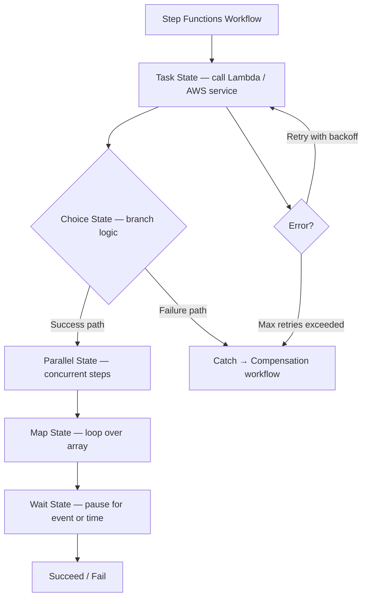
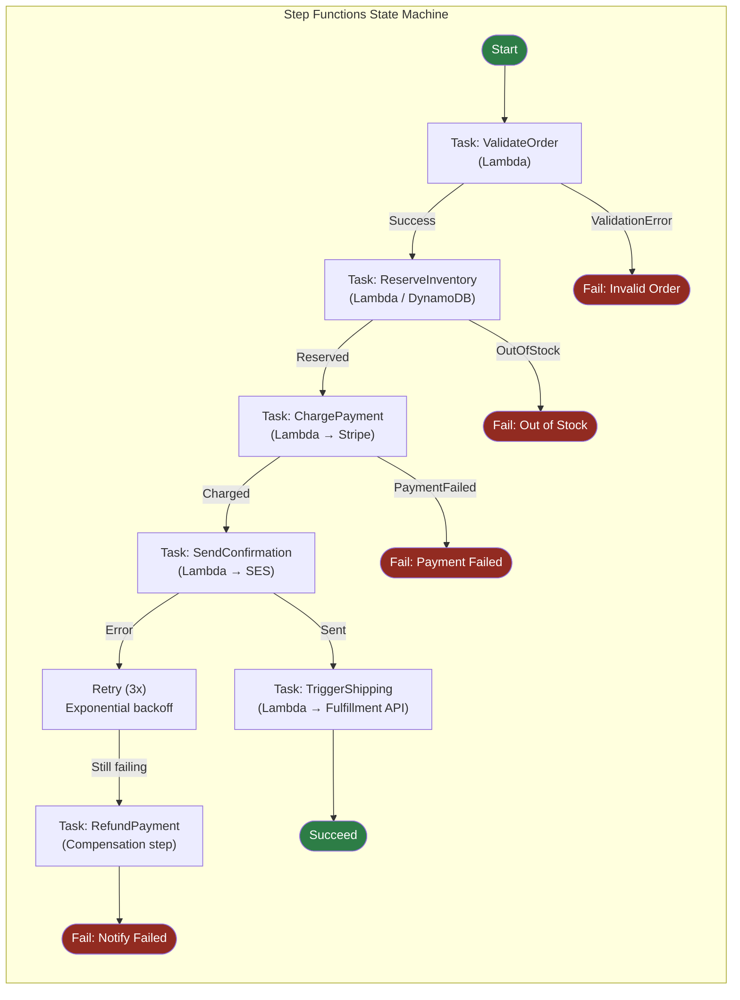
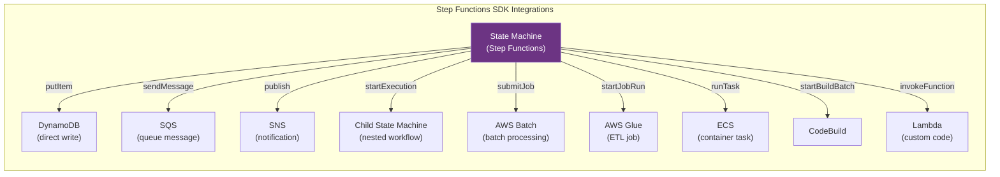
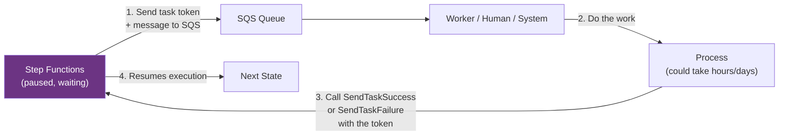
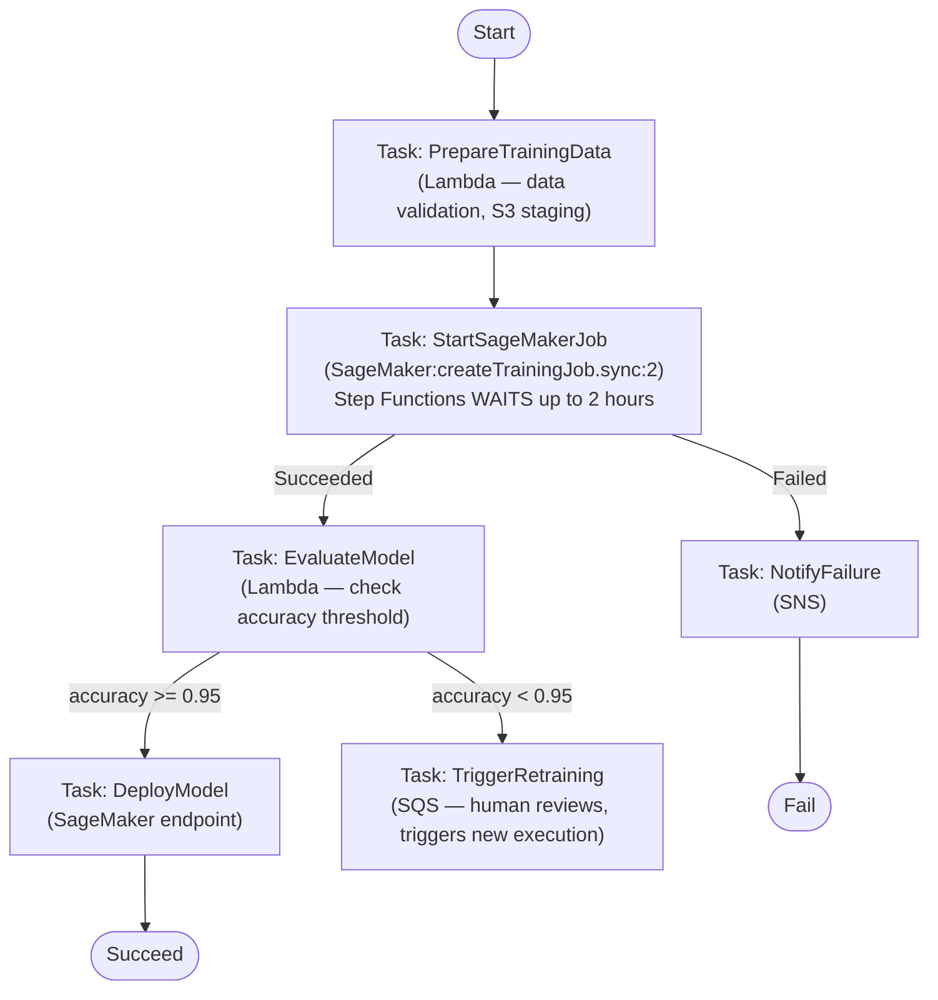
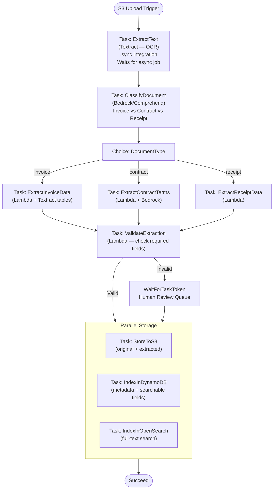

# AWS Step Functions: Workflow Orchestration & State Machines

## 🗺️ Quick Overview



*Step Functions handles retry, compensation, and visibility automatically — use it instead of DIY SQS chains for multi-step workflows.*

> **Common Interview Question**: "Design an order processing pipeline that validates the order, reserves inventory, charges the customer, sends a confirmation, and triggers shipping. How do you handle failures at each step? What if the payment succeeds but shipping fails?"

Common in: AWS Solutions Architect, Backend Engineering, Senior Backend, Platform Engineering, and MLOps interviews

---

## Quick Answer (30-second version)

- **Step Functions** = Visual state machine service. Define workflows in JSON (ASL), AWS executes them reliably. Each step is a state, transitions are defined in code.
- **Two workflow types**: Standard (1 year max, exactly-once, $0.025 per 1,000 state transitions) vs Express (5 minutes max, at-least-once, $1 per 1M transitions).
- **States**: Task (call Lambda/service), Choice (branching), Wait (pause for time/event), Parallel (concurrent), Map (loop over array), Pass (transform data), Succeed/Fail.
- **Error handling built-in**: Retry with exponential backoff, Catch to route failures to compensation workflows.
- **Wait for task token**: Step Functions pauses and waits for an external system to signal completion — perfect for human approval or async jobs.
- **vs SQS + Lambda chains**: Step Functions gives you visibility, retry logic, error handling, and state management without custom code. SQS chains give you durability but no orchestration visibility.

---

## Why This Matters / The Thought Process

When an interviewer asks about order processing, booking, or multi-step pipelines, they're testing whether you understand **saga patterns and distributed transaction compensation**.

The real challenge isn't the happy path. It's: "What happens when step 4 of 7 fails after steps 1-3 have already committed?"

Think like an SA:
- Step 1: Validate order ✓
- Step 2: Reserve inventory ✓
- Step 3: Charge payment ✓ (money taken from customer)
- Step 4: Send confirmation email — **FAILS**

Do you leave the customer charged with no confirmation? Do you refund them? Do you retry the email?

Step Functions is the AWS-native answer to this problem. It handles retries, catches failures, routes to compensation steps, and keeps a complete audit trail of every state transition. All without you writing a single line of "retry with exponential backoff" code.

**The mental model**: Think of Step Functions as a flowchart that AWS executes reliably. Each box in the flowchart is a state. Arrows are transitions. When something breaks, the flowchart branches to an error handler instead of crashing silently.

---

## Architecture: How Step Functions Works



**What makes this better than Lambda chaining:**
- Complete audit trail: every state transition is logged with timestamp, input, output
- Built-in retry with exponential backoff — you don't write retry code
- Catch specific error types and route them differently
- If a Lambda crashes mid-execution, Step Functions retries from the failed state, not from the beginning
- Visual debugging: AWS console shows exactly which state the execution is in

---

## State Types Deep Dive

### Task State — The Workhorse

```json
{
  "ValidateOrder": {
    "Type": "Task",
    "Resource": "arn:aws:lambda:us-east-1:123456789:function:ValidateOrderFn",
    "Parameters": {
      "orderId.$": "$.orderId",
      "customerId.$": "$.customerId",
      "items.$": "$.items"
    },
    "ResultPath": "$.validationResult",
    "Retry": [
      {
        "ErrorEquals": ["Lambda.ServiceException", "Lambda.TooManyRequestsException"],
        "IntervalSeconds": 2,
        "MaxAttempts": 3,
        "BackoffRate": 2.0
      }
    ],
    "Catch": [
      {
        "ErrorEquals": ["ValidationError"],
        "ResultPath": "$.error",
        "Next": "HandleValidationError"
      }
    ],
    "Next": "ReserveInventory"
  }
}
```

**Key fields:**
- `Resource`: What to call (Lambda ARN, or SDK integration like `arn:aws:states:::dynamodb:putItem`)
- `Parameters`: Input to the task (`.$ ` suffix means "reference from input")
- `ResultPath`: Where to store the result in the state data
- `Retry`: Automatic retry with configurable backoff
- `Catch`: Error handlers — catch specific errors, route to different states

### Choice State — Branching Logic

```json
{
  "CheckOrderType": {
    "Type": "Choice",
    "Choices": [
      {
        "Variable": "$.orderType",
        "StringEquals": "express",
        "Next": "ExpressShipping"
      },
      {
        "Variable": "$.totalAmount",
        "NumericGreaterThan": 500,
        "Next": "FraudReview"
      }
    ],
    "Default": "StandardShipping"
  }
}
```

### Wait State — Pause Execution

```json
{
  "WaitForDeliveryConfirmation": {
    "Type": "Wait",
    "Seconds": 86400,
    "Next": "CheckDeliveryStatus"
  }
}
```

Or wait until a timestamp:
```json
{
  "WaitForScheduledTime": {
    "Type": "Wait",
    "TimestampPath": "$.scheduledAt",
    "Next": "ExecuteScheduledTask"
  }
}
```

### Parallel State — Concurrent Execution

```json
{
  "ProcessOrderInParallel": {
    "Type": "Parallel",
    "Branches": [
      {
        "StartAt": "ReserveInventory",
        "States": {
          "ReserveInventory": {
            "Type": "Task",
            "Resource": "arn:aws:lambda:...:ReserveInventoryFn",
            "End": true
          }
        }
      },
      {
        "StartAt": "SendOrderToFulfillment",
        "States": {
          "SendOrderToFulfillment": {
            "Type": "Task",
            "Resource": "arn:aws:lambda:...:FulfillmentFn",
            "End": true
          }
        }
      }
    ],
    "Next": "ChargePayment"
  }
}
```

Both branches run simultaneously. Step Functions waits for ALL branches to complete before moving to `ChargePayment`. If either branch fails, the Parallel state fails.

### Map State — Process Arrays

```json
{
  "ProcessOrderItems": {
    "Type": "Map",
    "ItemsPath": "$.items",
    "MaxConcurrency": 5,
    "Iterator": {
      "StartAt": "ProcessSingleItem",
      "States": {
        "ProcessSingleItem": {
          "Type": "Task",
          "Resource": "arn:aws:lambda:...:ProcessItemFn",
          "End": true
        }
      }
    },
    "Next": "AggregateResults"
  }
}
```

`MaxConcurrency: 5` means process up to 5 items simultaneously. Set to 0 for unlimited concurrency.

---

## Standard vs Express Workflows

This is the most common certification and interview trap. Know this table cold.

| Dimension | Standard Workflow | Express Workflow |
|-----------|------------------|-----------------|
| **Max duration** | 1 year | 5 minutes |
| **Execution semantics** | **Exactly-once** | **At-least-once** |
| **Throughput** | 2,000 executions/second | 100,000 executions/second |
| **Pricing** | $0.025 per 1,000 state transitions | $1 per 1M transitions + duration |
| **Execution history** | 90 days in console | CloudWatch Logs only |
| **Idempotency** | Built-in (won't re-run completed states) | Your code must handle duplicates |
| **Use case** | Order processing, human approval, auditable workflows | High-volume event processing, IoT, streaming |

### When to Use Each

**Standard Workflow — use when:**
- Each execution must run exactly once (payment processing, order management)
- You need audit history (compliance, debugging)
- Execution can take hours or days (human approval, long-running jobs)
- Throughput is modest (<2,000/second)

**Express Workflow — use when:**
- Very high throughput (IoT ingestion, streaming event processing)
- Short-lived steps (< 5 minutes total)
- At-least-once is acceptable (e.g., sending a metric is OK to do twice)
- Cost matters at scale (100x cheaper per transition at high volume)

**The trap**: Express Workflows are at-least-once, NOT exactly-once. If you use Express for payment processing, you risk charging a customer twice. Standard is the correct choice for any financial transaction.

---

## SDK Integrations — Beyond Lambda

Step Functions can call AWS services DIRECTLY without Lambda as middleware. This is a major cost and complexity reduction.



**Direct SDK integration example — write to DynamoDB without Lambda:**

```json
{
  "SaveOrderToDB": {
    "Type": "Task",
    "Resource": "arn:aws:states:::dynamodb:putItem",
    "Parameters": {
      "TableName": "Orders",
      "Item": {
        "orderId": { "S.$": "$.orderId" },
        "status": { "S": "PROCESSING" },
        "timestamp": { "S.$": "$$.Execution.StartTime" }
      }
    },
    "ResultPath": null,
    "Next": "ReserveInventory"
  }
}
```

**Why this matters**: Instead of writing a Lambda function that calls DynamoDB, you call DynamoDB directly from the state definition. Fewer Lambdas = lower cost, faster execution, less code to maintain.

---

## Integration Patterns: Request-Response vs Wait-for-Callback

### Request-Response (Default)

Step Functions calls the service and immediately moves to the next state. Use when the downstream call is fast and synchronous.

```json
{
  "CallLambda": {
    "Type": "Task",
    "Resource": "arn:aws:lambda:...:MyFunction",
    "Next": "NextState"
  }
}
```

### Sync Integration — Wait for Completion

Step Functions calls the service and WAITS for it to complete. Use for Glue ETL jobs, ECS tasks, CodeBuild.

```json
{
  "RunGlueJob": {
    "Type": "Task",
    "Resource": "arn:aws:states:::glue:startJobRun.sync:2",
    "Parameters": {
      "JobName": "my-etl-job"
    },
    "Next": "ProcessResults"
  }
}
```

The `.sync:2` suffix tells Step Functions to wait (polling in the background) until the Glue job finishes. Could take hours — Step Functions handles it.

### Wait for Task Token — The Most Powerful Pattern

Step Functions pauses execution indefinitely and waits for an external system to send back a task token. Use for:
- Human approval workflows
- Legacy system integration (non-AWS systems)
- Long-running async processes



**Example — Human approval for large orders:**

```json
{
  "WaitForManagerApproval": {
    "Type": "Task",
    "Resource": "arn:aws:states:::sqs:sendMessage.waitForTaskToken",
    "Parameters": {
      "QueueUrl": "https://sqs.us-east-1.amazonaws.com/.../approval-queue",
      "MessageBody": {
        "orderId.$": "$.orderId",
        "amount.$": "$.totalAmount",
        "taskToken.$": "$$.Task.Token"
      }
    },
    "HeartbeatSeconds": 86400,
    "Next": "ProcessApprovedOrder",
    "Catch": [
      {
        "ErrorEquals": ["States.HeartbeatTimeout"],
        "Next": "HandleApprovalTimeout"
      }
    ]
  }
}
```

The `$$.Task.Token` is a unique string. The SQS worker picks up the message, emails the manager. When the manager clicks "Approve," your system calls `SendTaskSuccess(taskToken, result)`. Step Functions resumes instantly.

`HeartbeatSeconds`: If no heartbeat is received within this time, the task times out. Your catch block handles it.

---

## Interview Scenario 1: Order Processing Pipeline

> **"Design an order processing pipeline: validate → reserve inventory → charge payment → notify → ship. How do you handle failures?"**

**Full ASL state machine:**

```json
{
  "Comment": "Order Processing Pipeline",
  "StartAt": "ValidateOrder",
  "States": {
    "ValidateOrder": {
      "Type": "Task",
      "Resource": "arn:aws:lambda:...:ValidateOrderFn",
      "Retry": [
        {
          "ErrorEquals": ["Lambda.ServiceException"],
          "MaxAttempts": 2,
          "IntervalSeconds": 1,
          "BackoffRate": 2
        }
      ],
      "Catch": [
        {
          "ErrorEquals": ["InvalidOrderError"],
          "Next": "OrderInvalid"
        }
      ],
      "Next": "ReserveInventory"
    },

    "ReserveInventory": {
      "Type": "Task",
      "Resource": "arn:aws:states:::dynamodb:updateItem",
      "Parameters": {
        "TableName": "Inventory",
        "Key": { "productId": { "S.$": "$.productId" } },
        "UpdateExpression": "SET reserved = reserved + :qty",
        "ConditionExpression": "available >= :qty",
        "ExpressionAttributeValues": {
          ":qty": { "N.$": "States.Format('{}', $.quantity)" }
        }
      },
      "Catch": [
        {
          "ErrorEquals": ["DynamoDB.ConditionalCheckFailedException"],
          "Next": "OutOfStock"
        }
      ],
      "Next": "ChargePayment"
    },

    "ChargePayment": {
      "Type": "Task",
      "Resource": "arn:aws:lambda:...:ChargePaymentFn",
      "Retry": [
        {
          "ErrorEquals": ["TransientPaymentError"],
          "MaxAttempts": 3,
          "IntervalSeconds": 5,
          "BackoffRate": 2
        }
      ],
      "Catch": [
        {
          "ErrorEquals": ["PaymentDeclinedError"],
          "Next": "ReleaseInventoryReservation"
        }
      ],
      "Next": "SendConfirmation"
    },

    "ReleaseInventoryReservation": {
      "Type": "Task",
      "Resource": "arn:aws:states:::dynamodb:updateItem",
      "Comment": "Compensation step — undo reservation",
      "Parameters": {
        "TableName": "Inventory",
        "Key": { "productId": { "S.$": "$.productId" } },
        "UpdateExpression": "SET reserved = reserved - :qty"
      },
      "Next": "OrderFailed"
    },

    "SendConfirmation": {
      "Type": "Task",
      "Resource": "arn:aws:lambda:...:SendConfirmationFn",
      "Retry": [
        {
          "ErrorEquals": ["States.ALL"],
          "MaxAttempts": 3,
          "IntervalSeconds": 2,
          "BackoffRate": 2
        }
      ],
      "Next": "TriggerShipping"
    },

    "TriggerShipping": {
      "Type": "Task",
      "Resource": "arn:aws:states:::sqs:sendMessage",
      "Parameters": {
        "QueueUrl": "https://sqs.../shipping-queue",
        "MessageBody.$": "$"
      },
      "Next": "OrderComplete"
    },

    "OrderComplete": { "Type": "Succeed" },
    "OrderInvalid": { "Type": "Fail", "Error": "InvalidOrder" },
    "OutOfStock": { "Type": "Fail", "Error": "OutOfStock" },
    "OrderFailed": { "Type": "Fail", "Error": "PaymentFailed" }
  }
}
```

**Key design decisions:**
1. `ReserveInventory` uses DynamoDB SDK integration (no Lambda) with a conditional write — atomic reservation
2. If payment fails, a **compensation step** (`ReleaseInventoryReservation`) undoes the reservation
3. Shipping is sent to an SQS queue (decoupled from the state machine) — fulfillment system processes it independently
4. Confirmation email retries 3× with exponential backoff before giving up

---

## Interview Scenario 2: Long-Running ML Training

> **"How do you handle a long-running ML training job that takes 2 hours with Step Functions?"**



**Why Standard Workflow here:**
- Training job takes 2 hours → Express Workflows cap at 5 minutes. Standard is required.
- Exactly-once semantics: don't want to accidentally start two training jobs for the same dataset
- Need audit trail: compliance requires knowing when the model was trained and on what data

**The `.sync:2` pattern for SageMaker:**
- Step Functions sends the `createTrainingJob` call
- SageMaker starts training (2 hours)
- Step Functions polls the job status every 60 seconds (managed by AWS, not your code)
- When training completes, Step Functions reads the final status and transitions to `EvaluateModel`

---

## Interview Scenario 3: Document Processing Pipeline

> **"Design a document processing pipeline: upload → OCR → classify → extract → store"**



**Design highlights:**
- **Textract async** integration: OCR can take 30-120 seconds. Use `.sync` integration, not request-response.
- **Choice state** for document type: routes to specialized extractors
- **Human review** via task token: Low-confidence extractions get sent to a review queue. A human validates and calls `SendTaskSuccess` to resume the pipeline.
- **Parallel storage**: Write to S3, DynamoDB, and OpenSearch simultaneously — cuts storage latency from 3× sequential to 1× parallel.

---

## Step Functions vs Alternatives

| Scenario | Step Functions | SQS + Lambda chains | EventBridge + Lambda |
|----------|---------------|--------------------|--------------------|
| **Multi-step pipeline** | Best — native state management | Complex — need custom state tracking | Not designed for this |
| **Error handling** | Built-in retry, catch, compensate | Custom code per Lambda | Custom code |
| **Visibility** | Visual console, execution history | CloudWatch logs only | CloudWatch logs |
| **Long-running jobs** | Yes (1 year max) | No (Lambda 15min limit) | No |
| **Human approval** | Native (task token) | Custom implementation | Custom |
| **Throughput > 100K/s** | Express Workflows | Better choice (native SQS throughput) | Better choice |
| **Simple fan-out** | Overkill | Good choice | Best choice |
| **Cost at massive scale** | Expensive per transition | Cheaper | Cheaper |

**Rule of thumb:**
- Multi-step, stateful, needs error handling → Step Functions
- Simple fan-out/fan-in, very high volume → SQS + Lambda
- Event-driven, decoupled services, routing → EventBridge

---

## How Airbnb Uses Step Functions

Airbnb uses Step Functions for their booking state management — one of the most complex state machines in consumer tech.

A booking progresses through states:
1. `INQUIRY` → Guest sends request
2. `PENDING_REVIEW` → Host has 24 hours to accept/decline
3. `ACCEPTED` → Both parties confirmed
4. `AWAITING_PAYMENT` → Payment processing
5. `PAYMENT_COLLECTED` → Hold for cancellation period
6. `CONFIRMED` → Booking locked in
7. `CHECKED_IN` → Guest arrived
8. `CHECKED_OUT` → Stay complete
9. `UNDER_REVIEW` → Post-stay review period
10. `COMPLETED` → Payout released to host

**Why Step Functions is the right tool:**
- Each state is auditable (compliance, dispute resolution)
- Transitions have business rules (host must respond within 24 hours → Wait state with 86400s timeout)
- Compensation logic: if payment fails after host accepts, release the dates back to availability
- The 1-year execution duration fits: a booking inquiry might not check in for 11 months

---

## Common Interview Follow-ups

**Q: "What's the maximum size of the state data in Step Functions?"**

32 KB per state input/output. This is a critical limit. If you're processing large files (images, documents), store them in S3 and pass the S3 key as the state data — not the file content itself. The exam and real-world projects both catch people on this.

**Q: "How do you trigger a Step Functions execution?"**

Multiple ways:
- **API call**: `StartExecution` API from Lambda, EC2, or any SDK client
- **S3 Event → Lambda → StartExecution**: Classic pattern for file processing
- **EventBridge Rule**: Trigger execution on scheduled events or other AWS events
- **API Gateway**: HTTP endpoint that starts an execution
- **AWS console**: Manual trigger for testing

**Q: "Can Step Functions call another Step Functions state machine?"**

Yes — nested state machines. Use `arn:aws:states:::states:startExecution.sync:2` to start a child execution and wait for it. Use `arn:aws:states:::states:startExecution` to fire-and-forget.

Use case: A main order processing machine calls a specialized refund machine as a sub-workflow.

**Q: "How do you handle idempotency in Step Functions?"**

Standard Workflows are exactly-once per execution ID. If you retry the same execution ID, it won't start a new execution. Pass a unique idempotency key (order ID, event ID) as the execution name: `StartExecution(name="order-12345-v1")`. Duplicate calls with the same name return the existing execution.

**Q: "What's the difference between Retry and Catch?"**

- **Retry**: Automatically retries the SAME state when specific errors occur. Uses exponential backoff. The state input doesn't change between retries.
- **Catch**: If all retries are exhausted (or no Retry configured), Catch routes to a DIFFERENT state. The Catch block defines a compensation or error-handling path.

---

## AWS Certification Exam Tips

1. **Standard vs Express pricing**: Standard = $0.025 per 1,000 state transitions (per-transition charge). Express = $1 per 1M transitions + duration charge. Standard is NOT free — the exam tests whether you know there's a cost per state transition.

2. **Express Workflows are at-least-once, NOT exactly-once** — this is the #1 Express Workflow trap. Use Standard for anything financial or where duplicate execution would cause harm.

3. **Maximum duration**: Standard = up to 1 year. Express = up to 5 minutes. Any question about workflows that could run longer than 5 minutes → Standard.

4. **Task token pattern**: For human approval or async systems, use `waitForTaskToken`. The execution pauses indefinitely until `SendTaskSuccess` or `SendTaskFailure` is called.

5. **State data size**: 256 KB per execution input/output (note: 32 KB per state input/output in older docs — verify current limits). For large payloads, use S3 references.

6. **Map state MaxConcurrency**: Set to 0 for unbounded parallelism, or limit it to avoid overwhelming downstream services. Default is 40 concurrent iterations.

7. **SDK integrations reduce Lambda costs**: Direct integrations (DynamoDB, SQS, SNS, etc.) don't require a Lambda function. Exam question: "minimize Lambda invocations" → use SDK integrations.

8. **`$$.` prefix**: Access execution context metadata (execution ID, start time, etc.) using `$$.Execution.Id`, `$$.Execution.StartTime`. Single `$.` accesses the state input.

9. **Activity tasks vs Lambda tasks**: Activities are a way to run worker code outside Lambda (on EC2, on-prem). Workers poll for tasks, process them, and send results. Lambda tasks are push-based. Activities are niche but exam-tested.

10. **Heartbeat timeout**: For long-running tasks (training jobs, manual approvals), set `HeartbeatSeconds`. If the worker doesn't send a heartbeat within that window, the task times out and falls into the Catch block.

---

## Key Takeaways

- **Step Functions** = Reliable orchestration for multi-step workflows. Handles retries, error routing, compensation, and long-running jobs without custom state management code.
- **Standard Workflows**: Exactly-once, 1-year duration, $0.025 per 1,000 transitions. Use for financial transactions, order processing, human approvals.
- **Express Workflows**: At-least-once, 5-minute max, 100K executions/second. Use for high-volume event processing. NOT suitable for operations that must not be duplicated.
- **Task token pattern**: The right answer for human approval, async external systems, and any long-running process where Step Functions must wait for an external signal.
- **SDK integrations**: Call DynamoDB, SQS, SageMaker, ECS directly — no Lambda wrapper needed for simple operations.
- **vs SQS chains**: Step Functions wins when you need visibility, error handling, compensation, and state management. SQS wins for pure high-throughput decoupled messaging.
- The order processing saga pattern (reserve → charge → ship, with compensation on failure) is the canonical Step Functions interview answer.

## Related Topics

- [AWS Lambda Serverless](/12-interview-prep/quick-reference/aws-cloud/lambda-serverless)
- [AWS SQS, SNS & EventBridge](/12-interview-prep/quick-reference/aws-cloud/sqs-sns-eventbridge)
- [AWS ECS, EKS & Fargate](/12-interview-prep/quick-reference/aws-cloud/ecs-eks-fargate)
- [AWS Kinesis Streaming](/12-interview-prep/quick-reference/aws-cloud/kinesis-streaming)
