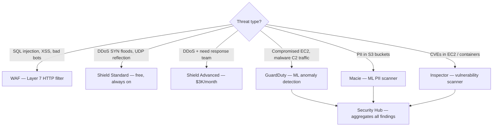
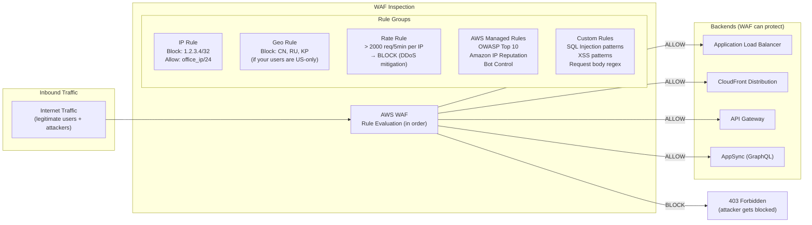
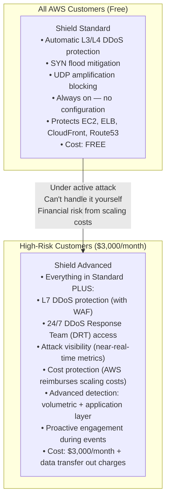
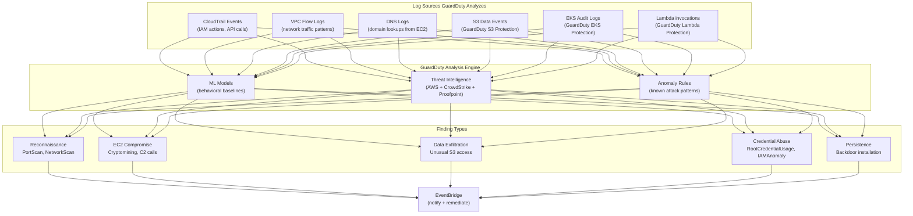
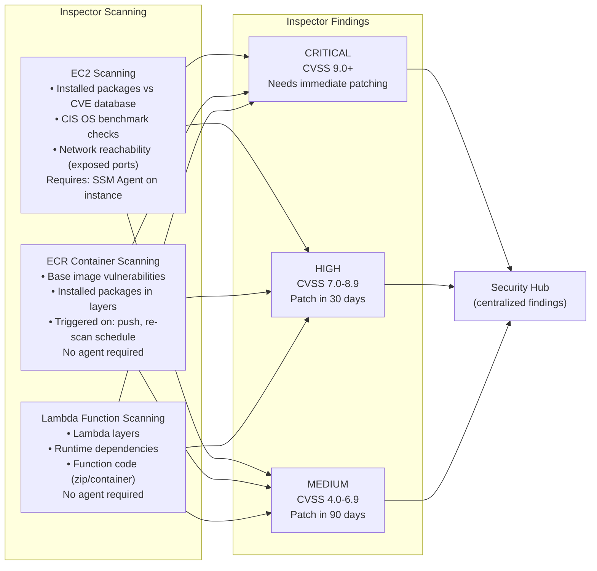
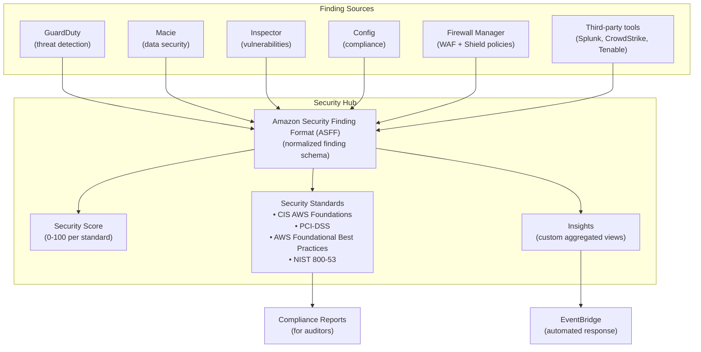
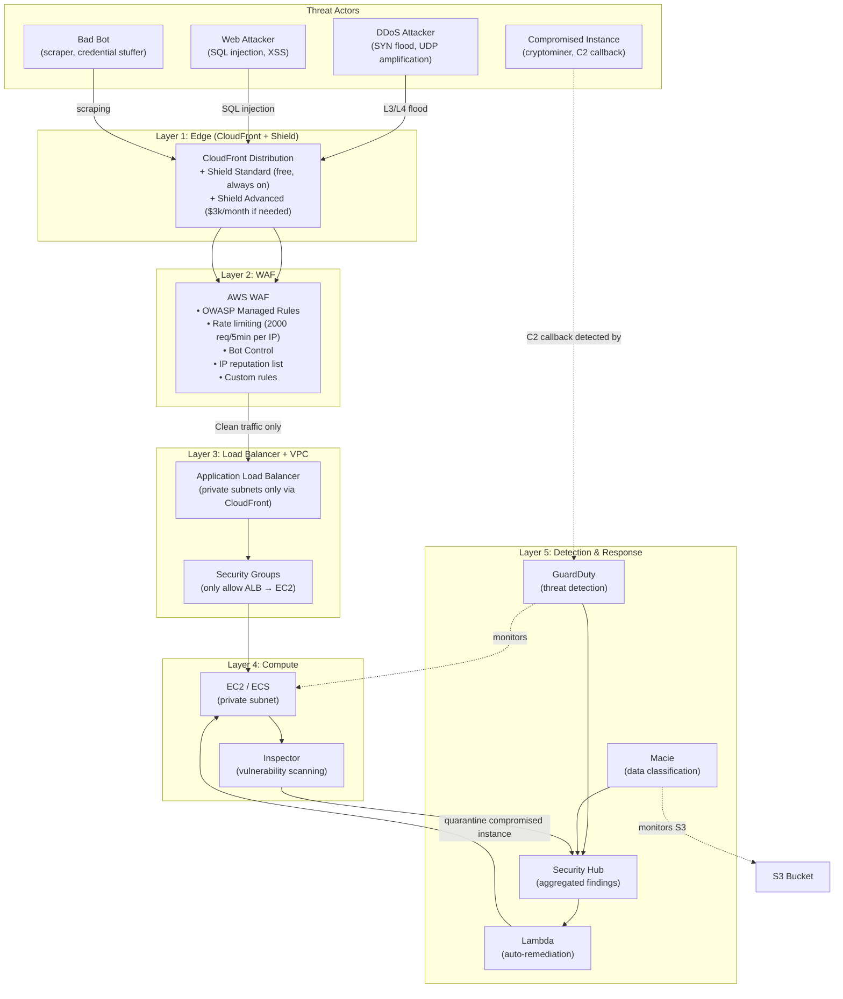
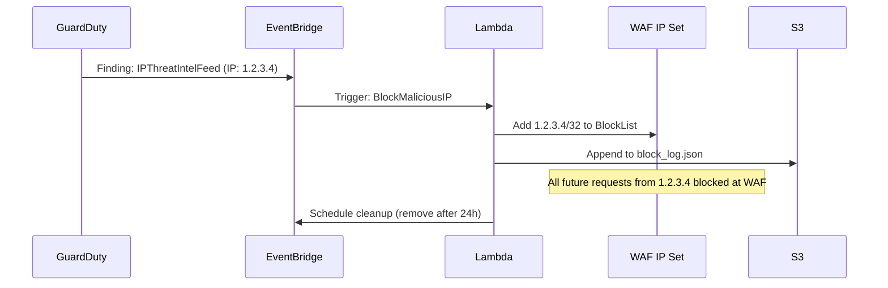

# AWS WAF, Shield, GuardDuty & Security Services: Multi-Layer Threat Protection

## 🗺️ Quick Overview



*Match threat type to service: WAF for application layer, GuardDuty for runtime threats, Macie for data exposure.*

> **Common Interview Question**: "How do you protect a public API from DDoS attacks? How do you detect if an EC2 instance has been compromised? What's the difference between WAF and Shield? Your security team says 'we need to know if any S3 bucket contains PII' — which AWS service do you use?"

Common in: AWS Solutions Architect, Security Engineering, Senior Backend, Cloud Security interviews

---

## Quick Answer (30-second version)

- **WAF** = Web Application Firewall. Inspects HTTP/HTTPS requests at layer 7. Blocks SQL injection, XSS, bad bots, specific IPs, countries, request patterns. Runs in front of ALB, CloudFront, API Gateway, AppSync.
- **Shield Standard** = Free, automatic DDoS protection for all AWS customers. Covers layer 3/4 attacks (SYN floods, UDP reflection). Always on, nothing to enable.
- **Shield Advanced** = Paid ($3,000/month). Layer 7 DDoS protection, 24/7 DRT (DDoS Response Team) access, cost protection (AWS reimburses scaling costs during attacks), near-real-time metrics.
- **GuardDuty** = ML-based threat detection. Analyzes CloudTrail, VPC Flow Logs, DNS logs, and S3 data events to find anomalies. EC2 exfiltrating data to known malware C2 server? GuardDuty finds it.
- **Macie** = PII detector for S3. Uses ML to identify personal data (SSNs, credit cards, passports) and flag public or unprotected buckets.
- **Inspector** = Vulnerability scanner for EC2 instances and container images. Finds CVEs, unpatched packages, CIS benchmark violations.
- **Security Hub** = Aggregates findings from GuardDuty, Macie, Inspector, Config, and third-party tools into a single dashboard with ASFF (Amazon Security Finding Format).

---

## Why This Matters / The Thought Process

Security interview questions test whether you understand the **threat model** and can match the right tool to the right threat. The mistake candidates make is thinking "we need security, let's turn on WAF" — but WAF won't help if your EC2 instance is compromised via a leaked SSH key, and GuardDuty won't block SQL injection.

The interviewer wants to hear you think in layers:

**The 5 layers of AWS security threats:**

| Layer | Threat type | Service that addresses it |
|-------|------------|--------------------------|
| Network (L3/L4) | SYN flood, UDP amplification, volumetric DDoS | Shield Standard/Advanced |
| Application (L7) | SQL injection, XSS, OWASP Top 10, bot traffic | WAF |
| Compute | Compromised EC2, cryptomining, lateral movement | GuardDuty, Inspector |
| Identity | Leaked IAM credentials, unusual API calls | GuardDuty, CloudTrail |
| Data | PII in wrong place, public S3 buckets | Macie, Config |

Think like an SA: When a company asks "how do we secure our AWS infrastructure?", the answer isn't one service — it's a defense-in-depth architecture where every layer is independently covered.

---

## Service Decision Framework: Which Threat → Which Service

Memorize this table for interviews:

| Threat / Scenario | Service | Why |
|------------------|---------|-----|
| SQL injection attack on your API | **WAF** | Layer 7 request inspection, OWASP managed rules |
| DDoS flood taking down your ALB | **Shield Advanced** + WAF | L3/L4 volumetric → Shield, L7 rate-based → WAF |
| Bot scraping your pricing page | **WAF** (rate-based rules + Bot Control) | Request rate and bot fingerprinting |
| EC2 instance calling known malware server | **GuardDuty** | Network traffic anomaly detection |
| IAM access keys leaked on GitHub, being used | **GuardDuty** | Unusual API call patterns from unexpected locations |
| Cryptomining on your EC2 instances | **GuardDuty** | High CPU + outbound DNS to mining pools |
| PII data sitting in a public S3 bucket | **Macie** | ML-based PII detection + public access check |
| EC2 has unpatched CVE-2024-1234 | **Inspector** | Vulnerability scanning against CVE database |
| You want ALL findings in one place | **Security Hub** | Aggregator for GuardDuty + Macie + Inspector + Config |
| Attacker doing port scans on your EC2 | **GuardDuty** | VPC Flow Log analysis, reconnaissance detection |
| Lateral movement inside your VPC | **GuardDuty** | Unusual internal traffic patterns |
| Someone exfiltrating data from S3 | **GuardDuty** (S3 Protection) + Macie | Unusual S3 access patterns + data classification |

---

## Deep Dive: AWS WAF

### How WAF Works

WAF sits in front of your application and inspects every HTTP/HTTPS request before it reaches your backend. You define rules that either ALLOW, BLOCK, or COUNT matching requests.



### WAF Rule Groups and Managed Rules

**AWS Managed Rule Groups** (maintained by AWS, updated automatically):

| Rule Group | What it blocks | Cost |
|------------|---------------|------|
| `AWSManagedRulesCommonRuleSet` | OWASP Top 10: SQLi, XSS, remote file inclusion, common exploits | Included in WAF pricing |
| `AWSManagedRulesKnownBadInputsRuleSet` | Log4Shell, Spring4Shell, common malicious patterns | Included |
| `AWSManagedRulesAmazonIpReputationList` | IPs known for bots, crawlers, DoS tools (AWS threat intel) | Included |
| `AWSManagedRulesBotControlRuleSet` | Bot traffic, scrapers, headless browsers | Extra charge: $10/million requests |
| `AWSManagedRulesAnonymousIpList` | Tor exit nodes, VPNs, anonymous proxies | Included |

**Custom rule example — rate limiting:**
```json
{
  "Name": "RateLimitPerIP",
  "Priority": 1,
  "Statement": {
    "RateBasedStatement": {
      "Limit": 2000,
      "AggregateKeyType": "IP",
      "EvaluationWindowSec": 300
    }
  },
  "Action": { "Block": {} },
  "VisibilityConfig": {
    "SampledRequestsEnabled": true,
    "CloudWatchMetricsEnabled": true,
    "MetricName": "RateLimitPerIP"
  }
}
```

This blocks any IP sending more than 2,000 requests in a 5-minute window.

### WAF Pricing (Certification Trap)

**WAF is NOT free.** This trips up many candidates:

| Cost component | Price |
|----------------|-------|
| Web ACL | $5/month |
| Rule group | $1/month each |
| Requests inspected | $0.60 per million requests |
| Bot Control | Extra $10 per million requests |

**Shield Standard is free. WAF is not.** Always note this in interviews.

---

## Deep Dive: Shield Standard vs Shield Advanced



### When Do You Need Shield Advanced?

| Scenario | Standard | Advanced | Reason |
|----------|----------|----------|--------|
| Small SaaS, low profile | Yes | No | Standard handles most L3/L4 attacks |
| E-commerce with $10M/day revenue | Maybe | **Yes** | DRT access + cost protection worth it |
| Financial institution, payment processor | Yes | **Yes** | Regulatory + SLA requirements |
| DDoS-for-hire target (gaming, crypto) | Yes | **Yes** | Repeated sophisticated attacks need DRT |
| Government / critical infrastructure | Yes | **Yes** | Compliance + proactive engagement |

**The $3,000/month question from interviewers**: "Is Shield Advanced worth it?"
> "If you're running a business where 1 hour of DDoS downtime costs more than $3,000 — and for most e-commerce or financial services businesses, it does — then yes. The DRT (DDoS Response Team) can engage in real time, fine-tune WAF rules during an attack, and the cost protection clause means AWS reimburses EC2/CloudFront scaling costs incurred because of a DDoS attack."

---

## Deep Dive: Amazon GuardDuty

### How GuardDuty Works

GuardDuty doesn't touch your application. It analyzes **existing AWS log sources** using ML and threat intelligence:



**Critical point**: GuardDuty doesn't need you to enable CloudTrail, VPC Flow Logs, or DNS logging separately — it automatically enables its own data sources. You don't need to configure anything except turning GuardDuty on.

### GuardDuty Finding Categories (Interview Favorites)

| Finding | What it means | Severity |
|---------|--------------|----------|
| `EC2:CryptoCurrencyMiningActivity` | EC2 querying cryptocurrency mining pools | HIGH |
| `EC2:TrojanActivity` | EC2 communicating with known malware C2 server | HIGH |
| `EC2:PortProbeUnprotectedPort` | Someone is port-scanning your EC2 | LOW-MED |
| `IAMUser:AnomalousBehavior` | IAM user doing something they never do (new region, unusual API) | HIGH |
| `Credentials:AWSCredentialExfiltration/MaliciousIPCaller` | Your IAM creds being used from a known malicious IP | HIGH |
| `S3:PolicGrantedToPublic` | S3 bucket became publicly accessible | MED |
| `S3:UnusualObject` | Ransomware-like S3 activity (mass delete + re-upload) | HIGH |
| `Kubernetes:AnomalousBehavior` | Unusual EKS API calls | HIGH |
| `RootCredentialUsage` | Root account was used (should almost never happen) | HIGH |

### GuardDuty + Multi-Account Architecture

```
Security Account
├── GuardDuty Admin Account
│   ├── Aggregates findings from all member accounts
│   ├── Single dashboard for 50 accounts
│   └── EventBridge rules → Lambda → PagerDuty

Member Accounts (50 accounts)
├── GuardDuty enabled (cannot be disabled by member accounts)
├── Findings sent to admin account
└── Local response possible if needed
```

**Pricing**: GuardDuty costs per GB of data analyzed. A typical AWS account runs $10-150/month. A large account with high CloudTrail volume can reach $1,000+/month. This is the most common cost trap.

---

## Deep Dive: Amazon Macie

Macie uses ML to **discover, classify, and protect sensitive data in S3**.

```
Macie scans S3 buckets and identifies:
├── PII (Personally Identifiable Information)
│   ├── SSNs, passport numbers, driver's license numbers
│   ├── Email addresses, phone numbers, mailing addresses
│   └── Full names combined with other identifiers
├── Financial data
│   ├── Credit card numbers (PAN)
│   ├── Bank account numbers, routing numbers
│   └── Financial account details
├── Health information (PHI)
│   ├── Medical record numbers
│   └── Health insurance IDs
└── Access violations
    ├── Publicly accessible buckets with sensitive data
    └── Buckets with sensitive data shared with external accounts
```

**Interview scenario**: "GDPR audit team says we need to know which S3 buckets contain personal data."

> "Enable Macie across all accounts via AWS Organizations. Run a discovery job across all S3 buckets. Macie will generate findings for every bucket where it detects PII. Review the sensitive data findings report — it shows each bucket, the type of sensitive data found, and whether the bucket is publicly accessible. This gives you a data map for GDPR purposes without manually inspecting every object."

**Macie vs GuardDuty for S3:**
- **Macie** = What data is in the bucket? (classification, PII detection)
- **GuardDuty** = How is the bucket being accessed? (unusual access patterns, potential exfiltration)

---

## Deep Dive: Amazon Inspector

Inspector performs **automated vulnerability assessments** against:
- EC2 instances (CVEs, CIS benchmarks, network reachability)
- ECR container images (CVEs in base image and installed packages)
- Lambda functions (CVEs in layers and dependencies)



**Key difference from third-party scanners**: Inspector integrates natively with SSM for EC2 (no separate agent) and has direct ECR integration (scans on push without any pipeline changes).

---

## Deep Dive: Security Hub

Security Hub is the **aggregator** for all security findings.



**Why Security Hub matters**: Without it, you'd have to log into 5 different consoles to see findings from GuardDuty, Macie, Inspector, Config, and Firewall Manager. Security Hub normalizes everything into one place. For multi-account setups, designate a Security Hub administrator account and it aggregates findings from all member accounts.

---

## Architecture: Multi-Layer Security for a Public API



---

## Interview Scenario: "EC2 Instance is Compromised — Walk Me Through the Response"

**Question**: "GuardDuty shows a finding: `EC2:TrojanActivity` — your EC2 instance is communicating with a known malware C2 server. What do you do?"

**Model answer:**

> "First, I'd verify the finding in GuardDuty — check the finding details to confirm which instance, what IP it's calling, and the confidence score. If it's HIGH severity and I trust the finding, I act immediately.
>
> **Step 1: Isolate the instance** — modify the security group to deny all inbound and outbound traffic. This stops the lateral movement and C2 communication without losing the instance for forensics.
>
> **Step 2: Take a forensic snapshot** — create an EBS snapshot of the root volume before doing anything else. This preserves the state for incident analysis.
>
> **Step 3: Revoke credentials** — if this instance had an IAM role, I'd create a deny-all permission boundary or remove the instance profile. If any hardcoded access keys exist, rotate them immediately.
>
> **Step 4: Investigate** — launch a new instance from the snapshot in an isolated VPC (no internet access). Run memory analysis, check running processes, look at bash history and network connections at time of compromise. Use VPC Flow Logs to see what IPs the instance was communicating with.
>
> **Step 5: Remediate** — terminate the compromised instance, launch a new one from a known-good AMI, patch the vulnerability that was exploited (Inspector finding likely identified it beforehand).
>
> **Step 6: Automate for next time** — create an EventBridge rule that triggers a Lambda function when GuardDuty detects `EC2:TrojanActivity` with HIGH severity. The Lambda automatically isolates the instance and notifies the security team."

**Automated response Lambda (architecture):**

```javascript
// Lambda triggered by EventBridge when GuardDuty HIGH/CRITICAL finding detected
const { EC2Client, ModifyInstanceAttributeCommand,
        CreateSecurityGroupCommand, RevokeSecurityGroupIngressCommand } = require('@aws-sdk/client-ec2');

exports.handler = async (event) => {
  const finding = event.detail;
  const instanceId = finding.resource?.instanceDetails?.instanceId;
  const region = event.region;
  const accountId = event.account;

  if (!instanceId) {
    console.log('No instance ID in finding, skipping');
    return;
  }

  const ec2 = new EC2Client({ region });

  // Step 1: Create an isolation security group (no inbound, no outbound)
  const isolationSg = await ec2.send(new CreateSecurityGroupCommand({
    GroupName: `isolation-${instanceId}-${Date.now()}`,
    Description: `Isolation group for compromised instance ${instanceId}`,
    VpcId: finding.resource.instanceDetails.networkInterfaces[0].vpcId
  }));

  // Step 2: Attach isolation security group (replaces existing SGs)
  await ec2.send(new ModifyInstanceAttributeCommand({
    InstanceId: instanceId,
    Groups: [isolationSg.GroupId]  // Only the isolation SG — no traffic in or out
  }));

  console.log(`Instance ${instanceId} isolated with SG ${isolationSg.GroupId}`);

  // Step 3: Post to Security Hub + notify team (SNS/Slack)
  // ... notification code here

  return {
    instanceId,
    action: 'isolated',
    isolationSecurityGroup: isolationSg.GroupId,
    finding: finding.type
  };
};
```

---

## WAF + GuardDuty Together: Blocking IPs That GuardDuty Flags

A common architecture pattern: when GuardDuty flags an IP as malicious, automatically add it to a WAF IP set to block future requests.



---

## Common Interview Follow-ups

**Q: "WAF is expensive — how do you reduce costs?"**

> "WAF pricing has three components: the WebACL ($5/month), each rule ($1/month), and requests ($0.60/million). To reduce costs: use fewer, more targeted rules instead of enabling every managed rule group; use Bot Control only on the specific paths that matter (login pages, API endpoints with high abuse risk); use sampling on CloudWatch metrics rather than logging every request to S3 (which has additional Firehose + S3 costs). For a small startup, WAF often isn't necessary — start with rate limiting at the ALB or API Gateway level before adding WAF."

**Q: "How does GuardDuty know an IP is malicious?"**

> "GuardDuty uses multiple threat intelligence feeds: AWS's own threat intelligence, CrowdStrike, Proofpoint, and community threat intel lists. These feeds contain known malware C2 servers, botnet command IPs, Tor exit nodes, cryptomining pool addresses, and IPs associated with known attack campaigns. GuardDuty cross-references every IP your EC2 instances communicate with against these feeds. It also has behavioral baselines — if your EC2 instance suddenly starts sending 100MB/hour of outbound traffic to an IP in a country you've never communicated with before, that's anomalous even if the IP isn't in a threat feed."

**Q: "Can GuardDuty protect against insider threats?"**

> "Yes. GuardDuty has specific finding types for privileged user abuse: `IAMUser:AnomalousBehavior` fires when an IAM user starts doing things they've never done before — accessing new regions, calling new API actions, downloading large amounts of data. `RootCredentialUsage` fires any time the root account is used (which should be essentially never in a well-managed account). For deeper insider threat detection, you'd complement GuardDuty with CloudTrail analysis using Athena or a SIEM, looking for patterns like mass data downloads during off-hours."

**Q: "Explain the difference between Shield and WAF for DDoS."**

> "Shield handles volumetric, infrastructure-level DDoS — the kind where an attacker sends terabytes of traffic to saturate your network connection. Shield Standard automatically absorbs layer 3 and layer 4 attacks (SYN floods, UDP amplification, IP fragmentation). WAF handles application-layer DDoS, which looks like legitimate HTTP requests but in overwhelming volume — slow attacks, HTTP floods. WAF rate-based rules detect when any single IP is making more requests than normal and block it. The two work together: Shield stops the 1 Tbps flood, WAF stops the 100K requests/second HTTP flood."

**Q: "When would you NOT use GuardDuty?"**

> "GuardDuty is cheap enough (often under $50-100/month for small accounts) that the main reasons not to use it are very tight budgets in dev/test environments. The main cost driver is CloudTrail log volume — if you're running load tests that generate massive CloudTrail event volumes, GuardDuty costs spike. In that case, you might exclude test accounts from GuardDuty. But for any production environment, GuardDuty is always worth it — the cost of one undetected breach far exceeds a year of GuardDuty costs."

**Q: "How do Security Hub, GuardDuty, Macie, and Inspector relate to each other?"**

> "Think of GuardDuty, Macie, and Inspector as specialized sensors, and Security Hub as the central monitoring station. GuardDuty monitors behavior and network traffic for threats. Macie monitors S3 for sensitive data and data access patterns. Inspector scans for known vulnerabilities in your running infrastructure. Each generates findings in different formats. Security Hub normalizes all findings into ASFF (Amazon Security Finding Format), aggregates them in one place, maps them to compliance frameworks (CIS, PCI-DSS, NIST), and lets you route findings to EventBridge for automated response."

---

## AWS Certification Exam Tips

1. **WAF is NOT free** — $5/month for a WebACL plus per-request charges. Shield Standard IS free. This distinction appears on virtually every exam.

2. **Shield Standard is always on** — you don't enable it, configure it, or pay for it. It's automatic for all AWS customers on CloudFront, Route53, ELB, EC2, and Global Accelerator.

3. **WAF requires explicit attachment** — WAF doesn't protect your ALB automatically. You must create a WebACL and attach it to the specific ALB, CloudFront distribution, or API Gateway.

4. **GuardDuty findings do NOT block traffic** — GuardDuty is a detector, not a blocker. It generates findings. You must set up EventBridge + Lambda to take automated action (block the IP in WAF, isolate the instance, revoke credentials).

5. **GuardDuty costs per GB analyzed** — in accounts with high CloudTrail or VPC Flow Log volume, GuardDuty costs scale significantly. This is the most common GuardDuty cost surprise.

6. **Macie scans S3, not databases** — Macie finds PII in S3 object content. For PII in RDS, you'd need a different approach (Data Masking with AWS Glue DataBrew, or a third-party tool).

7. **Inspector requires SSM Agent for EC2** — Inspector uses SSM to run vulnerability assessments on EC2 instances. No SSM Agent = no EC2 vulnerability findings. Container and Lambda scanning require no agent.

8. **WAF rate-based rules count per 5-minute window** — not per second or per minute. The minimum rate limit in WAF is 100 requests per 5 minutes.

9. **Security Hub is a regional service** — Security Hub aggregates findings within a region. For multi-region visibility, designate one aggregation region and configure Security Hub cross-region aggregation.

10. **AWS Firewall Manager** = the policy management layer on top of WAF and Shield Advanced. If you need to deploy WAF rules across 50 accounts consistently, use Firewall Manager (with Organizations) rather than configuring WAF in each account separately.

---

## Key Takeaways

- **WAF** = layer 7 request inspection. Blocks SQL injection, XSS, bots, rate abusers. Runs in front of ALB/CloudFront/API Gateway. Not free.
- **Shield Standard** = always-on, free L3/L4 DDoS protection. Shield Advanced = paid, adds L7 DDoS, DRT team, cost protection.
- **GuardDuty** = ML-based behavioral threat detection. Analyzes CloudTrail + VPC Flow Logs + DNS. Finds compromised EC2, leaked credentials, exfiltration. Does NOT block — it detects.
- **Macie** = PII detector for S3. Required for GDPR/HIPAA data discovery.
- **Inspector** = vulnerability scanner for EC2, ECR, Lambda. Finds CVEs and unpatched packages.
- **Security Hub** = aggregator. Normalizes findings from all security services into one dashboard, maps to compliance standards.
- Defense-in-depth: use all layers — Shield at the edge, WAF for application attacks, GuardDuty for behavioral anomalies, Macie for data classification, Inspector for vulnerability management.
- EventBridge + Lambda = automated response. GuardDuty or Config finds it → Lambda remediates it automatically.

## Related Topics

- [AWS CloudTrail & Config — Audit and Compliance](/12-interview-prep/quick-reference/aws-cloud/cloudtrail-config)
- [AWS IAM — Roles, Policies, and Multi-Account Security](/12-interview-prep/quick-reference/aws-cloud/iam-roles-policies)
- [AWS VPC Networking](/12-interview-prep/quick-reference/aws-cloud/vpc-networking)
- [API Gateway](/12-interview-prep/quick-reference/aws-cloud/api-gateway)
