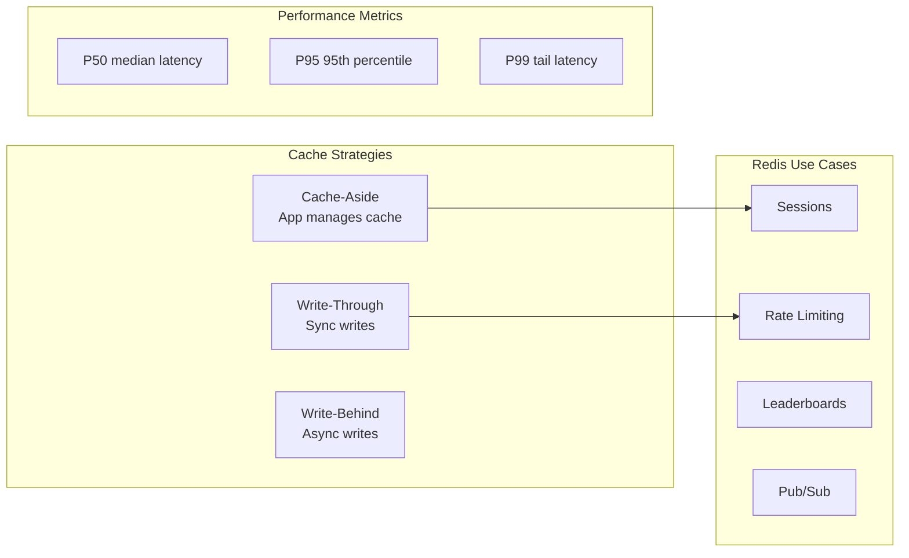

# Caching & Performance - Interview Questions



## 📋 Questions Covered

1. [Redis Caching Fundamentals](/12-interview-prep/quick-reference/caching/redis-fundamentals)
2. [CDN Usage and Optimization](/12-interview-prep/quick-reference/caching/cdn-usage)
3. [Cache Strategies (cache-aside, write-through, write-behind)](/12-interview-prep/quick-reference/caching/cache-strategies)
4. [API Metrics: P50, P95, P99 Response Times](/12-interview-prep/quick-reference/caching/api-metrics)
5. [Performance Bottleneck Identification](/12-interview-prep/quick-reference/caching/performance-bottlenecks)

## 🎯 Quick Reference

| Question | Quick Answer | Article |
|----------|--------------|---------|
| Redis use cases? | Caching, sessions, rate limiting, leaderboards, pub/sub | [View Article](/12-interview-prep/quick-reference/caching/redis-fundamentals) |
| When to use CDN? | Static assets, videos, global distribution, reduce latency | [View Article](/12-interview-prep/quick-reference/caching/cdn-usage) |
| Cache-aside vs Write-through? | Cache-aside: app manages cache, Write-through: sync writes | [View Article](/12-interview-prep/quick-reference/caching/cache-strategies) |
| P95 vs Average? | P95 shows 95% experience, average hides outliers | [View Article](/12-interview-prep/quick-reference/caching/api-metrics) |
| Find bottlenecks? | APM tools, DB profiling, distributed tracing, heap snapshots | [View Article](/12-interview-prep/quick-reference/caching/performance-bottlenecks) |

## 💡 Interview Tips

**Common Follow-ups**:
- "How do you handle cache invalidation?"
- "What's an acceptable P95/P99 for your API?"
- "How do you debug a slow endpoint?"
- "Redis vs Memcached?"

**Red Flags to Avoid**:
- ❌ Using average latency instead of percentiles
- ❌ Not considering cache invalidation strategy
- ❌ Caching without TTL (memory leak!)
- ❌ Not monitoring cache hit rates

## 🔥 Real-World Scenarios

### Scenario 1: "API is slow during peak hours"
**Answer**: Check if it's a database bottleneck (add read replicas, indexes), cache hot data in Redis (80%+ hit rate target), use CDN for static assets, implement connection pooling.

### Scenario 2: "P99 latency is 5 seconds"
**Answer**: Use APM to identify slow endpoints, check for N+1 queries, add database indexes, implement timeouts to prevent hanging requests, optimize slow queries with EXPLAIN ANALYZE.

### Scenario 3: "Cache hit rate is only 30%"
**Answer**: Increase TTL if appropriate, check if data is too personalized (can't cache), implement cache warming for predictable access patterns, use refresh-ahead for frequently accessed data.

## 📊 Performance Benchmarks

### Latency Comparison
```
Operation                    Latency
─────────────────────────────────────
L1 cache reference           0.5 ns
Redis cache hit              1-5 ms
Database query (indexed)     10-50 ms
Database query (full scan)   100-1000 ms
Cross-region API call        100-300 ms
```

### Cache Impact
```
Without Cache:
- DB query: 50ms
- 1000 req/sec = Database overload

With Redis (80% hit rate):
- Cache hit: 5ms
- Cache miss: 52ms (50ms DB + 2ms write)
- Average: (0.8 × 5ms) + (0.2 × 52ms) = 14.4ms
- Result: 3.5x faster!
```

---

Start with: [Redis Caching Fundamentals](/12-interview-prep/quick-reference/caching/redis-fundamentals)
