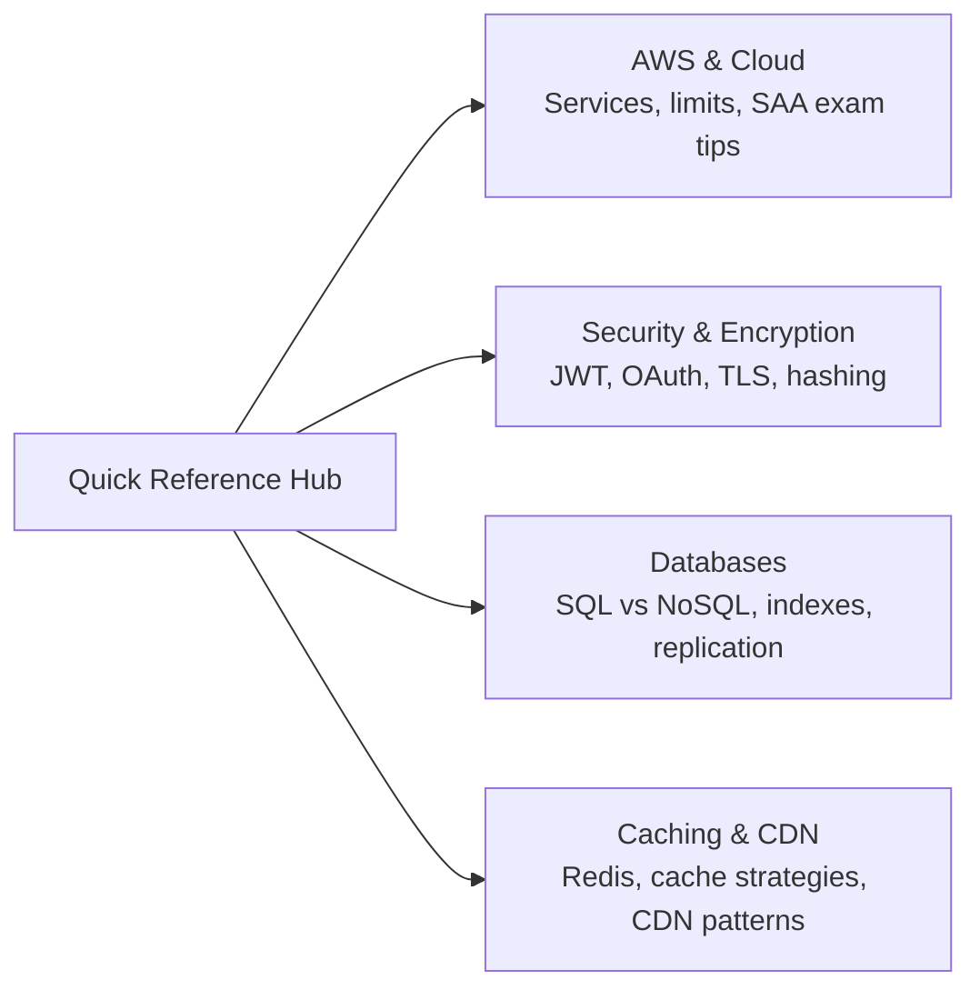

# Quick Reference

Concise reference sheets for system design interviews, organized by topic. Use these for fast review before an interview — each sheet fits on one screen.

| Sheet | What's Inside |
|-------|--------------|
| [AWS & Cloud](/12-interview-prep/quick-reference/aws-cloud) | Key services, limits, SAA scenarios, and when to choose EC2 vs Lambda vs ECS |
| [Security & Encryption](/12-interview-prep/quick-reference/security) | JWT, OAuth 2.0, hashing algorithms, TLS handshake, zero-trust |
| [Databases](/12-interview-prep/quick-reference/databases) | SQL vs NoSQL decision table, indexes, replication, sharding patterns |
| [Caching & CDN](/12-interview-prep/quick-reference/caching) | Redis data structures, cache strategies, eviction policies, CDN patterns |
