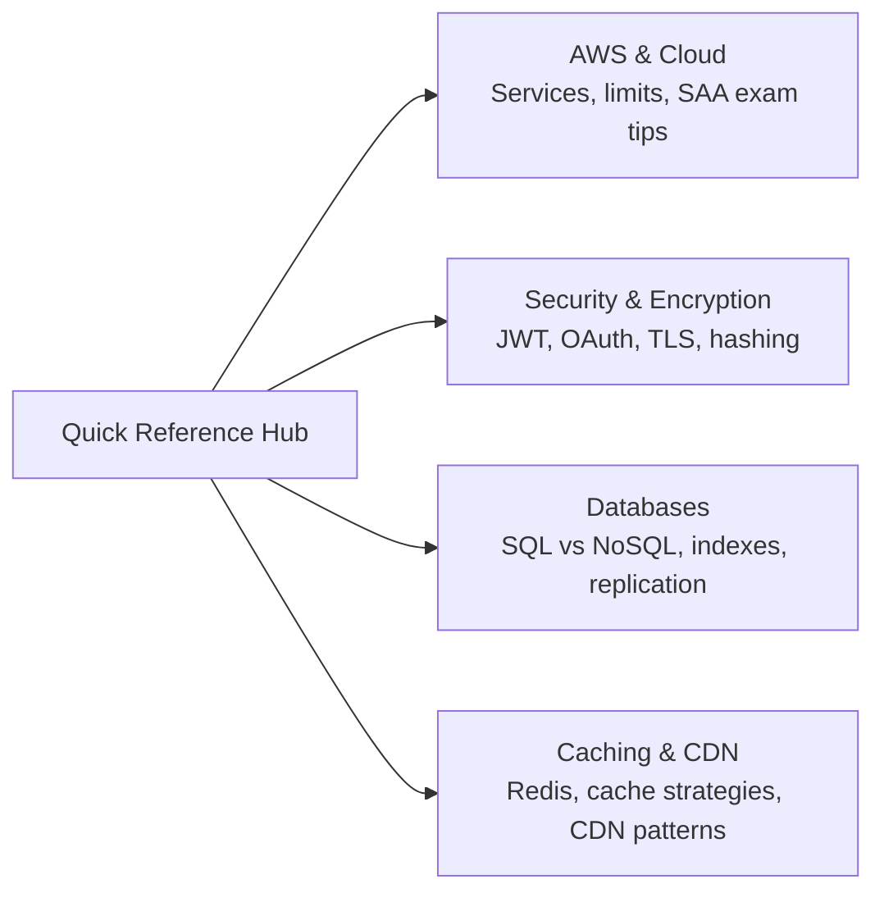

# Quick Reference

Concise reference sheets for system design interviews, organized by topic.

- [AWS & Cloud](./aws-cloud) — Key services, limits, and when to use them
- [Security & Encryption](./security) — JWT, OAuth, hashing algorithms, TLS
- [Databases](./databases) — SQL vs NoSQL, indexing, replication, partitioning
- [Caching & CDN](./caching) — Redis, cache strategies, CDN patterns
