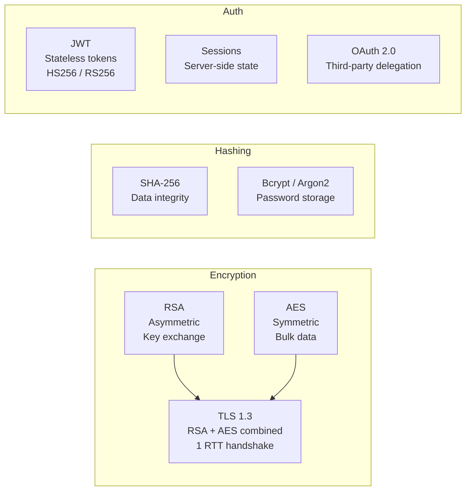

# Security & Encryption - Interview Questions

## 📋 Questions Covered

1. [Encryption Basics: RSA vs AES](/12-interview-prep/security-encryption/rsa-vs-aes)
2. [Hashing vs Encryption](/12-interview-prep/security-encryption/hashing-vs-encryption)
3. [SHA-1 vs SHA-2 Comparison](/12-interview-prep/security-encryption/sha-comparison)
4. [JWT vs Session vs OAuth 2.0](/12-interview-prep/security-encryption/jwt-vs-session)
5. [MITM Attack Prevention](/12-interview-prep/security-encryption/mitm-prevention)

## 🎯 Quick Reference

| Question | Quick Answer | Article |
|----------|--------------|---------|
| RSA vs AES? | RSA: asymmetric (slow, small data), AES: symmetric (fast, large data) | [View Article](/12-interview-prep/security-encryption/rsa-vs-aes) |
| Hash vs Encrypt? | Hash: one-way (passwords), Encrypt: two-way (data protection) | [View Article](/12-interview-prep/security-encryption/hashing-vs-encryption) |
| SHA-1 vs SHA-2? | SHA-1: Broken (deprecated), SHA-2: Secure (use SHA-256) | [View Article](/12-interview-prep/security-encryption/sha-comparison) |
| JWT vs Session? | Session: server-side storage, JWT: client-side (stateless) | [View Article](/12-interview-prep/security-encryption/jwt-vs-session) |
| Prevent MITM? | HTTPS/TLS, HSTS, Certificate Pinning, Mutual TLS | [View Article](/12-interview-prep/security-encryption/mitm-prevention) |

## 💡 Interview Tips

**Common Follow-ups**:
- "When would you use each?"
- "How do you implement this?"
- "What are the performance implications?"
- "How do you handle key management?"

**Red Flags to Avoid**:
- ❌ Saying "encryption is secure" without specifying algorithm
- ❌ Not mentioning key management
- ❌ Confusing hashing with encryption
- ❌ Not discussing TLS/HTTPS for MITM
