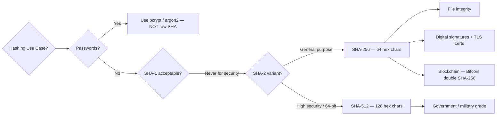

# SHA-1 vs SHA-2 - Hash Algorithm Comparison

**Interview Question**: *"What is the difference between SHA-1 and SHA-2? What does SHA stand for? When would you use each?"*

**Difficulty**: 🟡 Intermediate
**Asked by**: HDFC, Amazon, Security-focused Companies
**Time to Answer**: 3-4 minutes

---

## 🗺️ Quick Overview



*SHA-1 is broken since 2017 — never use it for security; SHA-256 is the standard for file integrity, signatures, and blockchain; use bcrypt for passwords.*

---

## 🎯 Quick Answer (30 seconds)

**SHA** = **Secure Hash Algorithm**

**SHA-1** (160-bit):
- **Status**: Deprecated/Broken (since 2017)
- **Security**: Vulnerable to collision attacks
- **Use**: Should NOT be used for security purposes
- **Output**: 40 hex characters (160 bits)

**SHA-2** (224/256/384/512-bit):
- **Status**: Current standard (secure)
- **Security**: No known practical attacks
- **Use**: Passwords, certificates, file integrity, blockchain
- **Output**: 64 hex characters for SHA-256 (256 bits)

**Recommendation**: Always use SHA-256 (or higher) from SHA-2 family.

---

## 📚 Detailed Explanation

### What is SHA?

SHA (Secure Hash Algorithm) is a family of cryptographic hash functions designed by the NSA and published by NIST. They take input data of any size and produce a fixed-size hash output.

**Key Properties**:
1. **Deterministic**: Same input always produces same hash
2. **One-way**: Cannot reverse hash to get original input
3. **Collision-resistant**: Hard to find two inputs with same hash
4. **Avalanche effect**: Small input change → completely different hash

### SHA-1 (1995) - DEPRECATED

```javascript
const crypto = require('crypto');

// SHA-1 Example (DO NOT USE IN PRODUCTION)
function sha1Hash(data) {
  return crypto
    .createHash('sha1')
    .update(data)
    .digest('hex');
}

const input = "Hello, World!";
const hash = sha1Hash(input);

console.log('SHA-1 Hash:', hash);
// Output: 0a0a9f2a6772942557ab5355d76af442f8f65e01 (40 hex chars = 160 bits)
```

**Problems with SHA-1**:
- ❌ **Collision vulnerability**: Google demonstrated collision in 2017
- ❌ **Deprecated by browsers**: SSL certificates rejected since 2017
- ❌ **Not suitable for security**: Can be attacked with sufficient resources
- ❌ **Legacy use only**: Git commits (for backward compatibility)

**Real-World SHA-1 Collision Example**:
```javascript
// In 2017, Google created two different PDF files with same SHA-1 hash
// File 1: shattered-1.pdf
// File 2: shattered-2.pdf
// SHA-1: 38762cf7f55934b34d179ae6a4c80cadccbb7f0a (SAME!)

// This proves SHA-1 is broken for security purposes
```

### SHA-2 Family (2001) - CURRENT STANDARD

SHA-2 includes multiple variants:
- **SHA-224**: 224-bit (56 hex chars)
- **SHA-256**: 256-bit (64 hex chars) ⭐ **Most Common**
- **SHA-384**: 384-bit (96 hex chars)
- **SHA-512**: 512-bit (128 hex chars)

```javascript
const crypto = require('crypto');

class SHA2Hashing {
  // SHA-256 (Recommended)
  static sha256(data) {
    return crypto
      .createHash('sha256')
      .update(data)
      .digest('hex');
  }

  // SHA-512 (Higher security)
  static sha512(data) {
    return crypto
      .createHash('sha512')
      .update(data)
      .digest('hex');
  }

  // SHA-256 with salt (for passwords)
  static sha256WithSalt(data, salt) {
    return crypto
      .createHash('sha256')
      .update(data + salt)
      .digest('hex');
  }
}

// Examples
const input = "Hello, World!";

console.log('SHA-256:', SHA2Hashing.sha256(input));
// dffd6021bb2bd5b0af676290809ec3a53191dd81c7f70a4b28688a362182986f (64 hex chars)

console.log('SHA-512:', SHA2Hashing.sha512(input));
// 374d794a95cdcfd8b35993185fef9ba368f160d8daf432d08ba9f1ed1e5abe6c...
// (128 hex chars total)

// With salt (more secure)
const salt = crypto.randomBytes(16).toString('hex');
console.log('SHA-256 with salt:', SHA2Hashing.sha256WithSalt(input, salt));
```

**Advantages of SHA-2**:
- ✅ **Secure**: No known practical collision attacks
- ✅ **Industry standard**: Used everywhere (TLS, Bitcoin, certificates)
- ✅ **Multiple sizes**: Choose based on security needs
- ✅ **Fast**: Optimized implementations available

---

## 🔄 Real-World Examples

### Example 1: Password Hashing (WRONG vs RIGHT)

```javascript
// ❌ WRONG: Using SHA-1
function hashPasswordWrong(password) {
  return crypto
    .createHash('sha1')
    .update(password)
    .digest('hex');
}

// ❌ STILL WRONG: SHA-256 without salt
function hashPasswordStillWrong(password) {
  return crypto
    .createHash('sha256')
    .update(password)
    .digest('hex');
}

// ✅ CORRECT: bcrypt (better than plain SHA-256)
const bcrypt = require('bcrypt');

async function hashPasswordCorrect(password) {
  const saltRounds = 10;
  const hash = await bcrypt.hash(password, saltRounds);
  return hash;
}

async function verifyPassword(password, hash) {
  return await bcrypt.compare(password, hash);
}

// Usage
(async () => {
  const password = 'mySecretPassword123';

  // Hash password
  const hashedPassword = await hashPasswordCorrect(password);
  console.log('Hashed:', hashedPassword);

  // Verify password
  const isValid = await verifyPassword(password, hashedPassword);
  console.log('Valid:', isValid); // true
})();
```

**Why bcrypt over SHA-2 for passwords?**
- bcrypt includes salt automatically
- Adaptive: Can increase cost factor over time
- Designed to be slow (prevents brute force)
- Industry standard for password hashing

### Example 2: File Integrity Check (SHA-256)

```javascript
const crypto = require('crypto');
const fs = require('fs');

class FileIntegrityChecker {
  // Calculate file hash
  static async calculateFileHash(filePath) {
    return new Promise((resolve, reject) => {
      const hash = crypto.createHash('sha256');
      const stream = fs.createReadStream(filePath);

      stream.on('data', (data) => hash.update(data));
      stream.on('end', () => resolve(hash.digest('hex')));
      stream.on('error', reject);
    });
  }

  // Verify file integrity
  static async verifyFile(filePath, expectedHash) {
    const actualHash = await this.calculateFileHash(filePath);
    return actualHash === expectedHash;
  }

  // Create checksum file
  static async createChecksum(filePath) {
    const hash = await this.calculateFileHash(filePath);
    const checksumFile = `${filePath}.sha256`;

    fs.writeFileSync(checksumFile, `${hash}  ${filePath}\n`);
    console.log(`Checksum saved to ${checksumFile}`);
    return hash;
  }
}

// Usage
(async () => {
  const file = './important-document.pdf';

  // Create checksum
  const hash = await FileIntegrityChecker.createChecksum(file);
  console.log('File hash:', hash);

  // Later: Verify file hasn't been tampered with
  const isValid = await FileIntegrityChecker.verifyFile(file, hash);
  console.log('File integrity:', isValid ? 'VALID' : 'TAMPERED');
})();
```

### Example 3: Digital Signatures (SHA-256 + RSA)

```javascript
const crypto = require('crypto');

class DigitalSignature {
  constructor() {
    // Generate RSA key pair
    const { publicKey, privateKey } = crypto.generateKeyPairSync('rsa', {
      modulusLength: 2048
    });

    this.publicKey = publicKey;
    this.privateKey = privateKey;
  }

  // Sign data (hash with SHA-256, then encrypt with private key)
  sign(data) {
    const sign = crypto.createSign('SHA256'); // Uses SHA-256
    sign.update(data);
    sign.end();

    return sign.sign(this.privateKey, 'hex');
  }

  // Verify signature
  verify(data, signature) {
    const verify = crypto.createVerify('SHA256');
    verify.update(data);
    verify.end();

    return verify.verify(this.publicKey, signature, 'hex');
  }
}

// Usage
const signer = new DigitalSignature();

const document = 'Important contract agreement...';
const signature = signer.sign(document);

console.log('Signature:', signature);
console.log('Verified:', signer.verify(document, signature)); // true
console.log('Tampered:', signer.verify(document + ' HACKED', signature)); // false
```

### Example 4: Blockchain (SHA-256)

```javascript
const crypto = require('crypto');

class Block {
  constructor(index, timestamp, data, previousHash = '') {
    this.index = index;
    this.timestamp = timestamp;
    this.data = data;
    this.previousHash = previousHash;
    this.nonce = 0;
    this.hash = this.calculateHash();
  }

  calculateHash() {
    return crypto
      .createHash('sha256')
      .update(
        this.index +
        this.timestamp +
        JSON.stringify(this.data) +
        this.previousHash +
        this.nonce
      )
      .digest('hex');
  }

  // Proof of Work (mining)
  mineBlock(difficulty) {
    const target = Array(difficulty + 1).join('0');

    while (this.hash.substring(0, difficulty) !== target) {
      this.nonce++;
      this.hash = this.calculateHash();
    }

    console.log(`Block mined: ${this.hash}`);
  }
}

class Blockchain {
  constructor() {
    this.chain = [this.createGenesisBlock()];
    this.difficulty = 4; // Number of leading zeros required
  }

  createGenesisBlock() {
    return new Block(0, Date.now(), 'Genesis Block', '0');
  }

  getLatestBlock() {
    return this.chain[this.chain.length - 1];
  }

  addBlock(newBlock) {
    newBlock.previousHash = this.getLatestBlock().hash;
    newBlock.mineBlock(this.difficulty);
    this.chain.push(newBlock);
  }

  isChainValid() {
    for (let i = 1; i < this.chain.length; i++) {
      const currentBlock = this.chain[i];
      const previousBlock = this.chain[i - 1];

      // Verify current block hash
      if (currentBlock.hash !== currentBlock.calculateHash()) {
        return false;
      }

      // Verify link to previous block
      if (currentBlock.previousHash !== previousBlock.hash) {
        return false;
      }
    }
    return true;
  }
}

// Usage
const blockchain = new Blockchain();

console.log('Mining block 1...');
blockchain.addBlock(new Block(1, Date.now(), { amount: 100 }));

console.log('Mining block 2...');
blockchain.addBlock(new Block(2, Date.now(), { amount: 50 }));

console.log('Blockchain valid?', blockchain.isChainValid()); // true

// Try to tamper
blockchain.chain[1].data = { amount: 1000 };
console.log('After tampering:', blockchain.isChainValid()); // false
```

---

## 📊 Comparison Table

| Feature | SHA-1 | SHA-256 (SHA-2) | SHA-512 (SHA-2) |
|---------|-------|-----------------|-----------------|
| **Bit Length** | 160 bits | 256 bits | 512 bits |
| **Hex Length** | 40 characters | 64 characters | 128 characters |
| **Released** | 1995 | 2001 | 2001 |
| **Security Status** | ❌ Broken | ✅ Secure | ✅ Secure |
| **Collision Resistance** | ❌ Vulnerable | ✅ Strong | ✅ Strongest |
| **Speed** | Fast | Fast | Slower |
| **SSL/TLS** | ❌ Rejected | ✅ Standard | ✅ Supported |
| **Blockchain** | ❌ Not used | ✅ Bitcoin, Ethereum | ✅ Some altcoins |
| **Git** | ✅ Legacy | ⚠️ Git transitioning | - |
| **Best For** | Nothing (deprecated) | General purpose | High security needs |
| **Attack Vector** | Collision found | None known | None known |

---

## 🏢 Real-World Usage

### Companies Using SHA-256

**Bitcoin/Blockchain**:
```javascript
// Bitcoin uses double SHA-256
function doubleSHA256(data) {
  const hash1 = crypto.createHash('sha256').update(data).digest();
  const hash2 = crypto.createHash('sha256').update(hash1).digest('hex');
  return hash2;
}
```

**SSL/TLS Certificates**:
- All modern certificates use SHA-256
- SHA-1 certificates rejected by browsers since 2017

**Cloud Storage (AWS S3, Google Cloud)**:
- SHA-256 for ETag generation
- File integrity verification

**GitHub**:
- Transitioning from SHA-1 to SHA-256 for git commits
- New projects can use SHA-256

---

## 🎓 Interview Follow-up Questions

### Q: "Why is SHA-1 considered broken?"

**Answer**:
- In 2017, Google and CWI Amsterdam demonstrated a **collision attack** (SHAttered)
- They created two different PDF files with the **same SHA-1 hash**
- This breaks the fundamental collision-resistance property
- Cost: ~$110,000 in computation (feasible for attackers)
- Impact: Can't trust SHA-1 for certificates, signatures, or security

### Q: "Is SHA-256 quantum-resistant?"

**Answer**:
- ❌ **No**, SHA-256 is NOT quantum-resistant
- Grover's algorithm can reduce effective security from 256-bit to **128-bit**
- Still considered secure against quantum computers for now
- Post-quantum alternatives being researched: **SHA-3** (Keccak)

### Q: "When should I use SHA-512 instead of SHA-256?"

**Answer**:
- **SHA-256**: General purpose, most common, good balance
- **SHA-512**: When you need:
  - Higher security level (government, military)
  - 64-bit architectures (SHA-512 faster on 64-bit systems)
  - Future-proofing against attacks
- **Trade-off**: SHA-512 produces larger hashes (128 vs 64 hex chars)

### Q: "Should I use SHA-256 for password hashing?"

**Answer**:
- ❌ **No**, use bcrypt, argon2, or PBKDF2
- **Why?** SHA-256 is too fast
  - Attackers can hash billions of passwords per second
  - GPU/ASIC acceleration makes brute force easy
- **Better options**:
  - **bcrypt**: Adaptive, slow by design, includes salt
  - **argon2**: Winner of Password Hashing Competition
  - **PBKDF2**: NIST-approved, configurable iterations

---

## 💡 Key Takeaways

1. ✅ **SHA = Secure Hash Algorithm** (family of hash functions)
2. ❌ **Never use SHA-1** - Broken since 2017, vulnerable to collisions
3. ✅ **Use SHA-256** (SHA-2 family) - Current industry standard
4. ✅ **SHA-2 family**: SHA-224, SHA-256, SHA-384, SHA-512
5. ✅ **SHA-256 use cases**: File integrity, digital signatures, blockchain, TLS
6. ❌ **Don't use SHA-256 for passwords** - Use bcrypt or argon2 instead
7. ✅ **SHA-512** - Better for 64-bit systems, higher security
8. ⚠️ **SHA-3** - Newer standard (Keccak), quantum-resistant alternative

---

## 🔗 Related Questions

- [Hashing vs Encryption](/12-interview-prep/security-encryption/hashing-vs-encryption)
- [RSA vs AES](/12-interview-prep/security-encryption/rsa-vs-aes)

---

## 📚 Further Reading

- **NIST SHA-2 Standard**: https://csrc.nist.gov/publications/detail/fips/180/4/final
- **SHAttered Attack**: https://shattered.io/
- **Git SHA-256 Transition**: https://git-scm.com/docs/hash-function-transition/
- **Bitcoin SHA-256**: https://en.bitcoin.it/wiki/SHA-256
