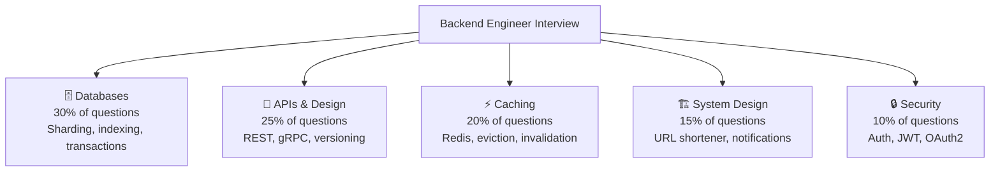

# ⚙️ Backend Engineer — Interview Guide

## What Interviewers Focus On

Backend engineering interviews test your ability to **design, build, and scale server-side systems**. You're expected to know databases deeply, design clean APIs, implement caching correctly, and understand distributed systems at a working level.

## Study Roadmap

| Week | Focus | Why |
|------|-------|-----|
| Week 1 | P0 Databases + P0 APIs | Foundation — asked in every interview |
| Week 2 | P0 Caching + P0 System Design | Differentiate from other candidates |
| Week 3 | P1 Distributed Systems + P1 Security | Shows depth |
| Week 4 | P2 topics + practice scenarios | Preparation for senior-level Qs |

---

## P0 — Must Know Cold

### Databases
| # | Question | Difficulty | Format |
|---|----------|------------|--------|
| 1 | [When do you choose SQL vs NoSQL?](../question-bank/databases/sql-vs-nosql-decisions) | 🟢 Junior | Quick Answer |
| 2 | [What are the ACID properties?](../question-bank/databases/sql-vs-nosql-decisions) | 🟢 Junior | Quick Answer |
| 3 | [What is database sharding and when do you need it?](../question-bank/databases/database-sharding-deep-dive) | 🟡 Mid | Quick Answer |
| 4 | [How do you add a column to a 100M row table without downtime?](../question-bank/databases/database-migrations-at-scale) | 🟡 Mid | Quick Answer |
| 5 | [What is a database index and why does it speed up queries?](../question-bank/databases/indexing-strategies) | 🟢 Junior | Quick Answer |
| 6 | [Composite indexes — how do they work and why does column order matter?](../question-bank/databases/indexing-strategies) | 🔴 Senior | Deep Dive |
| 7 | [What is connection pooling and why is it necessary?](../question-bank/databases/connection-pooling) | 🟡 Mid | Quick Answer |
| 8 | [Explain ACID with a bank transfer example](../question-bank/databases/transactions-acid-base) | 🟢 Junior | Quick Answer |

### APIs & Networking
| # | Question | Difficulty | Format |
|---|----------|------------|--------|
| 9 | [What makes an API RESTful? Name the 5 constraints.](../question-bank/apis-networking/rest-api-design-principles) | 🟢 Junior | Quick Answer |
| 10 | [How do you choose the right HTTP verb?](../question-bank/apis-networking/rest-api-design-principles) | 🟡 Mid | Quick Answer |
| 11 | [Cursor vs offset pagination — which do you use and why?](../question-bank/apis-networking/rest-api-design-principles) | 🟡 Mid | Quick Answer |
| 12 | [What is idempotency and why is it critical for payment APIs?](../question-bank/system-design/design-payment-system) | 🟡 Mid | Quick Answer |
| 13 | [What are the key differences between HTTP/1.1, HTTP/2, HTTP/3?](../question-bank/apis-networking/http-internals) | 🟡 Mid | Quick Answer |
| 14 | [What is gRPC and when should you use it over REST?](../question-bank/apis-networking/grpc-and-protobuf) | 🟡 Mid | Quick Answer |

### Caching
| # | Question | Difficulty | Format |
|---|----------|------------|--------|
| 15 | [Cache-aside vs read-through vs write-through — differences?](../question-bank/system-design/design-distributed-cache) | 🟡 Mid | Quick Answer |
| 16 | [What is consistent hashing and how does it minimize cache misses?](../question-bank/algorithms-patterns/consistent-hashing) | 🟡 Mid | Quick Answer |
| 17 | [What is a cache stampede and how do you prevent it?](../question-bank/caching-performance/cache-stampede-thundering-herd) | 🟡 Mid | Quick Answer |
| 18 | [Why is cache invalidation considered one of the hardest problems?](../question-bank/caching-performance/cache-invalidation-strategies) | 🟡 Mid | Quick Answer |

### System Design
| # | Question | Difficulty | Format |
|---|----------|------------|--------|
| 19 | [Design a URL shortener (100M URLs, 10K redirects/sec)](../question-bank/system-design/design-url-shortener) | 🔴 Senior | Scenario |
| 20 | [Design a distributed rate limiter for a public API at 50K req/sec](../question-bank/system-design/design-rate-limiter) | 🔴 Senior | Scenario |
| 21 | [What is a rate limiter and why is it needed?](../question-bank/system-design/design-rate-limiter) | 🟢 Junior | Quick Answer |
| 22 | [Compare Fixed Window vs Sliding Window vs Token Bucket](../question-bank/algorithms-patterns/rate-limiting-algorithms) | 🔴 Senior | Deep Dive |

---

## P1 — Differentiators

### Distributed Systems
| # | Question | Difficulty | Format |
|---|----------|------------|--------|
| 23 | [What is idempotency and how do you implement it at scale?](../question-bank/distributed-systems/idempotency-at-scale) | 🟡 Mid | Quick Answer |
| 24 | [What is the Saga pattern and when do you use it?](../question-bank/distributed-systems/saga-pattern) | 🟡 Mid | Quick Answer |
| 25 | [What is event sourcing and how does it differ from CRUD?](../question-bank/distributed-systems/event-sourcing-cqrs) | 🟡 Mid | Quick Answer |
| 26 | [Why are distributed transactions hard?](../question-bank/distributed-systems/distributed-transactions) | 🟡 Mid | Quick Answer |

### Security
| # | Question | Difficulty | Format |
|---|----------|------------|--------|
| 27 | [Why do you hash passwords instead of encrypting them?](../question-bank/security-auth/authentication-patterns) | 🟢 Junior | Quick Answer |
| 28 | [JWT vs server-side sessions — when do you use each?](../question-bank/security-auth/jwt-sessions-cookies) | 🟡 Mid | Quick Answer |
| 29 | [What is OAuth2 and what problem does it solve?](../question-bank/security-auth/oauth2-oidc) | 🟡 Mid | Quick Answer |
| 30 | [What are the OWASP API Security Top 10?](../question-bank/security-auth/api-security-patterns) | 🟡 Mid | Quick Answer |

### Advanced System Design
| # | Question | Difficulty | Format |
|---|----------|------------|--------|
| 31 | [Design a notification system for 100M users](../question-bank/system-design/design-notification-system) | 🔴 Senior | Scenario |
| 32 | [Design a payment system like Stripe (1000 tx/sec)](../question-bank/system-design/design-payment-system) | 🔴 Senior | Scenario |
| 33 | [How do you prevent double charges in a distributed payment system?](../question-bank/system-design/design-payment-system) | 🔴 Senior | Deep Dive |
| 34 | [How do you scale the redirect service to 50K req/sec?](../question-bank/system-design/design-url-shortener) | 🔴 Senior | Deep Dive |

---

## P2 — Depth Questions (Senior Backend)

| # | Question | Topic | Difficulty |
|---|----------|-------|------------|
| 35 | [Cross-shard queries and distributed joins](../question-bank/databases/database-sharding-deep-dive) | Databases | 🔴 Senior |
| 36 | [Re-shard without downtime when a shard grows too large](../question-bank/databases/database-sharding-deep-dive) | Databases | 🔴 Senior |
| 37 | [Design a distributed cache with multi-region consistency](../question-bank/system-design/design-distributed-cache) | Caching | ⚫ Staff |
| 38 | [How does RedLock work and what are its failure modes?](../question-bank/system-design/design-distributed-locking) | Distributed | 🔴 Senior |
| 39 | [API versioning strategy for 10K developers building on your API](../question-bank/apis-networking/api-versioning-strategies) | APIs | 🔴 Senior |
| 40 | [Design reconciliation to detect missed transactions](../question-bank/system-design/design-payment-system) | System Design | 🔴 Senior |

---

## Recommended Resources

→ [All Databases Questions](../question-bank/databases/)
→ [All API & Networking Questions](../question-bank/apis-networking/)
→ [All Caching Questions](../question-bank/caching-performance/)
→ [All System Design Questions](../question-bank/system-design/)
→ [Master Question Index](../question-bank/)
