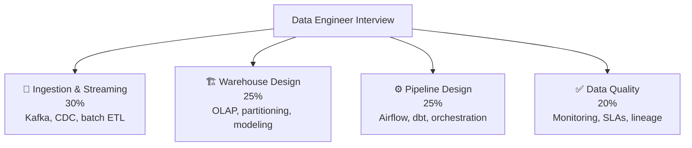

# 📊 Data Engineer — Interview Guide

## What Interviewers Focus On

Data engineering interviews test your ability to **design, build, and operate data pipelines at scale** — batch and streaming ingestion, warehouse modeling, data quality, and orchestration. You need to understand the tradeoffs between Kafka vs batch, OLAP vs OLTP, and star schema vs data vault.

---

## P0 — Must Know Cold

### Ingestion & Streaming
| # | Question | Difficulty | Format |
|---|----------|------------|--------|
| 1 | [When do you use Kafka vs a batch ETL pipeline?](../question-bank/databases/sql-vs-nosql-decisions) | 🟡 Mid | Quick Answer |
| 2 | [What is CDC (Change Data Capture) and how does Debezium work?](../question-bank/databases/database-replication-patterns) | 🟡 Mid | Quick Answer |
| 3 | [How do you handle late-arriving events in a streaming pipeline?](../question-bank/distributed-systems/event-sourcing-cqrs) | 🔴 Senior | Deep Dive |
| 4 | [What is exactly-once delivery and how does Kafka achieve it?](../question-bank/distributed-systems/event-sourcing-cqrs) | 🔴 Senior | Deep Dive |

### Warehouse Design
| # | Question | Difficulty | Format |
|---|----------|------------|--------|
| 5 | [What is the difference between OLTP and OLAP databases?](../question-bank/databases/sql-vs-nosql-decisions) | 🟢 Junior | Quick Answer |
| 6 | [Star schema vs Snowflake schema — when do you use each?](../question-bank/databases/sql-vs-nosql-decisions) | 🟡 Mid | Quick Answer |
| 7 | [How do you partition a 10TB table for query performance?](../question-bank/databases/database-sharding-deep-dive) | 🔴 Senior | Deep Dive |
| 8 | [What is columnar storage and why is Parquet faster than CSV for analytics?](../question-bank/databases/query-optimization) | 🟡 Mid | Quick Answer |
| 9 | [How do you implement slowly changing dimensions (SCD Type 2)?](../question-bank/databases/sql-vs-nosql-decisions) | 🟡 Mid | Quick Answer |

### Pipeline Design
| # | Question | Difficulty | Format |
|---|----------|------------|--------|
| 10 | [What is idempotency and why is it critical for data pipelines?](../question-bank/distributed-systems/idempotency-at-scale) | 🟡 Mid | Quick Answer |
| 11 | [How do you design a pipeline retry strategy for transient failures?](../question-bank/distributed-systems/partition-tolerance) | 🟡 Mid | Quick Answer |
| 12 | [How does Airflow schedule and execute DAGs?](../question-bank/cloud-devops/cicd-pipeline-design) | 🟡 Mid | Quick Answer |
| 13 | [What is dbt and how does it fit into the modern data stack?](../question-bank/databases/sql-vs-nosql-decisions) | 🟡 Mid | Quick Answer |

### Data Quality
| # | Question | Difficulty | Format |
|---|----------|------------|--------|
| 14 | [What are data quality dimensions (completeness, accuracy, freshness)?](../question-bank/observability-sre/metrics-alerting-design) | 🟢 Junior | Quick Answer |
| 15 | [How do you detect schema drift in production pipelines?](../question-bank/databases/database-migrations-at-scale) | 🔴 Senior | Quick Answer |
| 16 | [What is data lineage and how do you implement it?](../question-bank/observability-sre/distributed-tracing) | 🔴 Senior | Deep Dive |

---

## P1 — Differentiators

| # | Question | Topic | Difficulty |
|---|----------|-------|------------|
| 17 | [Design a real-time fraud detection pipeline processing 10K events/sec](../question-bank/ai-ml-systems/ml-pipeline-design) | Streaming | 🔴 Senior |
| 18 | [How do you backfill 3 years of historical data without disrupting production?](../question-bank/databases/database-migrations-at-scale) | Migrations | 🔴 Senior |
| 19 | [What is the Lambda architecture vs Kappa architecture — when does Lambda win?](../question-bank/distributed-systems/event-sourcing-cqrs) | Architecture | 🔴 Senior |
| 20 | [How do you implement data mesh — federated ownership vs centralized governance?](../question-bank/databases/sql-vs-nosql-decisions) | Architecture | ⚫ Staff |
| 21 | [How do you design a feature store for ML that handles point-in-time correctness?](../question-bank/ai-ml-systems/feature-store-design) | ML | 🔴 Senior |
| 22 | [How do you cost-optimize a Snowflake warehouse — clustering, materialized views?](../question-bank/cloud-devops/cloud-cost-optimization) | Cost | 🔴 Senior |

---

## P2 — Staff Data Engineer

| # | Question | Topic | Difficulty |
|---|----------|-------|------------|
| 23 | [How does Uber's Michelangelo ML platform manage feature pipelines for 2B predictions/day?](../question-bank/ai-ml-systems/feature-store-design) | ML Platform | ⚫ Staff |
| 24 | [How do you design a data catalog for 10K tables across 20 data sources?](../question-bank/observability-sre/distributed-tracing) | Governance | ⚫ Staff |
| 25 | [How does Apache Iceberg enable time-travel and schema evolution on data lakes?](../question-bank/databases/query-optimization) | Storage | ⚫ Staff |

---

→ [All Database Questions](../question-bank/databases/)
→ [All Distributed Systems Questions](../question-bank/distributed-systems/)
→ [All AI/ML Questions](../question-bank/ai-ml-systems/)
→ [Master Question Index](../question-bank/)
