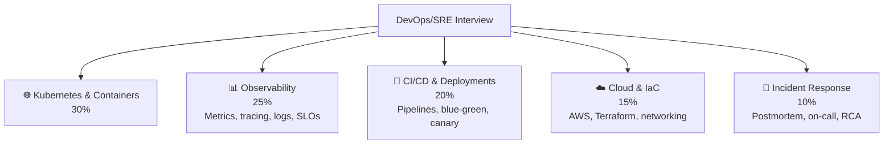

# 🚀 DevOps / SRE — Interview Guide

## What Interviewers Focus On

DevOps/SRE interviews test your ability to **build, deploy, and operate reliable systems at scale**. You need deep Kubernetes knowledge, strong observability instincts, CI/CD expertise, and the ability to respond to incidents systematically.

---

## P0 — Must Know Cold

### Kubernetes
| # | Question | Difficulty | Format |
|---|----------|------------|--------|
| 1 | [What are the Kubernetes control plane components and what does each do?](../question-bank/cloud-devops/kubernetes-architecture) | 🟡 Mid | Quick Answer |
| 2 | [What is the difference between a Pod, ReplicaSet, and Deployment?](../question-bank/cloud-devops/kubernetes-architecture) | 🟡 Mid | Quick Answer |
| 3 | [How does HPA (Horizontal Pod Autoscaler) work?](../question-bank/cloud-devops/kubernetes-architecture) | 🔴 Senior | Deep Dive |
| 4 | [What is the difference between ClusterIP, NodePort, and LoadBalancer services?](../question-bank/cloud-devops/kubernetes-architecture) | 🟡 Mid | Quick Answer |
| 5 | [How does Kubernetes handle a node failure?](../question-bank/cloud-devops/kubernetes-architecture) | 🔴 Senior | Quick Answer |
| 6 | [What is the difference between CPU requests and CPU limits?](../question-bank/cloud-devops/container-orchestration) | 🟡 Mid | Quick Answer |

### Observability
| # | Question | Difficulty | Format |
|---|----------|------------|--------|
| 7 | [What are the Four Golden Signals?](../question-bank/observability-sre/metrics-alerting-design) | 🟢 Junior | Quick Answer |
| 8 | [What is distributed tracing and what does it solve that logs can't?](../question-bank/observability-sre/distributed-tracing) | 🟡 Mid | Quick Answer |
| 9 | [What is the difference between metrics, logs, and traces?](../question-bank/system-design/design-metrics-monitoring) | 🟢 Junior | Quick Answer |
| 10 | [What is the SLI/SLO/SLA difference?](../question-bank/observability-sre/slo-sla-error-budgets) | 🟡 Mid | Quick Answer |
| 11 | [How do you calculate an error budget and burn rate?](../question-bank/observability-sre/slo-sla-error-budgets) | 🔴 Senior | Deep Dive |

### CI/CD
| # | Question | Difficulty | Format |
|---|----------|------------|--------|
| 12 | [What is the difference between CI, CD (delivery), and CD (deployment)?](../question-bank/cloud-devops/cicd-pipeline-design) | 🟢 Junior | Quick Answer |
| 13 | [How do you implement parallel test execution to cut pipeline time from 20 to 5 mins?](../question-bank/cloud-devops/cicd-pipeline-design) | 🔴 Senior | Deep Dive |
| 14 | [What is a blue-green deployment and how does it achieve zero downtime?](../question-bank/cloud-devops/blue-green-canary-deployments) | 🟡 Mid | Quick Answer |
| 15 | [How do you handle database migrations in a blue-green deployment?](../question-bank/cloud-devops/blue-green-canary-deployments) | 🔴 Senior | Deep Dive |

---

## P1 — Differentiators

### Incident Response
| # | Question | Difficulty | Format |
|---|----------|------------|--------|
| 16 | [What are incident severity levels and what defines each?](../question-bank/observability-sre/incident-response-systems) | 🟡 Mid | Quick Answer |
| 17 | [What is the incident commander role?](../question-bank/observability-sre/incident-response-systems) | 🔴 Senior | Deep Dive |
| 18 | [How do you run a blameless postmortem?](../question-bank/observability-sre/incident-response-systems) | 🔴 Senior | Deep Dive |
| 19 | [Walk through a P0 incident response for a payment processing outage](../question-bank/observability-sre/incident-response-systems) | 🔴 Senior | Scenario |
| 20 | [What is chaos engineering and how does it prevent incidents proactively?](../question-bank/observability-sre/incident-response-systems) | ⚫ Staff | Quick Answer |

### Cloud & IaC
| # | Question | Difficulty | Format |
|---|----------|------------|--------|
| 21 | [EC2 vs Lambda vs ECS vs EKS — when do you use each?](../question-bank/cloud-devops/aws-core-services) | 🟡 Mid | Quick Answer |
| 22 | [How does Terraform manage state and what problems does remote state solve?](../question-bank/cloud-devops/infrastructure-as-code) | 🔴 Senior | Deep Dive |
| 23 | [What is GitOps and how does it apply to infrastructure management?](../question-bank/cloud-devops/infrastructure-as-code) | 🔴 Senior | Quick Answer |
| 24 | [How do you detect and handle infrastructure drift in Terraform?](../question-bank/cloud-devops/infrastructure-as-code) | 🔴 Senior | Deep Dive |

### Advanced Observability
| # | Question | Difficulty | Format |
|---|----------|------------|--------|
| 25 | [How do you implement multi-window multi-burn-rate alerting?](../question-bank/observability-sre/metrics-alerting-design) | ⚫ Staff | Deep Dive |
| 26 | [How does Jaeger store and query traces at millions of traces/day?](../question-bank/observability-sre/distributed-tracing) | 🔴 Senior | Deep Dive |
| 27 | [How do you implement log sampling to reduce volume 10x without losing critical logs?](../question-bank/observability-sre/log-aggregation-systems) | 🔴 Senior | Deep Dive |

---

## P2 — Staff SRE Level

| # | Question | Topic | Difficulty |
|---|----------|-------|------------|
| 28 | [Design a distributed tracing system for 50 microservices at 10K req/sec](../question-bank/observability-sre/distributed-tracing) | Observability | 🔴 Senior |
| 29 | [How does Netflix deploy 100+ times per day safely?](../question-bank/cloud-devops/cicd-pipeline-design) | CI/CD | ⚫ Staff |
| 30 | [How does Cloudflare process 10M log events/sec?](../question-bank/observability-sre/log-aggregation-systems) | Observability | ⚫ Staff |

---

→ [All Cloud & DevOps Questions](../question-bank/cloud-devops/)
→ [All Observability Questions](../question-bank/observability-sre/)
→ [Master Question Index](../question-bank/)
