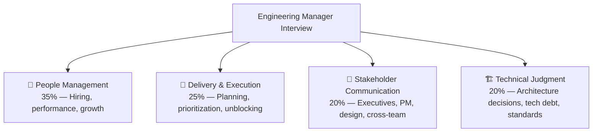

# 🧑‍💼 Engineering Manager — Interview Guide

## What Interviewers Focus On

EM interviews test whether you can **lead people, not just code**. They assess your ability to build high-performing teams, navigate ambiguity, resolve conflict, deliver on commitments, and grow engineers. Every answer should demonstrate ownership, empathy, and measurable outcomes.

## How EM Interviews Differ from IC Roles

| Dimension | Senior Engineer (IC) | Engineering Manager |
|-----------|---------------------|-------------------|
| Success metric | My code ships | My team ships |
| Conflict resolution | Escalate or avoid | Own and resolve |
| Roadmap input | Feature estimates | Roadmap co-ownership with PM |
| Hiring | Maybe 1 interview | Owns end-to-end pipeline |
| Ambiguity | Ask for clarity | Create clarity for the team |
| 1:1s | Receive them | Design and run them |

---

## P0 — People Management

### Behavioral (STAR format required)

| # | Question | Difficulty | What They're Testing |
|---|----------|------------|---------------------|
| B1 | Walk me through a time you had to let someone go or put them on a PIP. | ⚫ Hard | Courage, fairness, documentation |
| B2 | Tell me about an engineer on your team who was underperforming. How did you handle it? | 🔴 Medium | Early detection, direct feedback, patience |
| B3 | Describe a situation where two senior engineers had a major technical disagreement. What did you do? | 🔴 Medium | Conflict resolution, decision ownership |
| B4 | Tell me about a time you had to give very difficult feedback to a high-performer. | 🔴 Medium | Psychological safety, honesty |
| B5 | An engineer on your team is consistently late to standups and missing deadlines. What do you do? | 🟡 Easy | Process discipline, coaching vs. managing |
| B6 | How do you handle a situation where a rockstar engineer wants to leave the team? | 🔴 Medium | Retention, role clarity, career growth |
| B7 | Tell me about a time you promoted someone. How did you decide they were ready? | 🟡 Easy | Calibration, leveling criteria |
| B8 | You've inherited a team from a manager who left. What do you do in the first 30/60/90 days? | 🔴 Medium | Onboarding, trust-building, listening before changing |

### Situational

| # | Question | Difficulty | Focus |
|---|----------|------------|-------|
| S1 | Your team has two engineers who refuse to work with each other. What's your approach? | 🔴 Medium | Interpersonal conflict |
| S2 | A senior engineer bypasses code review and pushes directly to main. How do you handle it? | 🟡 Easy | Process enforcement, culture |
| S3 | An engineer tells you in a 1:1 that they feel burned out. What do you do? | 🔴 Medium | Wellbeing, workload management |
| S4 | You're asked to cut 2 engineers from your team due to budget. How do you decide who? | ⚫ Hard | Difficult decisions, fairness, documentation |

---

## P0 — Delivery & Execution

| # | Question | Difficulty | What They're Testing |
|---|----------|------------|---------------------|
| D1 | How do you run sprint planning? Walk me through your process. | 🟡 Easy | Process maturity |
| D2 | A project is 2 weeks behind schedule and the deadline is fixed. What do you do? | 🔴 Medium | Triage, scope negotiation, communication |
| D3 | How do you balance feature work vs. technical debt? | 🔴 Medium | Prioritization, stakeholder alignment |
| D4 | How do you manage dependencies across multiple teams? | 🔴 Medium | Cross-team coordination |
| D5 | Your team shipped a major bug to production. Walk me through your post-mortem process. | 🔴 Medium | Blameless culture, learning systems |
| D6 | How do you protect your team from scope creep? | 🟡 Easy | Boundary-setting, PM relationship |
| D7 | Walk me through how you estimated a project that had significant unknowns. | 🔴 Medium | Risk management, T-shirt sizing, spike work |
| D8 | How do you track engineering metrics? What do you measure? | 🔴 Medium | DORA metrics, cycle time, deployment frequency |

---

## P0 — Stakeholder Communication

| # | Question | Difficulty | Focus |
|---|----------|------------|-------|
| C1 | How do you communicate a technical decision to a non-technical executive? | 🔴 Medium | Translation, framing |
| C2 | Your PM and your tech lead disagree on the priority of a feature. You're the tiebreaker. What do you do? | 🔴 Medium | Facilitation, data-driven decisions |
| C3 | How do you build trust with a new executive stakeholder? | 🔴 Medium | Relationship building, reliability |
| C4 | Describe how you've influenced product roadmap as an EM. | 🔴 Medium | Strategic input, advocacy |
| C5 | How do you handle a stakeholder who keeps adding requirements mid-sprint? | 🟡 Easy | Boundary-setting, process |

---

## P0 — Hiring & Team Building

| # | Question | Difficulty | Focus |
|---|----------|------------|-------|
| H1 | Walk me through your end-to-end hiring process. | 🔴 Medium | Pipeline design, bar-raising |
| H2 | How do you assess culture fit without bias? | 🔴 Medium | Structured interviews, rubrics |
| H3 | You interviewed 10 candidates and only 1 meets the bar. Do you hire them or reset? | ⚫ Hard | Hiring bar discipline |
| H4 | How do you onboard a new engineer to be productive in 30 days? | 🟡 Easy | Onboarding design |
| H5 | What does your ideal engineering team composition look like for a 6-person team? | 🔴 Medium | Team topology, skill distribution |
| H6 | How do you build a pipeline of senior candidates proactively (not just reactively)? | ⚫ Hard | Sourcing strategy |

---

## P1 — Engineering Culture & Growth

| # | Question | Difficulty | Focus |
|---|----------|------------|-------|
| G1 | How do you build a culture of psychological safety? | 🔴 Medium | Team culture |
| G2 | How do you run 1:1s? What questions do you always ask? | 🟡 Easy | 1:1 structure |
| G3 | How do you create individual development plans (IDPs) for engineers? | 🔴 Medium | Career development |
| G4 | What does your engineering quality culture look like? How do you enforce it? | 🔴 Medium | Code review, standards |
| G5 | How do you handle an engineer who is technically brilliant but has poor soft skills? | 🔴 Medium | Coaching, feedback |

---

## P1 — Technical Judgment as EM

| # | Question | Difficulty | Focus |
|---|----------|------------|-------|
| T1 | How much time do you still spend coding as an EM? | 🟡 Easy | Role transition |
| T2 | How do you stay technically current without being in the codebase every day? | 🟡 Easy | Technical currency |
| T3 | Your team wants to rewrite a service from scratch. How do you evaluate the request? | ⚫ Hard | Cost/benefit, risk |
| T4 | How do you decide when to adopt a new technology vs. stay with what you have? | 🔴 Medium | Technology strategy |
| T5 | How do you create a culture of code review without creating bottlenecks? | 🔴 Medium | Process design |

---

## Gaurav-Specific Prep Notes

Based on your background, expect these angles:

1. **"You led 20+ engineers — how did you manage at that scale?"** → Talk about the 3-concurrent-project model, delegation to tech leads, async check-ins
2. **"You went from Senior Engineer → EM → Associate Director — what changed at each step?"** → Scope, delegation, abstraction level
3. **"You handled end-to-end hiring — walk me through your process at GeekyAnts"** → Screening criteria, technical bar, offer decisions
4. **"What metrics did you use to measure team health?"** → DORA metrics, deployment frequency, incident rate, engineer satisfaction

---

## Interview Format Tips

- **Always STAR**: Every behavioral answer needs Situation, Task, Action, Result with **numbers**
- **Show range**: Mix technical + people stories; don't over-index on either
- **Own failures**: "I made a mistake here, here's what I learned" > "my team failed"
- **Avoid vagueness**: "We improved velocity" → "We went from 2 deploys/week to daily deploys in 6 weeks"

---

## Resources

- 📖 [An Elegant Puzzle — Will Larson](https://lethain.com/elegant-puzzle/)
- 📖 [The Manager's Path — Camille Fournier]
- 📺 [StaffEng Podcast — Engineering Leadership stories]
