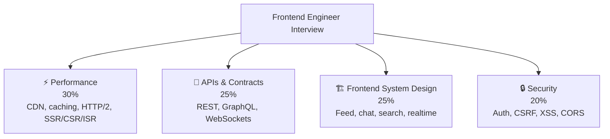

# 🎨 Frontend Engineer — Interview Guide

## What Interviewers Focus On

Frontend engineering interviews at senior level increasingly test **system design for client-side applications** — performance, state management, API design, CDN caching, real-time systems, and browser internals.

---

## P0 — Must Know Cold

### Performance & Caching
| # | Question | Difficulty | Format |
|---|----------|------------|--------|
| 1 | [What do Cache-Control headers (max-age, s-maxage, no-cache) do?](../question-bank/caching-performance/cdn-caching-strategies) | 🟢 Junior | Quick Answer |
| 2 | [How do ETag and Last-Modified enable conditional requests?](../question-bank/caching-performance/cdn-caching-strategies) | 🟡 Mid | Quick Answer |
| 3 | [What are the key differences between HTTP/1.1, HTTP/2, and HTTP/3?](../question-bank/apis-networking/http-internals) | 🟡 Mid | Quick Answer |
| 4 | [What is head-of-line blocking and how does HTTP/2 solve it?](../question-bank/apis-networking/http-internals) | 🟡 Mid | Quick Answer |
| 5 | [How do you maximize CDN cache hit ratio for a dynamic website?](../question-bank/caching-performance/cdn-caching-strategies) | 🔴 Senior | Deep Dive |
| 6 | [How do you warm a CDN cache before a product launch?](../question-bank/caching-performance/cdn-caching-strategies) | 🔴 Senior | Quick Answer |

### APIs & Real-Time
| # | Question | Difficulty | Format |
|---|----------|------------|--------|
| 7 | [What is the N+1 problem in GraphQL and how does DataLoader solve it?](../question-bank/apis-networking/graphql-design-patterns) | 🟡 Mid | Quick Answer |
| 8 | [WebSockets vs SSE vs long-polling — when do you use each?](../question-bank/apis-networking/websockets-long-polling) | 🟡 Mid | Quick Answer |
| 9 | [What are the 3 main API versioning strategies?](../question-bank/apis-networking/api-versioning-strategies) | 🟡 Mid | Quick Answer |
| 10 | [What is gRPC-web and how does it enable gRPC in browsers?](../question-bank/apis-networking/grpc-and-protobuf) | 🟡 Mid | Quick Answer |

### Security
| # | Question | Difficulty | Format |
|---|----------|------------|--------|
| 11 | [What are the secure cookie attributes (HttpOnly, SameSite, Secure)?](../question-bank/security-auth/jwt-sessions-cookies) | 🟡 Mid | Quick Answer |
| 12 | [What is CSRF and how do SameSite cookies prevent it?](../question-bank/security-auth/jwt-sessions-cookies) | 🟡 Mid | Quick Answer |
| 13 | [Why is localStorage insecure for token storage?](../question-bank/security-auth/jwt-sessions-cookies) | 🟡 Mid | Quick Answer |
| 14 | [What is CORS and how do you configure it correctly?](../question-bank/security-auth/api-security-patterns) | 🟡 Mid | Quick Answer |

### System Design
| # | Question | Difficulty | Format |
|---|----------|------------|--------|
| 15 | [Design a social news feed like Twitter/Instagram for 100M DAU](../question-bank/system-design/design-news-feed) | 🔴 Senior | Scenario |
| 16 | [Design a real-time chat system](../question-bank/system-design/design-chat-system) | 🔴 Senior | Scenario |
| 17 | [Design search autocomplete like Google handling 10K queries/sec](../question-bank/system-design/design-search-autocomplete) | 🔴 Senior | Scenario |

---

## P1 — Differentiators

| # | Question | Topic | Difficulty |
|---|----------|-------|------------|
| 18 | [How do you handle sticky sessions when load balancing WebSocket connections?](../question-bank/apis-networking/websockets-long-polling) | WebSockets | 🔴 Senior |
| 19 | [How do you implement reconnection with backoff for WebSocket clients?](../question-bank/apis-networking/websockets-long-polling) | WebSockets | 🔴 Senior |
| 20 | [What is schema federation in GraphQL and how does Apollo Federation work?](../question-bank/apis-networking/graphql-design-patterns) | GraphQL | 🔴 Senior |
| 21 | [How do you cache GraphQL responses when queries are dynamic?](../question-bank/apis-networking/graphql-design-patterns) | Caching | 🔴 Senior |
| 22 | [How do you design a real-time collaborative whiteboard backend?](../question-bank/apis-networking/websockets-long-polling) | Real-Time | 🔴 Senior |
| 23 | [How do you implement OAuth2 integration for a marketplace?](../question-bank/security-auth/oauth2-oidc) | Security | 🔴 Senior |

---

→ [All APIs & Networking Questions](../question-bank/apis-networking/)
→ [All Caching Questions](../question-bank/caching-performance/)
→ [All Security Questions](../question-bank/security-auth/)
→ [Master Question Index](../question-bank/)
