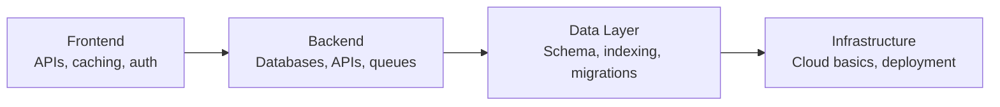

# 🟡 Full-Stack Mid-Level Engineer — Interview Guide

## What Interviewers Focus On

Mid-level full-stack interviews test **breadth across the entire stack** — you should design a feature end-to-end, from database schema to API to frontend considerations. Depth is less critical than for senior roles, but you need solid fundamentals everywhere.

---

## P0 — Must Know Cold

### APIs & HTTP
| # | Question | Difficulty | Format |
|---|----------|------------|--------|
| 1 | [What makes an API RESTful?](../question-bank/apis-networking/rest-api-design-principles) | 🟢 Junior | Quick Answer |
| 2 | [How do you choose the right HTTP verb?](../question-bank/apis-networking/rest-api-design-principles) | 🟢 Junior | Quick Answer |
| 3 | [Cursor vs offset pagination — when do you use each?](../question-bank/apis-networking/rest-api-design-principles) | 🟡 Mid | Quick Answer |
| 4 | [What are the 3 main API versioning strategies?](../question-bank/apis-networking/api-versioning-strategies) | 🟡 Mid | Quick Answer |
| 5 | [What are the key differences between HTTP/1.1 and HTTP/2?](../question-bank/apis-networking/http-internals) | 🟡 Mid | Quick Answer |

### Databases
| # | Question | Difficulty | Format |
|---|----------|------------|--------|
| 6 | [When do you choose SQL vs NoSQL?](../question-bank/databases/sql-vs-nosql-decisions) | 🟢 Junior | Quick Answer |
| 7 | [What is a database index and why does it speed up queries?](../question-bank/databases/indexing-strategies) | 🟢 Junior | Quick Answer |
| 8 | [What are N+1 queries and how do you eliminate them?](../question-bank/databases/query-optimization) | 🟡 Mid | Quick Answer |
| 9 | [What is connection pooling and why is it necessary?](../question-bank/databases/connection-pooling) | 🟡 Mid | Quick Answer |
| 10 | [How do you add a column to a 100M row table without downtime?](../question-bank/databases/database-migrations-at-scale) | 🟡 Mid | Quick Answer |

### Caching
| # | Question | Difficulty | Format |
|---|----------|------------|--------|
| 11 | [What is caching and when should you use cache-aside vs read-through?](../question-bank/system-design/design-distributed-cache) | 🟡 Mid | Quick Answer |
| 12 | [What do Cache-Control headers do?](../question-bank/caching-performance/cdn-caching-strategies) | 🟢 Junior | Quick Answer |
| 13 | [What is a cache stampede and how do you prevent it?](../question-bank/caching-performance/cache-stampede-thundering-herd) | 🟡 Mid | Quick Answer |

### Auth
| # | Question | Difficulty | Format |
|---|----------|------------|--------|
| 14 | [Why do you hash passwords instead of encrypting them?](../question-bank/security-auth/authentication-patterns) | 🟢 Junior | Quick Answer |
| 15 | [JWT vs server-side sessions — when do you use each?](../question-bank/security-auth/jwt-sessions-cookies) | 🟡 Mid | Quick Answer |
| 16 | [What is OAuth2 and what problem does it solve?](../question-bank/security-auth/oauth2-oidc) | 🟡 Mid | Quick Answer |
| 17 | [What are the secure cookie attributes?](../question-bank/security-auth/jwt-sessions-cookies) | 🟡 Mid | Quick Answer |

### System Design
| # | Question | Difficulty | Format |
|---|----------|------------|--------|
| 18 | [Design a URL shortener (basic version)](../question-bank/system-design/design-url-shortener) | 🟡 Mid | Quick Answer |
| 19 | [What is a rate limiter and why is it needed?](../question-bank/system-design/design-rate-limiter) | 🟢 Junior | Quick Answer |
| 20 | [What is idempotency and why does it matter?](../question-bank/distributed-systems/idempotency-at-scale) | 🟡 Mid | Quick Answer |

---

## P1 — Differentiators

| # | Question | Topic | Difficulty |
|---|----------|-------|------------|
| 21 | [What is the N+1 problem in GraphQL and how does DataLoader solve it?](../question-bank/apis-networking/graphql-design-patterns) | GraphQL | 🟡 Mid |
| 22 | [How does PgBouncer work and what pooling modes does it offer?](../question-bank/databases/connection-pooling) | Databases | 🔴 Senior |
| 23 | [Explain ACID with a bank transfer example](../question-bank/databases/transactions-acid-base) | Databases | 🟢 Junior |
| 24 | [How do you prevent SQL injection in API parameters?](../question-bank/security-auth/api-security-patterns) | Security | 🟡 Mid |
| 25 | [How do you implement notification rate limiting per user?](../question-bank/system-design/design-notification-system) | System Design | 🟡 Mid |

---

→ [All APIs Questions](../question-bank/apis-networking/)
→ [All Database Questions](../question-bank/databases/)
→ [All Security Questions](../question-bank/security-auth/)
→ [Master Question Index](../question-bank/)
