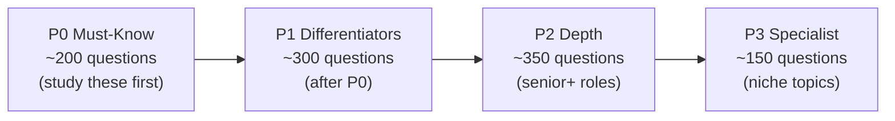

# Interview Prep by Role

Choose your target role to get a curated study plan with questions ordered by priority.

> **How to use:** Start with **P0** questions — these cover 70%+ of what gets asked at your level. Work through P1 before moving to P2/P3.

## Choose Your Role

| Role | Level | Questions | P0 Focus Areas |
|------|-------|-----------|----------------|
| [⚙️ Backend Engineer](./backend-engineer) | Mid–Senior | ~180 | Databases, APIs, Caching, System Design |
| [🔴 Senior Engineer](./senior-engineer) | Senior–Staff | ~200 | Distributed Systems, Scale, Architecture |
| [⚫ Solution Architect](./solution-architect) | Staff–Principal | ~160 | End-to-end Design, Cloud, Trade-offs |
| [🎨 Frontend Engineer](./frontend-engineer) | Mid–Senior | ~120 | APIs, CDN, Performance, State |
| [🚀 DevOps / SRE](./devops-sre) | Mid–Senior | ~140 | Cloud/K8s, Observability, Reliability |
| [🟡 Full-Stack Mid-Level](./fullstack-mid) | Mid | ~150 | APIs, Databases, Caching, Auth |
| [📊 Data Engineer](./data-engineer) | Mid–Senior | ~130 | Databases, Pipelines, Streaming |
| [🤖 ML / AI Engineer](./ml-ai-engineer) | Mid–Senior | ~130 | AI/ML Systems, Vector DBs, LLMs |
| [🔒 Security Engineer](./security-engineer) | Mid–Senior | ~100 | Auth, Encryption, Zero Trust |
| [📱 Mobile Engineer](./mobile-engineer) | Mid–Senior | ~80 | Mobile Architecture, APIs, Offline |

---

## Study Strategy

| Priority | What it means | Time to cover |
|----------|---------------|---------------|
| **P0** | Asked in >70% of interviews at your level. Can't skip. | Week 1–2 |
| **P1** | Differentiates strong candidates from average ones | Week 3–4 |
| **P2** | Shows depth — asked for senior/staff roles | Week 5–6 |
| **P3** | Edge cases, niche topics | As time allows |

---

## Topic Map

```mermaid
graph TD
  SD["🏗️ System Design\n200 questions"]
  DB["🗄️ Databases\n150 questions"]
  DS["🌐 Distributed Systems\n120 questions"]
  CP["⚡ Caching\n100 questions"]
  AN["🔌 APIs & Networking\n80 questions"]
  SA["🔒 Security & Auth\n70 questions"]
  CD["☁️ Cloud & DevOps\n70 questions"]
  AP["🧮 Algorithms\n60 questions"]
  AI["🤖 AI & ML\n80 questions"]
  OB["📊 Observability\n50 questions"]
  MB["📱 Mobile\n20 questions"]
```

→ [Browse all 1000+ questions by topic](../question-bank/)
