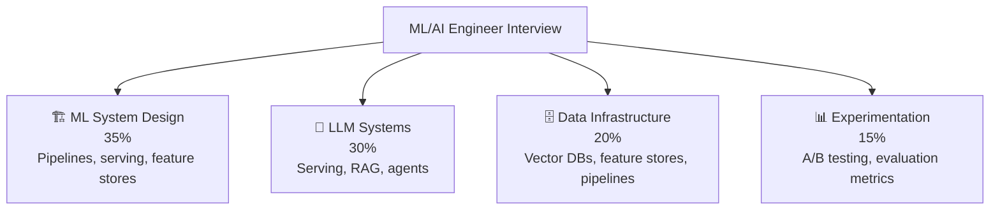

# 🤖 ML / AI Engineer — Interview Guide

## What Interviewers Focus On

ML/AI engineering interviews combine system design with ML-specific concerns: **data pipelines, model serving, LLM infrastructure, RAG systems, and evaluation**. You need to know both the ML theory and the production engineering to make it work reliably at scale.

---

## P0 — Must Know Cold

### ML System Design
| # | Question | Difficulty | Format |
|---|----------|------------|--------|
| 1 | [What are the stages of an ML pipeline from data to production?](../question-bank/ai-ml-systems/ml-pipeline-design) | 🟡 Mid | Quick Answer |
| 2 | [How do you design a training pipeline that scales from 1M to 100M examples?](../question-bank/ai-ml-systems/ml-pipeline-design) | 🔴 Senior | Deep Dive |
| 3 | [How do you monitor for data quality issues before they corrupt model training?](../question-bank/ai-ml-systems/ml-pipeline-design) | 🔴 Senior | Quick Answer |
| 4 | [Design an ML pipeline for fraud detection (ingest, features, train, deploy, monitor)](../question-bank/ai-ml-systems/ml-pipeline-design) | 🔴 Senior | Scenario |

### LLM Infrastructure
| # | Question | Difficulty | Format |
|---|----------|------------|--------|
| 5 | [What is TTFT and TPOT and why do they matter for LLM UX?](../question-bank/ai-ml-systems/llm-system-design) | 🟡 Mid | Quick Answer |
| 6 | [What is KV cache in LLM inference and how does it speed up generation?](../question-bank/ai-ml-systems/llm-system-design) | 🟡 Mid | Quick Answer |
| 7 | [What is continuous batching for LLM inference and how does it improve GPU utilization?](../question-bank/ai-ml-systems/llm-system-design) | 🔴 Senior | Deep Dive |
| 8 | [How does quantization (INT8, INT4) reduce model memory and what accuracy does it cost?](../question-bank/ai-ml-systems/llm-system-design) | 🔴 Senior | Deep Dive |
| 9 | [Design an LLM serving system for 100K concurrent users](../question-bank/ai-ml-systems/llm-system-design) | 🔴 Senior | Scenario |

### RAG Systems
| # | Question | Difficulty | Format |
|---|----------|------------|--------|
| 10 | [What is RAG and why use it over fine-tuning?](../question-bank/ai-ml-systems/rag-architecture) | 🟡 Mid | Quick Answer |
| 11 | [What is hybrid search (dense + sparse) and why is it better than dense-only?](../question-bank/ai-ml-systems/rag-architecture) | 🔴 Senior | Deep Dive |
| 12 | [How do you evaluate RAG quality (faithfulness, relevance, groundedness)?](../question-bank/ai-ml-systems/rag-architecture) | 🔴 Senior | Quick Answer |
| 13 | [Design a RAG system for customer support: 1M docs, <2s response, high accuracy](../question-bank/ai-ml-systems/rag-architecture) | 🔴 Senior | Scenario |

### Vector Databases
| # | Question | Difficulty | Format |
|---|----------|------------|--------|
| 14 | [What is HNSW and how does it enable fast ANN search?](../question-bank/ai-ml-systems/vector-database-design) | 🔴 Senior | Deep Dive |
| 15 | [How do you implement filtered vector search (similar + metadata filter)?](../question-bank/ai-ml-systems/vector-database-design) | 🔴 Senior | Deep Dive |
| 16 | [Pinecone vs Weaviate vs pgvector — when do you choose each?](../question-bank/ai-ml-systems/vector-database-design) | 🟡 Mid | Quick Answer |
| 17 | [Design semantic product search for 10M products](../question-bank/ai-ml-systems/vector-database-design) | 🔴 Senior | Scenario |

---

## P1 — Differentiators

### Model Serving
| # | Question | Difficulty | Format |
|---|----------|------------|--------|
| 18 | [Online vs batch model serving — when do you use each?](../question-bank/ai-ml-systems/model-serving-infrastructure) | 🟡 Mid | Quick Answer |
| 19 | [How do you A/B test two model versions in production?](../question-bank/ai-ml-systems/model-serving-infrastructure) | 🔴 Senior | Deep Dive |
| 20 | [What is shadow scoring and how does it validate new models safely?](../question-bank/ai-ml-systems/model-serving-infrastructure) | 🔴 Senior | Quick Answer |
| 21 | [Design model serving for a recommendation model at 50K req/sec, <50ms p99](../question-bank/ai-ml-systems/model-serving-infrastructure) | 🔴 Senior | Scenario |

### Feature Stores & Experimentation
| # | Question | Difficulty | Format |
|---|----------|------------|--------|
| 22 | [What is point-in-time correctness and why does it matter for training data?](../question-bank/ai-ml-systems/feature-store-design) | 🔴 Senior | Deep Dive |
| 23 | [How do you ensure feature freshness for real-time ML models?](../question-bank/ai-ml-systems/feature-store-design) | 🔴 Senior | Quick Answer |
| 24 | [What is the minimum sample size for statistical significance in an A/B test?](../question-bank/ai-ml-systems/ab-testing-ml-models) | 🟡 Mid | Quick Answer |
| 25 | [Multi-armed bandit vs A/B test — when does bandit win?](../question-bank/ai-ml-systems/ab-testing-ml-models) | 🔴 Senior | Deep Dive |

### AI Agents
| # | Question | Difficulty | Format |
|---|----------|------------|--------|
| 26 | [What is an AI agent loop (perceive → plan → act → reflect)?](../question-bank/ai-ml-systems/ai-agent-architecture) | 🟡 Mid | Quick Answer |
| 27 | [How do you coordinate multiple specialized agents?](../question-bank/ai-ml-systems/ai-agent-architecture) | 🔴 Senior | Deep Dive |
| 28 | [How do you defend against prompt injection in agentic systems?](../question-bank/ai-ml-systems/ai-agent-architecture) | 🔴 Senior | Deep Dive |
| 29 | [Design a multi-agent system for automated code review](../question-bank/ai-ml-systems/ai-agent-architecture) | 🔴 Senior | Scenario |

---

## P2 — Staff ML Engineer

| # | Question | Topic | Difficulty |
|---|----------|-------|------------|
| 30 | [What is speculative decoding and how does it achieve 2-3x faster inference?](../question-bank/ai-ml-systems/llm-system-design) | LLM | ⚫ Staff |
| 31 | [How do you handle embedding drift when your embedding model changes?](../question-bank/ai-ml-systems/vector-database-design) | Vector DB | ⚫ Staff |
| 32 | [How does Netflix run 1000+ concurrent A/B tests without interference?](../question-bank/ai-ml-systems/ab-testing-ml-models) | Experimentation | ⚫ Staff |

---

→ [All AI/ML Systems Questions](../question-bank/ai-ml-systems/)
→ [All Algorithms Questions](../question-bank/algorithms-patterns/)
→ [Master Question Index](../question-bank/)
