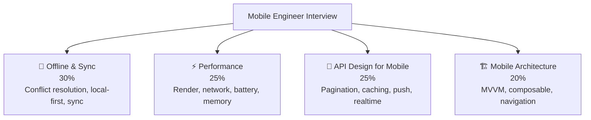

# 📱 Mobile Engineer — Interview Guide

## What Interviewers Focus On

Mobile engineering interviews at senior level increasingly test **offline-first architecture, performance at scale, backend API design for mobile, and cross-platform patterns**. You need to understand how the device constraints (battery, bandwidth, CPU) shape architecture decisions differently from backend systems.

---

## P0 — Must Know Cold

### Offline-First & Sync
| # | Question | Difficulty | Format |
|---|----------|------------|--------|
| 1 | [What is offline-first architecture and why does it matter for mobile?](../question-bank/mobile-architecture/offline-first-sync) | 🟡 Mid | Quick Answer |
| 2 | [How do you resolve conflicts when a user edits data offline on two devices?](../question-bank/mobile-architecture/offline-first-sync) | 🔴 Senior | Deep Dive |
| 3 | [How does exponential backoff work for mobile sync retries?](../question-bank/distributed-systems/partition-tolerance) | 🟡 Mid | Quick Answer |
| 4 | [What is CRDTs and when do you use them over operational transforms?](../question-bank/mobile-architecture/offline-first-sync) | ⚫ Staff | Deep Dive |

### Performance
| # | Question | Difficulty | Format |
|---|----------|------------|--------|
| 5 | [What is the 16ms frame budget and what causes jank?](../question-bank/mobile-architecture/mobile-app-architecture) | 🟡 Mid | Quick Answer |
| 6 | [How do you optimize a RecyclerView / LazyColumn for 10K items with images?](../question-bank/mobile-architecture/mobile-app-architecture) | 🔴 Senior | Deep Dive |
| 7 | [How do you reduce an app's memory footprint — LRU cache, bitmap pooling?](../question-bank/mobile-architecture/mobile-app-architecture) | 🔴 Senior | Deep Dive |
| 8 | [What is the difference between network requests on WiFi vs cellular — how does it change your strategy?](../question-bank/caching-performance/cdn-caching-strategies) | 🟡 Mid | Quick Answer |

### API Design for Mobile
| # | Question | Difficulty | Format |
|---|----------|------------|--------|
| 9 | [Why do mobile apps prefer cursor-based pagination over offset?](../question-bank/apis-networking/rest-api-design-principles) | 🟡 Mid | Quick Answer |
| 10 | [How do push notifications work — APNs/FCM architecture?](../question-bank/system-design/design-notification-system) | 🟡 Mid | Quick Answer |
| 11 | [WebSockets vs SSE vs long-polling — what's best for a mobile chat app?](../question-bank/apis-networking/websockets-long-polling) | 🟡 Mid | Quick Answer |
| 12 | [How do you version a mobile API when clients can't be forced to upgrade?](../question-bank/apis-networking/api-versioning-strategies) | 🔴 Senior | Deep Dive |

### Auth on Mobile
| # | Question | Difficulty | Format |
|---|----------|------------|--------|
| 13 | [How do you store tokens securely on iOS (Keychain) and Android (Keystore)?](../question-bank/security-auth/jwt-sessions-cookies) | 🟡 Mid | Quick Answer |
| 14 | [What is certificate pinning and when does it help vs hurt?](../question-bank/security-auth/encryption-at-rest-transit) | 🔴 Senior | Quick Answer |
| 15 | [How do you implement OAuth2 PKCE flow in a native mobile app?](../question-bank/security-auth/oauth2-oidc) | 🔴 Senior | Deep Dive |

---

## P1 — Differentiators

| # | Question | Topic | Difficulty |
|---|----------|-------|------------|
| 16 | [Design a social feed for Instagram-scale — what's different on mobile vs web?](../question-bank/system-design/design-news-feed) | System Design | 🔴 Senior |
| 17 | [How do you implement real-time collaborative editing in a mobile app?](../question-bank/apis-networking/websockets-long-polling) | Real-Time | ⚫ Staff |
| 18 | [How does React Native's bridge work and how do you fix bridge bottlenecks?](../question-bank/mobile-architecture/mobile-app-architecture) | Cross-Platform | 🔴 Senior |
| 19 | [How do you ship feature flags to mobile without requiring an app update?](../question-bank/cloud-devops/blue-green-canary-deployments) | Deployment | 🔴 Senior |
| 20 | [Design a ride-sharing app location service — GPS batching, server push, geofencing](../question-bank/system-design/design-location-service) | System Design | 🔴 Senior |
| 21 | [How do you A/B test UI changes when 40% of your users are on old app versions?](../question-bank/ai-ml-systems/ab-testing-ml-models) | Experimentation | 🔴 Senior |

---

## P2 — Staff Mobile Engineer

| # | Question | Topic | Difficulty |
|---|----------|-------|------------|
| 22 | [How does WhatsApp achieve end-to-end encryption for messages and media?](../question-bank/security-auth/encryption-at-rest-transit) | Security | ⚫ Staff |
| 23 | [How does Spotify preload 30 seconds of audio ahead without draining battery?](../question-bank/mobile-architecture/mobile-app-architecture) | Performance | ⚫ Staff |
| 24 | [How do you design background sync that respects iOS's App Nap and Android Doze?](../question-bank/mobile-architecture/offline-first-sync) | OS Constraints | ⚫ Staff |

---

→ [All Mobile Architecture Questions](../question-bank/mobile-architecture/)
→ [All APIs & Networking Questions](../question-bank/apis-networking/)
→ [All Caching & Performance Questions](../question-bank/caching-performance/)
→ [Master Question Index](../question-bank/)
