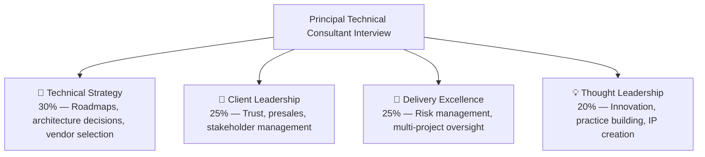

# ⚫ Principal Technical Consultant — Interview Guide

## What Interviewers Focus On

PTC interviews test whether you can **operate at the intersection of business, technology, and client relationships**. You're not just a senior architect — you're expected to own client outcomes, shape technical strategy, build trust with C-suite stakeholders, win business, and ensure delivery excellence across multiple engagements simultaneously.

## How PTC Differs from Other Roles

| Dimension | Solution Architect | Tech Lead | Principal Technical Consultant |
|-----------|-------------------|-----------|-------------------------------|
| Scope | One system | One team | Multiple clients / engagements |
| Primary output | Architecture design | Team productivity | Client business outcomes |
| Client interaction | Technical contact | Rare | Owns client relationship |
| Revenue impact | Indirect | Indirect | Direct (presales, upsell, retention) |
| Practice building | None | None | Builds capability for the org |
| Ambiguity | System-level | Sprint-level | Business strategy level |

---

## P0 — Client Leadership & Presales

| # | Question | Difficulty | What They're Testing |
|---|----------|------------|---------------------|
| CL1 | Walk me through how you qualify a new technical opportunity in presales. | ⚫ Hard | Deal qualification, BANT/MEDDIC |
| CL2 | You're in a first meeting with a skeptical CTO who thinks your firm is too small. How do you build credibility? | ⚫ Hard | Trust-building, credibility signals |
| CL3 | Describe a time you turned a failing client engagement around. | ⚫ Hard | Recovery, accountability, communication |
| CL4 | How do you scope a fixed-price project that has significant technical unknowns? | ⚫ Hard | Risk pricing, assumptions documentation |
| CL5 | A client's in-house team disagrees with your architectural recommendation. What do you do? | ⚫ Hard | Influence without authority, data-driven persuasion |
| CL6 | How do you identify upsell or extension opportunities in a current engagement? | 🔴 Hard | Consulting value delivery |
| CL7 | Describe how you've led a post-mortem or RCA with a client after a production incident. | ⚫ Hard | Client communication, blameless culture |
| CL8 | How do you set and manage expectations with a client who has unrealistic timelines? | 🔴 Hard | Scope negotiation, early signaling |
| CL9 | How do you handle a situation where the client's internal team is resistant to your recommendations? | ⚫ Hard | Change management, stakeholder alignment |

---

## P0 — Technical Strategy & Architecture

| # | Question | Difficulty | What They're Testing |
|---|----------|------------|---------------------|
| TS1 | How do you build a 2-year technology roadmap for a mid-size enterprise client? | ⚫ Staff | Strategic thinking, prioritization |
| TS2 | A client is on a legacy monolith. How do you recommend migrating without disrupting business? | ⚫ Staff | Migration strategy, risk management |
| TS3 | How do you evaluate whether a client should build vs buy vs integrate a new capability? | ⚫ Staff | Decision frameworks |
| TS4 | Walk me through how you designed a multi-tenant banking architecture for 40+ FIs. | ⚫ Staff | Real-world depth, design decisions |
| TS5 | How do you define non-functional requirements (NFRs) for a client who hasn't thought about them? | 🔴 Hard | Elicitation, SLAs, SLOs |
| TS6 | A client asks you to evaluate 3 different cloud providers. How do you structure the evaluation? | ⚫ Staff | Vendor assessment framework |
| TS7 | How do you architect for compliance (PCI-DSS, SOC2, HIPAA) from day one vs retrofitting? | ⚫ Staff | Security architecture, regulatory requirements |
| TS8 | What's your approach to API design when you're integrating multiple third-party vendors? | 🔴 Hard | Adapter pattern, versioning, resilience |

### System Design (PTC Depth — Business + Technical)

| # | Question | Difficulty | Domain |
|---|----------|------------|--------|
| SD1 | Design a pluggable bank-core adapter system (Symitar, Fiserv, DNA, Corelation) | ⚫ Staff | Adapter pattern, extensibility |
| SD2 | Design a KYC pipeline integrating Persona + Experian + TransUnion + ChexSystems | ⚫ Staff | Event-driven, third-party integration |
| SD3 | Design a Server-Driven UI engine for multi-tenant white-label banking app | ⚫ Staff | SDUI, CMS, feature flags |
| SD4 | Design an AI-powered presales workflow (email → research → requirements → human review) | ⚫ Staff | Agentic systems, LangGraph |
| SD5 | Design a multi-region active-active FinTech platform with data sovereignty requirements | ⚫ Staff | Global distribution, compliance |
| SD6 | Design a white-label PropTech platform where each client gets a custom-branded mobile app | ⚫ Staff | White-labeling, CI/CD automation |

---

## P0 — Delivery Excellence & Risk Management

| # | Question | Difficulty | What They're Testing |
|---|----------|------------|---------------------|
| DR1 | How do you identify delivery risks at the start of an engagement? | ⚫ Hard | Risk assessment, RAID log |
| DR2 | You're 3 months into a 6-month project and you realize you'll miss the deadline. What do you do? | ⚫ Hard | Transparency, scope negotiation, recovery planning |
| DR3 | How do you manage multiple concurrent client engagements without dropping quality? | ⚫ Hard | Multi-project oversight, delegation |
| DR4 | A critical team member leaves mid-project. How do you respond? | 🔴 Hard | Risk mitigation, knowledge transfer |
| DR5 | How do you set up knowledge transfer so a client's team can own the system after handoff? | 🔴 Hard | Documentation, training, runbooks |
| DR6 | How do you measure the success of a consulting engagement? | 🔴 Hard | KPIs, client satisfaction, business value |
| DR7 | Walk me through your definition of "done" for a major feature in a client project. | 🟡 Medium | Quality gates, acceptance criteria |

---

## P0 — Thought Leadership & Practice Building

| # | Question | Difficulty | What They're Testing |
|---|----------|------------|---------------------|
| TH1 | How do you establish yourself as a trusted advisor vs a vendor? | ⚫ Hard | Long-term relationship building |
| TH2 | How do you create reusable IP from client engagements without IP conflicts? | ⚫ Hard | Knowledge management, IP boundaries |
| TH3 | How have you contributed to your organization's practice/capability building? | 🔴 Hard | Internal knowledge sharing, templates |
| TH4 | How do you stay current across multiple technology domains simultaneously? | 🔴 Hard | Learning systems, curation |
| TH5 | How do you create content (talks, blogs, POCs) that builds your firm's credibility? | 🔴 Hard | Thought leadership pipeline |

---

## P0 — AI & Emerging Tech (Growing importance)

| # | Question | Difficulty | What They're Testing |
|---|----------|------------|---------------------|
| AI1 | How would you advise a client on whether to build a custom LLM vs use an existing model? | ⚫ Hard | AI strategy, build vs buy |
| AI2 | You built an AI presales workflow with LangGraph. Walk me through the architecture and lessons learned. | ⚫ Hard | Agentic systems depth |
| AI3 | How do you evaluate the ROI of an AI initiative for a skeptical CFO? | ⚫ Hard | Business case, measurement |
| AI4 | What are the enterprise risks of adopting LLMs? How do you advise clients on mitigating them? | ⚫ Hard | Risk management, governance |
| AI5 | How do you design human-in-the-loop checkpoints in an AI pipeline? | 🔴 Hard | Agentic workflow design |

---

## P1 — Behavioral (PTC Level)

| # | Question | Difficulty | Focus |
|---|----------|------------|-------|
| BH1 | Tell me about a time you disagreed with a client's technical direction. What did you do? | ⚫ Hard | Influence, integrity |
| BH2 | Describe your most complex multi-stakeholder project. How did you keep everyone aligned? | ⚫ Hard | Communication, governance |
| BH3 | Tell me about a time you had to say "no" to a client. | 🔴 Hard | Boundary-setting, client trust |
| BH4 | Describe a time you made a technical recommendation that turned out to be wrong. | ⚫ Hard | Accountability, learning |
| BH5 | How have you grown junior consultants on your team? | 🔴 Hard | Mentoring, delegation |
| BH6 | Tell me about a time you won a deal you weren't expected to win. | ⚫ Hard | Presales excellence |

---

## Gaurav-Specific Prep Notes

Your GeekyAnts experience maps directly to PTC expectations. Prepare these narratives:

1. **Multi-tenant banking (NAO + Online Banking):**
   → 40+ FIs, pluggable bank-core adapters (Symitar, Corelation, DNA, Fiserv), Server-Driven UI engine, Redis tenant-scoped caching, full observability stack

2. **Client-facing leadership:**
   → Primary technical contact across stand-ups, sprint planning, production RCAs, API contract design, solution scoping

3. **White-label PropTech (Optushome):**
   → Multi-tenant builds via Azure Pipelines — config swap at build time per UK client

4. **AI presales workflow (LangGraph):**
   → Email → agent pipeline → lead research → gap analysis → requirements summary → human review checkpoints

5. **Hiring and team building:**
   → Led 20+ engineers across 3+ concurrent projects, end-to-end hiring, 6-7 direct reports as Associate Director

### Numbers to memorize for your answers:
- **40+ financial institutions** served by banking platform
- **20+ engineers** across 3+ concurrent projects
- **10 years** at GeekyAnts (one company — demonstrate depth and loyalty)
- **11 JSON config files** in SDUI engine
- **5 funding methods** in NAO payment system
- **8,500+ GitHub stars** on Vue Native (open source credibility)
- **500+ enterprise clients** at Sortly, 50,000+ active users

---

## PTC Interview Format Tips

- **Lead with business impact**: Frame every answer as "the client needed X, we delivered Y, which meant Z dollars/users/risk reduction"
- **Show breadth**: You need to prove you can handle architecture, people, business, and delivery simultaneously
- **Quantify everything**: "We improved performance" → "P99 latency dropped from 800ms to 120ms"
- **Client empathy**: Show you understand clients' business constraints, not just technical requirements
- **Demonstrate reusability**: Show how you've created patterns/frameworks/templates that work across multiple engagements
