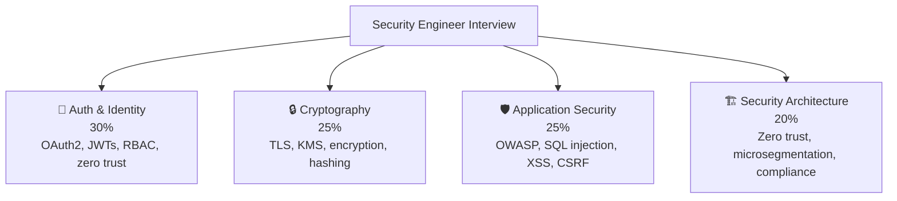

# 🔐 Security Engineer — Interview Guide

## What Interviewers Focus On

Security engineering interviews test **threat modeling, authentication systems, cryptography fundamentals, and secure architecture** — not just "what is XSS" but how to design systems that are secure by default at scale. You need to know both offensive concepts (to understand attacker mindset) and defensive patterns (to build mitigations).

---

## P0 — Must Know Cold

### Authentication & Authorization
| # | Question | Difficulty | Format |
|---|----------|------------|--------|
| 1 | [What is the difference between authentication and authorization?](../question-bank/security-auth/authentication-patterns) | 🟢 Junior | Quick Answer |
| 2 | [JWT vs server-side sessions — security tradeoffs, not just use cases](../question-bank/security-auth/jwt-sessions-cookies) | 🟡 Mid | Deep Dive |
| 3 | [What is OAuth2 authorization code flow with PKCE and why is it secure?](../question-bank/security-auth/oauth2-oidc) | 🟡 Mid | Deep Dive |
| 4 | [What is RBAC vs ABAC — when does ABAC justify the complexity?](../question-bank/security-auth/authentication-patterns) | 🔴 Senior | Quick Answer |
| 5 | [How do you design a multi-tenant permission system without data leakage?](../question-bank/security-auth/authentication-patterns) | 🔴 Senior | Scenario |

### Cryptography
| # | Question | Difficulty | Format |
|---|----------|------------|--------|
| 6 | [Why do you hash passwords with bcrypt/argon2 instead of SHA-256?](../question-bank/security-auth/authentication-patterns) | 🟢 Junior | Quick Answer |
| 7 | [How does TLS 1.3 work — handshake, key exchange, forward secrecy?](../question-bank/security-auth/encryption-at-rest-transit) | 🔴 Senior | Deep Dive |
| 8 | [What is envelope encryption and how does AWS KMS implement it?](../question-bank/security-auth/encryption-at-rest-transit) | 🔴 Senior | Deep Dive |
| 9 | [What is the difference between symmetric and asymmetric encryption — when do you use each?](../question-bank/security-auth/encryption-at-rest-transit) | 🟡 Mid | Quick Answer |

### Application Security
| # | Question | Difficulty | Format |
|---|----------|------------|--------|
| 10 | [How do you prevent SQL injection — parameterized queries vs ORM vs input validation?](../question-bank/security-auth/api-security-patterns) | 🟢 Junior | Quick Answer |
| 11 | [What is CSRF and how do SameSite=Strict cookies prevent it?](../question-bank/security-auth/jwt-sessions-cookies) | 🟡 Mid | Quick Answer |
| 12 | [What is stored vs reflected vs DOM-based XSS — how do you mitigate each?](../question-bank/security-auth/api-security-patterns) | 🟡 Mid | Deep Dive |
| 13 | [What are the OWASP Top 10 and which 3 are most critical for APIs?](../question-bank/security-auth/api-security-patterns) | 🟡 Mid | Quick Answer |
| 14 | [What is CORS and why does the preflight request exist?](../question-bank/security-auth/api-security-patterns) | 🟡 Mid | Quick Answer |

---

## P1 — Differentiators

### Zero Trust & Architecture
| # | Question | Difficulty | Format |
|---|----------|------------|--------|
| 15 | [What is zero trust architecture — how is it different from VPN + perimeter?](../question-bank/security-auth/zero-trust-architecture) | 🔴 Senior | Deep Dive |
| 16 | [How did Google implement BeyondCorp — workload identity vs user identity?](../question-bank/security-auth/zero-trust-architecture) | ⚫ Staff | Deep Dive |
| 17 | [What is microsegmentation and how does it limit blast radius?](../question-bank/security-auth/zero-trust-architecture) | 🔴 Senior | Quick Answer |
| 18 | [How do you implement service-to-service auth using SPIFFE/SPIRE mTLS?](../question-bank/security-auth/zero-trust-architecture) | ⚫ Staff | Deep Dive |

### Compliance & Secrets Management
| # | Question | Difficulty | Format |
|---|----------|------------|--------|
| 19 | [How do you design encryption strategy for a healthcare app with PHI?](../question-bank/security-auth/encryption-at-rest-transit) | 🔴 Senior | Scenario |
| 20 | [How does Stripe handle PCI-DSS compliance architecturally?](../question-bank/system-design/design-payment-system) | ⚫ Staff | Deep Dive |
| 21 | [How do you rotate encryption keys for 100M stored records with zero downtime?](../question-bank/security-auth/encryption-at-rest-transit) | ⚫ Staff | Deep Dive |
| 22 | [How do you manage secrets in Kubernetes — Vault vs AWS Secrets Manager vs k8s secrets?](../question-bank/cloud-devops/kubernetes-architecture) | 🔴 Senior | Quick Answer |

### Threat Modeling
| # | Question | Difficulty | Format |
|---|----------|------------|--------|
| 23 | [How do you run a STRIDE threat model for a new microservice?](../question-bank/security-auth/api-security-patterns) | 🔴 Senior | Deep Dive |
| 24 | [How do you defend against prompt injection in LLM-powered applications?](../question-bank/ai-ml-systems/ai-agent-architecture) | 🔴 Senior | Deep Dive |
| 25 | [What is supply chain security and how do you harden a CI/CD pipeline?](../question-bank/cloud-devops/cicd-pipeline-design) | ⚫ Staff | Deep Dive |

---

## P2 — Staff Security Engineer

| # | Question | Topic | Difficulty |
|---|----------|-------|------------|
| 26 | [Design a zero trust migration roadmap from VPN + perimeter model](../question-bank/security-auth/zero-trust-architecture) | Architecture | ⚫ Staff |
| 27 | [How do you design a secrets rotation system that runs automatically at scale?](../question-bank/security-auth/encryption-at-rest-transit) | Secrets | ⚫ Staff |
| 28 | [How does Cloudflare DDoS mitigation work at 100 Tbps?](../question-bank/system-design/design-rate-limiter) | DDoS | ⚫ Staff |

---

→ [All Security & Auth Questions](../question-bank/security-auth/)
→ [All Cloud & DevOps Questions](../question-bank/cloud-devops/)
→ [Master Question Index](../question-bank/)
