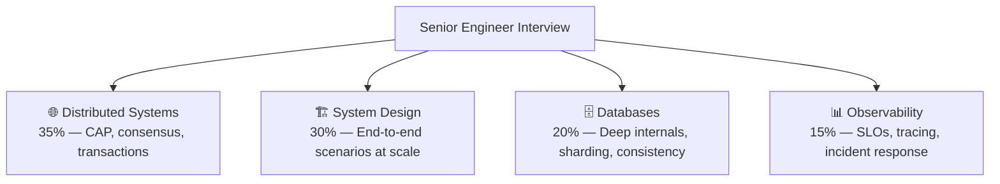

# 🔴 Senior Engineer — Interview Guide

## What Interviewers Focus On

Senior engineering interviews go deep on **distributed systems, system design at scale, and architectural trade-offs**. You must justify every decision with numbers, discuss failure modes proactively, and demonstrate you've operated systems under real load.

## Study Roadmap

| Week | Focus | Target |
|------|-------|--------|
| Week 1 | P0 Distributed Systems + P0 System Design | Core senior competency |
| Week 2 | P0 Database internals + P0 Caching deep dives | Data layer mastery |
| Week 3 | P1 Observability + P1 Security architecture | Operations depth |
| Week 4 | P2 Staff-level scenarios + practice | Stretch to Staff+ |

---

## P0 — Must Know Cold

### Distributed Systems
| # | Question | Difficulty | Format |
|---|----------|------------|--------|
| 1 | [What does the CAP theorem mean practically (not just the acronym)?](../question-bank/distributed-systems/cap-theorem-real-world) | 🟡 Mid | Quick Answer |
| 2 | [How does Cassandra choose AP over CP, and handle conflicts?](../question-bank/distributed-systems/cap-theorem-real-world) | 🔴 Senior | Deep Dive |
| 3 | [How does Raft differ from Paxos and how does it elect a leader?](../question-bank/distributed-systems/consensus-algorithms) | 🔴 Senior | Deep Dive |
| 4 | [What is 2PC and what happens when the coordinator crashes after PREPARE?](../question-bank/distributed-systems/two-phase-commit) | 🔴 Senior | Deep Dive |
| 5 | [How do you design compensating transactions for a failed Saga step?](../question-bank/distributed-systems/saga-pattern) | 🔴 Senior | Deep Dive |
| 6 | [How do fencing tokens prevent a stale leader from corrupting data?](../question-bank/distributed-systems/leader-election) | 🔴 Senior | Deep Dive |
| 7 | [What are Lamport timestamps and vector clocks — when do you use each?](../question-bank/distributed-systems/clock-synchronization) | 🔴 Senior | Deep Dive |
| 8 | [How do idempotency keys work and how do you store + expire them at scale?](../question-bank/distributed-systems/idempotency-at-scale) | 🔴 Senior | Deep Dive |

### System Design (Scenarios)
| # | Question | Difficulty | Format |
|---|----------|------------|--------|
| 9 | [Design a real-time chat like WhatsApp for 500M users](../question-bank/system-design/design-chat-system) | 🔴 Senior | Scenario |
| 10 | [Design a social news feed for 100M DAU](../question-bank/system-design/design-news-feed) | 🔴 Senior | Scenario |
| 11 | [Design a distributed rate limiter at 50K req/sec](../question-bank/system-design/design-rate-limiter) | 🔴 Senior | Scenario |
| 12 | [Design a payment system like Stripe (1000 tx/sec)](../question-bank/system-design/design-payment-system) | 🔴 Senior | Scenario |
| 13 | [Design a distributed locking service (10K lock req/sec)](../question-bank/system-design/design-distributed-locking) | 🔴 Senior | Scenario |
| 14 | [Design a metrics monitoring system like Datadog (1M metrics/sec)](../question-bank/system-design/design-metrics-monitoring) | 🔴 Senior | Scenario |

### Databases (Deep Internals)
| # | Question | Difficulty | Format |
|---|----------|------------|--------|
| 15 | [How does MySQL binlog replication work and what are its failure modes?](../question-bank/databases/database-replication-patterns) | 🔴 Senior | Deep Dive |
| 16 | [How do you implement leader election when the primary DB fails?](../question-bank/databases/database-replication-patterns) | 🔴 Senior | Deep Dive |
| 17 | [Compare range vs hash vs directory-based sharding strategies](../question-bank/databases/database-sharding-deep-dive) | 🔴 Senior | Deep Dive |
| 18 | [What are MVCC and SERIALIZABLE isolation — when do you use each?](../question-bank/databases/transactions-acid-base) | 🔴 Senior | Deep Dive |
| 19 | [What is the expand-contract migration pattern?](../question-bank/databases/database-migrations-at-scale) | 🔴 Senior | Deep Dive |

---

## P1 — Differentiators

### Observability & Reliability
| # | Question | Difficulty | Format |
|---|----------|------------|--------|
| 20 | [What are the Four Golden Signals?](../question-bank/observability-sre/metrics-alerting-design) | 🟡 Mid | Quick Answer |
| 21 | [How do you set alert thresholds to minimize false positives?](../question-bank/observability-sre/metrics-alerting-design) | 🔴 Senior | Deep Dive |
| 22 | [What is distributed tracing and what problems does it solve that logs can't?](../question-bank/observability-sre/distributed-tracing) | 🟡 Mid | Quick Answer |
| 23 | [How do you calculate an error budget from an SLO?](../question-bank/observability-sre/slo-sla-error-budgets) | 🟡 Mid | Quick Answer |
| 24 | [What is a blameless postmortem — process and common pitfalls?](../question-bank/observability-sre/incident-response-systems) | 🔴 Senior | Deep Dive |

### Caching & Performance
| # | Question | Difficulty | Format |
|---|----------|------------|--------|
| 25 | [How do you handle a cache node failure without thundering herd?](../question-bank/system-design/design-distributed-cache) | 🔴 Senior | Deep Dive |
| 26 | [How does event-driven cache invalidation work?](../question-bank/caching-performance/cache-invalidation-strategies) | 🔴 Senior | Deep Dive |
| 27 | [How do you implement stale-while-revalidate to eliminate stampedes?](../question-bank/caching-performance/cache-stampede-thundering-herd) | 🔴 Senior | Deep Dive |

### Security & Auth
| # | Question | Difficulty | Format |
|---|----------|------------|--------|
| 28 | [How do you revoke a JWT before it expires?](../question-bank/security-auth/jwt-sessions-cookies) | 🔴 Senior | Deep Dive |
| 29 | [How does token rotation prevent token theft?](../question-bank/security-auth/oauth2-oidc) | 🔴 Senior | Deep Dive |
| 30 | [How do you implement key rotation without decrypting all existing data?](../question-bank/security-auth/encryption-at-rest-transit) | 🔴 Senior | Deep Dive |

---

## P2 — Staff-Level Depth

| # | Question | Topic | Difficulty |
|---|----------|-------|------------|
| 31 | [How does Google Spanner achieve external consistency globally?](../question-bank/databases/database-consistency-models) | Databases | ⚫ Staff |
| 32 | [How does Google Chubby achieve consensus-based locking with Paxos?](../question-bank/system-design/design-distributed-locking) | Distributed | ⚫ Staff |
| 33 | [Multi-window multi-burn-rate alerting — Google's approach](../question-bank/observability-sre/metrics-alerting-design) | Observability | ⚫ Staff |
| 34 | [How does Google Zanzibar serve 10M authorization checks/sec at <10ms p99?](../question-bank/security-auth/authorization-rbac-abac) | Security | ⚫ Staff |
| 35 | [Design a hybrid fan-out strategy that switches on follower count](../question-bank/system-design/design-news-feed) | System Design | ⚫ Staff |

---

→ [All Distributed Systems Questions](../question-bank/distributed-systems/)
→ [All System Design Questions](../question-bank/system-design/)
→ [All Observability Questions](../question-bank/observability-sre/)
→ [Master Question Index](../question-bank/)
