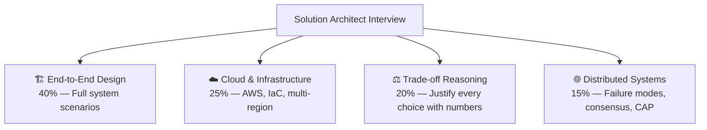

# ⚫ Solution Architect — Interview Guide

## What Interviewers Focus On

Solution Architect interviews are about **end-to-end system thinking** — not just how to build one component, but how the entire system fits together, scales globally, fails gracefully, and meets business constraints (cost, compliance, SLAs). You must drive conversations, not just answer them.

## How SA Interviews Differ

| Dimension | Senior Engineer | Solution Architect |
|-----------|----------------|-------------------|
| Scope | One service | Full platform |
| Depth | Implementation details | Trade-off reasoning |
| Cost | Not usually asked | Always considered |
| Compliance | Rarely asked | Frequently asked (PCI, GDPR, HIPAA) |
| Org impact | Team-level | Cross-team / company-wide |

---

## P0 — Must Know Cold

### End-to-End System Design
| # | Question | Difficulty | Format |
|---|----------|------------|--------|
| 1 | [Design Netflix-style video streaming for 1M concurrent streams](../question-bank/system-design/design-video-streaming) | ⚫ Staff | Scenario |
| 2 | [Design a recommendation engine for 200M users](../question-bank/system-design/design-recommendation-engine) | ⚫ Staff | Scenario |
| 3 | [Design an API gateway handling 100K req/sec for microservices](../question-bank/system-design/design-api-gateway) | 🔴 Senior | Scenario |
| 4 | [Design a CDN serving static assets to 1B users globally](../question-bank/system-design/design-cdn) | ⚫ Staff | Scenario |
| 5 | [Design a distributed job scheduler handling 1M jobs/day](../question-bank/system-design/design-job-scheduler) | 🔴 Senior | Scenario |
| 6 | [Design file storage like Dropbox for 500M files and 10M DAU](../question-bank/system-design/design-file-storage) | 🔴 Senior | Scenario |

### Cloud & Infrastructure
| # | Question | Difficulty | Format |
|---|----------|------------|--------|
| 7 | [EC2 vs Lambda vs ECS vs EKS — when do you use each?](../question-bank/cloud-devops/aws-core-services) | 🟡 Mid | Quick Answer |
| 8 | [Design a VPC with public/private subnets, NAT, and security groups](../question-bank/cloud-devops/aws-core-services) | 🔴 Senior | Deep Dive |
| 9 | [Design IAM policies following least-privilege for multi-account AWS](../question-bank/cloud-devops/aws-core-services) | ⚫ Staff | Deep Dive |
| 10 | [Blue-green vs canary deployments — when do you use each?](../question-bank/cloud-devops/blue-green-canary-deployments) | 🔴 Senior | Deep Dive |
| 11 | [How does Terraform manage state and what problems does remote state solve?](../question-bank/cloud-devops/infrastructure-as-code) | 🔴 Senior | Deep Dive |

### Distributed Systems Trade-offs
| # | Question | Difficulty | Format |
|---|----------|------------|--------|
| 12 | [CAP theorem — how do you choose between CP and AP for your system?](../question-bank/distributed-systems/cap-theorem-real-world) | 🔴 Senior | Deep Dive |
| 13 | [PACELC theorem — what does it add to CAP?](../question-bank/distributed-systems/cap-theorem-real-world) | ⚫ Staff | Quick Answer |
| 14 | [2PC vs Saga — justify your choice for a checkout flow](../question-bank/distributed-systems/distributed-transactions) | 🔴 Senior | Scenario |
| 15 | [How do you design a system that degrades gracefully during partitions?](../question-bank/distributed-systems/partition-tolerance) | 🔴 Senior | Deep Dive |

---

## P1 — Differentiators

### Multi-Region Architecture
| # | Question | Difficulty | Format |
|---|----------|------------|--------|
| 16 | [How would you design CDN PoP placement for India + Southeast Asia?](../question-bank/system-design/design-cdn) | ⚫ Staff | Quick Answer |
| 17 | [How do you geo-distribute the redirect service to <50ms globally?](../question-bank/system-design/design-url-shortener) | ⚫ Staff | Deep Dive |
| 18 | [How do you design a disaster recovery strategy across two AWS regions?](../question-bank/databases/database-backup-recovery) | ⚫ Staff | Deep Dive |
| 19 | [How does CockroachDB achieve multi-region replication with <100ms latency?](../question-bank/databases/database-replication-patterns) | ⚫ Staff | Quick Answer |

### Cost & Compliance
| # | Question | Difficulty | Format |
|---|----------|------------|--------|
| 20 | [How does Netflix save ~$1B/year on AWS bills?](../question-bank/cloud-devops/cloud-cost-optimization) | ⚫ Staff | Deep Dive |
| 21 | [How does Stripe handle PCI-DSS compliance architecturally?](../question-bank/system-design/design-payment-system) | ⚫ Staff | Quick Answer |
| 22 | [How do you handle location data privacy and GDPR compliance?](../question-bank/system-design/design-location-service) | 🔴 Senior | Quick Answer |
| 23 | [How do you design encryption strategy for a healthcare app (PHI)?](../question-bank/security-auth/encryption-at-rest-transit) | 🔴 Senior | Scenario |

### Security Architecture
| # | Question | Difficulty | Format |
|---|----------|------------|--------|
| 24 | [How did Google implement BeyondCorp (zero trust replacing VPN)?](../question-bank/security-auth/zero-trust-architecture) | ⚫ Staff | Deep Dive |
| 25 | [How do you implement service-to-service auth using SPIFFE/SPIRE?](../question-bank/security-auth/zero-trust-architecture) | ⚫ Staff | Deep Dive |
| 26 | [What is microsegmentation and how does it limit blast radius?](../question-bank/security-auth/zero-trust-architecture) | 🔴 Senior | Quick Answer |

---

## P2 — Advanced Scenarios

| # | Question | Topic | Difficulty |
|---|----------|-------|------------|
| 27 | [How do you design a multi-tenant SaaS API gateway with custom routing?](../question-bank/system-design/design-api-gateway) | System Design | ⚫ Staff |
| 28 | [How does Salesforce achieve multi-tenancy for 150K+ customers in shared Oracle?](../question-bank/databases/multi-tenancy-database-patterns) | Databases | ⚫ Staff |
| 29 | [How do you design DNS routing for global SaaS with US/EU/Asia regions?](../question-bank/apis-networking/dns-load-balancing) | Networking | 🔴 Senior |
| 30 | [How do you design a zero trust migration roadmap from VPN + perimeter?](../question-bank/security-auth/zero-trust-architecture) | Security | ⚫ Staff |

---

→ [All System Design Scenarios](../question-bank/system-design/)
→ [All Cloud & DevOps Questions](../question-bank/cloud-devops/)
→ [All Distributed Systems Questions](../question-bank/distributed-systems/)
→ [Master Question Index](../question-bank/)
