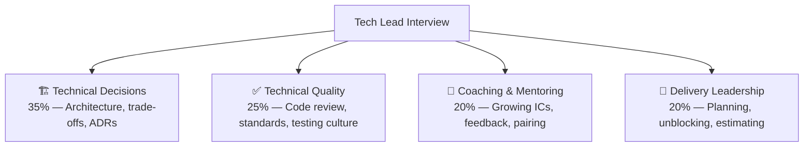

# 🔧 Tech Lead — Interview Guide

## What Interviewers Focus On

Tech Lead interviews sit at the intersection of deep technical expertise and team influence. Unlike a Senior IC, a TL is responsible for the **technical health of the entire team's output** — code quality, architecture decisions, mentoring, and delivery. They test whether you can make good decisions under ambiguity, align your team, and stay hands-on while doing it.

## How TL Differs from Senior IC and EM

| Dimension | Senior IC | Tech Lead | Engineering Manager |
|-----------|-----------|-----------|-------------------|
| Coding | Deep individual contribution | Balanced — still coding but less | Rare or none |
| Architecture | Owns a service | Owns the system | Approves at portfolio level |
| Mentoring | Informal | Core responsibility | Performance management |
| Planning | Task estimates | Sprint + milestone planning | Roadmap ownership |
| Decisions | Makes own decisions | Makes team decisions | Delegates and unblocks |
| Authority | Technical | Technical + some process | People + process |

---

## P0 — Technical Decisions & Architecture

| # | Question | Difficulty | What They're Testing |
|---|----------|------------|---------------------|
| A1 | Walk me through the most important architecture decision you made in the last year. | 🔴 Hard | Decision quality, trade-off reasoning |
| A2 | How do you document architectural decisions? Do you write ADRs? | 🟡 Medium | Communication, institutional memory |
| A3 | Your team is debating PostgreSQL vs MongoDB for a new service. How do you decide? | 🔴 Hard | Data modeling, access patterns, trade-offs |
| A4 | How do you approach a system redesign when the existing system works but has tech debt? | ⚫ Staff | Risk assessment, incremental migration |
| A5 | Tell me about a time you reversed an architecture decision. What happened? | 🔴 Hard | Intellectual honesty, course-correction |
| A6 | How do you evaluate whether to build vs buy for a new capability? | 🔴 Hard | Strategic thinking, cost modeling |
| A7 | How do you handle technical disagreements within your team? | 🔴 Hard | Facilitation, decision ownership |
| A8 | You've inherited a service with no tests, no documentation, and high churn. Where do you start? | 🔴 Hard | Technical triage, risk-first thinking |

### System Design (TL-Level Depth)

| # | Question | Difficulty | Domain |
|---|----------|------------|--------|
| SD1 | Design a BFF (Backend for Frontend) for a mobile banking app | ⚫ Staff | API design, aggregation |
| SD2 | Design a multi-tenant SaaS platform where each tenant needs data isolation | ⚫ Staff | Multi-tenancy, security |
| SD3 | Design a Server-Driven UI system that allows config changes without app releases | ⚫ Staff | SDUI, CMS integration |
| SD4 | Design an event-driven payment processing pipeline with exactly-once semantics | ⚫ Staff | Messaging, idempotency |
| SD5 | Migrate a monolith to microservices using Strangler Fig — where do you start? | 🔴 Hard | Migration patterns |
| SD6 | Design a feature flag system for a multi-tenant platform | 🔴 Hard | Configuration management |
| SD7 | Design an observability stack for a distributed system | 🔴 Hard | OTel, tracing, metrics, logs |

---

## P0 — Technical Quality & Code Culture

| # | Question | Difficulty | What They're Testing |
|---|----------|------------|---------------------|
| Q1 | What does your code review process look like? | 🟡 Medium | Review culture, async vs sync |
| Q2 | How do you handle a PR that technically works but is the wrong approach? | 🔴 Hard | Balancing speed vs quality |
| Q3 | How do you define and enforce coding standards across a team of 8? | 🔴 Hard | Linting, style guides, ADRs |
| Q4 | How do you measure code quality without making it feel punitive? | 🔴 Hard | Culture vs metrics |
| Q5 | Your team has 0% test coverage on a critical service. How do you address this? | 🔴 Hard | Testing strategy, incremental approach |
| Q6 | How do you prevent "big bang" PRs that block review? | 🟡 Medium | PR discipline, feature flags |
| Q7 | How do you balance moving fast with maintaining quality? | 🔴 Hard | Speed/quality trade-off |

---

## P0 — Coaching & Mentoring

| # | Question | Difficulty | What They're Testing |
|---|----------|------------|---------------------|
| M1 | Tell me about a junior engineer you grew significantly. What did you do? | 🔴 Hard | Teaching style, patience |
| M2 | How do you give technical feedback without demoralizing someone? | 🔴 Hard | Feedback delivery |
| M3 | A mid-level engineer disagrees with your architecture choice. How do you handle it? | 🔴 Hard | Openness, teaching moments |
| M4 | How do you pair-program effectively? When do you use it? | 🟡 Medium | Coaching through code |
| M5 | How do you help engineers level up from mid to senior? | 🔴 Hard | Leveling criteria, projects |
| M6 | An engineer is stuck on a problem for 2 days but hasn't asked for help. What do you do? | 🟡 Medium | Sensing blockers, culture of asking |

---

## P0 — Delivery & Planning

| # | Question | Difficulty | What They're Testing |
|---|----------|------------|---------------------|
| DE1 | How do you estimate a project that spans 3 months with multiple unknowns? | 🔴 Hard | T-shirt sizing, spike work, buffer |
| DE2 | The sprint is halfway through and it's clear you'll miss the sprint goal. What do you do? | 🟡 Medium | Transparency, triage |
| DE3 | How do you handle a team member who consistently over-promises and under-delivers? | 🔴 Hard | Feedback, calibration |
| DE4 | How do you prioritize technical debt against feature work? | 🔴 Hard | Negotiation, visibility |
| DE5 | Walk me through how you handled a production incident as TL. | 🔴 Hard | Incident command, communication |
| DE6 | How do you create technical roadmaps that non-technical stakeholders can understand? | 🔴 Hard | Communication, translation |

---

## P1 — Algorithms & Coding (TL-Level)

Expect medium-to-hard LeetCode, but the lens is **design quality and communication**, not just correctness.

| # | Problem | Difficulty | Concept |
|---|---------|------------|---------|
| C1 | Implement an LRU Cache | 🔴 Medium | HashMap + Doubly Linked List |
| C2 | Design a rate limiter (token bucket) in code | 🔴 Medium | Concurrency, Redis patterns |
| C3 | Implement a circuit breaker class | 🔴 Medium | State machine, thread safety |
| C4 | Design a simple in-memory job queue with priorities | 🔴 Medium | Heap, worker pattern |
| C5 | Find all cycles in a dependency graph | 🔴 Medium | DFS, topological sort |
| C6 | Implement retry with exponential backoff + jitter | 🟡 Easy | Reliability patterns |
| C7 | Serialize/deserialize a binary tree | 🔴 Medium | Tree traversal |
| C8 | Given a stream of events, find the top-K most frequent in a sliding window | ⚫ Hard | Sliding window, heap |
| C9 | Design a consistent hashing ring | ⚫ Hard | Distributed systems fundamentals |

---

## P1 — On-Call & Incident Management

| # | Question | Difficulty | Focus |
|---|----------|------------|-------|
| I1 | How do you set up an on-call rotation for a team of 6? | 🔴 Hard | Fairness, runbooks, escalation |
| I2 | An alert fires at 2am. Walk me through your response process. | 🔴 Hard | Incident command, triage |
| I3 | How do you write a post-mortem that drives real change? | 🔴 Hard | Blameless culture, action items |
| I4 | How do you reduce alert fatigue on your team? | 🔴 Hard | SLO-based alerting, noise reduction |

---

## Gaurav-Specific Prep Notes

Based on your background, these angles will come up:

1. **"You designed a Server-Driven UI system — walk me through the architecture"**
   → 11 JSON config files, Strapi CMS backend, tenant-specific layouts, zero-code-release config changes

2. **"You used Strangler Fig to migrate a banking monolith — what did you start with?"**
   → Risk-first: identify highest-churn or highest-risk seams, extract BFF layer first, strangler pattern at routing level

3. **"You set up OpenTelemetry + Jaeger + Prometheus — why that stack? What would you change?"**
   → OTel vendor-neutral, Jaeger for distributed trace correlation, Prometheus for time-series metrics, Grafana for dashboards

4. **"You led teams of 20+ across 3 concurrent projects — how did you maintain technical consistency?"**
   → Shared ADRs, internal knowledge-sharing sessions, cross-project code review on shared libraries

---

## Interview Format Tips

- **Lead with architecture**: TL interviews reward "big picture first, details on request"
- **Show your trade-offs**: Every design choice needs a "we chose X over Y because..."
- **Code quality matters**: Even if not asked to code, talk about test coverage, PR process, standards
- **Show mentoring wins**: "I grew an engineer from mid to senior in 18 months by..."
