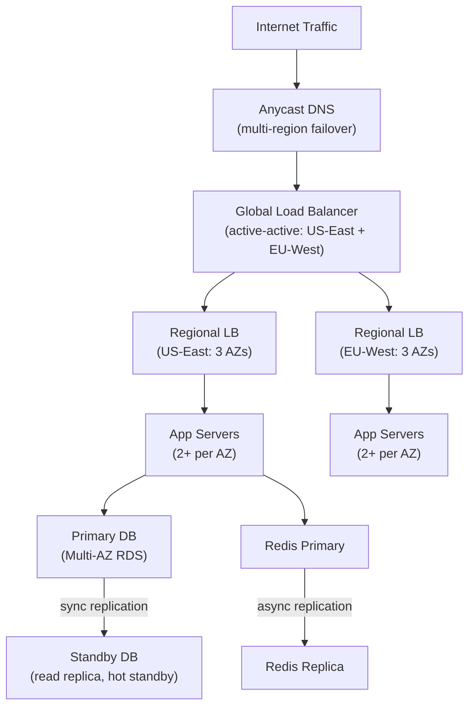
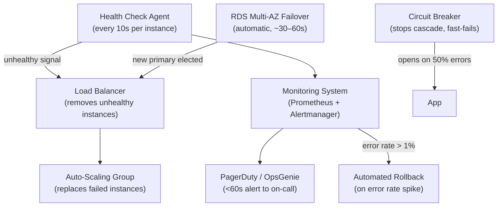
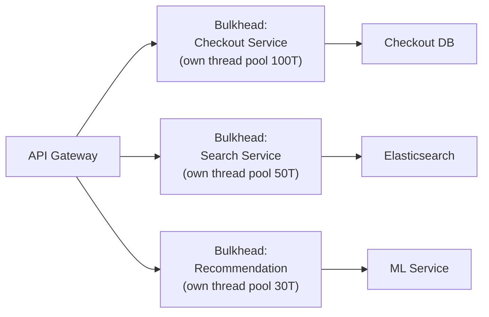
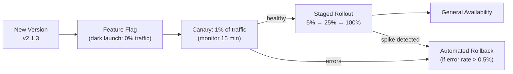

# How Do You Achieve 99.99% Uptime?

**Interview Question**: *"Your company's SLA is 99.99% availability. Walk me through how you would design for that."*

**Difficulty**: 🔴 Senior / Staff
**Asked by**: AWS, Google, Stripe, Cloudflare, Datadog, all companies with uptime SLAs
**Time to Answer**: 20–25 minutes

---

## Level 1 — Surface Answer (First 2 Minutes)

**One-line answer**: 99.99% means 52 minutes of downtime per year. Achieving it requires eliminating single points of failure, detecting failures fast (<30 s), and recovering automatically — through redundancy, health checks, circuit breakers, and chaos testing.

### Uptime Math

| SLA | Downtime/Year | Downtime/Month | Meaning |
|-----|--------------|----------------|---------|
| 99% (2 nines) | 3.65 days | 7.3 hours | One bad incident wipes the SLA |
| 99.9% (3 nines) | 8.7 hours | 43 minutes | Achievable with basic redundancy |
| 99.99% (4 nines) | 52 minutes | 4.3 minutes | Requires serious automation |
| 99.999% (5 nines) | 5.2 minutes | 26 seconds | Near-real-time failover, high cost |

Key insight: **99.99% allows ~4 minutes of downtime per month**. One unplanned deploy or DB failover can consume that entire budget.

### Key Decision Points

| Risk Area | Mitigation |
|-----------|-----------|
| Single point of failure | N+1 redundancy at every layer |
| Slow failure detection | Health checks every 10 s, alerting <1 min |
| Long recovery time | Automated failover, pre-warmed standby |
| Cascading failures | Circuit breakers, bulkheads, rate limits |
| Human error in deployments | Canary releases, feature flags, automated rollback |

---

## Level 2 — Deep Dive

### Approach A — Redundancy at Every Layer (Foundation)

Eliminate single points of failure before optimizing anything else.

**Rules**:
- **N+1 minimum**: If N units are needed to serve traffic, deploy N+1
- **Multi-AZ**: Spread across at least 2 Availability Zones (different power + network)
- **Multi-region** (for 99.99%+): At least 2 active regions. One region failure ≠ outage.

---

### Approach B — Automated Failure Detection + Recovery

Redundancy is useless if failover is manual. 99.99% requires failover in <60 seconds.

**Key numbers**:
- Health check interval: 10 seconds
- Unhealthy threshold: 2 consecutive failures = remove from pool
- DB automatic failover (AWS RDS Multi-AZ): 30–60 seconds
- Auto-scaling warmup: 60–120 seconds
- Target: traffic fully rerouted in <2 minutes after any single failure

---

### Approach C — Blast Radius Reduction (Bulkheads)

Even with redundancy, a cascading failure can take down healthy instances. Bulkheads prevent this.

If the ML service becomes slow (e.g., model loaded into memory), only the Recommendation bulkhead fills up. The Checkout and Search pools are unaffected. Without bulkheads, one slow dependency consumes all threads and takes down the whole application.

**Implementation**: Hystrix (Java), Resilience4j, Polly (.NET), or just separate goroutine pools in Go.

---

### Deployment Safety (Canary + Feature Flags)

Bad deploys cause 50%+ of outages at companies with good infra. Make deployments reversible.

**Rule**: No direct prod deploys. Every change goes through a canary phase with automated health gates.

---

### Error Budget Policy

99.99% = 52 min/year = ~4.3 min/month downtime budget.

| Severity | Allowed per Month | Response Time |
|----------|------------------|--------------|
| P0 (full outage) | 4.3 min total | 5 min to detect, 10 min to mitigate |
| P1 (partial, >10% users) | Budget shared | 15 min to detect, 30 min to mitigate |
| P2 (degraded, <10% users) | Doesn't count | 1 hour to detect, next business day |

**Error Budget Rule**: If the monthly budget is exhausted before month end, freeze all non-critical releases until next month. Engineering time goes to reliability work only.

---

### Chaos Engineering

You only know your system is reliable when you've deliberately broken it in production.

| Chaos Experiment | What It Tests |
|-----------------|--------------|
| Kill a random app server | Auto-scaling replaces within 2 minutes |
| Kill a Redis replica | Traffic fails over to primary with no error |
| Introduce 2 s latency on DB | Circuit breaker opens, service degrades gracefully |
| Block cross-AZ network | Traffic stays within healthy AZ |
| Simulate AZ outage | Multi-AZ failover completes in <60 s |

**Tools**: Chaos Monkey (Netflix), AWS Fault Injection Simulator, Gremlin, LitmusChaos (Kubernetes).

---

### Real Company Benchmarks

| Company | Uptime | Key Technique |
|---------|--------|--------------|
| AWS S3 | 99.99%+ | Erasure coding + multi-AZ, automated cell isolation |
| Google Search | 99.999%+ | Load shedding + graceful degradation (old cache) |
| Stripe | 99.9999% | Active-active multi-region, shadow writes, idempotency |
| Netflix | 99.99%+ | Chaos Monkey + multi-region active-active, fallback content |
| Cloudflare | 99.999%+ | Anycast edge, isolated PoPs, 270+ data centers |

---

### The SRE Golden Signals

Any 99.99% design must have dashboards on these four signals:

| Signal | What to Measure | Alert Threshold |
|--------|----------------|----------------|
| Latency | p50, p95, p99 response time | p99 > 500 ms |
| Traffic | Requests per second | Sudden drop >20% |
| Errors | 5xx / total requests | Error rate > 0.1% |
| Saturation | CPU, memory, queue depth | CPU > 80%, queue > 1K |

---

### Common Mistakes at Senior Interviews

1. **Confusing availability with uptime percentage**: Uptime = system is running. Availability = system is serving correct responses. A system can be "up" but serving errors.
2. **Ignoring the deployment risk**: Most outages come from bad deploys, not hardware failures. If you don't mention canary releases, you've missed half the answer.
3. **No failure budget**: Designing for 99.99% without an error budget and policy is theoretical. Explain how the organization enforces reliability.
4. **Single region "multi-AZ" is not enough for 99.99%**: AZs share the same regional control plane. An AWS region-level issue (rare but happens) requires multi-region.
5. **Not mentioning dependency availability**: Your system's availability is bounded by its dependencies. If a payment processor is 99.9%, your checkout can't be 99.99% without a fallback.

---

### References

> 📖 [Google SRE Book — Chapter 3: Embracing Risk](https://sre.google/sre-book/embracing-risk/) — Error budgets, SLOs, SLAs

> 📖 [AWS Well-Architected Framework — Reliability Pillar](https://docs.aws.amazon.com/wellarchitected/latest/reliability-pillar/welcome.html)

> 📺 [Netflix: Chaos Engineering — Building Confidence in System Behavior](https://www.youtube.com/watch?v=9599TXcaYvk)

> 📖 [The Availability Numbers Game — Increment Magazine](https://increment.com/reliability/reliability-by-the-numbers/)
