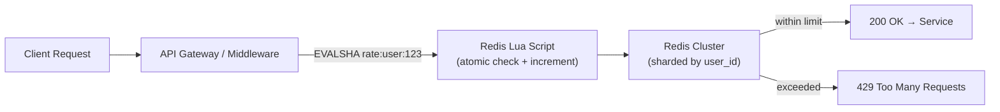
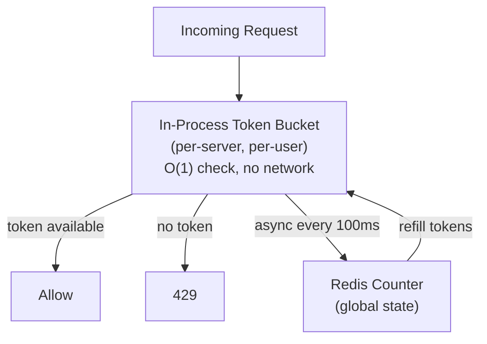
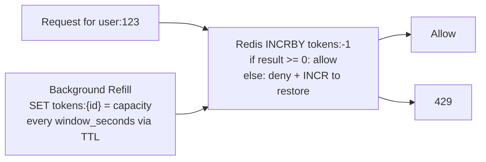

# Design a Distributed Rate Limiter

**Interview Question**: *"Design a rate limiter that can enforce per-user limits across 500 API servers. It must handle 500,000 RPS globally with under 5 ms overhead."*

**Difficulty**: 🔴 Senior
**Asked by**: Amazon, Cloudflare, Stripe, Twilio, GitHub, most API-heavy companies
**Time to Answer**: 20–25 minutes

---

## Level 1 — Surface Answer (First 2 Minutes)

**One-line answer**: A Redis Cluster stores atomic counters per user-key; every API server runs a Lua script that atomically checks-and-increments the counter with TTL, adding <2 ms overhead. For extreme scale, a local token bucket in-process is backed by async sync to Redis.

### Key Decision Points

| Concern | Strategy |
|---------|---------|
| Correctness (no double-counting) | Atomic Redis operations via Lua script |
| Low overhead | In-process local bucket + async Redis sync |
| Algorithm | Sliding window log or token bucket per use case |
| Key granularity | Per user, per IP, per tenant, per endpoint |
| Failure mode | Fail open vs fail closed (choose explicitly) |

### When to Use This

- Public APIs with tiered quotas (free: 100 req/min, paid: 10K req/min)
- Auth endpoints (prevent credential stuffing)
- SMS/email delivery APIs (cost control)
- Financial APIs (prevent fee abuse)

---

## Level 2 — Deep Dive

### Algorithm Comparison

| Algorithm | Burst? | Memory | Accuracy | When to Use |
|-----------|--------|--------|----------|------------|
| Fixed Window | Yes (window edge) | O(1) | Low | Simple counters, low stakes |
| Sliding Window Log | No | O(requests) | High | Audit-critical, low traffic |
| Sliding Window Counter | Small burst | O(1) | ~98% | **Best general choice** |
| Token Bucket | Yes (burst to max) | O(1) | High | APIs that allow bursting |
| Leaky Bucket | No | O(queue) | High | Smooth rate, no spikes |

---

### Approach A — Redis Lua Atomic Counter (Standard)

The most battle-tested approach. Used by Stripe, GitHub, and AWS API Gateway.



**Redis Lua Script (Sliding Window Counter)**

```lua
-- KEYS[1] = rate:user:{id}:{window}
-- ARGV[1] = limit, ARGV[2] = window_ms, ARGV[3] = now_ms
local key = KEYS[1]
local limit = tonumber(ARGV[1])
local window = tonumber(ARGV[2])
local now = tonumber(ARGV[3])

-- Remove expired entries
redis.call('ZREMRANGEBYSCORE', key, 0, now - window)
local count = redis.call('ZCARD', key)

if count < limit then
    redis.call('ZADD', key, now, now .. math.random())
    redis.call('EXPIRE', key, math.ceil(window / 1000))
    return {1, limit - count - 1}  -- allowed, remaining
else
    return {0, 0}  -- denied
end
```

The Lua script runs atomically in Redis — no race condition between check and increment. This is critical: a non-atomic check-then-set would allow bursts past the limit under concurrent load.

**Trade-offs**

| Pro | Con |
|-----|-----|
| Correct across all nodes | 1 Redis RTT per request (~1–2 ms) |
| Simple to understand and debug | Redis becomes a critical path dependency |
| Works for any algorithm | Memory grows with unique keys |

---

### Approach B — Two-Level: In-Process + Redis Sync

For systems where even 2 ms per request is too expensive (e.g., real-time bidding).



Each server holds a local bucket with a small quota fraction (e.g., 1/10 of total limit if there are 10 servers). A background goroutine/thread syncs to Redis every 100 ms. This makes the check zero-latency but allows slight over-limit bursts during the sync interval.

**Trade-offs**

| Pro | Con |
|-----|-----|
| Sub-microsecond hot path | Can exceed limit by up to (sync_interval × local_rate) |
| Survives Redis downtime (fail open) | Requires careful quota partitioning |
| Scales to millions of RPS | Not suitable for strict financial limits |

**When to pick B**: Ad-tech, gaming scoreboards, high-frequency endpoints where approximate limiting is fine.

---

### Approach C — Token Bucket with Redis INCR + Sliding Refill

Simple, widely used when you want to allow reasonable bursts.



```
Key: tokens:user:123
Value: remaining tokens (starts at capacity, e.g. 1000)
TTL: window_seconds (e.g. 60 s)

On request:
  tokens = DECR tokens:user:123
  if tokens < 0: INCR tokens:user:123; return 429
  else: allow

On first request (key expired/missing):
  SET tokens:user:123 {capacity-1} EX {window_seconds} NX
```

This is simpler but doesn't handle burst tracking as precisely as a sliding window.

---

### Handling Failure Modes

| Failure | Fail Open (default) | Fail Closed (strict) |
|---------|--------------------|--------------------|
| Redis down | Allow all requests | Block all requests |
| Redis slow (>5ms) | Allow + log | Block + alert |
| Redis partial partition | Allow per local state | Block |

**Rule**: Fail open for product APIs (better to over-serve than drop paying customers). Fail closed for auth and payment endpoints (security is paramount).

---

### Production Numbers

| Company | Scale | Approach | Storage |
|---------|-------|---------|---------|
| Cloudflare | 50M RPS | Two-level: local + central | Custom in-memory |
| Stripe | ~1M RPS | Redis Lua sliding window | Redis Cluster (3 shards) |
| GitHub API | ~10M req/hour | Redis token bucket | Redis with RDB snapshots |
| AWS API Gateway | Multi-region | Per-region Redis + DynamoDB | DynamoDB for persistence |
| Twilio | ~5M RPS | Redis Lua + Kafka for audit | Redis + S3 audit trail |

---

### Key Space Design

```
rate:{tenant}:{user_id}:{endpoint}:{window}

Examples:
rate:acme:user:123:POST:/checkout:60       → per-user endpoint rate
rate:acme:ip:1.2.3.4:global:1             → per-IP global (1-second window)
rate:acme:tenant:global:60                → per-tenant global quota
```

Use consistent hashing to assign rate keys to Redis shards — keys for the same user should always land on the same shard to avoid distributed aggregation.

---

### Common Mistakes at Senior Interviews

1. **Proposing a local counter without distributed coordination**: Works per server, but a user can send 10× the limit by hitting 10 different servers.
2. **Non-atomic check and set**: Using GET + SET is a race condition. Always use Lua or Redis atomic commands (INCR, GETSET).
3. **Not discussing the failure mode**: What happens when Redis goes down? Interviewers probe this specifically.
4. **Forgetting rate limit headers**: Production systems return `X-RateLimit-Limit`, `X-RateLimit-Remaining`, `Retry-After` headers — mention this.
5. **Not distinguishing algorithm by use case**: Token bucket for bursty APIs, sliding window for strict quotas, leaky bucket for smooth downstream protection.

---

### References

> 📺 [Rate Limiter System Design — ByteByteGo](https://www.youtube.com/watch?v=FU4WlwfS3G0)

> 📖 [Cloudflare — How Cloudflare Implements Rate Limiting](https://blog.cloudflare.com/counting-things-a-lot-of-different-things/)

> 📖 [Stripe — Designing Robust and Predictable APIs with Idempotency](https://stripe.com/blog/idempotency)

> 📖 [Redis Documentation — EVAL / Lua scripting](https://redis.io/docs/manual/programmability/eval-intro/)
