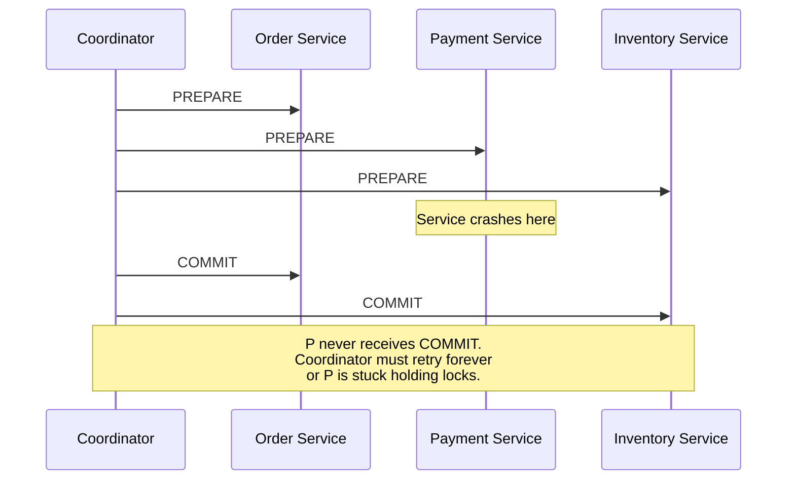
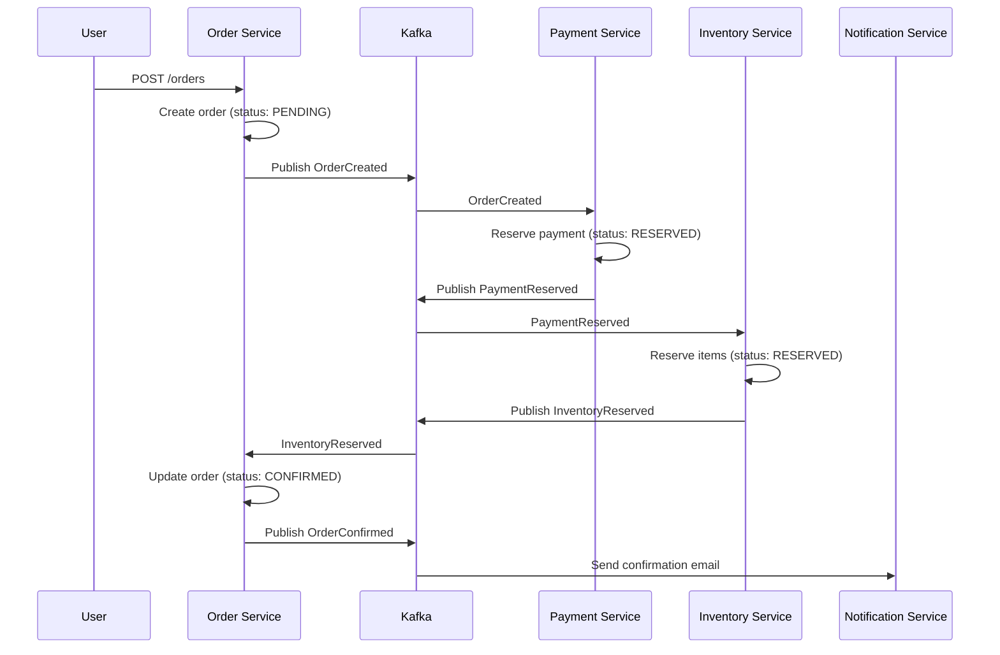
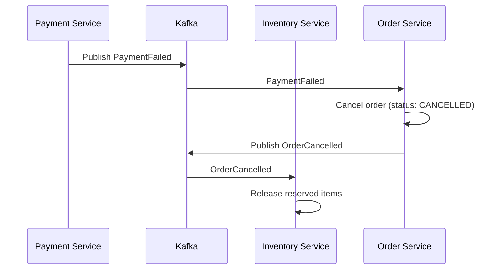
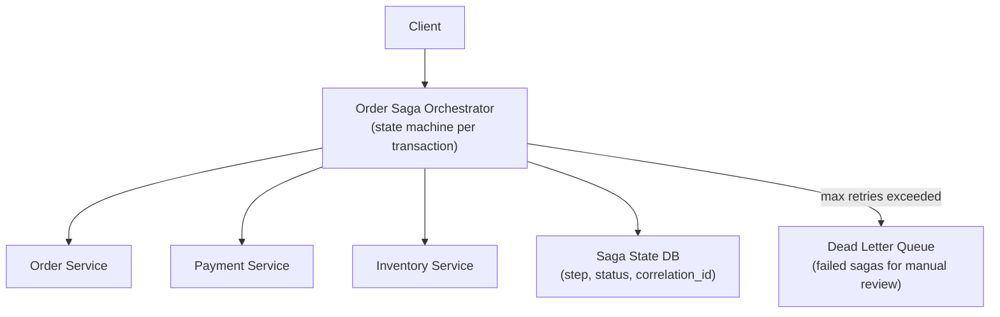
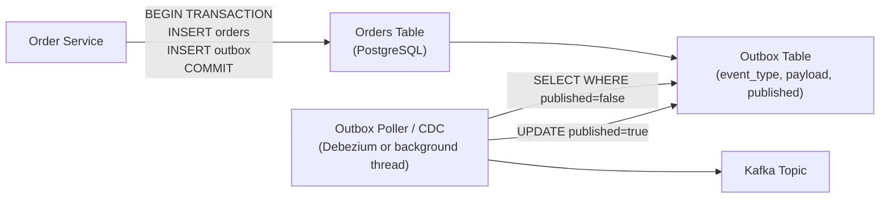

# How Do You Handle Distributed Transactions?

**Interview Question**: *"You have an Order Service, Payment Service, and Inventory Service. A user places an order — how do you ensure all three are updated consistently, or none are?"*

**Difficulty**: 🔴 Senior / Staff
**Asked by**: Amazon, Stripe, Uber, Shopify, DoorDash, fintech companies
**Time to Answer**: 20–30 minutes

---

## Level 1 — Surface Answer (First 2 Minutes)

**One-line answer**: In a distributed system, 2-phase commit (2PC) is fragile and slow. Instead, use the Saga pattern: each service executes a local transaction and publishes an event; on failure, compensating transactions undo prior steps. Idempotency keys ensure exactly-once semantics despite retries.

### Key Decision Points

| Approach | Consistency | Availability | Complexity | When to Use |
|----------|------------|-------------|-----------|------------|
| 2-Phase Commit (2PC) | Strong (ACID) | Low (blocking) | Medium | Small clusters, short transactions |
| Saga (Choreography) | Eventual | High | Low (for simple) | Simple flows, high throughput |
| Saga (Orchestration) | Eventual | High | Medium | Complex flows needing central visibility |
| Outbox Pattern | Eventual | High | Low | Reliable event publishing from any service |
| TCC (Try-Confirm-Cancel) | Near-strong | Medium | High | Booking, reservations, escrow |

---

## Level 2 — Deep Dive

### Why 2PC Fails at Scale



**2PC problems at scale**:
- **Blocking**: All participants hold locks during the prepare phase. One slow service blocks everything.
- **Coordinator SPOF**: Coordinator crashes after PREPARE → participants stuck indefinitely.
- **Network partitions**: PREPARE received, COMMIT not — ambiguous state.
- **Latency**: Requires 2 round-trips across network before commit. At 10 ms RTT × 2 = 20 ms minimum.

2PC is viable for 2–3 services on the same network with short transactions (e.g., cross-database writes within one data center). It does not scale to internet-scale microservices.

---

### Approach A — Saga Pattern: Choreography

Each service subscribes to events and reacts by executing local transactions or publishing new events.



**Compensating transactions (rollback path)**:



**Trade-offs**

| Pro | Con |
|-----|-----|
| Loose coupling — services don't know each other | Hard to track where a saga is in its lifecycle |
| High availability — no central coordinator | Debugging failures requires tracing event chain |
| Scales well (Kafka handles millions of events/sec) | Compensating transactions must be designed for every step |
| Services fail independently | No single view of transaction state |

**When to pick choreography**: Simple linear flows (order → payment → inventory), small number of steps (< 5), teams prefer loose coupling.

---

### Approach B — Saga Pattern: Orchestration

A central Saga Orchestrator service drives the workflow and handles failures.



The orchestrator maintains a state machine:

```
States: PENDING → PAYMENT_RESERVED → INVENTORY_RESERVED → CONFIRMED
                                                     ↓ (failure)
                              COMPENSATING → PAYMENT_RELEASED → CANCELLED
```

**Each step in the orchestrator**:

```
function processOrderSaga(sagaId, event):
  saga = db.load(sagaId)

  switch saga.state:
    case PENDING:
      payment.reserve(saga.orderId, saga.amount)
      saga.state = AWAITING_PAYMENT
      db.save(saga)

    case PAYMENT_RESERVED:
      inventory.reserve(saga.orderId, saga.items)
      saga.state = AWAITING_INVENTORY
      db.save(saga)

    case INVENTORY_RESERVED:
      order.confirm(saga.orderId)
      saga.state = CONFIRMED
      db.save(saga)

    case PAYMENT_FAILED:
      order.cancel(saga.orderId)
      saga.state = CANCELLED
      db.save(saga)
```

**Trade-offs**

| Pro | Con |
|-----|-----|
| Single view of transaction state | Orchestrator is a bottleneck and SPOF (mitigate with HA) |
| Easy to add retry logic, timeouts | Higher coupling — orchestrator knows all services |
| Easier debugging (one place to check) | Orchestrator becomes complex for many workflow types |
| Better visibility for ops teams | Latency added per step (orchestrator is on the hot path) |

**When to pick orchestration**: Complex workflows (>5 steps), workflows that need human approval, regulatory/compliance workflows where audit trails are required.

---

### Approach C — Outbox Pattern (Reliable Event Publishing)

Both Choreography and Orchestration require that when a service writes to its DB, it also reliably publishes an event. The Outbox Pattern solves this atomically.



Without the Outbox Pattern:
```
// WRONG — non-atomic, event can be lost
db.insert(order)           // succeeds
kafka.publish(OrderCreated) // crashes here → event never sent
```

With the Outbox Pattern:
```
// CORRECT — atomic
BEGIN TRANSACTION
  db.insert(order, status=PENDING)
  db.insert(outbox, {type: "OrderCreated", payload: {...}})
COMMIT
// Background poller reads outbox and publishes to Kafka
// If poller crashes, it restarts and re-reads unpublished events
```

**Tools**: Debezium (CDC from Postgres/MySQL binlog), Transactional Outbox libraries (e.g., Eventuate Tram), or a simple background polling job.

---

### Idempotency — The Critical Companion

Sagas + retries require every operation to be idempotent. The same message may be delivered more than once (Kafka at-least-once delivery).

```
// Payment reservation with idempotency key
function reservePayment(orderId, amount, idempotencyKey):
  existing = db.find(idempotency_keys, key=idempotencyKey)
  if existing:
    return existing.result  // deduplicate: return previous result

  result = chargeCard(amount)
  db.insert(idempotency_keys, {key: idempotencyKey, result: result})
  return result
```

**Idempotency key design**:
- Use the originating `orderId` or `sagaId` as the key
- Store with TTL (e.g., 7 days for payments)
- Return the stored result if key already exists (don't charge again)

---

### Production Numbers (Real Systems)

| Company | Pattern | Scale | Key Decision |
|---------|---------|-------|-------------|
| Amazon | Saga (orchestration) | Billions of orders/year | Each order is a saga with 10+ steps |
| Uber | Saga (choreography) via Cadence | Millions of rides/day | Workflow engine handles timeouts + retries |
| Stripe | Idempotency keys + 2PC within region | ~1M payments/sec | Strong consistency within region, async cross-region |
| DoorDash | Choreography via Kafka | ~1M orders/day | Event-driven with explicit compensation handlers |
| Shopify | Outbox pattern + Sidekiq | Millions of checkouts/day | Outbox ensures no event loss during deploys |

---

### Common Mistakes at Senior Interviews

1. **Proposing 2PC for microservices**: Immediately signals unfamiliarity with distributed systems. 2PC works for 2 DBs in the same data center, not 5 services across the internet.
2. **No compensating transactions**: Saying "use a Saga" without explaining what happens on failure misses the point. Every forward step needs a defined rollback step.
3. **Assuming Kafka guarantees exactly-once end-to-end**: Kafka supports exactly-once delivery *within Kafka* (with transactions). Your consumers still need idempotency for exactly-once processing.
4. **Not mentioning idempotency**: At-least-once delivery + no idempotency = duplicate charges. This is one of the most common production bugs in distributed systems.
5. **Using choreography for complex workflows**: 8+ step sagas with choreography become impossible to debug. Orchestration provides the visibility complex flows need.

---

### References

> 📖 [Chris Richardson — Saga Pattern](https://microservices.io/patterns/data/saga.html) — The definitive reference on Saga choreography and orchestration

> 📖 [Stripe — Idempotency Keys](https://stripe.com/blog/idempotency) — How Stripe uses idempotency to prevent double charges

> 📺 [Distributed Transactions & Sagas — ByteByteGo](https://www.youtube.com/watch?v=_avjgADTCZE)

> 📖 [Debezium — Change Data Capture for the Outbox Pattern](https://debezium.io/blog/2019/02/19/reliable-microservices-data-exchange-with-the-outbox-pattern/)

> 📖 [Uber Cadence — Fault-Oblivious Stateful Code](https://eng.uber.com/cadence-workflow-engine/) — How Uber orchestrates workflows at scale
