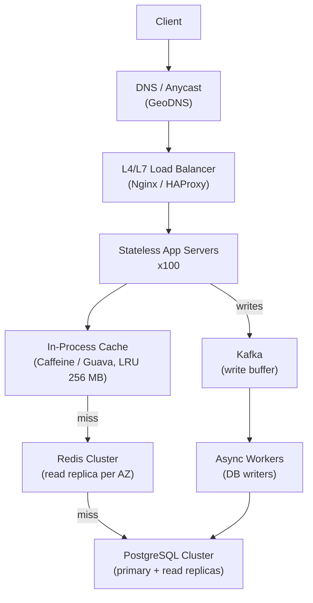
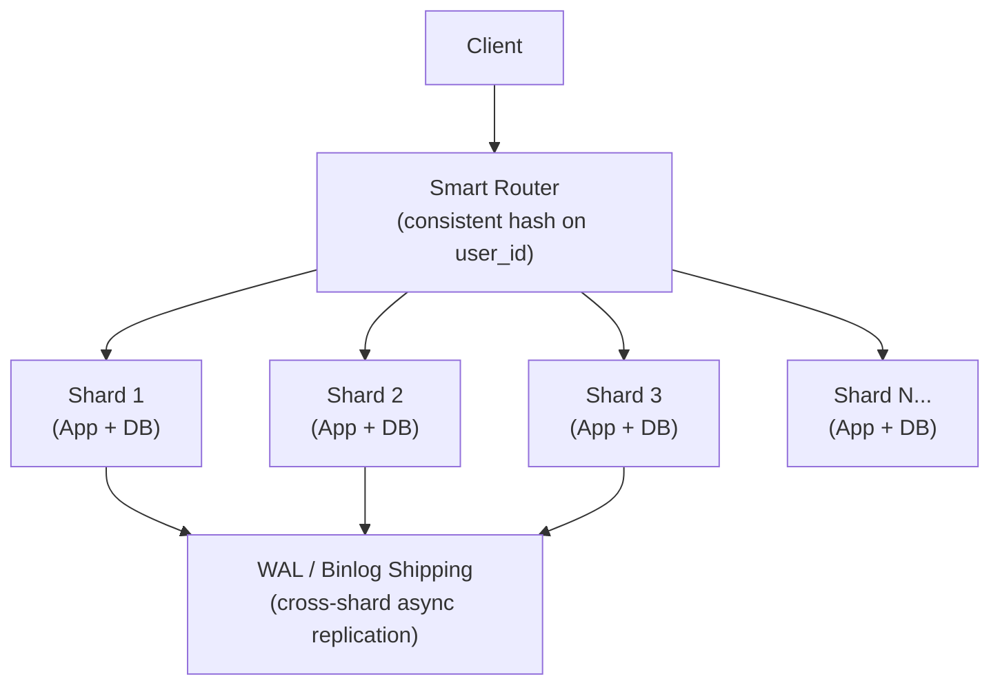
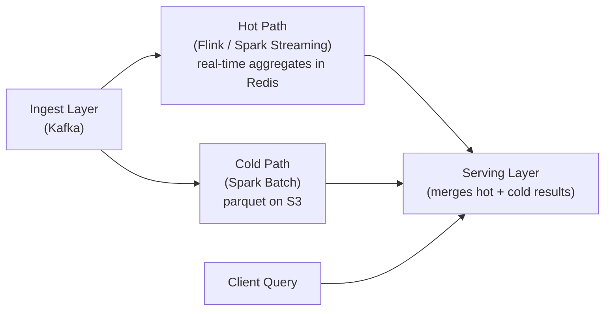

# Design a High-Throughput, Low-Latency System (1M RPS)

**Interview Question**: *"Design a system that can handle 1 million requests per second with sub-100ms p99 latency."*

**Difficulty**: 🔴 Senior / Staff
**Asked by**: Google, Meta, Amazon, Netflix, Stripe
**Time to Answer**: 20–30 minutes

---

## Level 1 — Surface Answer (First 2 Minutes)

**One-line answer**: Horizontally scaled stateless services behind a load balancer, with an in-memory cache (Redis) as the primary read path and async writes via a message queue to absorb bursts.

### Key Decision Points

| Concern | Strategy |
|---------|---------|
| Horizontal scale | Stateless app servers + consistent-hash load balancing |
| Read hot path | Redis in-process cache → Redis cluster → DB |
| Write durability | Write-ahead log + async flush (Kafka → DB) |
| Fan-out / spikes | Queue-based buffering + autoscaling |
| Latency budget | Keep serialization lean (Protobuf or MessagePack, not JSON) |

### When to Use This Approach

- Ad-serving, real-time bidding (RTB)
- Payment authorization endpoints
- Social feed ranking and serving
- Gaming leaderboards
- DNS, CDN edge nodes

---

## Level 2 — Deep Dive

### Back-of-Envelope Math

Before designing, anchor the problem:

```
1,000,000 RPS
Average request size: 1 KB
Peak write rate: 20% of traffic = 200,000 writes/sec
Average DB row: 256 bytes

Storage growth: 200,000 * 256 B = ~50 MB/sec → ~4 TB/day
Network ingress: 1M * 1 KB = 1 GB/sec (10 Gbps NIC needed)
Servers needed (10K RPS per server): 100 app servers
Cache hit ratio target: 95% → DB RPS = 50,000
```

A single PostgreSQL primary saturates around 50,000 simple reads/sec — 95% cache hit ratio just barely makes one DB work. Without cache, you need 20+ DB shards.

---

### Approach A — Layered Cache + Stateless Compute

The most common answer. Works for read-heavy systems (90%+ reads).



**Trade-offs**

| Pro | Con |
|-----|-----|
| Simple operationally | Stale reads (eventual consistency) |
| Cache absorbs 95%+ of reads | Cold-start problem on cache miss storm |
| Kafka decouples write spikes | Extra latency on uncached reads |
| Each layer independently scalable | 3-hop latency on cache misses |

**When to pick A**: Read-heavy (product catalog, profile data, leaderboards).

---

### Approach B — Shared-Nothing + Consistent Hashing

For write-heavy systems (payments, event tracking) where caching doesn't help much.



Each shard owns a key range. Requests for `user_id=42` always go to Shard 2. No cross-shard coordination.

**Trade-offs**

| Pro | Con |
|-----|-----|
| No distributed lock or coordination | Hot shards if user distribution skews |
| Consistent single-shard write latency | Resharding requires data migration |
| Works at any write ratio | Cross-shard queries need scatter-gather |
| Isolates blast radius | Harder to rebalance |

**When to pick B**: Write-heavy, user-partitioned data (payments, user events, IoT telemetry).

---

### Approach C — Lambda Architecture (Hot + Cold Path)

For analytics and mixed real-time/batch queries.



**When to pick C**: Dashboards, fraud scoring, ad attribution — need both fast recent data and accurate historical data.

---

### Latency Optimization Checklist

| Layer | Technique | Typical Gain |
|-------|-----------|-------------|
| Network | HTTP/2, keep-alive, connection pool | 10–30 ms |
| Serialization | Protobuf vs JSON | 2–5x CPU reduction |
| App | Async I/O (non-blocking), thread pool tuning | 30–50% throughput |
| Cache | In-process L1 (Caffeine) before Redis | 0.5 ms → 0.05 ms |
| DB | Read replicas, covering indexes, prepared statements | 5–10x read throughput |
| OS | TCP tuning (SO_REUSEPORT, large send buffer) | 15–20% on small packets |

---

### Production Numbers (Real Systems)

| System | RPS | P99 Latency | Key Technique |
|--------|-----|------------|--------------|
| Cloudflare DNS | 46M RPS (peak) | <1 ms | Anycast, in-memory hash, no DB |
| Stripe payments | ~1M auth/sec | <50 ms p99 | Stateless + Redis + Postgres shards |
| Discord messages | 5M msgs/sec | <50 ms | Cassandra for fan-out, Elixir GenServer |
| Twitter timeline | ~300K RPS | <100 ms | Precomputed fan-out in Redis |
| DoorDash ETA | ~500K RPS | <80 ms | Read replica fleet + in-process cache |

---

### Common Mistakes at Senior Interviews

1. **Starting with microservices**: At 1M RPS the bottleneck is almost never service boundaries — it's the database and serialization. Don't over-engineer.
2. **Ignoring the cache warming problem**: A fresh deploy or a cache failure causes a thundering herd to the DB. Always have a rate limiter protecting DB from cold starts.
3. **Missing the write path**: Most candidates design the read path and say "writes go to DB." At 200K writes/sec, a single DB cannot absorb that. You need buffering.
4. **Forgetting connection pooling**: 100 app servers × 100 threads = 10,000 DB connections. PostgreSQL max_connections defaults to 100. Use PgBouncer.
5. **Not talking about observability**: No mention of metrics, tracing, alerting = red flag at senior level.

---

### References

> 📺 [How Discord Stores Billions of Messages](https://discord.com/blog/how-discord-stores-billions-of-messages) — Cassandra + hot/cold path design

> 📖 [Stripe's Payment Infrastructure](https://stripe.com/blog/payment-api-design) — Idempotency keys + sharded Postgres

> 📺 [Systems Design: How to Design a Rate Limiter](https://www.youtube.com/watch?v=FU4WlwfS3G0) — ByteByteGo

> 📖 [High Performance Browser Networking — Ilya Grigorik](https://hpbn.co/) — TCP and HTTP optimization fundamentals
