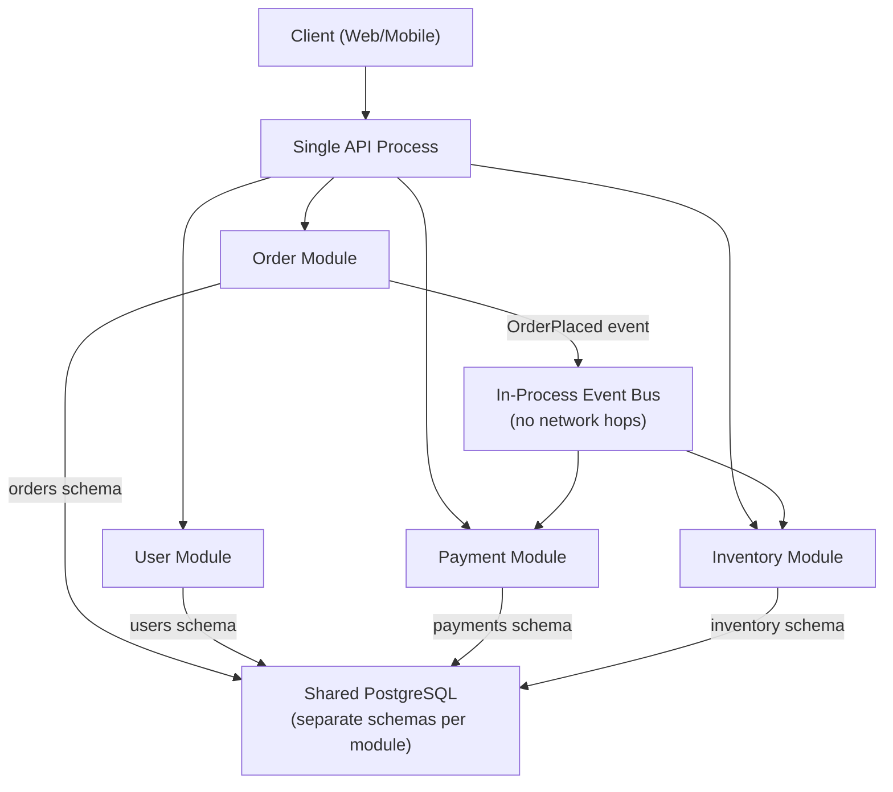
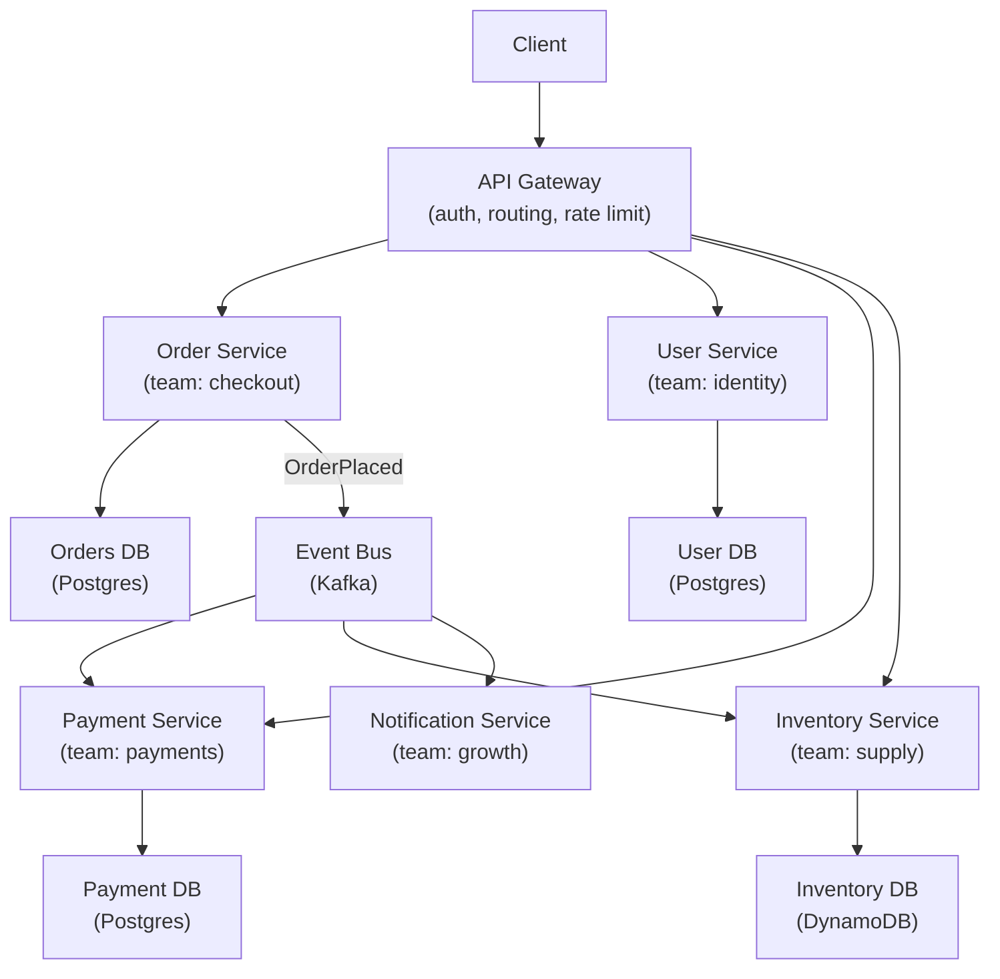
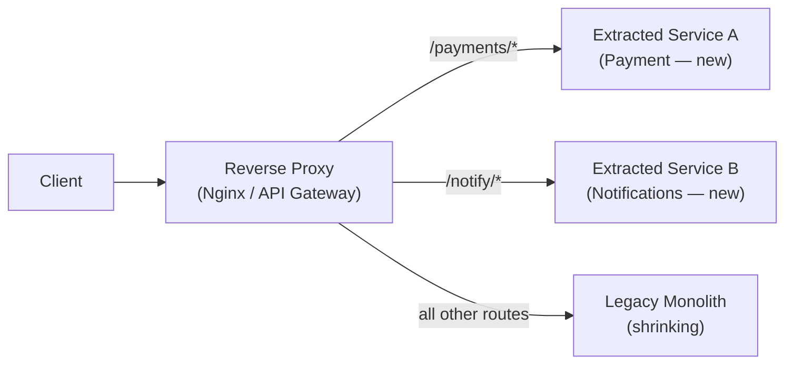

# Microservices vs Monolith — When to Choose Which?

**Interview Question**: *"Your team is starting a new product. Should you build a monolith or microservices? What factors drive your decision?"*

**Difficulty**: 🔴 Senior / Staff
**Asked by**: Thoughtworks, Shopify, Airbnb, Netflix, Stripe, most engineering director rounds
**Time to Answer**: 15–20 minutes

---

## Level 1 — Surface Answer (First 2 Minutes)

**One-line answer**: Start with a modular monolith. Extract microservices only when you have a clear scaling or team-autonomy problem that the monolith cannot solve — premature decomposition is one of the most expensive architectural mistakes.

### Key Decision Points

| Factor | Favour Monolith | Favour Microservices |
|--------|----------------|---------------------|
| Team size | <20 engineers | >50 engineers across domains |
| Product maturity | Early/unknown boundaries | Stable, well-understood domains |
| Scaling needs | Uniform scaling | Heterogeneous: one component 100× others |
| Deployment cadence | Weekly releases fine | Teams need independent deploy cycles |
| Operational maturity | No dedicated platform team | Dedicated SRE / platform team |
| Data model | Highly relational, joins everywhere | Domain-isolated data, event-driven |

### When to Use This Approach

- **Monolith**: New product, <2 years old, team < 30, revenue not proven
- **Modular monolith**: Growth phase, team 20–80, clear domain boundaries, not enough ops maturity for microservices
- **Microservices**: Scale-up phase, team > 80, distinct scaling profiles per domain, separate deploy cycles required

---

## Level 2 — Deep Dive

### Approach A — Modular Monolith (The Overlooked Middle Ground)

A single deployable unit with hard module boundaries enforced by code structure and import rules. This is the right default for most teams.



**Key rules for a modular monolith**:
- Modules communicate only through public interfaces, never through direct DB joins across schemas
- Use an in-process event bus for cross-module side effects
- Enforce module boundaries with linting rules or package visibility
- Each module has its own DB schema or table prefix

**Trade-offs**

| Pro | Con |
|-----|-----|
| Simple deployments (one artifact) | Single process: one OOM kills everything |
| No network hops between modules | Must scale entire app for one hot module |
| Easy debugging, distributed tracing trivial | Monorepo merges can slow large teams |
| Can extract services later from clean boundaries | Language/framework is shared across modules |

**When to pick A**: First 1–3 years of a product, team size < 50, deployment frequency not a bottleneck.

---

### Approach B — Microservices (When Team Topology Demands It)

Conway's Law: *"Organizations design systems that mirror their communication structure."* Microservices only make sense when your team is structured around service ownership.



**Critical requirements** before going microservices:
1. **Platform team**: Kubernetes, service mesh, centralized logging, distributed tracing
2. **Stable domain boundaries**: Frequent boundary changes = expensive cross-service refactors
3. **Each team owns full lifecycle**: A team that can't deploy independently gains nothing from microservices

**Trade-offs**

| Pro | Con |
|-----|-----|
| Teams deploy independently | Distributed system problems: network partitions, partial failures |
| Scale services independently | Distributed tracing required to debug issues |
| Technology heterogeneity per service | Service discovery, load balancing, auth complexity |
| Fault isolation: one service fails, others continue | Integration testing becomes significantly harder |
| Smaller codebase per service | Operational overhead: N × (deployment pipeline + monitoring + on-call) |

---

### Migration Path: Monolith → Microservices

If you must migrate, use the **Strangler Fig Pattern** — never a "big bang rewrite".



**Migration order** — extract in this sequence to minimize risk:

| Phase | What to Extract | Why |
|-------|----------------|-----|
| 1 | Read-only reporting/analytics | No write risk, safe to duplicate |
| 2 | Leaf services (notifications, email) | No downstream dependencies |
| 3 | High-traffic hotspots (search, catalog) | Clear scaling benefit |
| 4 | Core domains (orders, payments) | Most risky — do last |

---

### Real Company Decisions

| Company | Decision | Outcome |
|---------|---------|---------|
| **Amazon (2001–2002)** | Forced SOA / microservices across all teams | Enabled AWS to be built on the same APIs |
| **Netflix (2008–2012)** | Migrated from monolith after DVD-shipping DB corruption | 1000+ microservices, 150+ engineering teams |
| **Shopify** | Kept modular monolith until 2019 | "Majestic Monolith" blog post — intentional choice |
| **Stack Overflow** | Still a monolith in 2023 | 2.4B page views/month, 9 app servers — monolith scales |
| **Segment (2017)** | Broke monolith into microservices → broke back to monolith | Microservices increased cost and complexity without benefit |
| **Prime Video (2023)** | Merged distributed Lambda-based services into monolith | 90% cost reduction, simpler operations |

**Lesson from Segment and Prime Video**: Microservices have a real operational cost. The architecture must earn its complexity.

---

### The "Modular Monolith First" Decision Framework

```
Is the team > 50 engineers with distinct domain ownership?
  No → Modular Monolith
  Yes ↓

Do different modules have 10x+ different scaling requirements?
  No → Modular Monolith
  Yes ↓

Does the platform team exist (Kubernetes + observability + CI/CD)?
  No → Modular Monolith (build platform first)
  Yes ↓

Are domain boundaries stable (not changing frequently)?
  No → Modular Monolith (wait for stability)
  Yes ↓

→ Microservices (with Strangler Fig migration)
```

---

### Common Mistakes at Senior Interviews

1. **Recommending microservices by default**: Many candidates assume "microservices = good architecture." Experienced engineers know the cost. Defending a modular monolith shows maturity.
2. **Not mentioning Conway's Law**: Team structure drives architecture. A 5-person team with microservices is an organizational anti-pattern, not a technical one.
3. **Missing the database problem**: Microservices with a shared DB is the worst of both worlds. Every service needs its own data store.
4. **No mention of the platform team**: Microservices need Kubernetes, service mesh, centralized logging, and distributed tracing. Without this, teams spend 50% of time on ops.
5. **Ignoring the Strangler Fig pattern**: Saying "rewrite the monolith" is a red flag. Incremental extraction is the only safe path.

---

### References

> 📖 [Martin Fowler — Microservices](https://martinfowler.com/articles/microservices.html) — The canonical article defining microservices

> 📖 [Shopify — Deconstructing the Monolith](https://shopify.engineering/deconstructing-monolith-designing-software-maximizes-developer-productivity) — The case for the modular monolith

> 📺 [Prime Video — Scaling Up the Prime Video Audio/Video Monitoring Service](https://www.primevideotech.com/video-streaming/scaling-up-the-prime-video-audio-video-monitoring-service-and-reducing-costs-by-90) — Why they went back to monolith

> 📖 [Team Topologies — Matthew Skelton & Manuel Pais](https://teamtopologies.com/) — How team structure should drive service boundaries
