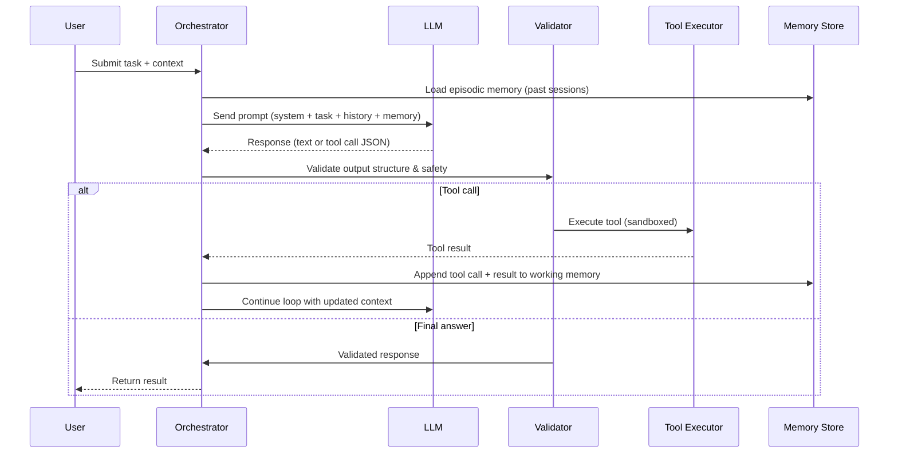
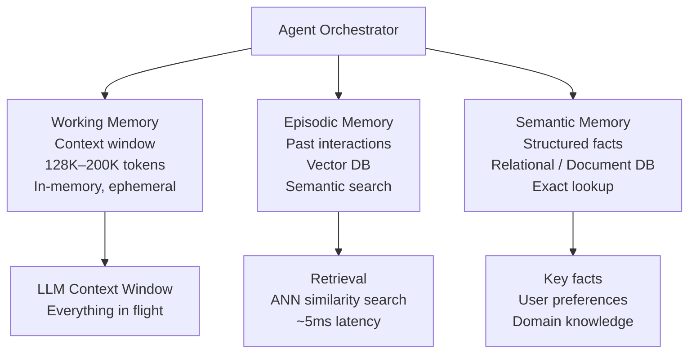
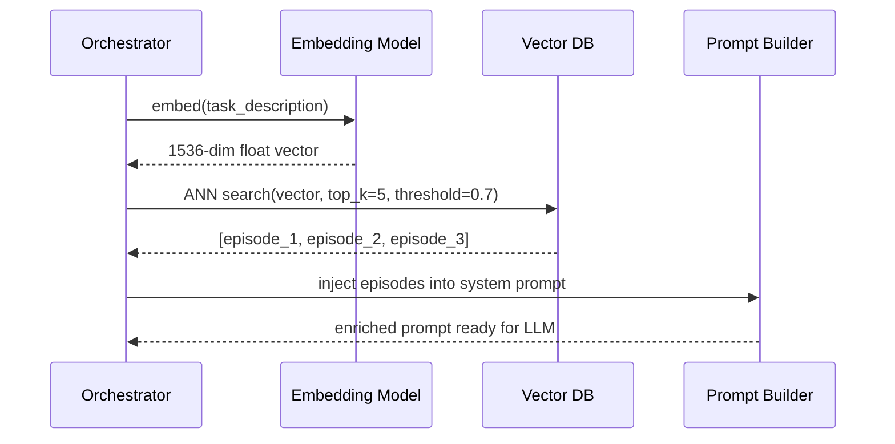

# Agent Loop Design

**Interview Question:** "Design a system where an AI agent can autonomously complete multi-step tasks — for example, a coding assistant that can read a codebase, identify bugs, write fixes, and run tests."

---

## Clarifying Questions

Before jumping into architecture, ask these to scope the design:

1. **What types of tasks?** Read-only research tasks vs tasks that mutate state (write files, call APIs) have very different safety requirements.
2. **What's the maximum number of steps?** Unbounded loops are dangerous. Is 10 steps fine, or do we need 100+?
3. **What's the latency tolerance?** Autonomous agents are slow (seconds to minutes). Is this background or interactive?
4. **What tools does the agent have access to?** File system? External APIs? Code execution? Each adds a new attack surface.
5. **What happens on failure?** Should the agent retry, surface an error, or ask the user for clarification?
6. **Is there a human-in-the-loop gate?** Can the agent act autonomously on destructive actions, or does it need approval?
7. **How do we measure success?** The agent completing the task vs the task being completed correctly are different things.

---

## High-Level Architecture

### Perception-Action Loop



### Memory Architecture



---

## Key Components

### 1. Orchestrator

The orchestrator is the control plane of the agent. It manages the loop:

```
while not done and steps < MAX_STEPS:
    response = llm.complete(build_prompt(task, history, memory))

    if response.type == "tool_call":
        result = tool_executor.run(response.tool, response.args)
        history.append(tool_call=response, result=result)
    elif response.type == "final_answer":
        done = True
        return response.content
    else:
        # malformed output — retry or abort
        handle_error(response)
```

**Stateless vs Stateful Orchestrator:**

| Dimension | Stateless | Stateful |
|-----------|-----------|---------|
| Scaling | Trivial — any instance handles any request | Harder — sticky sessions or external state |
| Cost | Re-fetches memory on every call | Keeps warm state in memory |
| Fault tolerance | High — any instance can resume | Session lost on crash without checkpointing |
| Latency | Slightly higher (memory lookup on each step) | Lower (state already loaded) |
| Recommendation | Prefer for most use cases | Only for very long-running agents (>10 min) |

**Decision:** Default to stateless. Externalize all state to Redis (working memory) and vector DB (episodic). This enables horizontal scaling and crash recovery.

### 2. Context Window Management

The LLM's context window is finite. With GPT-4o at 128K tokens, you must manage what goes in:

- **System prompt**: ~1K–4K tokens (instructions, persona, tool schemas)
- **Task description**: ~0.5K–2K tokens
- **Conversation history**: grows unboundedly — must truncate
- **Retrieved memory**: ~2K–8K tokens
- **Tool results**: can be large (e.g., file contents, API responses)

**Truncation strategies:**

1. **FIFO truncation**: Drop oldest history first. Simple but loses early context that may matter.
2. **Summarize and compress**: Periodically summarize old history using a cheaper LLM call. Adds latency.
3. **Importance scoring**: Mark certain messages as "keep" (user's original goal) and drop others. More complex.
4. **Sliding window with overlap**: Keep the last N messages plus the original task. Good default.

### 3. Memory Types

**Working Memory** — The current context window. Everything the agent "sees" right now. Ephemeral: gone when the session ends.

**Episodic Memory** — Long-term storage of past interactions, indexed by embedding similarity. When a new task arrives, retrieve the 3–5 most relevant past sessions. Implementation: embed the task → nearest neighbor search in vector DB → inject retrieved episodes into prompt.

**Semantic Memory** — Structured facts about the world or the user (preferences, domain knowledge, user profile). Implementation: relational or document DB. Looked up by exact key or structured query, not vector similarity.

### 4. Tool Executor

The tool executor is the agent's interface to the outside world. Safety is paramount.

**Tool classification:**

| Class | Examples | Safety gate |
|-------|----------|------------|
| Read-only | Read file, search web, query DB | None (but validate schema) |
| Write | Create file, post API, send message | Idempotency key + audit log |
| Destructive | Delete file, transfer money, admin action | Human confirmation required |

**Execution model:**
- All tool calls run in a **sandboxed environment** (e.g., Docker container with restricted filesystem and network)
- Set a **per-tool timeout** (default: 30s)
- **Allowlist** only approved tools — the agent cannot invent new tools at runtime
- Log every tool call with inputs, outputs, and timing

### 5. Safety Limits

| Limit | Default | Rationale |
|-------|---------|-----------|
| Max steps per task | 25 | Prevent infinite loops |
| Max tokens per task | 500K | Cost control |
| Max wall-clock time | 10 minutes | Prevent hung agents |
| Max parallel tool calls | 5 | Prevent resource exhaustion |
| Max output size per tool | 50K tokens | Prevent context overflow |

---

## Memory Retrieval Deep Dive

When the agent starts a new task, it retrieves relevant context from episodic memory:



**Retrieval quality matters.** Injecting irrelevant episodes wastes context and can confuse the model. Use a similarity threshold to filter low-quality matches.

---

## Trade-offs

| Decision | Option A | Option B | Recommendation |
|----------|----------|----------|----------------|
| Orchestrator statefulness | Stateless (external state) | Stateful (in-process) | Stateless for most; stateful only for sub-minute tasks where latency matters |
| Memory retrieval | Embed every lookup | Cache embeddings | Cache embeddings — re-embedding the same task is wasteful |
| Tool execution | In-process | Sandboxed subprocess | Always sandboxed for any code execution or filesystem access |
| Loop termination | LLM decides when done | Max steps hard limit | Both — LLM signals done + hard limit as safety net |
| Context truncation | FIFO drop | Summarize + compress | Summarize for long-running agents, FIFO for short tasks |

---

## Real-World Examples

- **Claude Code (Anthropic)**: Uses a perception-action loop where Claude reads files, runs bash commands, and edits code. The orchestrator is the user's terminal process; state is the filesystem itself.
- **GitHub Copilot Workspace**: Allows Copilot to plan a multi-file change, execute it, and run CI. Uses explicit plan-then-execute phases with human review gates.
- **AutoGPT (2023)**: Early open-source autonomous agent. Demonstrated unbounded loops as a real problem — tasks would spiral endlessly without a max-steps limit.
- **LangGraph (LangChain)**: Framework for building stateful agent graphs with explicit nodes for each step. Solves the "stateless orchestrator" problem with a checkpointed state machine.
- **Cursor Agent Mode**: Reads the codebase, identifies the right files to edit, applies changes, and runs lint/tests — all in a bounded loop with the user as final approver.

---

## Common Pitfalls

1. **No max-steps limit.** The agent enters an infinite loop trying to fix a bug that requires information it can never retrieve. Cost spikes and task never completes.

2. **Context window overflow.** Tool results (e.g., a 5000-line file) fill the context window, leaving no room for the LLM's reasoning. Always truncate tool outputs to a max size.

3. **Treating all tools the same.** Allowing the agent to execute code with the same safety level as reading a file is a serious mistake. Classify tools and gate destructive ones.

4. **Stateful orchestrator without checkpointing.** If the orchestrator crashes mid-task, all progress is lost. Either go stateless or implement checkpoint/resume.

5. **No episodic memory.** Every task starts from scratch. The agent repeatedly makes the same mistakes and can't learn user preferences across sessions.

6. **Unvalidated tool outputs.** The agent trusts raw tool output (e.g., a malicious webpage in a web search result). This is the entry point for indirect prompt injection.

7. **Hardcoded system prompt with no versioning.** When you update the system prompt, you can't tell which tasks used which version. Prompt versioning is essential for debugging regressions.

8. **No cost tracking per task.** You discover after the fact that 5% of tasks consume 50% of your token budget (usually the ones that loop). Per-task cost tracking catches this.

---

## Key Numbers to Memorize

| Metric | Value |
|--------|-------|
| GPT-4o context window | 128K tokens |
| Claude 3.5 Sonnet context window | 200K tokens |
| Typical tool call latency | 200ms – 2s |
| LLM API p99 latency (GPT-4o) | 5 – 30s |
| Recommended max steps for most agents | 25 |
| Episodic memory retrieval latency (vector DB) | 5 – 20ms |
| Cost of GPT-4o at 500K tokens/task | ~$1–$4 per task |
