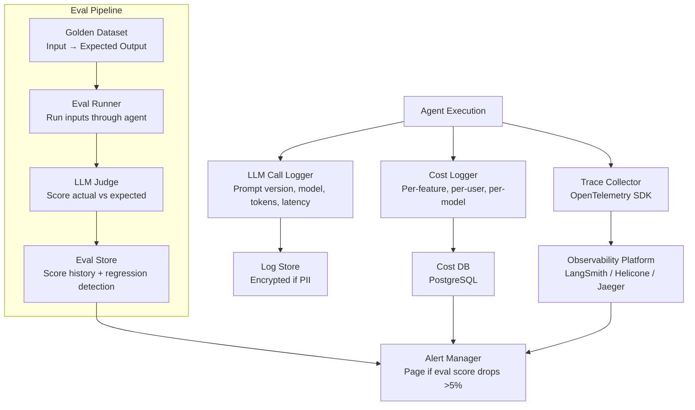
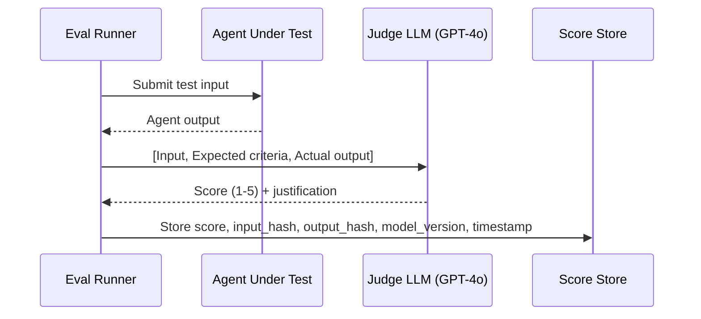
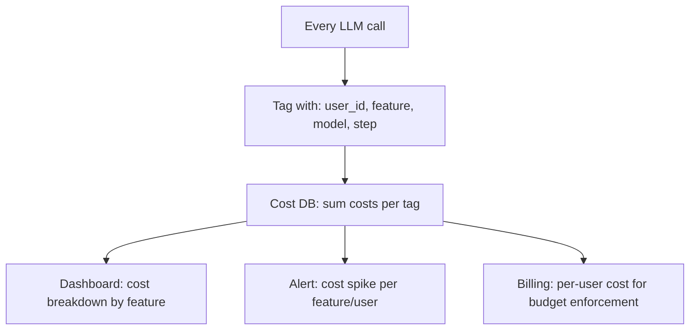

# Agent Observability & Evals

**Interview Question:** "You've deployed an AI agent to production. It's completing tasks autonomously, making tool calls, and interacting with thousands of users. How do you monitor it, detect when it degrades, and evaluate quality systematically?"

---

## Clarifying Questions

1. **Is the agent interactive (user sees results in real-time) or batch (async tasks)?** Different latency SLOs and different feedback loops.
2. **What does "quality" mean for this agent?** Task completion rate? Answer accuracy? User satisfaction? Safety (no harmful outputs)?
3. **Do you have labeled data?** A golden dataset enables regression testing. Without it, you rely on heuristics or LLM-as-judge.
4. **What's the regulatory context?** Finance and healthcare require audit trails of every decision. General consumer products may need only aggregate metrics.
5. **Is the agent's behavior expected to drift over time?** If you update the underlying LLM or system prompt, you need change detection in your evals.
6. **How many tool calls per session on average?** More tool calls = more spans to trace = higher observability infrastructure load.
7. **Can you collect user feedback signals?** Thumbs up/down, corrections, and re-generations are invaluable for quality monitoring.

---

## The Core Observability Challenge

Traditional systems are deterministic: the same input always produces the same output. Failures show up as exceptions, errors, and latency spikes. You can reproduce bugs by replaying the input.

LLM agents are fundamentally different:

- **Non-deterministic**: The same prompt at different times may produce different outputs (even at temperature=0, due to model updates and sampling).
- **No stack traces**: A wrong answer is not an exception. The system appears healthy while producing low-quality output.
- **Prompt drift**: Small changes to the system prompt can silently degrade quality across all users.
- **Emergent failures**: Failures often emerge from the interaction of the LLM with a particular context (long context, unusual tool output, edge-case user query) — not from any single component.

This requires a new layer of observability on top of traditional metrics: **evals**.

---

## High-Level Architecture



---

## Key Components

### 1. Distributed Tracing

Every agent execution produces a tree of operations: LLM calls, tool calls, memory lookups, and decision points. Tracing captures this tree as nested spans.

```
Trace: user_task_abc123 (total: 8.4s)
├── load_episodic_memory (12ms)
├── llm_call_1 (1.8s)
│   ├── model: claude-3-5-sonnet
│   ├── prompt_version: v42
│   ├── input_tokens: 1247
│   ├── output_tokens: 89
│   └── tool_calls: [search_web]
├── tool_call: search_web (450ms)
│   ├── query: "Python list comprehension performance"
│   ├── result_size_tokens: 823
│   └── status: success
├── llm_call_2 (2.1s)
│   ├── model: claude-3-5-sonnet
│   ├── input_tokens: 2182
│   └── output_tokens: 312
└── write_to_memory (8ms)
```

**What to attach to each span:**
- `trace_id`, `span_id`, `parent_span_id`
- `user_id` (hashed or internal — not raw PII)
- `model`, `prompt_version`
- `input_tokens`, `output_tokens`, `cost_usd`
- `latency_ms`
- `tool_name`, `tool_status` (for tool spans)
- `step_number` (which iteration of the agent loop)

**What NOT to include in spans:**
- Full prompt text (may contain PII)
- Full LLM response text (may contain PII)
- Raw user query (PII)

If you need full prompt logging for debugging, encrypt it with a separate key and log only the ciphertext in the trace. Decrypt only on-demand for authorized debugging.

### 2. Prompt Versioning

Prompts are code. Treat them with version control.

```mermaid
graph LR
    PR[PR: "Add safety guidelines to system prompt"] --> V43[Prompt v43]
    V43 --> Deploy[Deploy + Canary]
    Deploy --> Mon[Monitor eval score vs v42]
    Mon -->|Score improved or neutral| Rollout[Full rollout]
    Mon -->|Score degraded >3%| Rollback[Rollback to v42 + Alert]
```

**Implementation:**
- Store prompts in a versioned prompt registry (database with `version_id`, `content`, `created_at`, `deployed_at`)
- Tag every LLM call span with `prompt_version`
- Run automated evals before promoting a new prompt version to production
- Canary deploy new prompt versions (5% traffic) before full rollout

**Prompt drift detection:** Even without an explicit prompt change, model updates by providers can change behavior. Run weekly eval regression tests against the current production prompt. Alert if score drops.

### 3. LLM-as-Judge Evaluation

For most agent tasks, there's no single "correct" answer. LLM-as-judge uses a capable LLM to evaluate the quality of another LLM's output.



**Judge prompt structure:**
```
You are evaluating an AI agent's response.
Task: [original task]
Expected criteria: [what a good answer should include]
Agent response: [actual output]

Score the response on a scale of 1-5:
5 = Fully correct and helpful
4 = Mostly correct, minor issues
3 = Partially correct, significant gaps
2 = Mostly incorrect but attempted
1 = Wrong or harmful

Return JSON: {"score": N, "reason": "..."}
```

**Limitations of LLM-as-judge:**
- Not perfectly calibrated — different judge prompts produce different scores for the same output
- Expensive if run on every production request (use sampling: 5–10%)
- The judge can be wrong (especially for domain-specific questions)

Supplement with human review for high-stakes domains.

### 4. Golden Dataset Evals

A golden dataset is a curated set of (input, expected output) pairs that represents the range of real user queries. Run the agent against this dataset on every prompt change or model update.

**Golden dataset construction:**
1. Export a sample of production traces (with consent where required)
2. Have domain experts annotate the expected output or quality criteria
3. Include edge cases: empty results, ambiguous queries, adversarial inputs
4. Target: 200–500 examples to start; grow to 1000+ over time

**Eval pipeline:**

```
on_pull_request:
  run_evals(
    dataset=golden_dataset,
    agent=new_version,
    judge=llm_judge,
    metrics=[accuracy, helpfulness, safety]
  )
  compare_to_baseline(current_production_score)
  block_merge if score_delta < -3%
```

**Key metrics to track:**
- **Task completion rate**: Did the agent produce a final answer (vs. failing or looping)?
- **Accuracy**: Does the answer match expected output? (Use LLM judge for open-ended, exact match for structured)
- **Safety**: Did the agent produce any harmful content? (Run classifier on output)
- **Latency**: p50 and p99 latency per task type
- **Tool call efficiency**: Did the agent use fewer tool calls than the previous version (for the same quality)?

### 5. Production Monitoring Metrics

Beyond evals, monitor these real-time signals:

| Metric | Alert threshold | What it indicates |
|--------|----------------|------------------|
| LLM call error rate | >2% over 5 min | Provider outage or prompt format error |
| Task completion rate | <95% over 1h | Agent looping or breaking changes |
| p99 latency | >30s for 5 min | LLM provider slowdown |
| Token cost per task | >200% of 7-day avg | Loop bug or prompt injection inflating context |
| User feedback negative rate | >15% over 1h | Silent quality regression |
| Tool call error rate | >5% over 5 min | Tool dependency failure |

### 6. Cost Attribution



**Why per-feature attribution matters:** Without it, you know total cost is $10K/day but you don't know that the "summarize document" feature is responsible for 60% of that. You can't make intelligent cuts without attribution.

---

## What's Different from Traditional Observability

| Dimension | Traditional Systems | LLM Agent Systems |
|-----------|--------------------|--------------------|
| Failure mode | Exceptions, error codes | Incorrect but non-exceptional output |
| Reproducibility | High (deterministic) | Low (non-deterministic) |
| Debug tool | Stack traces, logs | Prompt traces, eval scores |
| Quality signal | Error rate, latency | Eval score, user feedback |
| Testing | Unit tests, integration tests | Evals on golden datasets |
| Regression detection | Test suite pass/fail | Eval score delta across versions |
| Cost unit | CPU/memory | Tokens (variable per request) |

---

## Real-World Tooling

| Tool | Category | Key Feature |
|------|----------|-------------|
| LangSmith | Tracing + Evals | Deep LangChain integration, LLM-as-judge, dataset management |
| Helicone | Proxy-based observability | Zero code change, semantic caching, cost tracking |
| Weights & Biases (W&B) | Experiment tracking + Evals | Strong for eval pipelines, versioning |
| Braintrust | Evals platform | Fast eval iteration, prompt playground with scoring |
| OpenTelemetry | Tracing infrastructure | Standard protocol, integrates with Jaeger/Grafana |
| Arize AI | ML observability | Drift detection, production model monitoring |
| Portkey | LLM gateway | Multi-provider routing, cost tracking, semantic cache |

---

## Common Pitfalls

1. **Logging full prompts in plaintext.** User queries and conversation history often contain PII. Store prompt hashes for correlation; encrypt full content or don't log it at all.

2. **No cost attribution by feature.** You know total LLM cost but not which feature is driving it. Without feature tags on every LLM call, you can't prioritize optimization.

3. **Ignoring latency percentiles.** Mean latency looks fine at 1.2s. But p99 is 45s and 1% of users are waiting nearly a minute. Always monitor p99.

4. **Running evals only on prompt changes.** Model providers silently update model weights. Run scheduled evals weekly to detect provider-side regressions.

5. **No safety eval in the pipeline.** Deploying a new prompt version without checking if it produces harmful outputs. Always include a safety classifier in the eval pipeline.

6. **Treating eval scores as absolute truth.** An LLM judge scoring 4.2 vs 4.1 is not statistically significant. Require a minimum sample size and statistical significance before making deployment decisions.

7. **No user feedback loop.** Automated evals are necessary but not sufficient. Thumbs up/down, corrections, and re-generations from real users are the ground truth signal. Collect and analyze them.

8. **Alerting on every eval score fluctuation.** Evals have natural variance. Alert only on sustained drops (e.g., score below threshold for 3 consecutive daily runs, not on a single run).

---

## Key Numbers to Memorize

| Metric | Value |
|--------|-------|
| Golden dataset target size (start) | 200 – 500 examples |
| Golden dataset target size (mature) | 1000+ examples |
| LLM-as-judge sampling rate (production) | 5 – 10% of requests |
| Eval regression alert threshold | Score drop > 3–5% |
| Task completion rate healthy baseline | > 95% |
| p99 latency alert threshold | > 30s |
| Token cost spike alert threshold | > 200% of 7-day average |
