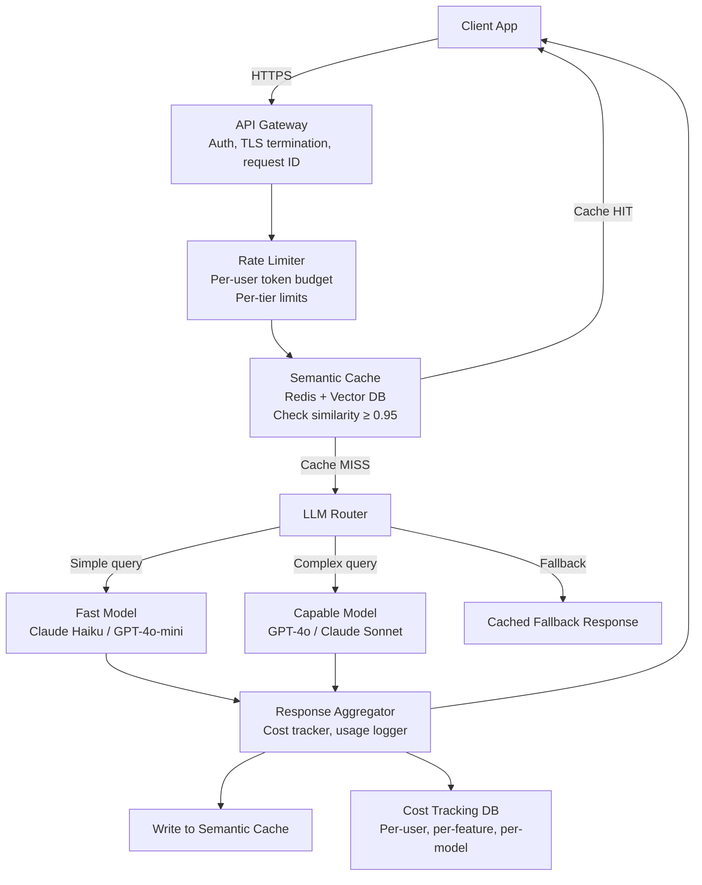
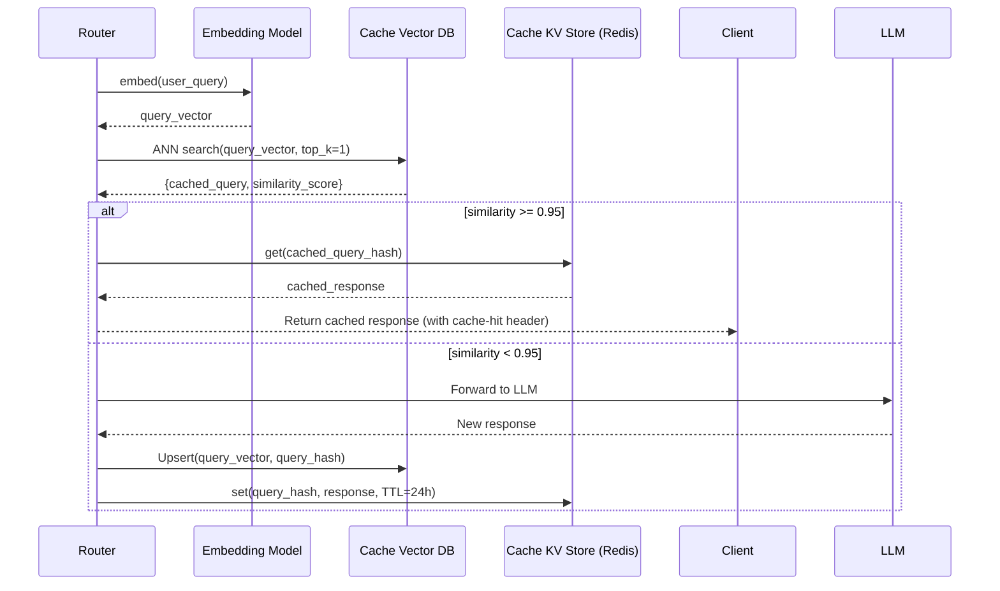
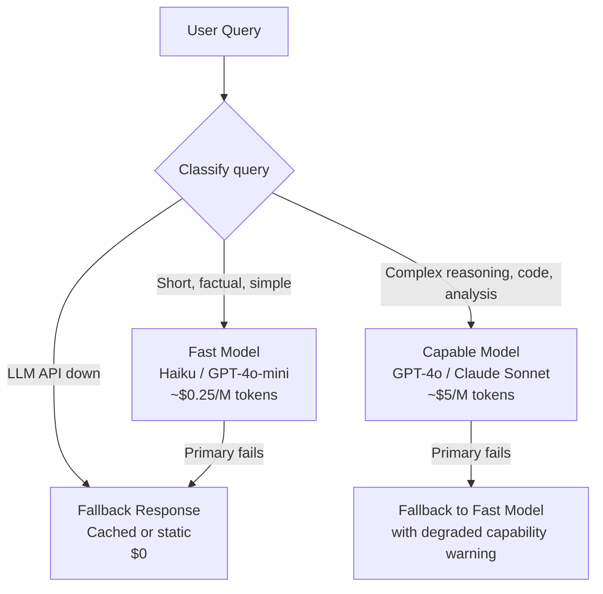

# Designing APIs on LLMs

**Interview Question:** "Design the API layer for a product that serves 1 million daily users making LLM-powered requests. Users ask questions, get answers, and can regenerate responses. You must control costs, enforce rate limits, and maintain <2s median response time."

---

## Clarifying Questions

1. **What's the average tokens per request (input + output)?** 1K tokens vs. 10K tokens is an order-of-magnitude cost difference.
2. **What percentage of requests are repeated or similar?** High similarity enables semantic caching — potentially the single biggest cost lever.
3. **Is streaming required?** If users see tokens as they're generated, perceived latency drops dramatically. But streaming complicates load balancers and monitoring.
4. **Are there different user tiers?** Free vs. pro users may get different models, rate limits, and SLAs.
5. **What are the SLOs?** p50 < 2s, p99 < 10s? Or something else? Shapes the model selection and caching strategy.
6. **Is there a multi-region requirement?** LLM API providers have regional endpoints. Routing to the nearest region can reduce latency by 200–500ms.
7. **What's the monthly cost budget?** This determines how aggressively to cache and tier models.

---

## Back-of-Envelope Cost Estimate

Before designing, establish the stakes:

```
1M daily users
× 5 requests/user/day = 5M requests/day
× 2K tokens/request (input + output) = 10B tokens/day

GPT-4o cost: $5/M input + $15/M output tokens
Assume 60% input / 40% output:
= (6B × $5/M) + (4B × $15/M)
= $30,000 + $60,000
= $90,000/day → $2.7M/month

Claude Haiku cost: ~$0.25/M input + $1.25/M output
= (6B × $0.25/M) + (4B × $1.25/M)
= $1,500 + $5,000
= $6,500/day → $195K/month
```

At $2.7M/month on GPT-4o, even a 10% cache hit rate saves $270K/month. Semantic caching and model tiering are not optimizations — they're survival strategies.

---

## High-Level Architecture



---

## Key Components

### 1. API Gateway

Responsibilities:
- **Authentication**: Validate JWT or API key. Attach user_id and tier to request context.
- **Request ID**: Generate and attach a `x-request-id` for distributed tracing.
- **TLS termination**: Terminate HTTPS at the edge.
- **Request logging**: Log request metadata (not full prompt — PII concerns) before forwarding.
- **Circuit breaker**: If LLM providers return >5% errors over 30s, trip circuit and return fallback.

The API Gateway does NOT make routing decisions about which LLM to use — that's the router's job.

### 2. Rate Limiter

LLM rate limiting is fundamentally different from traditional API rate limiting because **the cost unit is tokens, not requests**.

```
# Traditional rate limit (wrong for LLMs)
user_x: 100 requests/minute

# Token-budget rate limit (correct)
user_x: 100,000 tokens/day
       + 10,000 tokens/minute (burst)
```

**Implementation:**
- Use Redis with sliding window counters
- Key: `ratelimit:{user_id}:{window}` where window is `day` or `minute`
- On each request: estimate input token count (count words × 1.3), add to counter
- On response: record actual output tokens, add to counter
- Return `429 Too Many Requests` with `Retry-After` header when budget exceeded

**Tier differentiation:**

| Tier | Daily token budget | Max tokens/request | Model access |
|------|--------------------|-------------------|--------------|
| Free | 50,000 | 2,000 | Haiku / GPT-4o-mini |
| Pro | 1,000,000 | 16,000 | All models |
| Enterprise | Unlimited (custom) | 128,000 | All models + priority |

### 3. Semantic Cache

Traditional caches use exact key matching. For LLM queries, two questions with different wording may be semantically identical and should return the same (cached) answer.



**Threshold tuning:**
- 0.99: Only near-identical queries hit cache. Low hit rate but high accuracy.
- 0.95: Good balance. "What is Redis?" and "Can you explain Redis to me?" both hit the same cache entry.
- 0.90: More cache hits but may serve subtly different questions the same cached answer. Risk of incorrect responses.

**Start at 0.95 and tune down if hit rate is too low.**

**Cache invalidation:** Set a TTL (24h–7d depending on how often the knowledge changes). For factual queries about stable topics, longer TTLs are fine.

### 4. LLM Router

The router classifies each request and selects the appropriate model:



**Classification signals:**
- **Query length**: Long queries with complex instructions → capable model
- **Explicit complexity**: If the query contains "analyze", "compare", "write code" → capable model
- **User tier**: Free users always get fast model; Pro users get router decision
- **Historical success**: Track per-query-type success rate per model. Route to the model that historically handles this query type well.

**Fallback chain importance:** LLM APIs have SLAs of 99.9% at best. At 5M requests/day, expect ~5,000 failures/day from provider issues. The fallback chain prevents these from surfacing as user-facing errors.

### 5. Streaming Responses

LLMs generate tokens sequentially. Streaming allows the client to display tokens as they're generated, dramatically improving perceived latency even when total time is unchanged.

**Protocols:**
- **Server-Sent Events (SSE)**: Simple, HTTP/1.1 compatible, one-directional. Best for most use cases.
- **WebSockets**: Bidirectional, better for interactive agents. More complex infrastructure.

**Streaming challenges:**
- **Load balancer timeouts**: Configure your load balancer to allow long-lived HTTP connections. Default nginx timeout (60s) will kill a streaming response that takes 90s.
- **Cost tracking**: You don't know total token count until streaming completes. Record cost async on stream completion.
- **Error in the middle of a stream**: User has already seen partial output. Handle gracefully: send an error event, let client show "Response interrupted" message.
- **Caching streaming responses**: Cache the completed response (not the stream). On cache hit, re-stream from cache to simulate real-time generation.

### 6. Cost Tracking

Cost attribution at the feature and user level is essential for making informed product decisions.

**Data model:**

```sql
CREATE TABLE llm_usage (
    id            UUID PRIMARY KEY,
    user_id       UUID NOT NULL,
    feature       VARCHAR(100) NOT NULL,  -- e.g., "chat", "code_complete", "summarize"
    model         VARCHAR(100) NOT NULL,
    input_tokens  INT NOT NULL,
    output_tokens INT NOT NULL,
    cost_usd      DECIMAL(10, 6) NOT NULL,
    latency_ms    INT NOT NULL,
    cache_hit     BOOLEAN DEFAULT FALSE,
    created_at    TIMESTAMP DEFAULT NOW()
);

-- Aggregate per user per day for billing/rate limiting
CREATE MATERIALIZED VIEW daily_usage AS
SELECT user_id, DATE(created_at), SUM(cost_usd), SUM(input_tokens + output_tokens)
FROM llm_usage GROUP BY 1, 2;
```

**Alerting:**
- Alert if daily cost > 110% of yesterday's cost (anomaly detection)
- Alert if any single feature's cost exceeds 30% of total (unexpected usage spike)
- Alert if any single user exceeds 1% of total cost (billing anomaly or abuse)

---

## Model Cost Comparison

| Model | Input (per 1M tokens) | Output (per 1M tokens) | Context | Best for |
|-------|----------------------|----------------------|---------|---------|
| GPT-4o | $5 | $15 | 128K | Complex reasoning, code |
| GPT-4o-mini | $0.15 | $0.60 | 128K | Simple Q&A, classification |
| Claude 3.5 Sonnet | $3 | $15 | 200K | Complex reasoning, long docs |
| Claude 3 Haiku | $0.25 | $1.25 | 200K | Fast, cheap, good quality |
| Gemini 1.5 Flash | $0.075 | $0.30 | 1M | Ultra-cheap, long context |
| Llama 3.1 70B (self-hosted) | ~$0.08 | ~$0.08 | 128K | Data sovereignty, no egress cost |

**Strategy:** Route >70% of traffic to cheap models. Only use expensive models for queries that demonstrably require them.

---

## Trade-offs

| Dimension | Aggressive Caching | Light Caching |
|-----------|-------------------|--------------|
| Cost | Lower (cache hits are free) | Higher |
| Answer freshness | Risk of serving stale responses | Always fresh |
| User experience | Occasional inconsistency if cache TTL too long | Consistent |
| Recommendation | Use aggressive caching with short TTL (1–24h) for most features |

| Dimension | Semantic Cache | Exact-match Cache |
|-----------|---------------|------------------|
| Hit rate | Higher (catches paraphrased queries) | Lower |
| Correctness risk | Small (threshold controls it) | Zero |
| Latency overhead | +5ms for embedding | ~0ms |
| Recommendation | Use semantic cache with threshold ≥ 0.95 |

---

## Real-World Examples

- **Notion AI**: Token budget per workspace per month. Routes simple completions to GPT-4o-mini, complex reasoning to GPT-4o. Heavy caching on document summaries.
- **GitHub Copilot**: Real-time code completion at massive scale. Uses aggressive caching keyed on the code context prefix. Routes to different models by task type (completion vs. chat vs. test generation).
- **Perplexity AI**: Sophisticated model router that selects between Mistral, Claude, GPT-4 based on query type. Rate limits by subscription tier. Semantic caching on repeated popular queries.
- **Cursor**: Caches responses to common code questions (e.g., "how to use React hooks"). Model tiering: free users get GPT-3.5, pro users get GPT-4.
- **Helicone**: Observability proxy for LLM APIs. Sits in front of OpenAI/Anthropic APIs, injects semantic caching, cost tracking, and rate limiting without code changes.

---

## Common Pitfalls

1. **No semantic caching.** At 5M requests/day, even a 10% cache hit rate eliminates 500K LLM calls/day. Skipping caching is the most expensive mistake in LLM API design.

2. **Per-IP rate limiting instead of per-user token budgets.** Users behind NAT all share one IP. Corporate networks look like one user. Rate limit by authenticated user_id, not IP.

3. **No streaming timeout.** A streaming response that never terminates (LLM API hangs) ties up a server connection indefinitely. Set a per-stream timeout (120s) and close the connection if it's exceeded.

4. **Synchronous streaming through a load balancer.** Many load balancers buffer responses before forwarding. Configure your load balancer to pass through streaming responses with `proxy_buffering off` (nginx) or equivalent.

5. **No cost tracking.** You don't know which feature is driving 80% of your LLM bill. Without `feature` attribution, you can't make intelligent optimization decisions.

6. **Single LLM provider dependency.** The provider has an outage. All 5M daily users are affected. Always implement a fallback to at least one alternative provider or a degraded cached response.

7. **Logging full prompts.** Full prompts contain user PII. Log prompt hashes and metadata, not full content. Or, if full logging is needed for debugging, encrypt and restrict access.

8. **No circuit breaker.** LLM provider returns slow 503s. Requests pile up in the queue. Without a circuit breaker, a partial outage cascades into a full outage for your service.

---

## Key Numbers to Memorize

| Metric | Value |
|--------|-------|
| 1M users × 5 req/day × 2K tokens = daily token load | 10B tokens/day |
| GPT-4o cost at 10B tokens/day | ~$90,000/day |
| Claude Haiku cost at 10B tokens/day | ~$6,500/day |
| Semantic cache similarity threshold | 0.95 |
| Semantic cache lookup latency | ~5ms |
| SSE streaming: nginx default timeout (must extend) | 60s |
| Token budget for free tier (recommended) | 50K tokens/day |
| Token budget for pro tier (recommended) | 1M tokens/day |
