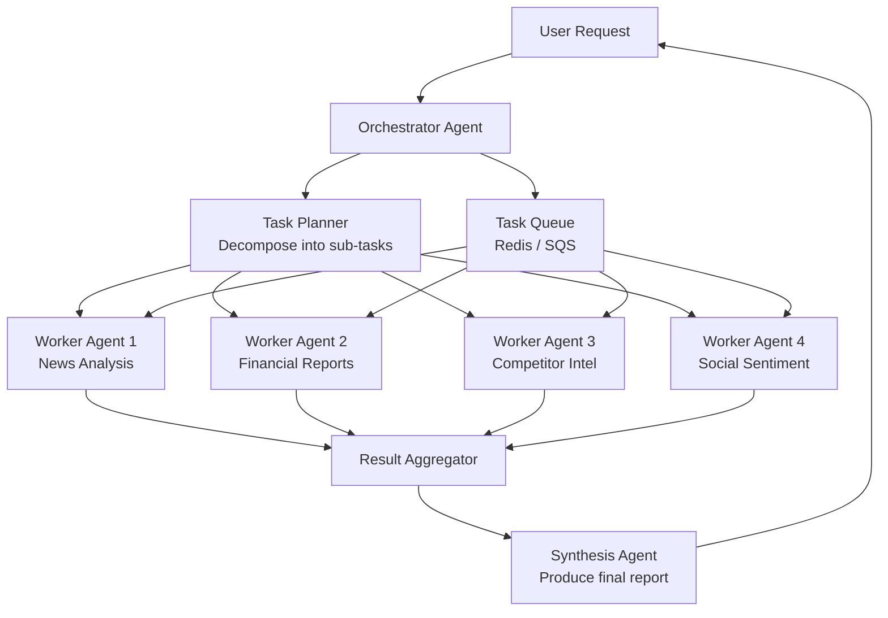
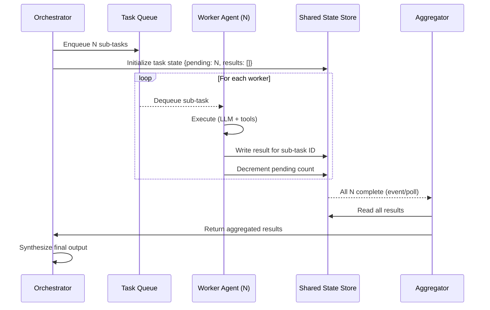
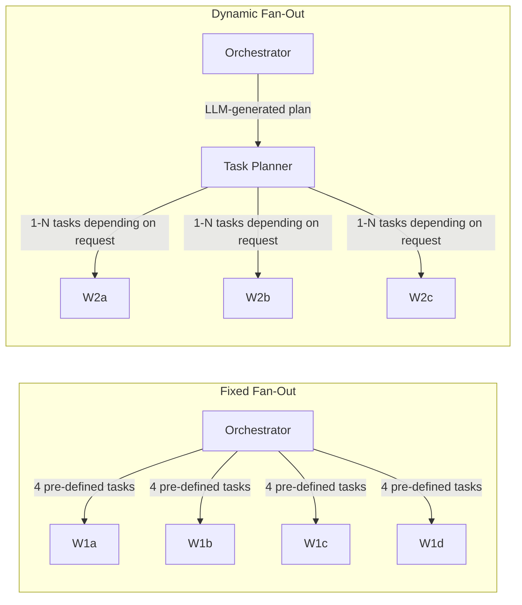

# Multi-Agent Coordination

**Interview Question:** "Design a system where multiple AI agents must coordinate to complete a complex research task — for example, researching a market opportunity by simultaneously analyzing news, financial reports, competitor products, and social sentiment."

---

## Clarifying Questions

1. **Is the work parallelizable?** If sub-tasks are independent (search news + search financials simultaneously), we can fan out. If sequential (analyze results then synthesize), we need a pipeline.
2. **How many concurrent agents?** 5 sub-agents vs 100 changes the coordination overhead significantly.
3. **What's the task completion criterion?** All sub-agents must finish, or is it acceptable to proceed once N-of-M complete?
4. **Can agents call other agents?** Recursive agent spawning can create unbounded trees without depth limits.
5. **How do conflicting results get resolved?** If two agents produce contradictory findings, who wins?
6. **What's the failure model?** Should the whole task fail if one sub-agent fails, or continue with partial results?
7. **Is there state that must be shared between agents during execution?** Or do they only share results at the end?

---

## High-Level Architecture

### Orchestrator/Worker Pattern



### State Flow



---

## Key Components

### 1. Orchestrator Agent

The orchestrator is responsible for:
- **Decomposing** the high-level task into independent or partially-dependent sub-tasks
- **Spawning** worker agents (or enqueuing tasks for a pool of workers)
- **Monitoring** progress and detecting stuck or failed workers
- **Aggregating** results and synthesizing a final output

The orchestrator itself uses an LLM to do task decomposition and synthesis. This is important: the "plan" is not hardcoded. The orchestrator generates a task plan dynamically based on the user's request.

### 2. State Sharing Options

| Option | Mechanism | Strengths | Weaknesses |
|--------|-----------|-----------|-----------|
| Redis Pub/Sub | Workers publish results to a channel; orchestrator subscribes | Low latency, simple | No durability, at-most-once delivery |
| Message Queue (SQS, RabbitMQ) | Workers publish results to a result queue; aggregator reads | Durable, reliable delivery | Higher latency, more infrastructure |
| Shared Database (PostgreSQL) | Workers write rows; orchestrator polls | Full durability, queryable, audit trail | Polling overhead, schema management |
| In-memory shared state | Workers update a shared dict in the same process | Ultra-low latency | Only works for single-process scenarios |

**Recommendation:** Use a message queue for the task distribution (work queue pattern) and a shared database for result persistence. Redis can supplement for low-latency progress tracking.

### 3. Fan-Out Strategy



**Fixed fan-out**: Orchestrator always spawns the same N workers. Predictable cost, simple to monitor. Works for well-defined pipelines (news + financials + social always).

**Dynamic fan-out**: Orchestrator uses an LLM to decide how many sub-tasks to create and what each should do. More flexible but harder to cost-control and test. Add a hard cap: `MAX_SUB_AGENTS = 10`.

**Fan-out cap**: Always enforce a maximum. Without a cap, a recursive agent can spawn sub-agents that spawn sub-agents, resulting in exponential cost growth.

### 4. Result Aggregation

When all workers complete, an aggregator must merge their outputs. Aggregation strategies:

| Strategy | Description | Use Case |
|----------|-------------|---------|
| Concatenation | Combine all results into a single document | When results are independent sections |
| LLM synthesis | Pass all results to an LLM to produce a unified summary | When results overlap and need deduplication |
| Voting | Multiple agents answer the same question; take the majority | For factual queries where accuracy matters |
| Scoring + ranking | Score each result by relevance; take top K | For search/research tasks with many results |

**Conflict resolution**: When two workers produce contradictory facts (Worker A says "revenue was $1B", Worker B says "revenue was $900M"), the synthesis LLM should be prompted to acknowledge the discrepancy and cite sources. Silently choosing one answer is dangerous.

### 5. Agent Isolation and Failure Handling

**Isolation principles:**
- Each worker agent runs in its own process/container with independent memory
- Workers cannot read each other's context windows
- A worker crashing should not affect sibling workers
- Worker timeouts are enforced independently

**Failure handling matrix:**

| Failure | N-of-M Policy | All-or-nothing Policy |
|---------|--------------|----------------------|
| 1 worker crashes | Continue with M-1 results, flag missing data | Abort task, return error |
| Worker stuck (timeout) | Same as crash | Same as crash |
| Worker returns empty result | Treat as valid partial result | Depends on business logic |
| Worker produces hallucination | Caught by validation, discarded | Same |

**Recommendation:** For research tasks, N-of-M is usually correct. For compliance or financial tasks, all-or-nothing is safer.

### 6. Deadlock Detection and Prevention

Multi-agent systems can deadlock if:
- Agent A is waiting for a result from Agent B
- Agent B is waiting for a result from Agent A

Prevention strategies:
1. **Acyclic dependency graph**: Task planning must produce a DAG (directed acyclic graph) of sub-tasks. Validate this at plan creation time before spawning workers.
2. **Global timeout**: Even if there's a cycle, the task-level timeout kills everything after N minutes.
3. **No direct agent-to-agent calls**: Workers publish results to a shared store; they never call other agents directly. The orchestrator is the only entity that reads and routes results.
4. **Dependency declaration**: Require each sub-task to declare its dependencies at creation time. Cycle detection is then trivially O(N+E) DFS on the task graph.

---

## Scaling Considerations

### Worker Pool vs Spawned Workers

| Approach | Worker Pool | Spawn on Demand |
|----------|-------------|-----------------|
| Startup latency | Low (workers pre-warmed) | Higher (cold start ~1-2s) |
| Cost | Higher (idle workers consume resources) | Lower (pay only for work) |
| Scalability | Limited by pool size | Scales to thousands |
| Recommended for | Low-latency, frequent tasks | Bursty workloads |

For AI agents where each LLM call takes seconds anyway, spawn-on-demand (serverless functions or containerized tasks) is usually the right call. The cold start is negligible relative to LLM latency.

### Task Queue Depth Monitoring

```
Alert if:
  task_queue_depth > 100  →  scale up workers
  task_queue_depth < 10   →  scale down workers (after drain)
  task_processing_p99 > SLA_threshold  →  page on-call
```

---

## Trade-offs Summary

| Dimension | Centralized Orchestrator | Distributed Agents |
|-----------|--------------------------|-------------------|
| Observability | High — single control plane | Low — distributed traces required |
| Fault tolerance | Single point of failure | Resilient to individual agent failures |
| Coordination overhead | Low | High (consensus, message passing) |
| Debugging | Easy — linear trace | Hard — parallel execution, race conditions |
| Scalability | Limited by orchestrator throughput | Near-linear scaling |
| Recommendation | Use for most cases | Only when orchestrator becomes bottleneck |

---

## Real-World Examples

- **CrewAI**: Open-source Python framework for multi-agent coordination. Implements roles (researcher, writer, reviewer) and a task pipeline. Agents share state through a crew memory object. Used for research automation, content generation pipelines.
- **AutoGen (Microsoft)**: Framework where agents communicate through messages in a group chat. An orchestrator "GroupChatManager" routes messages between agents. Supports human-in-the-loop as one of the agents.
- **LangGraph**: Adds stateful graph execution to LangChain. Each node is an agent or a tool; edges define data flow. Supports branching, loops, and parallel execution. Backed by a checkpointed state machine.
- **Claude Code multi-agent (Anthropic)**: Used internally for large refactor tasks — one orchestrator plans the changes, multiple subagents work on different files simultaneously. Results merged via git.
- **Devin (Cognition AI)**: Autonomous coding agent that can spin up sub-processes for running tests and linters while the main agent continues planning. Multiple concurrent processes coordinated via a shared workspace.

---

## Common Pitfalls

1. **Unbounded fan-out.** Orchestrator spawns 50 workers for a simple task. No cap means cost explosions and downstream service hammering. Always enforce `MAX_SUB_AGENTS`.

2. **Shared mutable state without locking.** Two workers both try to update the same task record simultaneously, causing partial updates. Use atomic operations or pessimistic locking for shared writes.

3. **Deadlock via circular task dependencies.** Validate the task dependency graph is a DAG before spawning. Never allow direct agent-to-agent calls that bypass the orchestrator.

4. **No timeout on worker agents.** A stuck worker holds up the aggregation phase indefinitely. Set per-worker timeouts and treat timeout as failure.

5. **Recursive agent spawning without depth limit.** Sub-agents spawn their own sub-agents. Without a max depth, this creates exponential cost growth. Enforce `MAX_RECURSION_DEPTH = 3`.

6. **Silently discarding failed worker results.** The final synthesis doesn't mention that the financial data worker failed. Users get an incomplete report with no indication of missing data.

7. **Race condition on result aggregation.** Aggregator starts synthesizing after seeing N-1 results; the N-th result arrives while synthesis is in progress and is ignored.

---

## Key Numbers to Memorize

| Metric | Value |
|--------|-------|
| Recommended max sub-agents | 10 |
| Recommended max recursion depth | 3 |
| Worker spawn cold start latency | 1 – 2s |
| Redis Pub/Sub message latency | <1ms |
| SQS message latency | 10 – 100ms |
| Total task timeout (recommended) | 10 minutes |
| Per-worker timeout (recommended) | 3 minutes |
