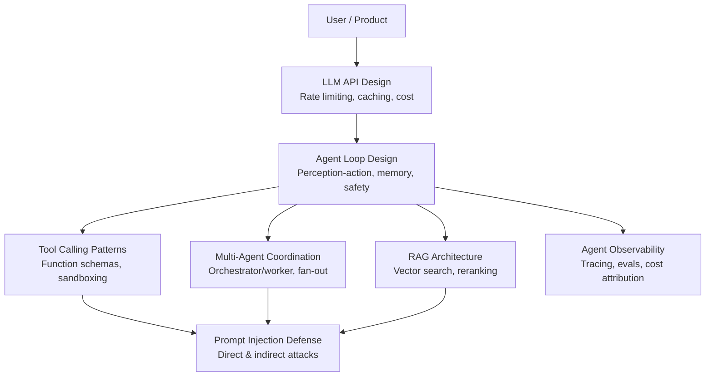

# AI Agents & LLM Systems — Interview Overview

AI agent and LLM questions are increasingly common in system design interviews at top tech companies. Teams building products on top of large language models face novel engineering challenges that traditional system design frameworks don't fully address: non-determinism, prompt drift, token-based cost models, and safety requirements around autonomous actions.

This section prepares you for 8 question categories that span the full stack of LLM-powered systems — from designing a single agent loop to securing a multi-agent pipeline against prompt injection.

---

## Why These Questions Appear in Interviews

Most companies that ship AI products in 2024–2026 encounter the same set of hard problems:

- **Reliability** — LLM calls can fail, time out, or return garbage. How do you build resiliency around a probabilistic API?
- **Cost** — GPT-4o at $5/M input tokens is expensive at scale. Semantic caching and model tiering are production necessities.
- **Safety** — An agent that can call APIs and execute code is a potential attack surface. Prompt injection is a real threat.
- **Observability** — You can't reproduce bugs by replaying logs the way you can in deterministic systems. Tracing and evals require new tooling.
- **Latency** — LLM p99 latency can be 5–30 seconds. How do you design UX and infrastructure around that?

Interviewers asking these questions are usually checking that you understand these constraints, not that you've memorized specific model benchmarks.

---

## Topic Map

How the 7 core topics relate to each other:

---

## Questions at a Glance

| # | Question | Article | Difficulty |
|---|----------|---------|-----------|
| 1 | Design a system where an AI agent can autonomously complete multi-step tasks | [Agent Loop Design](./agent-loop-design) | 🔴 Advanced |
| 2 | Design the tool-calling layer for an AI agent that can call APIs, read files, and execute code | [Tool Calling Patterns](./tool-calling-patterns) | 🟡 Intermediate |
| 3 | Design a system where multiple AI agents coordinate to complete a complex research task | [Multi-Agent Coordination](./multi-agent-coordination) | 🔴 Advanced |
| 4 | Design a system that lets users ask questions about a 10-million-document knowledge base | [RAG Architecture](./rag-architecture) | 🟡 Intermediate |
| 5 | Design the API layer for a product that serves 1M daily users making LLM-powered requests | [Designing APIs on LLMs](./llm-api-design) | 🟡 Intermediate |
| 6 | How do you monitor and evaluate an AI agent in production? | [Agent Observability & Evals](./agent-observability) | 🟡 Intermediate |
| 7 | Your AI agent reads user emails and takes actions. How do you prevent prompt injection? | [Prompt Injection Defense](./prompt-injection-defense) | 🔴 Advanced |

---

## Interview Strategy for AI/LLM Questions

These questions differ from traditional system design in important ways. Here's how to adapt your approach.

### 1. Acknowledge Non-Determinism Upfront

When the interviewer asks about reliability, say explicitly: "LLMs are probabilistic — the same prompt can produce different outputs. Our reliability strategy must account for that: structured output validation, retry logic, and human-in-the-loop gates for destructive actions."

This shows you understand the fundamental difference between LLM-based systems and deterministic microservices.

### 2. Lead with Cost Awareness

Cost is a first-class concern. Mention token cost early:

- GPT-4o: ~$5/M input tokens, ~$15/M output tokens (as of 2025)
- Claude Haiku: ~$0.25/M input tokens
- At 1M daily users × 2K tokens/request = 2B tokens/day = ~$10K/day on GPT-4o

If you're designing at scale, semantic caching, model tiering, and output length limits are not optional optimizations — they're survival strategies.

### 3. Distinguish the Safety Tiers

Not all LLM calls are equal. Make sure to classify:

- **Read-only LLM calls** (summarize, answer questions) — low risk, cache aggressively
- **Write actions via tools** (send email, create ticket) — require idempotency keys and audit logs
- **Destructive actions** (delete file, transfer money) — require human confirmation gate

Interviewers are looking for this threat model.

### 4. Structure Memory Explicitly

"Memory" in an agent system has three distinct layers. Name them:

- **Working memory** — the current context window (128K–200K tokens)
- **Episodic memory** — past interactions retrieved via vector search
- **Semantic memory** — structured facts in a relational/document DB

Conflating these is a red flag. Each has different latency, cost, and durability characteristics.

### 5. Don't Skip Evals

Traditional systems have unit tests. LLM systems need **evals**: automated pipelines that run a golden dataset through the agent and score outputs. Mention LLM-as-judge and regression testing. This shows production maturity.

### 6. Know the Key Numbers

Memorize these — they come up repeatedly:

| Item | Value |
|------|-------|
| GPT-4o context window | 128K tokens |
| Claude 3.5 context window | 200K tokens |
| Typical tool call latency | 200ms – 2s |
| LLM API p99 latency | 5 – 30s |
| OpenAI embedding dimensions | 1536 (text-embedding-3-large) |
| Common chunk size for RAG | 256 – 512 tokens |
| ANN vector search latency (HNSW) | ~5ms |
| Cosine similarity threshold for semantic cache hit | 0.95 |

---

## What Interviewers Are NOT Looking For

- Reciting specific model benchmark scores (MMLU, HumanEval) — this is not system design
- Deep knowledge of transformer architecture — that's ML engineering, not system design
- A single "correct" architecture — LLM systems are early and trade-offs are real. Show you know the options.

---

## Recommended Study Order

If you have limited time, prioritize in this order:

1. [Agent Loop Design](./agent-loop-design) — foundational for all other questions
2. [RAG Architecture](./rag-architecture) — most common interview question today
3. [LLM API Design](./llm-api-design) — required if interviewing for platform/infra roles
4. [Tool Calling Patterns](./tool-calling-patterns) — deep-dive on agent safety
5. [Multi-Agent Coordination](./multi-agent-coordination) — for senior/staff roles
6. [Agent Observability](./agent-observability) — for SRE / reliability-focused roles
7. [Prompt Injection Defense](./prompt-injection-defense) — for security-focused or autonomous agent roles
