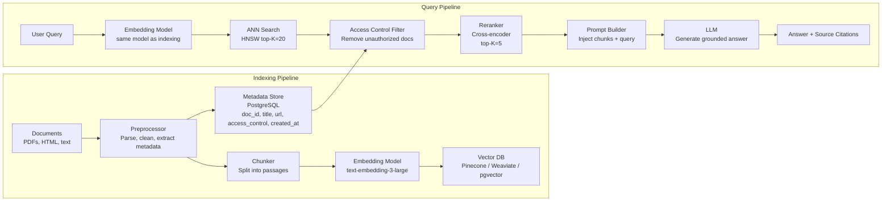
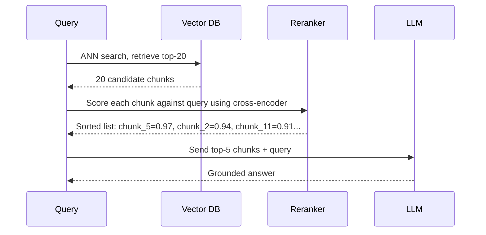

# RAG Architecture

**Interview Question:** "Design a system that lets users ask natural-language questions about a 10-million-document knowledge base. The documents include technical docs, PDFs, and web pages. Answers must be grounded in the documents, not hallucinated."

---

## Clarifying Questions

1. **What document types and sizes?** PDFs with tables and images, structured HTML, plain text — each requires different preprocessing.
2. **How fresh does the data need to be?** Real-time (documents indexed within seconds) vs. batch (daily re-indexing) changes the architecture significantly.
3. **What latency is acceptable for queries?** Interactive chat (<2s) vs. async research tasks (minutes) have different retrieval design requirements.
4. **Is there access control?** Different users should only see documents they're authorized to read. This must be enforced at retrieval time, not just the application layer.
5. **How large is each document?** A 500-page PDF needs different chunking than a 2-paragraph blog post.
6. **What's the expected query throughput?** 100 QPS vs. 10,000 QPS determines whether you need vector DB sharding.
7. **What's the expected quality bar?** Precise factual lookups (legal, medical) require higher recall than general knowledge questions.

---

## High-Level Architecture

### Full RAG Pipeline

---

## Key Components

### 1. Document Preprocessing

Before chunking, documents must be cleaned and parsed:

- **PDFs**: Extract text (pdfminer, PyMuPDF). Tables need special handling — convert to Markdown or CSV representation so the LLM can reason about them. Images are ignored unless you have a vision model pipeline.
- **HTML**: Strip nav, ads, and boilerplate. Extract main content. Preserve headings for context.
- **Metadata extraction**: Title, URL/path, author, created date, last modified. Store in PostgreSQL alongside doc_id. Used for filtering and citation.
- **Deduplication**: Hash document content. Skip re-indexing if hash unchanged. Critical for 10M document sets where many documents may be near-duplicates.

### 2. Chunking Strategies

Chunking is the most impactful design decision in RAG. Too large: poor retrieval precision. Too small: lack of context for the LLM.

| Strategy | Description | Chunk Size | Strengths | Weaknesses |
|----------|-------------|-----------|-----------|-----------|
| Fixed-size | Split every N tokens, overlap M tokens | 256–512 tokens | Simple, predictable | Splits mid-sentence, mid-table |
| Semantic | Split on paragraph/section boundaries | 100–800 tokens | Preserves meaning units | Uneven sizes, harder to implement |
| Document-level | Whole document as one chunk | Unbounded | No information loss | Exceeds context window for large docs |
| Hierarchical | Parent chunks for context, child chunks for retrieval | Parent: 1024, child: 128 | Best of both worlds | Complex implementation |
| Sentence-level | One sentence per chunk | ~20–50 tokens | Highest precision retrieval | Needs surrounding context for LLM |

**Recommendation:** Start with semantic chunking (split on headings, paragraphs) with 512-token target size and 50-token overlap between adjacent chunks. Upgrade to hierarchical if retrieval precision is insufficient.

**Overlap matters:** A 50-token overlap between chunks ensures that sentences near chunk boundaries aren't lost. Without overlap, a query about a fact that spans a chunk boundary returns zero results.

### 3. Embedding Models

The embedding model maps text to a dense vector. Query and document embeddings must use the **same model** — embeddings from different models are not comparable.

| Model | Provider | Dimensions | Cost | Strengths |
|-------|----------|------------|------|-----------|
| text-embedding-3-large | OpenAI | 1536 | $0.13/M tokens | Best quality, widely used |
| text-embedding-3-small | OpenAI | 1536 | $0.02/M tokens | Lower cost, slightly worse |
| text-embedding-ada-002 | OpenAI | 1536 | $0.10/M tokens | Older, avoid for new projects |
| embedding-001 | Google | 768 | $0/M (free tier) | Good multilingual support |
| BGE-M3 | BAAI (open source) | 1024 | Self-hosted | Strong multilingual, no API cost |
| E5-large | Microsoft (open source) | 1024 | Self-hosted | Strong for technical documents |

**For 10M documents at 512 tokens/chunk:** ~5B tokens to embed. At $0.02/M (text-embedding-3-small), that's ~$100 for initial indexing. Acceptable.

### 4. Vector Database Comparison

| DB | Architecture | Strengths | Weaknesses |
|----|-------------|-----------|-----------|
| Pinecone | Managed cloud | Zero ops, auto-scaling, fast | Expensive at scale, no self-host |
| Weaviate | Open source + managed | Schema support, multi-modal, hybrid search | More complex setup |
| Qdrant | Open source + managed | Fast, Rust-based, strong filtering | Smaller ecosystem |
| pgvector | PostgreSQL extension | Use existing Postgres, SQL joins | Slower ANN at >1M vectors |
| Chroma | Open source | Great for prototyping, simple API | Not production-grade at 10M+ vectors |
| Milvus | Open source | High scale (billions of vectors), GPU support | Heavy infrastructure requirements |

**For 10M documents at 512 tokens average = ~20M chunks at 1536 dims:** You need a production vector DB. Pinecone or Weaviate cloud for managed; Qdrant or Milvus for self-hosted.

### 5. Approximate Nearest Neighbor (ANN) Search

Exact nearest neighbor search over 20M vectors requires comparing the query vector against all 20M — O(N) with high constant. At 1536 dimensions, this is too slow for interactive queries.

**HNSW (Hierarchical Navigable Small World):** The dominant algorithm. Builds a multi-layer graph during indexing. At query time, traverses from top layer (coarse) to bottom layer (fine). Result:

- Query latency: ~5ms for 95th percentile
- Index build time: ~2-4 hours for 20M vectors
- Memory: ~128 bytes per vector (compressed) → ~2.5GB for 20M vectors
- Recall: ~95% of true nearest neighbors with default settings

**Filtering:** Many queries need metadata filters ("only documents from 2024" or "only documents accessible to user_id=X"). Naive approach: filter after ANN search. Problem: if the ANN returns 20 results but 18 are filtered out, quality degrades. Solution: use **pre-filtering** (index metadata alongside vectors and filter during graph traversal) or **over-fetch** (retrieve top-100, filter down to top-5).

### 6. Reranking

ANN search optimizes for vector similarity, which is a proxy for semantic relevance — not always the best proxy. Reranking is a second-pass that re-scores the top-K candidates using a more powerful model.

| Model Type | Bi-encoder | Cross-encoder |
|------------|-----------|--------------|
| How it works | Embeds query and doc separately, compute cosine similarity | Encodes query+doc together in one forward pass |
| Latency | ~1ms per candidate | ~20ms per candidate |
| Quality | Good (used for ANN search) | Better (sees full interaction) |
| Use in pipeline | First pass (ANN over millions) | Second pass (rerank top 20) |
| Examples | text-embedding-3-large | Cohere Rerank, cross-encoder/ms-marco |

**Without reranking**, RAG systems have noticeably worse answer quality. Reranking the top-20 down to top-5 typically improves answer accuracy by 10–20%.

### 7. Access Control at Retrieval Time

For 10M corporate documents, different users have different read permissions. This must be enforced at vector DB query time, not just in the application layer.

**Pattern:**
1. At index time, store `allowed_user_groups` as a metadata field on each chunk.
2. At query time, add a metadata filter: `allowed_user_groups contains user.group`.
3. ANN search only returns chunks the user is permitted to see.

**Never** retrieve all chunks and filter after — a bug in application-layer filtering could leak confidential documents.

---

## Trade-offs

| Decision | Option A | Option B | Recommendation |
|----------|----------|----------|----------------|
| Chunking strategy | Fixed-size | Semantic (heading/paragraph splits) | Semantic for quality; fixed-size for prototyping |
| Vector DB | Managed (Pinecone) | Self-hosted (Qdrant/Milvus) | Managed unless cost or data residency prohibits |
| Reranking | Skip (faster, cheaper) | Cross-encoder reranking | Always rerank — quality improvement is worth 20ms |
| Embedding model | API (OpenAI) | Self-hosted (BGE) | API for start; self-hosted if cost becomes material |
| Update strategy | Full re-index | Incremental (add/update/delete) | Incremental — full re-index of 10M docs takes hours |

---

## Real-World Examples

- **Notion AI / Confluence AI**: RAG over a user's own wiki. Documents change frequently — incremental indexing is critical. Chunks include page title and parent page title for context.
- **GitHub Copilot (repository context)**: Retrieves relevant code files and snippets to answer questions about a codebase. Uses tree-sitter to chunk code at function/class boundaries rather than fixed token counts.
- **Perplexity AI**: Real-time RAG where the retrieval step is web search (Bing API + custom crawl). Reranks web results, synthesizes an answer with citations.
- **Elastic / OpenSearch with kNN**: Many enterprises use their existing Elasticsearch cluster with the kNN plugin. Combines BM25 keyword search with vector search (hybrid retrieval) for better recall.
- **LlamaIndex**: Framework for building RAG pipelines. Handles parsing, chunking, embedding, and retrieval. Supports hierarchical retrieval (small-to-big), hybrid search, and many vector DB backends.

---

## Common Pitfalls

1. **Chunks too large.** A 2000-token chunk retrieves correctly but contains too much noise for the LLM to identify the specific fact. Smaller, more focused chunks yield better answers.

2. **No reranking.** ANN retrieval quality is sufficient for most queries but degrades on edge cases. Adding a reranker is a 1-day implementation that provides 10–20% quality improvement.

3. **Stale embeddings after document updates.** A document is updated but only the document store is updated — the vector index still points to the old chunks. Implement a change detection pipeline (hash-based or CDC from the document store).

4. **Hallucination on no-context queries.** When retrieval returns nothing relevant, the LLM should say "I don't have information about that" rather than hallucinating an answer. Implement a confidence check: if the top-1 reranker score is below a threshold (e.g., 0.5), return a "no information found" response instead of passing empty context to the LLM.

5. **No access control at retrieval time.** Application-layer filtering after retrieval creates a security boundary that can be bypassed. Enforce ACL as a vector DB metadata filter.

6. **Embedding model drift.** You switch from text-embedding-ada-002 to text-embedding-3-large. Existing vectors are incompatible. Re-embedding 10M documents takes time. Plan for this migration: keep old and new indexes in parallel during transition.

7. **Missing chunk overlap.** A fact spans two adjacent chunks. Without overlap, queries about that fact return zero results. Always use 10–20% overlap between adjacent chunks.

8. **Single embedding per document without metadata.** Without structured metadata (date, source, author), you can't filter by recency or source type. Always extract and store metadata at index time.

---

## Key Numbers to Memorize

| Metric | Value |
|--------|-------|
| OpenAI text-embedding-3-large dimensions | 1536 |
| Common RAG chunk size | 256 – 512 tokens |
| HNSW ANN search latency | ~5ms |
| Cross-encoder reranker latency per candidate | ~20ms |
| ANN search top-K before reranking | 20 |
| ANN search top-K passed to LLM (after reranking) | 5 |
| Cosine similarity threshold for no-context response | 0.5 |
| 10M documents × 2 chunks avg → vector DB size at 1536 dims | ~30GB (uncompressed float32) |
